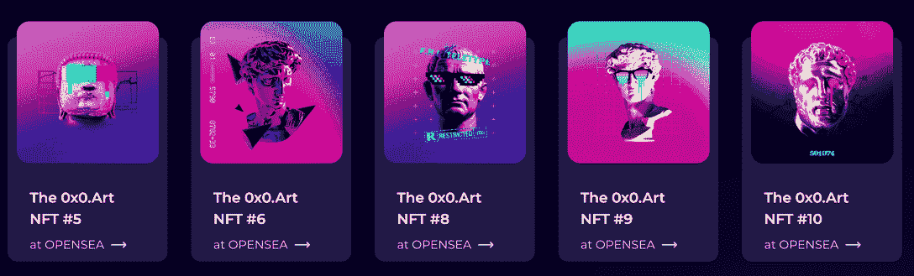
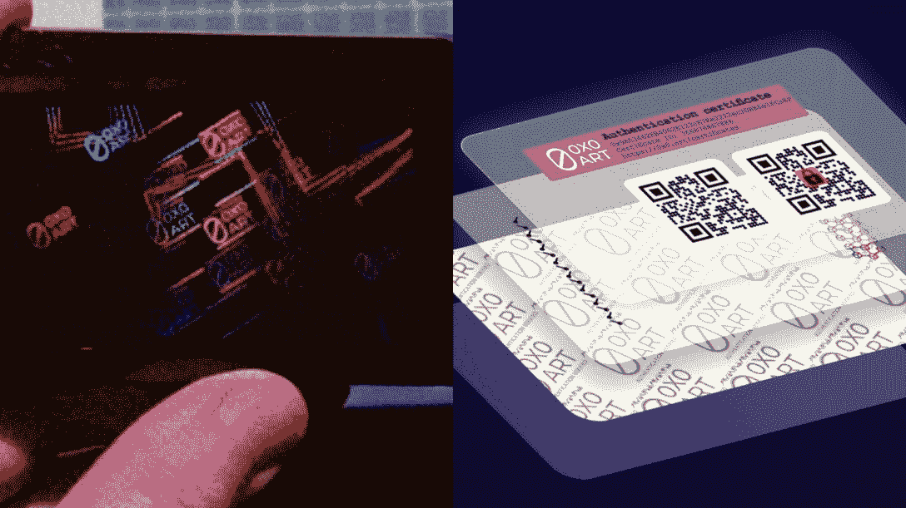

# 0x0 Art 让用户不用卖 NFT 就能赚钱

> 原文：<https://web.archive.org/web/https://dappradar.com/blog/0x0-art-lets-users-make-money-from-nfts-without-selling-them>

## 用 0x0 艺术将 NFT 艺术品数字化、符号化和货币化

**0x0 Art 是一个一体化的艺术平台，允许用户在不翻转 NFT 的情况下将其货币化。新一代 NFT 可以通过独特的安全系统将数字艺术形式与现实世界的绘画联系起来。**

总结:

*   [0x0 艺术](https://web.archive.org/web/20220813145540/https://dappradar.com/ethereum/marketplaces/0x0-art) NFT 是[以太坊](https://web.archive.org/web/20220813145540/https://dappradar.com/rankings/protocol/ethereum)上 10000 NFTs 的集合。
*   拥有一个 0x0 艺术 NFT 允许持有者通过他们的数字和实物版本的非功能性交易赚取被动收入。
*   举办 0x0 艺术 NFT 授予所有者将他们的 [NFTs](https://web.archive.org/web/20220813145540/https://dappradar.com/nft) 免费转换成一个或多个高质量印刷品的特权。
*   人工智能支持的平台可以根据文字制作艺术品。
*   2022 年 6 月 29 日开始公开铸造。

NFTs 在 2020 年末开始积极发展，已经成为密码产业的支柱部门。[根据 DappRadar 行业报告 5 月版](https://web.archive.org/web/20220813145540/https://dappradar.com/blog/dappradar-industry-report-may-2022)，NFT 市场 5 月份产生了 37 亿美元，其中 [OpenSea](https://web.archive.org/web/20220813145540/https://dappradar.com/ethereum/marketplaces/opensea) 产生了 95 万 ETH 的交易量。更值得注意的是，[Solana](https://web.archive.org/web/20220813145540/https://dappradar.com/rankings/protocol/solana)NFT 顶住了熊市趋势，在所有市场达到 3.35 亿美元，比 4 月份增长 13%。

这些令人印象深刻的数字背后的驱动力包括 NFT 游戏 dapps 的持续流行和翻转 NFT 的丰厚利润。例如，根据 DappRadar BGA 的报告，区块链博彩公司强烈抵制熊市，上个月每天有 115 万独立活跃钱包与游戏互动。

但是，除了这些原因之外，还有一件事可能会增加购买 NFT 的吸引力。那就是拥有一辆 0x0 艺术 NFT。

## 什么是 0x0 艺术 NFT？

0x0 艺术 NFT 是 10000 个 NFT 的集合，授予持有者其数字和物理格式的版税。人工智能支持的数字艺术平台允许用户发行有限数量的 NFT 原创艺术品的认证实物副本。此外，0x0 艺术 NFTs 的持有者可以获得二级市场销售产生的版税。

版画如何为 NFT 增加价值？据 Artsy 称，版画是艺术市场最赚钱的部分之一。由于限量版印刷品，基层收藏家可以以低得多的价格获得著名的艺术品。[例如](https://web.archive.org/web/20220813145540/https://www.artlife.com/andy-warhol-a-safe-bet-on-soup-cans/#:~:text=An%20original%20Warhol%20painting%20could,of%20similar%20prints%20in%20circulation.)，一幅沃霍尔的原作可以卖到 6 亿到 1 亿多美元。然而，一幅安迪·沃霍尔的版画起价约为 2000 美元。

借助区块链，0x0 艺术 NFT 将艺术版画的利润分享模式推向了一个新的高度。每当实物拷贝转手时，NFT 原作的持有者也能获得佣金。

## 拿着一个 0x0 的艺术 NFT 有什么好处？

与许多发行后没有实际用途的 NFT 项目不同，0x0 Art 将为持有者提供高端数字印刷服务。它为 NFT 收藏家提供了免费将数字艺术品转换成实物艺术品的机会。收藏家可以立即将它们用于室内装饰，作为礼物送人，或出售获利，为被动收入提供了一个替代选择。

此外，0x0 艺术将保证这些 NFT 的物理复制品的真实性。每张照片都有一个包含二维码的加密标签。任何人都可以通过扫描二维码来检查和验证艺术品的链上信息。

此外，成为 0x0 艺术的所有者将授予持有者使用人工智能工具进行艺术创作的权利。0x0 Art 强大的 AI 可以基于文本创作艺术品。例如，用户可以要求人工智能用它的想象力用数字画笔来解释莎士比亚的“生存还是毁灭”。此外，为了让每一件艺术品都与众不同，该平台让用户决定他们想要使用哪种艺术风格作为一种方法。当前可选择的类型包括抽象、超现实主义、极简主义等等。

值得一提的是，0x0 Art 的 AI 工具也在不断进化。团队中的科学家正在不断优化算法，将其打造为业界领先的艺术 AI。

## 薄荷 0x0 艺术 NFT 现在

0x0 艺术 NFT 系列预售于 2022 年 6 月 27 日开始。此阶段的合格参与者是那些较早加入白名单的人。公开发售将于 2022 年 6 月 29 日开始。

0x0 艺术团队已经推出了一个强大的路线图，让每个人都可以获得人工智能生成艺术体验。通过下面的频道了解更多关于 0x0 艺术的内容，敬请关注。

链接:

[OpenSea](https://web.archive.org/web/20220813145540/https://opensea.io/collection/the-0x0-art-platform)

[网站](https://web.archive.org/web/20220813145540/https://0x0.art/)

[推特](https://web.archive.org/web/20220813145540/https://twitter.com/0x0_Art)

[不和](https://web.archive.org/web/20220813145540/https://discord.com/invite/0x0art)

**免责声明** —这是一篇赞助文章。DappRadar 不认可本页面上的任何内容或产品。DappRadar 旨在提供准确的信息，但读者应该在采取行动之前总是自己做研究。DappRadar 的文章不能被认为是投资建议。