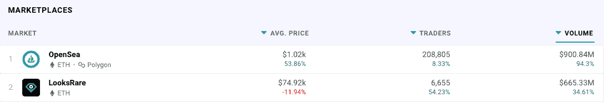
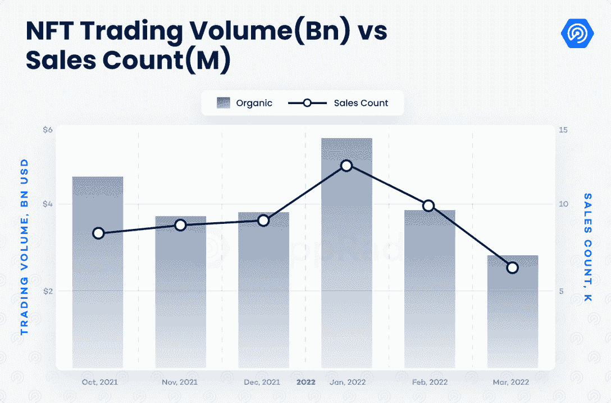
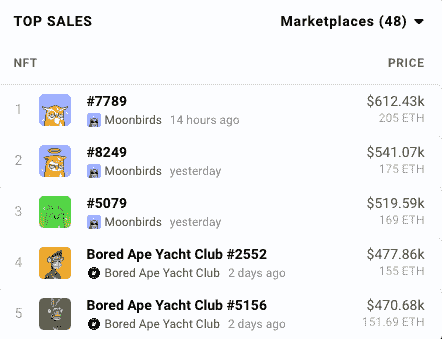

# 本周通过 LooksRare 和 OpenSea 交易的 NFT 价值 15 亿美元

> 原文：<https://web.archive.org/web/https://dappradar.com/blog/1-5-billion-in-nfts-traded-this-week-across-looksrare-and-opensea>

## NFT 交易的丰收周显示，空间仍然处于强势地位

**总结**

*   过去 7 天，OpenSea 和 LooksRare 在 NFT 的交易量合计超过 15 亿美元。
*   ***新 NFT 项目月鸟自身产生了超过 111，000 ETH(3.3 亿美元)。***

过去七天，NFT 的交易额超过了 15 亿美元。巨大的交易量部分是由新 NFT 项目月鸟推动的。但其他藏品无疑也为此尽了自己的一份力量，并帮助推动了一个尽管熊市呼声高涨但仍在走强的市场。

## NFT 的交易量看起来很强劲

关于 NFT 交易降温的预测可能为时过早。在过去的七天里，两个最大的二级市场的 NFT 交易量超过了 15 亿美元。

[DappRadar NFT marketplace rankings](https://web.archive.org/web/20220925090610/https://dappradar.com/nft/marketplaces)

在 2022 年 Q1 奥运会的 13 周内，NFT 的交易产生了 1 20 亿美元的销售额。平均每周销售额约为 9.23 亿美元。

正如我们在下面的图表中看到的，NFT 交易今年一直在下降。因此，本周的飙升对于 2021 年出现巨大增长的空间来说是一个好消息，但一些人担心可能会在 2022 年出现熊市信号的情况下出现回调。

[DappRadar’s 2022 Q1 report showed NFT sales dropping](https://web.archive.org/web/20220925090610/https://dappradar.com/blog/dapp-industry-report-q1-2022-overview)

## 数字背后的收藏

本周的大新闻是月鸟。自从这个项目于 4 月 16 日终止以来，我们已经在 DappRadar 上写了大量关于这个系列的文章。美国喜剧演员[吉米·法伦在他的钱包里放了两个](https://web.archive.org/web/20220925090610/https://dappradar.com/blog/moonbirds-for-jimmy-fallon-and-a-mutant-ape-for-neymar)，整个系列已经创造了大约 11.1 万 ETH(3.3 亿美元)的销售额。这相当于这两个平台全周交易量的五分之一以上。

促成这些令人印象深刻的数字的其他收藏有:

*   村上。flowers Seed——仅在 OpenSea 就有 21486 ETH(6400 万美元)。上周上涨了 4，108%。
*   [变种人 Ape 游艇俱乐部](https://web.archive.org/web/20220925090610/https://dappradar.com/ethereum/collectibles/mutant-ape-yacht-club):OpenSea 交易量每周 17273 ETH(5130 万美元)，过去 7 天内上涨 221%。
*   [Bored Ape 游艇俱乐部](https://web.archive.org/web/20220925090610/https://dappradar.com/ethereum/collectibles/bored-ape-yacht-club) : OpenSea 显示交易量为 11100 ETH(3300 万美元)。过去一周，交易量增长了 107%。
*   BEANZ 官方:过去一周，OpenSea 上的交易量为 5900 ETH(1750 万美元)，同期 collection 上的交易量增长了 113%。

上面的数字最令人惊讶的是每个收藏增加了 WoW 交易量。对于像 MAYC 和 BAYC 这样的大项目来说，如此大比例的激增是一个信号，表明兴奋可能会重新涌入 NFT 空间。

## 大拍卖增加了交易量

随着 Moonbirds 成为本周的热门话题，该项目中的三款非功能型汽车位居个人销售额前三名也就不足为奇了。令人惊讶的是，对于一个不到一周的项目，它有三笔交易，每笔价值超过 168 ETH(500，000 美元)。

[DappRadar’s top NFT collections for the week](https://web.archive.org/web/20220925090610/https://dappradar.com/nft)

可信赖的无聊的老猿还在那里，以过高的价格交易，看起来和以前一样疲惫不堪。

要跟踪 NFT 收藏并查看他们本周的排名，请访问我们的[排名页面](https://web.archive.org/web/20220925090610/https://dappradar.com/nft/collections)。你也可以阅读我们的[博客](https://web.archive.org/web/20220925090610/https://dappradar.com/blog/),了解非功能性测试领域的最新消息。我们的 [Twitter](https://web.archive.org/web/20220925090610/https://twitter.com/DappRadar) 页面发布新闻最快，我们的 [Discord](https://web.archive.org/web/20220925090610/https://discord.com/invite/4ybbssrHkm) 服务器每周都有精彩对话。