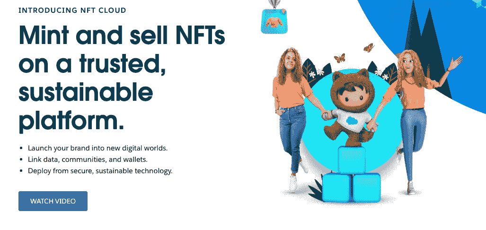
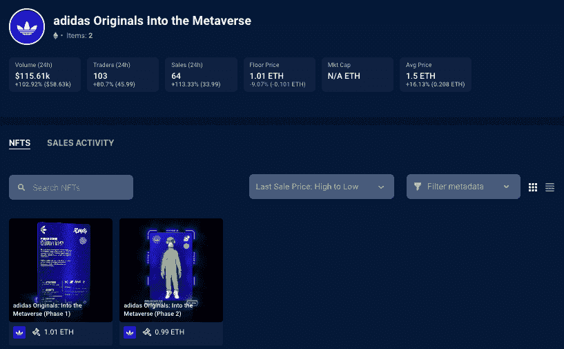
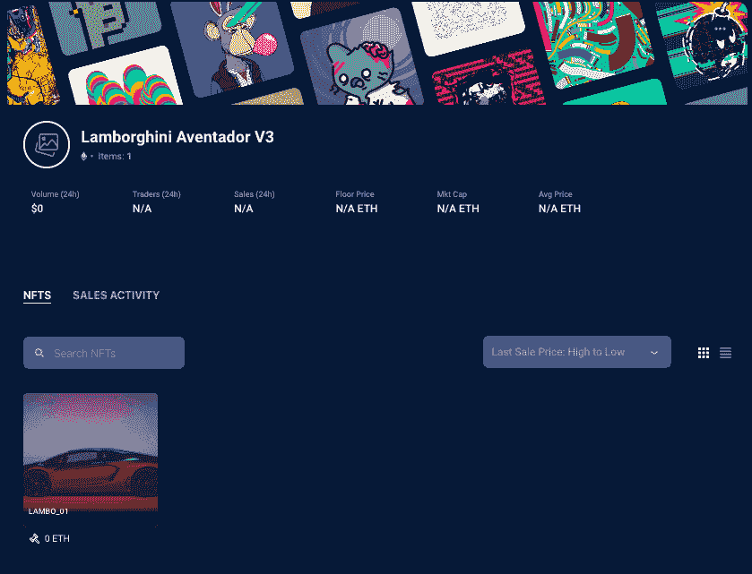
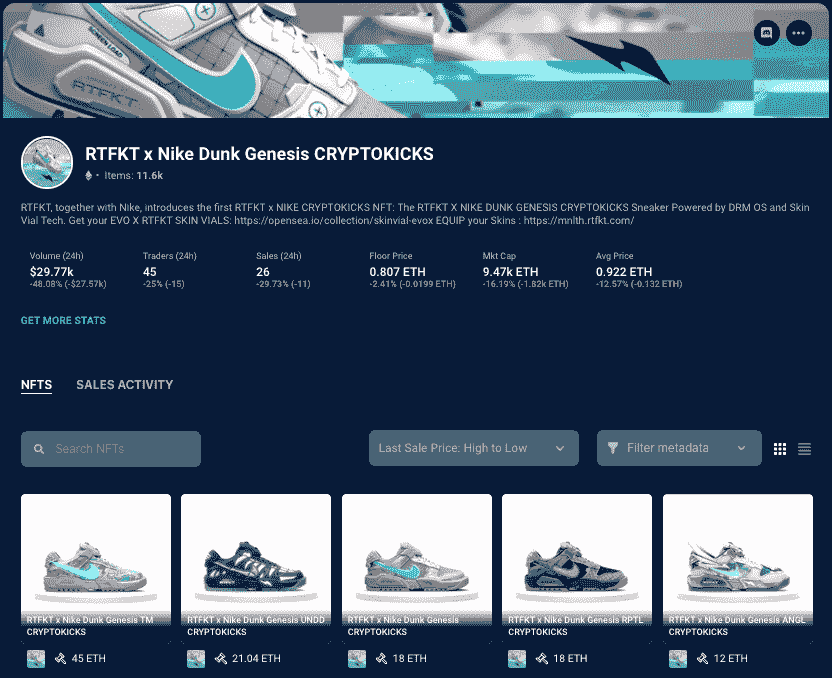
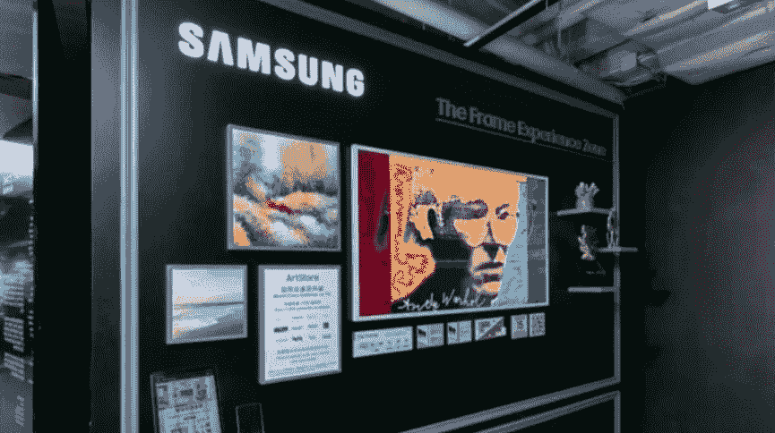
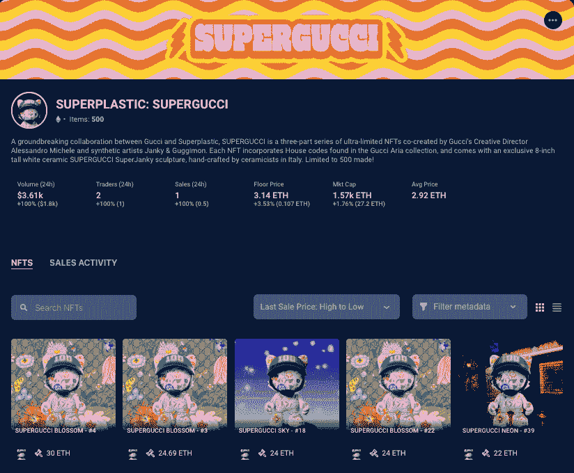
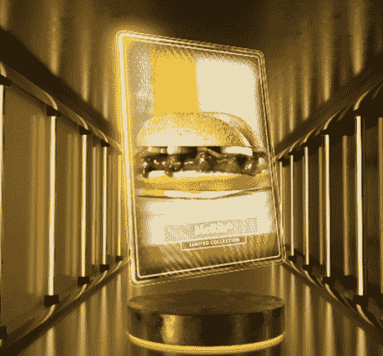
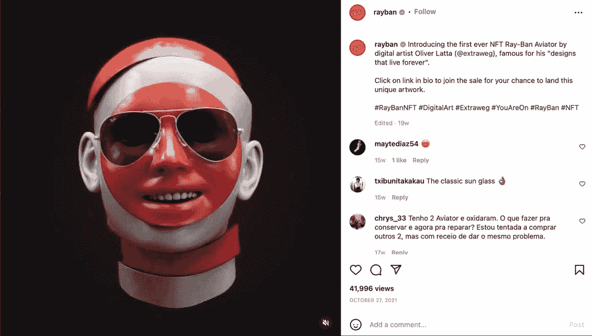
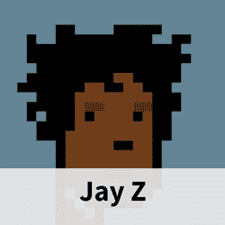

# 最近加入 NFT 市场的 10 大品牌

> 原文：<https://web.archive.org/web/https://dappradar.com/blog/10-big-brands-that-recently-joined-the-nft-space>

## 大品牌标志着向元宇宙生活和更多数字所有权的转变

在过去的 18 个月里，NFT 的受欢迎程度激增，像可口可乐和古驰这样的 T2 品牌正在研究如何利用这项技术更好地与顾客互动并为他们服务。与此同时，[百万美元的 NFT 销售额](https://web.archive.org/web/20221129083801/https://dappradar.com/hub/nft-explorer)已经成为常态，大品牌跃入 NFT 市场标志着向数字生活的重大转变。

无论你如何看待加密货币、区块链技术和 [NFTs](https://web.archive.org/web/20221129083801/https://dappradar.com/hub/nft-explorer) ，都很难否认它们将对我们未来的日常生活产生的影响。[德勤最近报道](https://web.archive.org/web/20221129083801/https://www2.deloitte.com/content/dam/Deloitte/us/Documents/technology/us-cons-merchant-getting-ready-for-crypto.pdf)美国大多数商家正在为不久后采用 crypto 做准备。

[关注当下最热门的 NFT 时装系列](https://web.archive.org/web/20221129083801/https://dappradar.com/nft/collections)

### 加密支付成为重中之重

在这项研究中，德勤对美国各行各业零售机构的 2000 名高管进行了有关数字资产相关话题的调查。超过 85%的受访高管表示，他们的企业“高度或非常高度重视”启用加密支付。近 75%的受访者表示，他们的组织计划在未来两年内接受加密或稳定币支付。

### 行业巨头纷纷涌向 NFT

根据 DappRadar 的数据，2021 年 NFT 交易量达到 250 亿美元。相比之下，NFT 贸易有机销售额有望超过去年，仅在 2022 年 5 月就达到 37 亿美元。

虽然许多品牌已跃入该领域，但也有一些明显的行业巨头，他们的行动胜于雄辩。可以说，虽然没有人有水晶球可以预见未来，但一些世界领先品牌的参与肯定会刺激另一波创新，并伴随着现实世界的采用。以下是最近进入 NFT 领域的 10 家公司。

*   [Salesforce](https://web.archive.org/web/20221129083801/https://dappradar.com/blog/10-big-brands-that-recently-joined-the-nft-space/#SalesForce-)
*   [阿迪达斯](https://web.archive.org/web/20221129083801/https://dappradar.com/blog/10-big-brands-that-recently-joined-the-nft-space/#Adidas)
*   [兰博基尼](https://web.archive.org/web/20221129083801/https://dappradar.com/blog/10-big-brands-that-recently-joined-the-nft-space/#Lamborghini)
*   [可口可乐](https://web.archive.org/web/20221129083801/https://dappradar.com/blog/10-big-brands-that-recently-joined-the-nft-space/#Coca-Cola)
*   [耐克](https://web.archive.org/web/20221129083801/https://dappradar.com/blog/10-big-brands-that-recently-joined-the-nft-space/#Nike)
*   [路易威登](https://web.archive.org/web/20221129083801/https://dappradar.com/blog/10-big-brands-that-recently-joined-the-nft-space/#Louis Vuitton)
*   [三星](https://web.archive.org/web/20221129083801/https://dappradar.com/blog/10-big-brands-that-recently-joined-the-nft-space/#Samsung)
*   [麦当劳](https://web.archive.org/web/20221129083801/https://dappradar.com/blog/10-big-brands-that-recently-joined-the-nft-space/#McDonald's)
*   雷朋

[<picture></picture>](https://web.archive.org/web/20221129083801/https://dappradar.com/blog/what-are-non-fungible-tokens-nfts)[<picture></picture>](https://web.archive.org/web/20221129083801/https://dappradar.com/nft/marketplaces)[<picture></picture>](https://web.archive.org/web/20221129083801/https://dappradar.com/nft/sales)

## 销售力量

Salesforce 是云计算技术的全球领导者，最近宣布凭借一个名为 NFT 云的新平台进入 NFT 领域。由客户关系管理软件行业领导者开发的 NFT 云平台，让公司[开发和销售 NFT](https://web.archive.org/web/20221129083801/https://dappradar.com/hub/nft-explorer)，与在线社区联系，并收集产品数据。

新的 Salesforce NFT 云目前正在由一小批测试版客户进行测试，但将于 2022 年 10 月开始向更多受众开放。目前还不知道哪些区块链平台将用于铸造非功能性交易，但是，该计划将不会支持需要大量能源来确认交易的区块链。

最重要的是，销售团队将 NFTs 视为建立更好的客户互动和忠诚度的一种方式，例如，NFTs 可用于提供独家在线社区和面对面活动的入场券。目前，销售人员更愿意提供无价值的人工制品，如固定和品牌办公设备，而不是使用非功能性技术来获取和参与。借助 Salesforce NFT 云，Salesforce 希望无限期地改变这种做法。

[<picture></picture>](https://web.archive.org/web/20221129083801/https://www.salesforce.com/products/web3/nft/)

## 阿迪达斯

2021 年 11 月，当[沙盒](https://web.archive.org/web/20221129083801/https://dappradar.com/multichain/games/the-sandbox)准备推出他们的第一款游戏赚取阿尔法测试游戏时，他们欢迎运动品牌阿迪达斯成为他们的 meta citizens 之一。沙盒已经与各种科技和娱乐公司建立了合作关系，例如雅达利、蓝精灵、Animoca Brands 和行尸走肉。然而，与时尚品牌的合作仍然缺失。

[在元宇宙查看阿迪达斯原厂](https://web.archive.org/web/20221129083801/https://dappradar.com/ethereum/collectibles/adidas-originals-into-the-metaverse)

运动服装巨头阿迪达斯 Originals 与 NFT 社区的知名人士合作，包括无聊猿游艇俱乐部、gmoney 以及 NFT 发布的朋克漫画背后的团队，在沙盒中推出了其第一款 NFT 数字和实体产品。

NFTs 让买家可以接触到区块链游戏世界的虚拟可穿戴设备，以及实体连帽衫、运动服和 gmoney 标志性的橙色无檐帽。阿迪达斯甚至为自己抢购了一个 NFT，一个叫 Indigo Herz 的无聊的 NFT 猿猴游艇俱乐部。然后，在 2022 年 1 月，阿迪达斯和意大利奢侈时尚品牌普拉达联手推出了一个基于[多边形网络](https://web.archive.org/web/20221129083801/https://dappradar.com/nft/protocol/polygon)的 NFT 项目，允许粉丝贡献他们的设计。

## 兰博基尼

豪华跑车制造商兰博基尼宣布将于 2022 年 1 月推出太空主题的 [NFT](https://web.archive.org/web/20221129083801/https://www.indiatimes.com/worth/news/in-2023-worlds-first-nft-restaurant-will-open-in-new-york-559548.html) 系列。然后在 2022 年 2 月初，[在推特上发布了](https://web.archive.org/web/20221129083801/https://www.indiatimes.com/worth/news/top-crypto-tweets-by-elon-musk-in-2021-558035.html)NFT 汽车俱乐部的 360 [兰博基尼 Aventador NFT](https://web.archive.org/web/20221129083801/https://dappradar.com/hub/nft-explorer/collection/lamborghini-aventador-v3) 系列。NFT 发射的想法可以追溯到 2019 年，当时兰博基尼向国际空间站发射了一块碳纤维复合材料，作为联合研究项目的一部分。

简而言之，这些钥匙的形状和制作材料是由[兰博基尼](https://web.archive.org/web/20221129083801/https://nft.lamborghini.com/)发送到国际空间站的碳纤维样本制成的，每个太空钥匙都有一个数字孪生艺术品作为 NFT，可以通过扫描实物背面的二维码来访问。该系列由 5 件独家太空主题的数码艺术品组成，由一位尚未透露姓名的艺术家创作。但是关于这位艺术家的身份和拍卖日期的更多细节预计将很快公布。

## 可口可乐

从大品牌的角度来看，可口可乐是早期的先驱之一。2021 年 7 月，可口可乐发布了一系列 4 个 NFT，它们是动画，一对一的数字艺术品，提供多感官体验，以庆祝国际友谊日。它解锁了一些惊喜的物品，比如一件可以在虚拟现实平台“分散”中穿着的“[可口可乐泡泡夹克”](https://web.archive.org/web/20221129083801/https://opensea.io/assets/ethereum/0x4581ce7b456a4254c98e1e32a3e59dd135061c17/341647274989675292413269219146690986323957005)，以及一张受 20 世纪 40 年代原始艺术品启发的可口可乐友谊卡。当然，持有者可以在二级市场上自由交易这些商品。

所有这些 NFT 在 72 小时内作为一个单独的“[战利品箱 NFT](https://web.archive.org/web/20221129083801/https://dappradar.com/hub/assets/eth/0x455f04c9c54fffa699e9f6b1271e857a1f2bddfa/1) ”被拍卖，获胜者还将获得一台现实生活中库存充足的可口可乐冰箱。值得注意的是，NFT 拍卖会的所有收益都捐给了国际特奥会。然后，在 2021 年底，可口可乐通过 [VeVe NFT 市场平台](https://web.archive.org/web/20221129083801/https://dappradar.com/blog/veve-nft-marketplace-to-allow-users-to-cash-out)发布了一套四个品牌的 NFT。随着可口可乐进一步尝试 NFT 滴剂和稀有产品，一系列以圣诞节为主题的数字收藏品雪花玻璃球(以落雪和标志性的可口可乐北极熊为特色)是盲盒产品的一部分。

## 奈基

最具标志性、历史最悠久的全球运动品牌之一耐克(Nike)也在 2021 年 12 月率先进入了 NFTs。耐克宣布收购 RTFKT Studios，称其为“利用尖端创新提供融合文化和游戏的下一代收藏品的领先品牌。”RTFKT 成立于 2020 年 1 月，发音为“artifact”，以 NFTs 的形式销售运动鞋等数字商品。

然而，耐克收购 RTFKT 之前，它在几十年里几乎没有任何品牌从属关系、收购或合并的情况下，开设了一个成功的运动品牌。简而言之，当耐克进军 NFT 市场时，人们给予了关注。虽然交易的细节当时没有披露，但从外部来看，这笔交易看起来像是一次传统的知识共享，双方都在各自的领域带来了大量的专业知识。

rtf kt x[Nike Dunk Genesis CRYPTOKICKS](https://web.archive.org/web/20221129083801/https://dappradar.com/ethereum/collectibles/rtfkt-x-nike-dunk-genesis-cryptokicks)于 2022 年 4 月中旬抵达，旁边是一个售罄的战利品箱。随后在 5 月底，RTFKT Space Drip x Nike Air Force 1 系列登陆。

[<picture></picture>](https://web.archive.org/web/20221129083801/https://dappradar.com/ethereum/collectibles/rtfkt-x-nike-dunk-genesis-cryptokicks)

## 路易·威登

为纪念诞生于 1821 年 8 月 4 日的路易威登 200 周年诞辰，该品牌创造了游戏路易(Louis The Game ),通过 NFTs 和游戏内创新将人们的注意力吸引到路易威登丰富的遗产上。这款游戏甚至有一个名为薇薇安的专属角色，模仿路易威登。在玩游戏时，用户可以潜入世界上最著名的时装屋之一的遗产，收集 monogram 蜡烛以进入更多的关卡。玩家还可以用不同的路易威登 monogram 印花和颜色定制他们的角色，并通过收集明信片和其他纪念品来了解 LV 在整个游戏中的历史。

现在，路易威登在游戏中加入了新的 NFT 任务和奖励。根据游戏规则，收集到一定数量的免费 NFT 的参与者将有机会赢得 NFT 彩票大奖。此外，玩家有机会赢得由时装设计师 Vivienne 设计的 10 个新 NFT 之一。NFT 收藏是与初创公司 Wenew Labs 合作创建的。

该项目虽然严格来说不是 NFT 系列，但它融合了两个最令人兴奋的游戏和非功能性游戏类别，不仅庆祝了它的生日，还向观众提供了有价值的营销和教育内容。此外，这是一个在客户营销和偏好方面有影响力的实验，因为增加的功能，如让玩家选择服装，可以转化为有价值的市场研究，用于以后的努力。

## 三星电子

三星是全球最重要的设备和电子产品制造商，从早期开始就公开支持 NFTs。这家在全球拥有数百万设备用户的韩国电子巨头已经在特定设备上推出了原生 dapp 浏览器，它在 2022 年 1 月宣布，计划从 2022 年的电视系列开始广泛支持 NFTs。

2022 年，三星将推出[世界上第一款基于电视屏幕的 NFT 浏览器](https://web.archive.org/web/20221129083801/https://news.samsung.com/au/nifty-gateway-partners-with-samsung-electronics-to-develop-an-industry-first-smart-tv-nft-platform)和市场聚合器，这是一个让你在一个地方浏览、购买和展示你最喜欢的艺术作品的平台。三星还在新闻稿中提到，这个平台将让创作者“与世界分享他们的艺术”，并让潜在买家在购买前预览 NFT，了解 NFT 的历史和区块链元数据。三星在 2022 年的电视上观看 NFT 时也注重细节。根据三星的发布，电视上的智能校准功能会自动将显示设置调整到创作者的预设值，这样你就可以放心，你的作品看起来无可挑剔，具有真实的原始图像质量

三星还于 2022 年 1 月在元宇宙分散的地方发布了其 837X 虚拟商店，进一步巩固了其在数字世界的地位。来自世界上最大的电视制造商之一的 NFT 的支持对 NFT 收藏家和技术来说只能是好事。此外，随着三星增加这些功能，其他制造商可能会很快加入进来。此外，该技术可以推广到移动和个人设备，以进一步增强未来的用户体验。

## 古驰

2021 年底，古驰宣布他们将与超塑和 NFT 巨星 Janky 和 Guggimon 合作。当时，关于合作的细节还不清楚，但它符合知名品牌与秘密项目合作在元宇宙立足的故事。

然后在 2022 年 1 月底，这家全球时装公司宣布了他们进入 NFT 空间的一大步，推出了 [SuperGucci 系列](https://web.archive.org/web/20221129083801/https://dappradar.com/blog/gucci-launches-10-exclusive-supergucci-nfts)，其中包括与玩具巨头 Superplastic 合作创作的十件作品。每一个都是与 web3 玩具和时尚品牌超塑合作制作和设计的。值得注意的是，每个 NFT 都配有一个由古驰创意团队共同设计的手工陶瓷雕像。

[在这里找到你最喜欢的 SuperGucci NFTs】](https://web.archive.org/web/20221129083801/https://dappradar.com/hub/nft-explorer/collection/superplastic-supergucci-2)

该声明伴随着该品牌未来元宇宙计划的路线图。根据这条线索，古驰将会在元宇宙下大赌注。这些努力将从一个专用的不和谐账户和革命性的古驰金库开始。金库旨在通过新的数字领域重新想象品牌的遗产，类似于前面提到的游戏路易。

## 麦当劳

这是品牌如何将非功能性营销用于营销目的的另一个典型例子。近 100，000 人转发了麦当劳菜单上的麦当劳排骨的消息，其传播速度和宣传力度超过了任何广告活动。重要的是，对于全球广告活动的一小部分预算来说。

2021 年 11 月，这家快餐业巨头发布了限量版的 10 份麦当劳三明治，旨在纪念这家快餐店受欢迎的三明治重返菜单。麦当劳发行了有限数量的 NFT，作为虚拟收藏艺术收藏的一部分，以 McRib 为特色，以创造产品暂时回归和有限供应的兴奋感。10 个单独的 McRib NFTs 的集合只提供给那些转发该品牌邀请的人，在短短几个小时内，超过 21，000 人转发了邀请，到 2022 年初，近 93，000 人转发了邀请。

[最近](https://web.archive.org/web/20221129083801/https://dappradar.com/blog/mcdonalds-metaverse-restaurants-to-feature-food-delivery-service)，麦当劳申请了商标，透露了在元宇宙开设食品配送服务的计划。这家标志性的美国快餐连锁店提交了十份商标申请，表明其计划推出一家虚拟餐厅，展示真实和虚拟商品，并进一步计划提供送货上门服务。

然后，在 2022 年 6 月初，Meta 宣布麦当劳将开始为其在几个全球市场的员工部署 Meta 的 Workplace 产品，包括公司和餐厅员工。目前，用户可以通过手机访问 Workplace。尽管如此，梅塔指出，部署是“以一种允许员工在需要时连接或断开的方式建立的。”未来，麦当劳的员工可以在 Meta 内部虚拟会面、主持会议等等，这一切肯定即将到来。

## 雷朋

标志性太阳镜设计师雷朋于 2021 年 10 月加入 NFTs，为其第一个也是唯一一个以该品牌传奇飞行员太阳镜为特色的 NFT 发起拍卖。它们是由德国艺术家奥利弗·拉塔创作的，他以其具有煽动性的 3D 动作设计而闻名。NFT 在 OpenSea 上拍卖，收益归意大利艺术信托。

感兴趣的收藏家和粉丝只需在雷朋的 NFT 和 OpenSea 的专用网站上注册，就可以加入这场慈善拍卖。那些将成功购买飞行员 NFT 眼镜的人将获得区块链数字艺术作品的真品证书。

除了这些大品牌，更多全球知名的公司已经进入 NFT 市场，包括安德玛、百事、法拉利等等。你可以[在这里](https://web.archive.org/web/20221129083801/https://dappradar.com/blog/category/collectibles)找到更多关于 NFTs 的信息，为什么不试着将你的区块链钱包连接到 DappRadar 和[现在就开始探索 NFTs](https://web.archive.org/web/20221129083801/https://dappradar.com/hub/wallet) 和 crypto。

[<picture></picture>](https://web.archive.org/web/20221129083801/https://dappradar.com/hub/wallet/eth/0x8d3bc45d7b30013c37c141f6ce7c981b2613efaa)[<picture></picture>](https://web.archive.org/web/20221129083801/https://dappradar.com/hub/wallet/)[<picture></picture>](https://web.archive.org/web/20221129083801/https://dappradar.com/hub/wallet/eth/0x3b417faee9d2ff636701100891dc2755b5321cc3) NewsletterUnsubscribe at any time. [T&Cs](https://web.archive.org/web/20221129083801/https://dappradar.com/terms) and [Privacy Policy](https://web.archive.org/web/20221129083801/https://dappradar.com/privacy-policy)