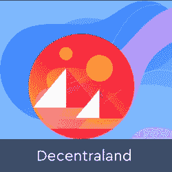
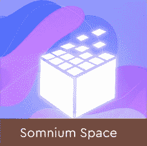

# 10 大品牌进军元宇宙

> 原文：<https://web.archive.org/web/https://dappradar.com/blog/10-major-brands-in-the-metaverse>

## 虚拟世界中的数字时尚、NFT 头像和虚拟事件

自从脸书改名为梅塔后，元宇宙就成了吸引各种品牌的地方。但即使在此之前，各种品牌已经涉足这一数字领域。我们来看看准备在元宇宙留下印记的 10 大主流品牌。

## 什么是元宇宙？

元宇宙不是一家公司制造的单一虚拟世界。不，它是一切的结合:虚拟世界、数字环境和分散服务。用户可以拥有一个身份，并在所有地点使用它，这意味着您可以在多个世界和多个服务中使用相同的个人资料、头像和钱包。

## 主要品牌进军元宇宙

现在让我们看看有哪些品牌对元宇宙感兴趣…

[https://web.archive.org/web/20221202015425if_/https://www.youtube.com/embed/ZNgNm4p2KAg?feature=oembed](https://web.archive.org/web/20221202015425if_/https://www.youtube.com/embed/ZNgNm4p2KAg?feature=oembed)

### 1.三星电子

韩国科技巨头三星在纽约开了一家虚拟版的 837 旗舰店，但现在你可以在分散地参观。虚拟 837X 商店是该公司在拉斯维加斯消费电子展上发布最新产品的展示窗口。它有三个区域:连接剧场、可持续森林和定制阶段。在活动的第一天，参观者甚至可以赢得限量版数码时装。分散地的三星商店将在有限的时间内开放，但三星计划在其他平台上开设更多的 837X 商店。

### 2.可口可乐

2021 年，可口可乐推出了他们的第一个 NFT 系列，同时在分散地举办了一场虚拟活动。这一切都是以 7 月 30 日友谊日的名义。可口可乐在他们的虚拟可乐罐建筑上组织了一场虚拟派对。参观者可以赢得非常罕见的可穿戴设备，派对开始了可口可乐友谊盒 NFT 包装的拍卖。

### 3.奈基

2021 年 12 月，耐克收购了 RTFKT (Artifact)工作室，这是一个在 NFT 社区拥有强大影响力的数字时尚品牌。因此，耐克现在可以接触到一个顶级的数字时尚品牌和元宇宙现成的 CloneX 头像。RTFKT 已经推出了各种可穿戴设备，包括将在分散地区使用的 NFT。此外，他们出售可以兑换实物物品的 NFT，他们允许某些社区获得专属运动鞋。所有这些都表明耐克收购了元宇宙迄今为止最强的时尚品牌之一。

### 4.阿迪达斯

阿迪达斯不仅在虚拟世界沙盒中获得了土地，还与朋克漫画、Gmoney 和 T2 无聊猿游艇俱乐部合作推出了 NFT 系列。这个 NFT 版本立即吸引了大量眼球，因为它吸引了各种社区。尤其是与无聊猿类的联系，为阿迪达斯的努力带来了很多关注。然而，由于 3 万部 NFT 中只有 1 万部出售给公众，所以《T4:走进元宇宙》的推出并没有引起一些争议。

### 5.路易·威登

为庆祝 200 周年，时尚品牌路易威登做了一些令人惊讶的事情。他们发布了路易斯游戏，一个益智冒险游戏，玩家可以收集 NFT。这标志着该公司首次非常认真地进入元宇宙。在游戏中，您扮演 Vivienne，她需要穿越六个充满活力的地点来找到所有 200 根可收集的蜡烛。你仍然可以在谷歌 Play 商店和苹果的应用商店找到这款游戏。

### 6.博柏利雨衣

在 E3 2021 上宣布，博柏利与神话游戏合作，将品牌 NFT 带到游戏 Blankos Block Party。各种 NFT 很快就销售一空，因为游戏玩家渴望得到独家和限量版的资产。博柏利的臂章售价 25 美元，而博柏利鲨鱼 B 的游戏角色标价 300 美元。围绕这些 NFT 有一些炒作，因为鲨鱼 B 角色现在在二级市场上的售价至少为 700 美元。

### 7.达美乐

当然，并不是达美乐本身进入了元宇宙，而是热情的开发商让美国公民订购比萨饼成为可能。整个订购过程发生在[分散化](https://web.archive.org/web/20221202015425/https://dappradar.com/ethereum/marketplaces/decentraland)的虚拟世界中。这表明，即使没有这些品牌自身的努力，品牌和服务也将找到进入元宇宙的途径。此外，这表明元宇宙的商业可以补充现实世界中的商业。

### 8.苏富比拍卖行

2021 年将成为 NFT 艺术成为主流的一年。苏富比拍卖行在其中发挥了至关重要的作用。他们甚至在分散地内开了一个模仿伦敦画廊的虚拟画廊。虚拟画廊没有无缘无故地开放，因为苏富比在 2021 年 6 月举行了原生数字拍卖。在这里，他们拍卖了罗伯特·爱丽丝的艺术品，同时展出了来自 NFT 著名艺术家的各种 NFT 艺术品。

### 9.AMC 是行尸走肉

AMC 的《行尸走肉》不仅仅是一部电视剧，因为它衍生出了续集和衍生剧、各种商品，现在也是一款游戏。《行尸走肉帝国》将进入游戏生态系统，允许玩家拥有土地，赚取和寻找资产，与其他玩家交易，等等。当然，看到基于行尸走肉的游戏并不是什么新鲜事，但这标志着玩家第一次可以拥有一点游戏世界。最重要的是，拥有土地可以产生被动收入，而游戏世界中的幸存者可以通过交易获得收入。这是一个大品牌进入游戏赚钱。我们甚至没有提到漫画公司 Skybound 也将《行尸走肉》带入元宇宙，这要感谢沙盒。

### 10.雅达利

最后但并非最不重要的是雅达利，这是一家游戏公司，它早期涉足虚拟世界，如[去中心化](https://web.archive.org/web/20221202015425/https://dappradar.com/ethereum/marketplaces/decentraland)和[沙盒](https://web.archive.org/web/20221202015425/https://dappradar.com/ethereum/games/the-sandbox)。在这里，他们将经典、标志性的游戏系列带入元宇宙。作为一家游戏公司，雅达利经历了困难时期，但它的品牌依然坚挺。雅达利在元宇宙的出现很可能是该公司真正再次繁荣所需要的火花。

## 为什么品牌要加入元宇宙？

难怪上面列出的这些全球品牌正乘着元宇宙的浪潮。正如你在我们的 [2021 年 Dapp 行业报告](https://web.archive.org/web/20221202015425/https://dappradar.com/blog/2021-dapp-industry-report)中看到的，去年所有与元宇宙相关的项目都经历了相当大的价值评估。虚拟土地 NFT 的售价高达 250 万美元。

例如，像沙盒这样的虚拟世界在 2022 年 3 月拥有 200 万注册用户。

根据我们 7 月、*的最新[行业报告，“元宇宙和区块链的博彩企业继续获得越来越多的风险投资。”](https://web.archive.org/web/20221202015425/https://dappradar.com/blog/dappradar-blockchain-industry-report-july-2022)*

## 有哪些最好的元宇宙虚拟世界？

如果你对检查各种区块链驱动的虚拟世界感兴趣，你必须阅读我们的文章[十大最佳元宇宙虚拟世界与陆地 NFTs](https://web.archive.org/web/20221202015425/https://dappradar.com/blog/top-10-best-metaverse-virtual-worlds-with-land-nfts) 。

我们也在这里列出了三个最著名的，供你探索。

[<picture></picture>](https://web.archive.org/web/20221202015425/https://dappradar.com/ethereum/marketplaces/decentraland)[<picture></picture>](https://web.archive.org/web/20221202015425/https://dappradar.com/ethereum/marketplaces/the-sandbox-marketplace)[<picture></picture>](https://web.archive.org/web/20221202015425/https://dappradar.com/ethereum/games/somnium-space)

## 和 DappRadar 一起继续了解元宇宙

在这个列表中，你最喜欢的品牌是什么？或者你知道其他品牌在元宇宙做一些很酷的事情吗？让我们知道并[加入我们的不和](https://web.archive.org/web/20221202015425/https://www.discord.gg/dappradar)与社区一起讨论事情。

我们 DappRadar 将继续关注最具革命性的元宇宙虚拟世界，并随时为您提供最佳机会。

如果你想进一步了解令人兴奋的去中心化应用世界中的最佳项目，那么关注 DappRadar [博客](https://web.archive.org/web/20221202015425/https://dappradar.com/blog/)、 [YouTube](https://web.archive.org/web/20221202015425/https://www.youtube.com/c/DappRadar) 频道和 [Twitter](https://web.archive.org/web/20221202015425/https://twitter.com/dappradar) 账户。

***以上不构成投资建议。此处给出的信息仅供参考。请尽职调查并自行研究。***

 NewsletterUnsubscribe at any time. [T&Cs](https://web.archive.org/web/20221202015425/https://dappradar.com/terms) and [Privacy Policy](https://web.archive.org/web/20221202015425/https://dappradar.com/privacy-policy)