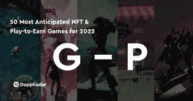

# 2022 年 2 月要观看的 10 场游戏

> 原文：<https://web.archive.org/web/https://dappradar.com/blog/10-play-to-earn-games-to-watch-in-february-2022>

## 涵盖产品发布、beta 测试、NFT 销售和锦标赛

2022 年 2 月你需要关注的游戏有哪些？我们在书中列出了十个突出的项目。今年 2 月，这些游戏将推出新的更新，启动 NFT 销售，并邀请玩家进行测试。

[玩即赚游戏](https://web.archive.org/web/20220930091914/https://dappradar.com/rankings/category/games)并不总是为了赚钱。首先也是最重要的一点，一个游戏必须是一个好游戏，当它有趣的时候，它会在更长的时间内吸引更多的玩家。将游戏列入这份名单的原因多种多样，从令人敬畏的游戏更新到早期投资机会。我们涵盖了光谱的两端。

然而，在这种情况下，我们更喜欢看那些承诺实际游戏性的游戏。现在让我们来看看 2022 年 2 月上榜的 10 款游戏。

## 奥运果酱

随着北京 2022 年冬季奥运会的举行，Animoca Brands 在 Android 和 iOS 上发布了奥运会果酱。在这款免费游戏中，玩家可以参加免费比赛，以获得业余、职业和冠军联赛的入场券。在这里，参赛者可以获得 sVTG 代币，然后他们可以用这些代币购买奥林匹克 Pin NFTs 或在[币安智能链](https://web.archive.org/web/20220930091914/https://dappradar.com/rankings/protocol/binance-smart-chain)上兑换 VTG 代币。

[https://web.archive.org/web/20220930091914if_/https://www.youtube.com/embed/IUVaqRnHmUI?feature=oembed](https://web.archive.org/web/20220930091914if_/https://www.youtube.com/embed/IUVaqRnHmUI?feature=oembed)

## 连锁怪兽

在线角色扮演游戏 [Chainmonsters](https://web.archive.org/web/20220930091914/https://dappradar.com/flow/games/chainmonsters) 已经成功完成在移动设备上的内部测试。这意味着 MMO 将在本月的某个时候登陆 Android 和 iOS 系统。Chainmonsters 的特色是季节性内容和各种各样的 NFT。然而，[流量区块链](https://web.archive.org/web/20220930091914/https://dappradar.com/rankings/protocol/flow)上的游戏不提供游戏内加密货币。价值隐藏在游戏物品的稀有性中。

[https://web.archive.org/web/20220930091914if_/https://www.youtube.com/embed/Aun5M3LDHv8?feature=oembed](https://web.archive.org/web/20220930091914if_/https://www.youtube.com/embed/Aun5M3LDHv8?feature=oembed)

## 黑暗国度

交易卡牌游戏[黑暗国度](https://web.archive.org/web/20220930091914/https://dappradar.com/multichain/games/dark-country)已经在[蜡像区块链](https://web.archive.org/web/20220930091914/https://dappradar.com/rankings/protocol/wax)上开放了陆地游戏，并在 mainnet 上推出了该功能。陆地游戏目前仍在测试中，并将很快全面发布。在这个测试阶段之后，土地所有者将能够获得以影子一角硬币支付的被动收入。土地所有者将需要保持活跃，以保持他们的影响力，并获得影子硬币奖励。

## 电影

战术战斗游戏 [Voxie Tactics](https://web.archive.org/web/20220930091914/https://dappradar.com/ethereum/games/voxies) 将于二月发布公测，给每个人一个尝试游戏的机会。测试版以 PVP 战斗为特色，允许玩家在基于战术的战斗中竞争。持有 [Voxie NFT](https://web.archive.org/web/20220930091914/https://dappradar.com/ethereum/games/voxies) 的玩家可以定制他们的英雄，但是没有 NFT 的玩家也可以玩游戏。在公测期间，所有玩家都可以通过在排行榜上竞争来获得体素代币。

[https://web.archive.org/web/20220930091914if_/https://www.youtube.com/embed/q__Zx_rHg0A?feature=oembed](https://web.archive.org/web/20220930091914if_/https://www.youtube.com/embed/q__Zx_rHg0A?feature=oembed)

## 淀积层

生物战斗游戏 [Illuvium](https://web.archive.org/web/20220930091914/https://dappradar.com/ethereum/games/illuvium) 背后的团队计划在二月底进行封闭测试。粉丝们已经看到了一些游戏片段，但他们中的一些人很快就会亲自尝试 batte 游戏。测试版将只包含 PVE 游戏，还没有任何游戏赚功能。玩家将与一波又一波的敌人战斗，直到他们最终灭亡。Illuvium 运行在[不可变 X](https://web.archive.org/web/20220930091914/https://dappradar.com/rankings/protocol/immutablex) 区块链缩放解决方案上。有兴趣尝试这款游戏的玩家，可以报名参加测试版。首先[注册你的账户](https://web.archive.org/web/20220930091914/https://www.illuvium.io/)，然后[在这里申请](https://web.archive.org/web/20220930091914/https://cutt.ly/illuviumpb1)。

[https://web.archive.org/web/20220930091914if_/https://www.youtube.com/embed/mzT88eN4gts?feature=oembed](https://web.archive.org/web/20220930091914if_/https://www.youtube.com/embed/mzT88eN4gts?feature=oembed)

## 区块链格斗家

随着瑞克·佛莱尔的加入和游戏准备推出其“玩赚”功能，区块链格斗家可能会有一个喜庆的月份。他们将出售各种 NFT 包与争吵，而齿轮可以增强数字摔跤手。BRWL 令牌将存在于[区块链格斗家](https://web.archive.org/web/20220930091914/https://dappradar.com/wax/games/blockchain-brawlers)生态系统的核心。毫无疑问，二月将是[蜡像游戏](https://web.archive.org/web/20220930091914/https://dappradar.com/rankings/protocol/wax/category/games)的大日子！

## 暴动赛车

尽管测试版是在一月的最后几天开始的，但仍然值得一提的是 [Riot Racers](https://web.archive.org/web/20220930091914/https://dappradar.com/polygon/games/riot-racers) 现在可以玩了。在这款游戏中，游戏世界的每一部分都掌握在社区手中。玩家拥有赛车和车手，还有加油站和机械商店。所有这些都作为 NFT 存在于[多边形区块链](https://web.archive.org/web/20220930091914/https://dappradar.com/rankings/protocol/polygon)上。车主需要这些服务来参加比赛，并从游戏中的赛车中获得防暴代币。

## 沙盒

Snoop Dogg 将很快出售 [10，000 个独特的 Snoop 头像](https://web.archive.org/web/20220930091914/https://dappradar.com/blog/snoop-dogg-launching-nft-avatars-in-the-sandbox/)用于沙盒，而虚拟世界也[最近迎来了华纳音乐集团](https://web.archive.org/web/20220930091914/https://dappradar.com/blog/the-sandbox-welcomes-warner-music-group)。然而，对于[沙盒](https://web.archive.org/web/20220930091914/https://dappradar.com/ethereum/games/the-sandbox)来说，最大的事情是即将到来的第二次 Alpha 测试。这项“玩到赚”的活动仍将通过 NFT 通行证进行，但更多的人将能够加入。此外，它将引入更多的经验和机制。他们的下一次土地出售将于 2 月 10 日进行。

[https://web.archive.org/web/20220930091914if_/https://www.youtube.com/embed/wvSYJg9xO08?feature=oembed](https://web.archive.org/web/20220930091914if_/https://www.youtube.com/embed/wvSYJg9xO08?feature=oembed)

## NFT 世界

本月 [NFT 世界](https://web.archive.org/web/20220930091914/https://dappradar.com/ethereum/games/nft-worlds)将为土地所有者进行第二次也是最后一次象征性空投。持有一万块土地中的一块或多块的人将获得 [WRLD](https://web.archive.org/web/20220930091914/https://dappradar.com/hub/token/eth/WRLD?from=0xd5d86fc8d5c0ea1ac1ac5dfab6e529c9967a45e9&selectedWallet=portfolio) 。这个令牌可以用来在 NFT 世界的生态系统中货币化服务和功能。您将获得的代币数量取决于您的地块的稀有程度。

[https://web.archive.org/web/20220930091914if_/https://www.youtube.com/embed/pzfsKNJa6jM?feature=oembed](https://web.archive.org/web/20220930091914if_/https://www.youtube.com/embed/pzfsKNJa6jM?feature=oembed)

## 万维网 b3

WorldWideWebb3 的像素化反乌托邦世界已经容纳了各种社区，而许多其他玩家可以将他们的个人资料图片 NFT 用作宠物或可玩角色。这些开发者以高速度创造新功能，加入社交元素和竞争性游戏。在本季度结束之前，该团队希望能够进入公寓并展示 NFT。此外，将有一个神奇宝贝风格的 NFT 宠物战斗系统。

有兴趣发现更多[区块链游戏](https://web.archive.org/web/20220930091914/https://dappradar.com/rankings/category/games)？然后，您应该深入了解我们 2022 年最受期待的 50 款 NFT 和玩赚游戏。我们将游戏分布在 3 个页面上，链接如下:

[<picture></picture>](https://web.archive.org/web/20220930091914/https://www.dappradar.com/blog/best-nft-play-to-earn-games-for-2022-from-a-to-f)[<picture></picture>](https://web.archive.org/web/20220930091914/https://www.dappradar.com/blog/best-nft-play-to-earn-games-for-2022-from-g-to-p)[<picture></picture>](https://web.archive.org/web/20220930091914/https://www.dappradar.com/blog/best-nft-play-to-earn-games-for-2022-from-q-to-z)