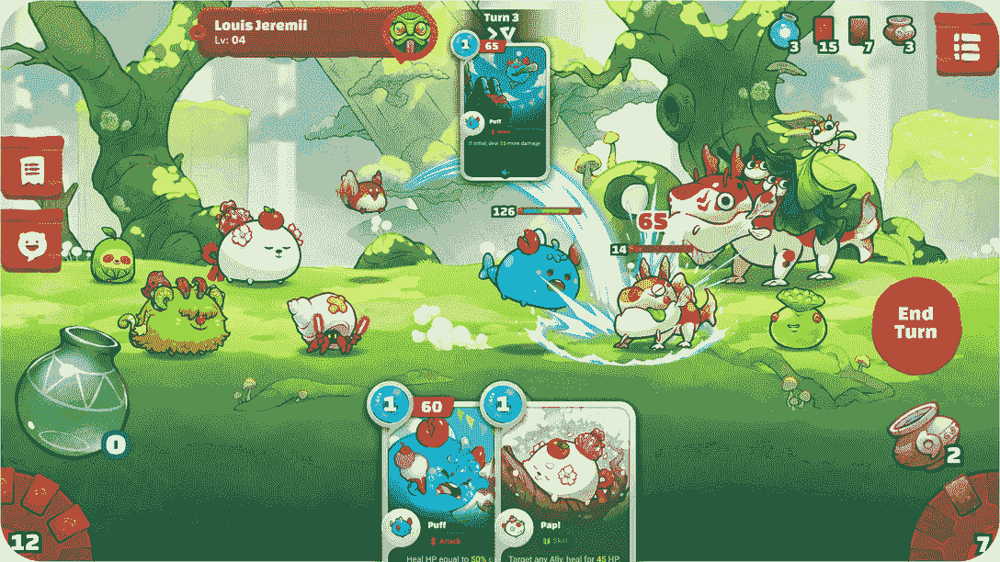

# 2022 年 3 月观看的 10 场游戏

> 原文：<https://web.archive.org/web/https://dappradar.com/blog/10-play-to-earn-games-to-watch-in-march-2022>

## 区块链游戏领域的升级、更新和改进概述

这个月应该看哪些游戏？我们下面的列表列出了那些上链活动有所增加或者刚刚发布了重大声明的公司。其他公司正在推出一系列新的 NFT，有几个公司正在进入下一个发展阶段。

玩赚取游戏是为了什么？它们是为人们通过利用他人获取经济利益而建立的系统吗？或者他们是一个想要共同建设有意义的东西的紧密团结的社区的核心？在 [DappRadar](https://web.archive.org/web/20221215220625/https://dappradar.com/rankings/category/games) ，我们认为先玩后赚游戏首先应该是一种很棒的体验。能够赢得奖励是让他们如此伟大的额外奖励。

看看下面是什么让我们对 2022 年 3 月刮目相看。

## 沙盒

[沙盒](https://web.archive.org/web/20221215220625/https://dappradar.com/ethereum/games/the-sandbox)于 3 月 3 日推出了其[阿尔法第二季](https://web.archive.org/web/20221215220625/https://dappradar.com/blog/news-from-the-sandbox-land-sale-going-live-on-march-3rd)。元宇宙巨人[继续建立合作伙伴关系](https://web.archive.org/web/20221215220625/https://dappradar.com/blog/the-sandbox-x-world-of-women-partner-up-to-empower-women)，以确保每个人都有理由参观。玩家现在可以探索 35 种以上的新体验，最棒的是，它们对所有人开放。不需要特别通行证或贵宾通道。

[https://web.archive.org/web/20221215220625if_/https://www.youtube.com/embed/qPVumlluz_4?feature=oembed](https://web.archive.org/web/20221215220625if_/https://www.youtube.com/embed/qPVumlluz_4?feature=oembed)

## 疯狂防御英雄

疯狂防御英雄上周，线上活动大幅增加。但是是什么让网络世界参与到塔防游戏中呢？有证据表明，是[每日明星基金](https://web.archive.org/web/20221215220625/https://dappradar.com/blog/crazy-defense-heroes-sees-crazy-rise-in-on-chain-activity)事件导致该平台活跃联网钱包增长了 300%。通过特殊活动获得奖励肯定会吸引“玩赚”的玩家。点击了解更多关于[的信息。](https://web.archive.org/web/20221215220625/https://medium.com/tower-token/crazy-defense-heroes-daily-star-chest-play-to-earn-event-adds-new-tower-map-nfts-in-march-2022-9189e2dc0c7c)

[https://web.archive.org/web/20221215220625if_/https://www.youtube.com/embed/0NCh3l7ymOU?feature=oembed](https://web.archive.org/web/20221215220625if_/https://www.youtube.com/embed/0NCh3l7ymOU?feature=oembed)

## 法特

全新的 [Farsite](https://web.archive.org/web/20221215220625/https://dappradar.com/ethereum/games/farsite) 市场将于 3 月 10 日开业。仅仅因为这个原因，就值得关注“DeFi-powered economic strategy MMO”:价格波动和机会往往会在大幅上涨期间出现。到目前为止，玩家可以通过游戏在线商店的箱子购买游戏中的物品。现在，在其官方市场上的点对点销售将为游戏玩家获得他们需要的资源开辟一系列新的途径。

[https://web.archive.org/web/20221215220625if_/https://www.youtube.com/embed/DdrQlnF7Ax4?feature=oembed](https://web.archive.org/web/20221215220625if_/https://www.youtube.com/embed/DdrQlnF7Ax4?feature=oembed)

## 轴无穷大:原点

Axie Infinity : Origin 将于本月底发布。Alpha 发布旨在确保游戏“通过 Mavis Hub 和 Android APK 面向全球所有人开放”。可能是游戏赚取游戏中最大的名字，[平台的经济最近被](https://web.archive.org/web/20221215220625/https://dappradar.com/blog/axie-lunar-event-ending-february-20th)重新调整以避免资产贬值。去 Axie Infinity 的[子栈](https://web.archive.org/web/20221215220625/https://axie.substack.com/p/origin?s=r)获取更多关于即将到来的 Origin 发布的信息。

Screenshot from Axie Infinity: Origin

## NFT 世界

2 月 18 日，NFT 世界发布了一份[文件](https://web.archive.org/web/20221215220625/https://docs.nftworlds.com/nft-worlds-tutorials/launch-your-metaverse)，其中包含了开发者如何在平台内推出自己的元宇宙的信息。FPS 游戏《我的国度》是[最近发布的](https://web.archive.org/web/20221215220625/https://twitter.com/MineNationsNFT/status/1499884778920849409)新游戏，值得一看。这种开源协作正是 web3 的初衷。这意味着像 NFT 世界这样的平台可以快速扩展，很快就能提供传统工作室花了几年时间才发布的游戏。

[https://web.archive.org/web/20221215220625if_/https://www.youtube.com/embed/akk62NUbpIc?feature=oembed](https://web.archive.org/web/20221215220625if_/https://www.youtube.com/embed/akk62NUbpIc?feature=oembed)

## 幻影星系

[幻影星系](https://web.archive.org/web/20221215220625/https://dappradar.com/polygon/collectibles/phantom-galaxies-origin)第二集现已出。如果你了解这个游戏，就没有太多要补充的了。事实上，如果你意识到了这一点，你正在读这篇文章而不是现在玩它是一个惊喜。但对于那些不熟悉快节奏射击游戏的人来说，它是在太空中设定的，建立在[多边形区块链](https://web.archive.org/web/20221215220625/https://dappradar.com/rankings/protocol/polygon)上。可在 PC 和 Mac 上使用，玩家有机会与他们的机械人自由漫游或参与故事情节。从图像和预告片来看，似乎 AAA 级游戏已经来到了区块链。

[https://web.archive.org/web/20221215220625if_/https://www.youtube.com/embed/HebwGVDp-_k?feature=oembed](https://web.archive.org/web/20221215220625if_/https://www.youtube.com/embed/HebwGVDp-_k?feature=oembed)

## 暴动赛车

[Riot Racers](https://web.archive.org/web/20221215220625/https://dappradar.com/polygon/games/riot-racers) 的从玩到赚将于三月到来。随着测试版的完成以及锦标赛和玩家创造的比赛的引入，赢得大量游戏内资产的机会终于来了。你甚至可以通过拥有加油站、机械商店或部分赛马场获得被动收入。现在是加入这个真正基于社区的平台的最佳时机。

[https://web.archive.org/web/20221215220625if_/https://www.youtube.com/embed/AZN2UZDz5Dw?feature=oembed](https://web.archive.org/web/20221215220625if_/https://www.youtube.com/embed/AZN2UZDz5Dw?feature=oembed)

## 城镇明星

作为[春晚](https://web.archive.org/web/20221215220625/https://dappradar.com/blog/tag/gala-games)最成功游戏之一的城镇之星，最近[发布了其最新升级](https://web.archive.org/web/20221215220625/https://dappradar.com/blog/more-rewards-coming-to-town-star-players)，以确保游戏继续满足其社区的期望。该平台刚刚推出了新的[动态明星挑战赛](https://web.archive.org/web/20221215220625/https://blog.gala.games/dynamic-star-challenge-update-ac5b2acea48f)系统，下个月将实施[城镇动力](https://web.archive.org/web/20221215220625/https://blog.gala.games/introducing-town-power-f38d254e7e09)。对于三月，游戏正在扩展其奖励结构，以便更多的玩家可以赚取资产，并延长其免费访问期。

[https://web.archive.org/web/20221215220625if_/https://www.youtube.com/embed/u1cymKiG-XM?feature=oembed](https://web.archive.org/web/20221215220625if_/https://www.youtube.com/embed/u1cymKiG-XM?feature=oembed)

## 夹板地

上周五，splitterlands 以 526，470 个独特的活跃钱包连接到该平台，荣登 DappRadar 的区块链[游戏排行榜](https://web.archive.org/web/20221215220625/https://dappradar.com/blog/splinterlands-takes-the-lead-nft-worlds-drops-out)榜首。仅从其令人印象深刻的在线活动来看，这款游戏就值得关注。 [SPS](https://web.archive.org/web/20221215220625/https://dappradar.com/hub/token/bsc/SPS/BNB?from=0x1633b7157e7638c4d6593436111bf125ee74703f) ，这款游戏的原生令牌，在 2022 年动荡的头几个月保持了相对稳定的价格。它的 30 天用户和交易数量也同样令人印象深刻。市场在为分裂的土地说话，所以也许我们都应该注意。

[https://web.archive.org/web/20221215220625if_/https://www.youtube.com/embed/i0MgCZC2-CQ?feature=oembed](https://web.archive.org/web/20221215220625if_/https://www.youtube.com/embed/i0MgCZC2-CQ?feature=oembed)

## Voxie 战术

上个月， [Voxies](https://web.archive.org/web/20221215220625/https://dappradar.com/ethereum/games/voxies) 团队发布了 PvP Voxies 战术游戏的公开测试版。该平台主要以其 Voxie NFTs 而闻名，于 2 月份推出了其战术 RPG。除此之外，它将很快开放自己的市场，玩家可以在那里交易游戏中的资产。

[https://web.archive.org/web/20221215220625if_/https://www.youtube.com/embed/6cAVut6HDWE?feature=oembed](https://web.archive.org/web/20221215220625if_/https://www.youtube.com/embed/6cAVut6HDWE?feature=oembed)

如果你有兴趣发现更多关于区块链游戏的信息，使用我们的[追踪工具](https://web.archive.org/web/20221215220625/https://dappradar.com/rankings/category/games)找到下一个即将到来的游戏。你可能会在下一个轰动事件的第一层。