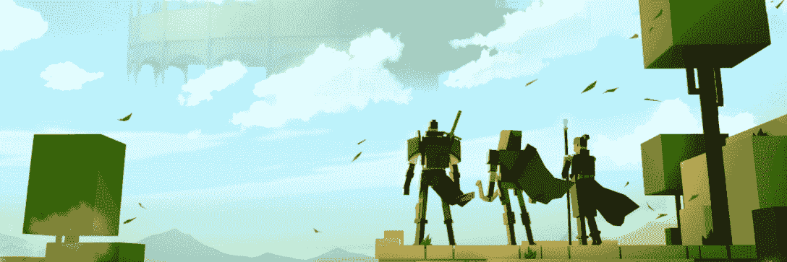
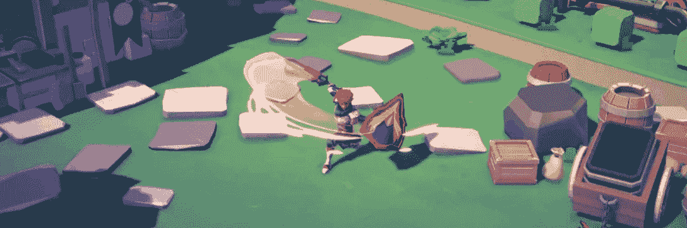
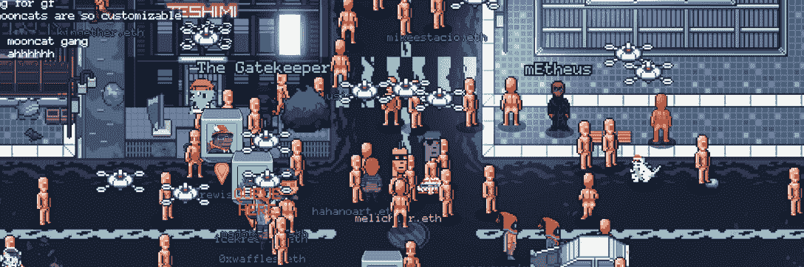
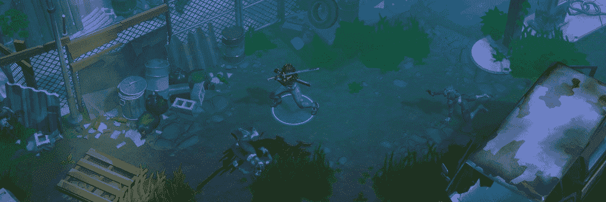
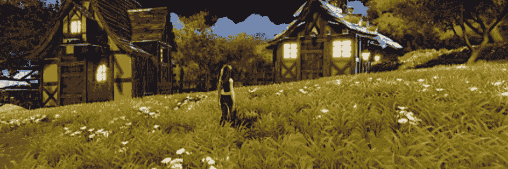
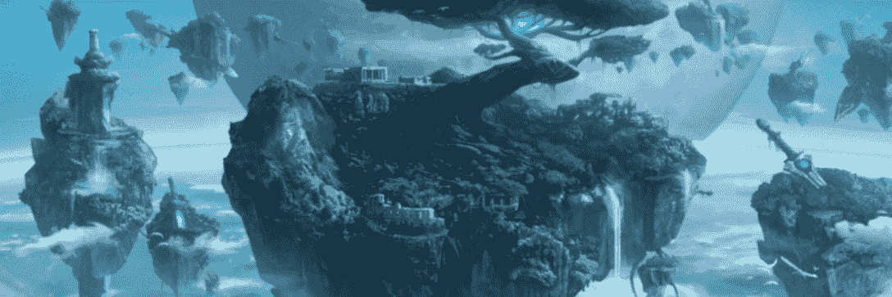
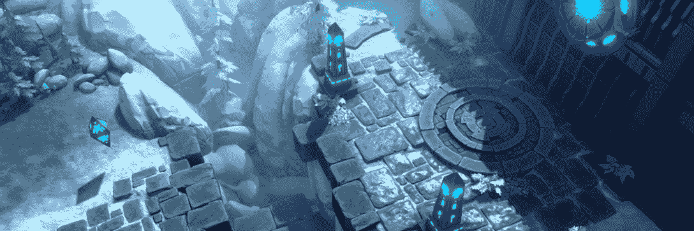
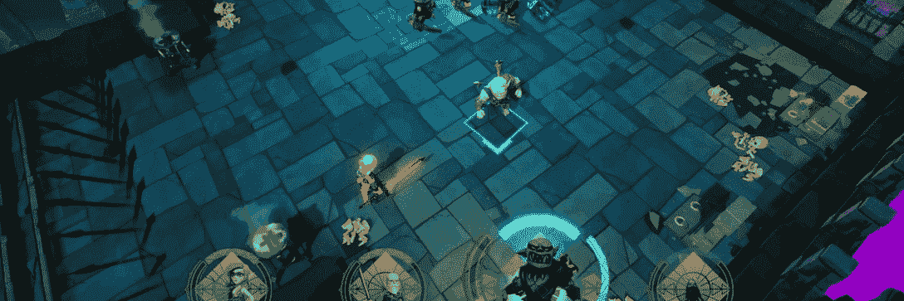
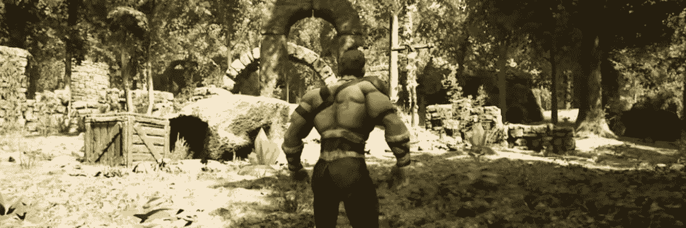
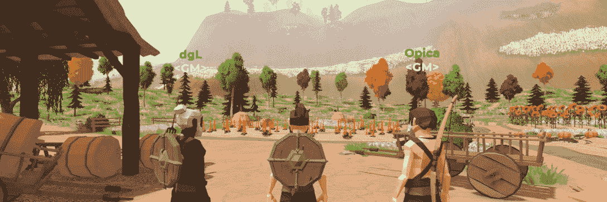

# 10 个即将到来的游戏世界与玩到赚机制

> 原文：<https://web.archive.org/web/https://dappradar.com/blog/10-upcoming-gaming-worlds-where-you-could-have-a-side-hustle>

## 一起工作，杀龙，分配战利品，制作一些物品

大型多人在线游戏和虚拟世界是最适合元宇宙和即玩即赚游戏的游戏类型。玩家在游戏世界中收集资源、工艺物品、交易资产，并在虚拟世界中冒险。在这篇文章中，我们将看看 10 个即将到来的游戏世界，你可能会发现一个不错的侧面骗局。

自从我们在《魔兽世界》中的戈德希尔或贫瘠之地漫步以来，许多人一直梦想着生活在 MMORPG。当然，你可以通过交易和训练新手来赚取游戏中的金币，但这并不能支付账单。通过区块链技术，这个梦想更近了一步，因为玩家拥有游戏资产的所有权。他们可以交易、借用、使用或出售物品，这就是游戏经济突然变得非常真实的原因。

让我们来看看 10 个以玩赚机制为特色的在线游戏世界，它们中的每一个都与为我们带来了无尽的任务、魔兽世界和江湖的 MMORPG 游戏类型有着密切的联系。

[https://web.archive.org/web/20221208162146if_/https://www.youtube.com/embed/PUQpuX6UtUM?feature=oembed](https://web.archive.org/web/20221208162146if_/https://www.youtube.com/embed/PUQpuX6UtUM?feature=oembed)

本文中列出的游戏有:

*   [Mirandus](https://web.archive.org/web/20221208162146/https://dappradar.com/blog/10-upcoming-gaming-worlds-where-you-could-have-a-side-hustle/#mirandus)
*   [余烬剑](https://web.archive.org/web/20221208162146/https://dappradar.com/blog/10-upcoming-gaming-worlds-where-you-could-have-a-side-hustle/#ember)
*   [环球韦布](https://web.archive.org/web/20221208162146/https://dappradar.com/blog/10-upcoming-gaming-worlds-where-you-could-have-a-side-hustle/#world)
*   [行尸走肉帝国](https://web.archive.org/web/20221208162146/https://dappradar.com/blog/10-upcoming-gaming-worlds-where-you-could-have-a-side-hustle/#walking)
*   [错过](https://web.archive.org/web/20221208162146/https://dappradar.com/blog/10-upcoming-gaming-worlds-where-you-could-have-a-side-hustle/#mist)
*   [摇篮:物种起源](https://web.archive.org/web/20221208162146/https://dappradar.com/blog/10-upcoming-gaming-worlds-where-you-could-have-a-side-hustle/#cradles)
*   [世界永恒在线](https://web.archive.org/web/20221208162146/https://dappradar.com/blog/10-upcoming-gaming-worlds-where-you-could-have-a-side-hustle/#eternal)
*   [守护者协会](https://web.archive.org/web/20221208162146/https://dappradar.com/blog/10-upcoming-gaming-worlds-where-you-could-have-a-side-hustle/#guild)
*   [盖亚 Everworld](https://web.archive.org/web/20221208162146/https://dappradar.com/blog/10-upcoming-gaming-worlds-where-you-could-have-a-side-hustle/#gaia)
*   [地牢宇宙](https://web.archive.org/web/20221208162146/https://dappradar.com/blog/10-upcoming-gaming-worlds-where-you-could-have-a-side-hustle/#dungeon)

请记住，所有这些游戏世界仍在发展中。这篇文章不应该被认为是投资建议。

## Mirandus

Gala Games 是区块链最受期待的 MMORPGs 之一。在米兰多斯，经济的每一部分都由公司、公会或个人玩家拥有。Gala Games 提供了一个充满动物、怪物和 5 个王国的生活世界。故事的走向取决于玩家。国王们可以发动战争，而商人和工匠们则尽力做到最好。玩家可以去冒险，把他们的资源卖给店主，或者应其他玩家的要求完成工作。现在还为时过早，但 2022 年对米兰多斯来说可能是重要的一年。

## 灰烬之剑

明亮之星工作室制作《余烬之剑》已经有一段时间了，到目前为止已经完成了一次土地出售。动作包装的 RPG 将有玩家杀死怪物，收集资源和交易物品。有一个小的开发延迟，因为团队决定将他们的资产转移到[不可变 X](https://web.archive.org/web/20221208162146/https://dappradar.com/rankings/protocol/immutablex) 。尽管如此，这个动作包装的 RPG 是非常高调的。预计 2022 年将会有更多的土地出售，或许我们将会拿到游戏的早期版本。

## 万维网

有了 WorldWideWebb，我们将最开放的元宇宙世界之一添加到列表中。该项目不仅整合了许多 NFT 项目，从[crypto punk](https://web.archive.org/web/20221208162146/https://dappradar.com/ethereum/collectibles/cryptopunks)到 [CyberKongz](https://web.archive.org/web/20221208162146/https://dappradar.com/ethereum/collectibles/cyberkongz) 以及从幼虫到[月饼](https://web.archive.org/web/20221208162146/https://dappradar.com/ethereum/games/mooncatrescue)，它还承诺土地所有者能够整合他们自己的游戏和服务。开发团队看到了一个未来，任何人都可以在万维网上发布或集成 dapp。互操作性是这个易于访问的虚拟像素世界的关键特征之一。

## 行尸走肉:帝国

有了 AMC 的《行尸走肉帝国》,我们就有了这个列表中唯一的品牌游戏虚拟世界。玩家需要组队，建立家园，保护自己，收集资源，并始终害怕僵尸部落。游戏发生在佐治亚州，这个场景也曾出现在著名的电视连续剧中。玩家现在可以在 Gala Games 网站上为行尸走肉帝国购买土地。定价在 11，000 [GALA](https://web.archive.org/web/20221208162146/https://dappradar.com/hub/token/eth/GALA?from=0x15d4c048f83bd7e37d49ea4c83a07267ec4203da) 左右开始，在撰写本文时为 3，300 美元。

## 下雾

随着[迷雾](https://web.archive.org/web/20221208162146/https://dappradar.com/binance-smart-chain/games/mist)我们将[币安智能链](https://web.archive.org/web/20221208162146/https://dappradar.com/rankings/protocol/binance-smart-chain/category/games)上的第一个在线动作 RPG 添加到列表中。游戏将允许玩家寻找并击败怪物以获得 NFT 奖励，但它也使用了原生的迷雾令牌。除了纯粹的游戏动作之外，这个团队承诺通过游戏制作农场迷雾的能力。持有和使用 NFT 可以增加你的赌注和农业收益，同时也提供了游戏性的好处。这为 Mist 生态系统中的所有用户提供了这些资产的宝贵功能。

## 摇篮:物种起源

从这个列表中的所有游戏来看，《摇篮:物种起源》仍然有最长的路要走。这款创新的在线角色扮演游戏让玩家拥有随时间发展的星球。然而，玩家越早冒险进入一个危险而混乱的世界，奖励就越大。玩家需要给世界带来秩序。这个游戏中的 NFT 遵循新的 ERC-3664 令牌标准，这意味着如果玩家不干预，NFT 可能会陷入混乱并灭亡。是的，每个星球都是玩家拥有的 NFT。Cradles 非常认真地对待游戏世界的概念，即玩即赚和社区所有权。

## 世界永恒在线

《永恒世界在线》将给玩家一个充满了要杀死的突袭 bosses、要爬过的地下城和要收集的战利品的幻想 MMORPG 世界。贸易和手工艺将形成这个 MMO 的经济，城市将成为充满活力的社会中心。新的区域，任务和地下城基于玩家的合作而产生。英雄 NFT，工艺许可证和地契将通过即将到来的销售活动出售给玩家。

## 守护者协会

随着[守护者协会](https://web.archive.org/web/20221208162146/https://dappradar.com/multichain/games/guild-of-guardians)的到来,《不可改变的团队》成为今年最热门的手机游戏之一。在这一行动中，RPG 玩家在公会中组队击败地下城，收集战利品，并摧毁团队首领。只有当玩家成为公会的一员时，他们才能将获得的资源用于手工艺制作。这强调了开发者都是关于玩家协作的。看起来，玩家也准备好了，因为守护者协会的 NFT 已经很受欢迎了，在[不可变 X](https://web.archive.org/web/20221208162146/https://dappradar.com/rankings/protocol/immutablex) 上交易气体免费。

## 盖亚 Everworld

尽管盖亚 Everworld 还处于早期阶段，这个幻想世界还是值得一提的。在这个游戏世界中，玩家建立他们的王国，探索土地，与怪物战斗，收集物品和饲养宠物。他们刚刚在[币安 NFT 市场](https://web.archive.org/web/20221208162146/https://dappradar.com/nft/marketplaces/protocol/binance-smart-chain)上开始出售他们的盖亚战士，同时玩家也可以在盖亚购买土地。盖亚的世界将充满冲突，但特殊的安全区将允许玩家和平地交易和社交。

## 地牢宇宙

我们以《地牢宇宙》结束这个列表，这是一个幻想的 MMORPG，玩家在那里收集武器和盔甲，但也收集稀有的法术和食谱。地下城宇宙为玩家提供住所和宠物，同时玩家可以继续任务，冒险进入地下城或组队进行史诗般的突袭。MMORPG 将是免费的，但 20 美元的高级订阅会给你在游戏世界中带来经济利益。想想降低费用和资源收集时间。

* * *

这是 10 个即将到来的游戏世界，融合了 NFTs、玩赚和区块链技术。很快你的 80 级术士将会成为你的助手，为你的伴侣支付周末的费用，或者至少 40 级战士可以为你在快餐店赚一个汉堡。你想在这些游戏中的哪一个中变得活跃？让我们知道，并[加入我们的不和](https://web.archive.org/web/20221208162146/https://www.discord.gg/dappradar)。

如果你对区块链游戏感兴趣，你可以通过查看 [DappRadar 排名](https://web.archive.org/web/20221208162146/https://dappradar.com/rankings/category/games)找到最活跃的游戏 dapps。在这里我们追踪游戏在[多边形](https://web.archive.org/web/20221208162146/https://dappradar.com/rankings/protocol/polygon/category/games)、[币安智能链](https://web.archive.org/web/20221208162146/https://dappradar.com/rankings/protocol/binance-smart-chain/category/games)、[浪人](https://web.archive.org/web/20221208162146/https://dappradar.com/rankings/protocol/ronin/category/games)、[蜡人](https://web.archive.org/web/20221208162146/https://dappradar.com/rankings/protocol/wax/category/games)以及其他许多区块链生态系统上。