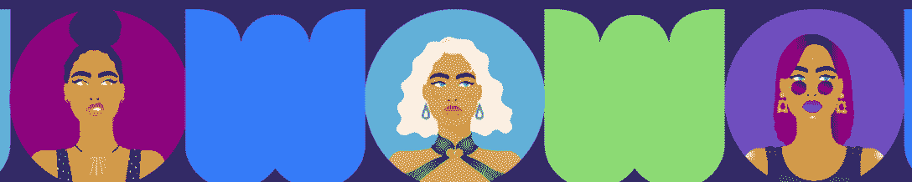
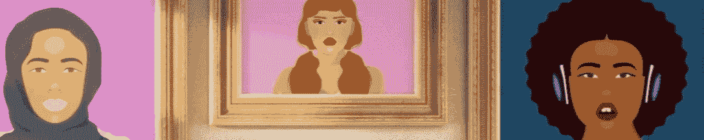
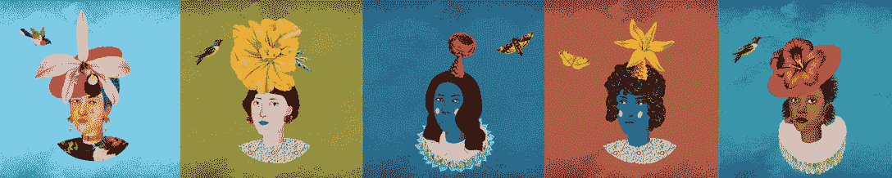
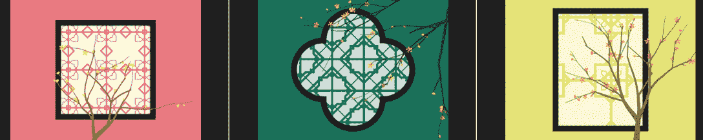
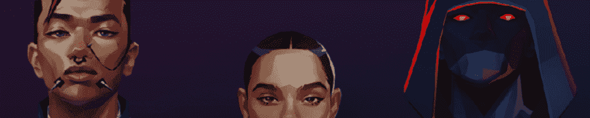

# 区块链领域的 15 位女性先锋

> 原文：<https://web.archive.org/web/https://dappradar.com/blog/15-women-pioneering-the-blockchain-space>

## 为了纪念国际妇女节，看看这些女士和她们成功的区块链项目

为了庆祝国际妇女节，我们在区块链空间创建了 15 位女性先锋的名单。区块链技术给我们生活的许多领域带来了一波又一波的革命，然而这个领域遵循着在传统金融和艺术领域观察到的相同模式——女性往往代表性不足。

高科技领域历来由男性主导。然而，这并不意味着妇女不参与。事实上，web3 领域一些最大、最受欢迎的项目都是由女性领导的团队从头开始构建的。在下面的列表中，你会发现 DeFi、游戏和众多 NFT 系列中的分散式应用都是由女性创造的。

浏览下面的列表，和 DappRadar 一起庆祝国际妇女节。让我们来关注一些令人印象深刻的女士，她们在区块链留下了自己的印记。请记住，还有更多我们没有在这里列出的女性。所有这些都建立在一个更好的，分散的未来之上。

## DeFi 中的妇女

### 安娜·斯通—*good dollar 的创始人兼首席执行官*

[安娜·斯通](https://web.archive.org/web/20221214005511/https://twitter.com/TheRealStone)和[古德勒](https://web.archive.org/web/20221214005511/https://dappradar.com/multichain/defi/gooddollar-1)一起开创了 DeFi 空间，古德勒是 [Fuse Network](https://web.archive.org/web/20221214005511/https://dappradar.com/rankings/protocol/fuse) 的头号 dapp。GoodDollar 允许成千上万的用户通过 dapp 生态系统提供流动性或受益于通用基本收入。

### bette Chen-*Acala 的联合创始人*

Bette Chen 是新西兰的 DeFi 冠军。作为 [Acala](https://web.archive.org/web/20221214005511/https://acala.network/) 的联合创始人，陈女士将目光投向了将 DeFi dapps 引入波尔卡多特区块链。Acala 是一个智能合约平台，允许用户在 Polkadot 上扩展 DeFi 解决方案，同时受益于以太坊兼容性。

### 克里斯汀·斯通—*平衡器的首席运营官*

克里斯汀·斯通(Kristen Stone)在加密领域拥有丰富的履历，之前曾在比特币基地和索拉纳任职。她目前是自动投资组合管理器和交易平台[平衡器](https://web.archive.org/web/20221214005511/https://balancer.fi/)的首席运营官。

### 丽贝卡·雷蒂格—*Aave 的总法律顾问*

丽贝卡·雷蒂格是目前最大的 DeFi dapps 之一 [Aave](https://web.archive.org/web/20221214005511/https://dappradar.com/ethereum/defi/aave) 的法律总顾问。建立在以太坊区块链，Aave 现在已经将其服务扩展到多边形和雪崩。仅在过去 30 天，dapp 就吸引了近 7 亿美元的交易量。

### Maggie Love-*SheFi 的创始人*

玛吉·洛夫是以女性为中心的 DeFi 教育服务机构[谢菲](https://web.archive.org/web/20221214005511/https://www.shefi.org/team)的创始人。SheFi 的目标是让女性有机会了解 DeFi，并开始从中受益，从加密好奇到加密自信。

## 区块链游戏中的女性

### bozena Rezab-*Gamee 的首席执行官和联合创始人*

Bozena Rezab 是 Gamee 团队的基础成员，该公司开发了广受欢迎的手机游戏平台 Arc8。作为 Gamee 的联合创始人兼首席执行官，Bozena Rezab 是区块链游戏领域的先驱，通过创建全移动 Arc8 区块链迷你游戏平台，将革命向前推进了一步。

### marguerite DeCourcelle-*封锁游戏公司的首席执行官*

Marguerite DeCourcelle 是封锁游戏公司的首席执行官，该公司是广受欢迎的赛博朋克角色扮演区块链游戏[霓虹区](https://web.archive.org/web/20221214005511/https://dappradar.com/ethereum/games/neon-district-ethereum)的幕后工作室。除了在封锁游戏中扮演重要角色，Marguerite DeCourcelle 还是一名狂热的 NFT 收藏家，在 crypto twitter 上以笔名硬币艺术家活跃着。

### beryl Li-*Yield Guild Games 联合创始人*

[Beryl Li](https://web.archive.org/web/20221214005511/http://twitter.com/berylchavezli) 是区块链最大的游戏公会之一 [Yield Guild Games](https://web.archive.org/web/20221214005511/https://yieldguild.io/) 的联合创始人。社区是让区块链游戏如此令人兴奋的最重要的方面之一，而 Yield 公会游戏让玩家很容易聚在一起并组织公会。

### 沙罗·麦肯纳—*《外星世界》的联合创始人*

沙罗·麦肯纳是广受欢迎的蜡制采矿游戏《T2》的联合创始人。《异形世界》是区块链表现最好的游戏之一，每周吸引成千上万的玩家。

### Anna norre vik-*安泰尔互动公司前首席执行官*

安娜·诺勒维克是安泰尔互动公司的前首席执行官，安泰尔互动公司是《T2》和《我的邻居爱丽丝》的幕后工作室。《我的邻居爱丽丝》是一款多人游戏，它向数百万玩家介绍了区块链。任何人都可以购买和拥有虚拟岛屿，收集和建造令人兴奋的物品，结识新朋友。

## 非技术学校中的妇女

### yam kar kai-*女性世界的创造者*

Yam Karkai 是广受欢迎的 NFT 女装系列背后的艺术天才。该系列背后的想法是打破 crypto 是男性专属的观念，将更多女性引入 NFT 空间。《女性世界》在 NFT 空间占据了突出的位置，吸引了数百万的交易量，以及像瑞茜·威瑟斯彭这样的名人的关注。

### 丽莎·梅尔-*《老板美人》的创作者*

丽莎·梅尔是另一个以女性为中心的系列的创造者，[老板美人](https://web.archive.org/web/20221214005511/https://dappradar.com/ethereum/collectibles/boss-beauties)。除了推出成功的 NFT 系列，该系列已经产生了超过 12，000 ETH 的交易量，Lisa Mayer 还是 MySocialCanvas 的首席执行官。MySocialCanvas 是一个专门为女性设计的导师和创业课程平台。

### 花童的创造者

[Varvara Alay](https://web.archive.org/web/20221214005511/https://twitter.com/VarvaraAlay) 是[花童](https://web.archive.org/web/20221214005511/https://dappradar.com/nft/collections) NFT 系列背后的创意力量。由于卖花女收藏品独特的艺术品和设计，Alay 女士的作品已经引起了 NFT 社区的极大兴趣。此外，像[布丽·拉尔森](https://web.archive.org/web/20221214005511/https://dappradar.com/blog/brie-larson-joins-the-nft-space-with-flower-girls-purchase/)这样的名人也注意到了这个系列，将花童 NFT 加入他们的作品集。

### 列瓦—*艺术块生成艺术家*

[列瓦](https://web.archive.org/web/20221214005511/https://www.artblocks.io/project/207)是一位北京的艺术生成艺术家、创意程序员和计算机图形工程师，他已经成为了[艺术街区](https://web.archive.org/web/20221214005511/https://dappradar.com/ethereum/collectibles/art-blocks)社区的一个品牌。她的【透过窗户的 系列设计独特，巧妙地融入了生殖元素，列瓦将女性生殖艺术推向了新的高度。

### 乔西·贝里尼—*网络经纪人的创造者*

[乔西·贝里尼](https://web.archive.org/web/20221214005511/https://twitter.com/josiebellini)是一位先锋艺术家和设计师，自 2017 年以来一直涉足秘密艺术。她有金融背景，并创造艺术来讲述加密生态系统的故事。最近，她推出了[网络经纪人](https://web.archive.org/web/20221214005511/https://dappradar.com/ethereum/collectibles/cyberbrokers) NFT 系列，几乎瞬间售罄，现在正在推动二级市场销售，因为底价继续上涨。

## 加密适用于所有人

当我们在 3 月 8 日庆祝女性时，这也是时候指出加密和区块链空间是为每个人准备的。区块链技术的基本原则是透明和公平，这也意味着平等。目前，大多数项目和 dapps，无论它们是 DeFi、游戏还是 NFT 部门的一部分，都是由男子管理的。

然而，女性领导的项目正在成倍增加，例如 SheFi 这样的倡议专门为妇女带来了信息、资源和进入区块链世界的机会。重要的是，技术相关领域不欢迎女性的观念正在消散。

达普拉达抓住了这个机会，将聚光灯对准了密码领域的女性领导者。国际妇女节快乐！如果你想了解更多关于区块链空间的来龙去脉，请在 Twitter 上关注 DappRadar。

 NewsletterUnsubscribe at any time. [T&Cs](https://web.archive.org/web/20221214005511/https://dappradar.com/terms) and [Privacy Policy](https://web.archive.org/web/20221214005511/https://dappradar.com/privacy-policy)