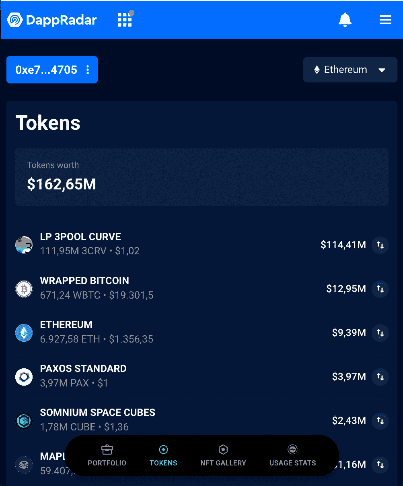

# 做市商温特穆特的 1.6 亿美元资产被盗

> 原文：<https://web.archive.org/web/https://dappradar.com/blog/160-million-in-assets-stolen-from-market-maker-wintermute>

## 黑客攻击了该公司的 DeFi 业务，而 CeFi 和 OTC 服务仍然没有危险。

Wintermute 是一次黑客攻击的受害者，那次攻击夺走了该公司大约 1.6 亿美元的资产。尽管做市商用户得到保证，该公司有两倍的剩余股权，但 Wintermute 的首席执行官在 Twitter 上向黑客发出公开呼吁，试图收回资金。

**总结**

*   Wintermute 是全球最大的数字资产算法做市商之一；
*   价值超过 160，000，000 美元的资产被盗；
*   正如首席执行官 Evgeny Gaevoy 在 Twitter 上宣布的那样，该公司仍然有偿付能力；
*   [使用 DappRadar 投资组合跟踪器](https://web.archive.org/web/20221207044658/https://dappradar.com/hub/wallet/eth/0xe74b28c2eae8679e3ccc3a94d5d0de83ccb84705/assets)查看黑客的钱包内容。

## 温特穆特解决了黑客

Gaevoy 在 Twitter 上解决了黑客问题，让 Wintermute 社区了解了正在发生的事情。

与 Wintermute 有 MM 协议的用户被保证他们的资金是安全的，但是做市商的服务将会暂时中断。

> 我们(仍然)开放对待这是一个白帽子，所以如果你是攻击者-取得联系
> 
> — wishful cynic (@EvgenyGaevoy) [September 20, 2022](https://web.archive.org/web/20221207044658/https://twitter.com/EvgenyGaevoy/status/1572134291382960130?ref_src=twsrc%5Etfw)

根据他的推文，温特穆特的贷款人仍然可以收回他们的贷款，如果他们觉得更安全的话，但提醒他们温特穆特是有偿付能力的。

作为回应，社区在如此艰难的时期表现出对团队的支持——但截至发稿时，没有人声称对此次黑客攻击负责。

## 2022 年 Dapp 行业的黑客攻击

近来，黑客攻击在 Web3 领域并不新鲜，也不令人惊讶。如我们 2022 年 8 月的 [Dapp 行业报告](https://web.archive.org/web/20221207044658/https://dappradar.com/blog/dappradar-blockchain-industry-report-august-2022)所示:

> ***今年前 7 个月，加密货币黑客攻击损失增加了约 60%，达到 19 亿美元，这是由通过分散金融(DeFi)协议窃取的资金增加所致。***
> 
> Sara Gherghellas, Blockchain Analyst

ZackXBT 设法追踪黑客的钱包，你现在可以使用 [DappRadar 的投资组合追踪器](https://web.archive.org/web/20221207044658/https://dappradar.com/hub/wallet/eth/0xe74b28c2eae8679e3ccc3a94d5d0de83ccb84705/assets)检查所有存储在钱包中的代币——直到它被归还给 Wintermute 或消失。

[<picture></picture>](https://web.archive.org/web/20221207044658/https://dappradar.com/hub/wallet/eth/0xe74b28c2eae8679e3ccc3a94d5d0de83ccb84705/assets)

[Track the hacker’s wallet using DappRadar’s Portfolio Tracker](https://web.archive.org/web/20221207044658/https://dappradar.com/hub/wallet/eth/0xe74b28c2eae8679e3ccc3a94d5d0de83ccb84705/assets)

## 不断学习和跟踪你的投资组合

在这个不断变化的环境中，不断了解分散式应用中的黑客攻击、DeFi 和安全性至关重要。

你可以使用 [DappRadar 的投资组合追踪器](https://web.archive.org/web/20221207044658/https://dappradar.com/hub/wallet)来管理你的投资组合——还有黑客和[名人的投资组合追踪器](https://web.archive.org/web/20221207044658/https://dappradar.com/blog/celebrity-wallets-a-dive-into-crypto-hollywood)，只要你有他们钱包的地址。

最后但同样重要的是，确保继续你的 Web3 教育之旅，在我们的[博客](https://web.archive.org/web/20221207044658/https://dappradar.com/blog/)、 [YouTube](https://web.archive.org/web/20221207044658/https://www.youtube.com/c/DappRadar) 和 [Twitter](https://web.archive.org/web/20221207044658/https://twitter.com/DappRadar) 上分享 DappRadar 的精彩内容。

### 有用的链接

*   [关于 Web3 行业黑客的最新新闻和文章](https://web.archive.org/web/20221207044658/https://dappradar.com/blog/tag/hack)
*   [先睹为快 Wintermute 的黑客加密钱包](https://web.archive.org/web/20221207044658/https://dappradar.com/hub/wallet/eth/0xe74b28c2eae8679e3ccc3a94d5d0de83ccb84705/assets)
*   [访问 Wintermute 官网](https://web.archive.org/web/20221207044658/https://www.wintermute.com/)

## 随身携带您的 Web3 之旅

使用 DappRadar 移动应用程序，再也不会错过 Web3。查看最受欢迎的 dapps 的性能，并关注您投资组合中的 NFT。您在 DappRadar 上的帐户会与我们的移动应用程序同步，这样您很快就可以选择实时接收提醒。

[Download the DappRadar app now](https://web.archive.org/web/20221207044658/https://dappradar.app.link/blog)[<picture></picture>](https://web.archive.org/web/20221207044658/https://play.google.com/store/apps/details?id=com.portfolio.dappradar) NewsletterUnsubscribe at any time. [T&Cs](https://web.archive.org/web/20221207044658/https://dappradar.com/terms) and [Privacy Policy](https://web.archive.org/web/20221207044658/https://dappradar.com/privacy-policy)