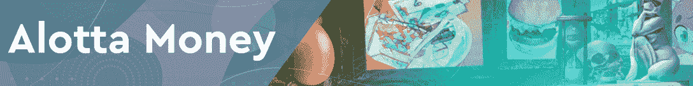
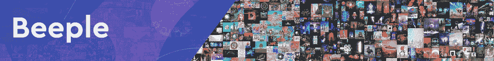
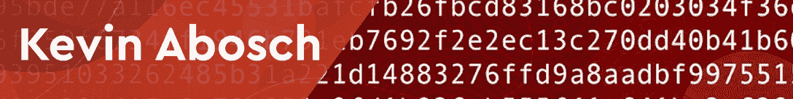
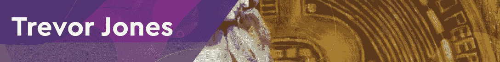
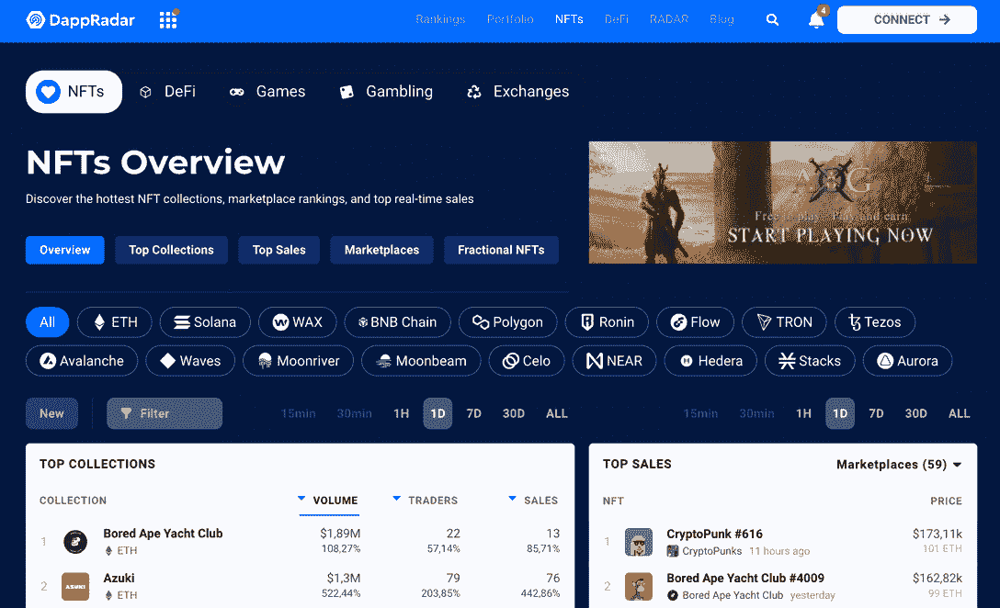

# 20 位 NFT 艺术家有可能成为元宇宙的毕加索

> 原文：<https://web.archive.org/web/https://dappradar.com/blog/17-nft-artists-who-could-be-the-picasso-of-the-metaverse>

## 在区块链成名的数字艺术家

NFT 艺术家最近成为热门话题，或许他们中的一位将会是未来几年元宇宙的毕加索。在这篇文章中，我们将看看你必须了解的 20 位艺术家。他们中的每一个人都因为在 NFT 的空间中为自己赢得了一席之地。继续读下去，让你的眼睛为一些艺术做好准备！

## NFT 炒作背后的艺术家

数字艺术和[不可替代代币(NFTs)](https://web.archive.org/web/20220805060717/https://dappradar.com/blog/what-are-non-fungible-tokens-nfts) 已经存在了相当长一段时间，但直到最近，它们才真正有机会大放异彩。

他们真的大放异彩。NFTs 为数字艺术家提供了展示他们的激情和才华的媒介和工具，即使是那些在传统的主流艺术界受到谴责的艺术家。

[https://web.archive.org/web/20220805060717if_/https://www.youtube.com/embed/Hx8bdw4kQio?feature=oembed](https://web.archive.org/web/20220805060717if_/https://www.youtube.com/embed/Hx8bdw4kQio?feature=oembed)

那么这些数字和 NFT 艺术家呢？努力开发新内容的人和那些对推动空间和随之而来的炒作负有最大责任的人？

[<picture></picture>](https://web.archive.org/web/20220805060717/https://dappradar.com/blog/what-are-non-fungible-tokens-nfts)[<picture></picture>](https://web.archive.org/web/20220805060717/https://dappradar.com/nft/marketplaces)[<picture></picture>](https://web.archive.org/web/20220805060717/https://dappradar.com/nft/sales)

## 可能成为下一个元宇宙·毕加索的 NFT 艺术家

让我们来看看元宇宙最受赞誉的一些创作者。

### 1.XCOPY

被称为 XCOPY 的艺术家在 Tumblr 的黄金时代开始了他的成功之路，在接下来的几年里聚集了无数的支持者。然而，直到 2017 年，他才对区块链感兴趣，出售了他的第一件加密货币。

2021 年 3 月，在以 1000 ETH 的价格售出后，他的作品《死亡之降》打破了[超级罕见的](https://web.archive.org/web/20220805060717/https://dappradar.com/ethereum/marketplaces/superrare)销售记录，随后又取得了其他百万美元的成功。XCOPY 的风格是公认的广泛使用卡通般的形象，CMYK 调色板和电视静态图像。

来看看 XCOPY 的这些 NFT:[虹吸管](https://web.archive.org/web/20220805060717/https://dappradar.com/hub/assets/eth/0x905e7e152ecd7315f03d8d671578ea72684cca99/33500010001)、[大吃大喝者](https://web.archive.org/web/20220805060717/https://dappradar.com/hub/assets/eth/0x8a939fd297fab7388d6e6c634eee3c863626be57/17600030074)和[底部进料器](https://web.archive.org/web/20220805060717/https://dappradar.com/hub/assets/eth/0xa8bd2de03228d1bb1686fe813047f2a4c638723c/3200010011)。

### 2.阿洛塔钱

作为一名先锋的加密艺术家，阿洛塔·莫尼以他在许多主要加密艺术平台上发现的广泛的未来主义、无政府主义、网络狂欢、幽默颠覆和无意义的艺术而闻名。

他被称为最优秀和最具创造力的隐体素建造者之一，因在该平台上设计了许多美丽的建筑而闻名，包括未来主义的体素酒店。最近，他发布了 CoinDesk 最具影响力的肖像集。

看看阿洛塔钱的这些 NFT:[1789](https://web.archive.org/web/20220805060717/https://dappradar.com/hub/assets/eth/0xb932a70a57673d89f4acffbe830e8ed7f75fb9e0/26210)、[裸美元](https://web.archive.org/web/20220805060717/https://dappradar.com/hub/assets/eth/0xb932a70a57673d89f4acffbe830e8ed7f75fb9e0/5997)、 [Reve Partis](https://web.archive.org/web/20220805060717/https://opensea.io/assets/0xb932a70a57673d89f4acffbe830e8ed7f75fb9e0/6356) 。

### 3.毕普勒

迈克·温克尔曼(Mike Winkelmann)又名毕普(Beeple)是一位成功的平面设计师[，他在 2021 年早些时候](https://web.archive.org/web/20220805060717/https://dappradar.com/blog/beeple-b20-and-the-rise-of-digital-art)因在佳士得的首次拍卖中以 6930 万美元的价格卖出一幅 NFT 作品而成为头条新闻。

“每一天:第一个 5000 天”包含了每天创作的艺术品，它的销售被认为是让公众意识到这个艺术分支的存在，并使 Beeple 成为整个秘密艺术运动的公众形象。

2021 年 11 月，佳士得以 2800 万美元拍卖了毕普的另一幅作品——人类的作品。作为三大最有价值的在世艺术家之一，Beeple 还创作短片、知识共享 VJ loops、every days 和 VR/AR 艺术。

### 4.凯文·阿波施

直到 2018 年，凯文·阿博施(Kevin Abosch)一直以概念艺术家而闻名，他以大约 150 万美元的价格出售了一张土豆的照片。

2018 年，他再次成为头条新闻——这一次是他的“IAMA 硬币”系列，其中有 1000 万枚代币，它们的地址用他自己的血印在纸上。同年，他出售了一个他创造的黄色霓虹灯实体版本的加密地址，引用# lambo——被加密投资者用来炫耀他们的利润。这幅作品的价格高于一幅真正的兰博基尼作品。

2021 年，他推出了自己的 NFT 系列，比如广受欢迎的 888 系列。他不太受欢迎的[评论出来的](https://web.archive.org/web/20220805060717/https://dappradar.com/hub/assets/eth/0x495f947276749ce646f68ac8c248420045cb7b5e/27485441570339410751458161112170074865610546237329051408727591129364192821249)系列没有成为头条新闻。然而，他的 [1111 系列是一个签名系列](https://web.archive.org/web/20220805060717/https://dappradar.com/hub/assets/eth/0x7f72528229f85c99d8843c0317ef91f4a2793edf/696)。

### 5.安娜·日利亚耶娃

Anna Zhilyaeva 也称为 Anna Dream Brush，是一位身临其境的虚拟现实艺术家和表演者，其雕塑般的绘画创作从任何角度看起来都像真正的油画。

对于他们中的每一个人，她都制作了一个混合现实的视频，描述她创作的过程。她也是 NFT 世界的杰出人物，在 Nifty Gateway 和 [SuperRare](https://web.archive.org/web/20220805060717/https://dappradar.com/ethereum/marketplaces/superrare) 上可以看到她的数字作品。看她的 [YouTube 频道](https://web.archive.org/web/20220805060717/https://www.youtube.com/c/Annadreambrush)。

### 6.Murat 西装

被称为“加密艺术的 Satoshi”的 Murat Pak 或 just Pak 是 Twitter 和 Instagram 项目 Archillect 的创始人，受到了埃隆·马斯克的称赞。

帕克也被称为“可替换”收藏背后的艺术家，2021 年 4 月在苏富比的一次部分拍卖部分抽奖活动中以 140 万美元的价格售出。

可替换包括近 20，000 个白色的数字渲染立方体，作为“可替换”版本出售，具有相同数量的 NFT，两个独立的 NFT 艺术品，以及四个通过社交媒体上各种挑战的人赢得的 NFT。看他们的作品:[可替换的](https://web.archive.org/web/20220805060717/https://dappradar.com/hub/assets/eth/0xc0cf5b82ae2352303b2ea02c3be88e23f2594171/22700070037)、[墙](https://web.archive.org/web/20220805060717/https://dappradar.com/hub/assets/eth/0x99b546a19cc1ec8ec9a6ce781a237ddb642dda77/100070002)和[尊敬的](https://web.archive.org/web/20220805060717/https://dappradar.com/hub/assets/eth/0x99b546a19cc1ec8ec9a6ce781a237ddb642dda77/100090002)。

### 7.稀少的

在一个不被支持的家庭环境中长大后，同性恋跨性别艺术家维克多·朗罗伊(又名费沃西乌斯)在秘密社区中找到了他们需要的支持。

他们在 NFT 的工作是丰富多彩和高度个性化的，向所有人展示了他早期生活经历的细节。

2021 年 6 月，一套数字艺术品、有形绘画和一系列素描在佳士得以 220 万美元的价格成交。通过这次拍卖，Fewocious 成为拍卖行有史以来最年轻的艺术家。看他们的作品:[继续](https://web.archive.org/web/20220805060717/https://dappradar.com/hub/assets/eth/0xa2d544196fdbc9da15a701c38bb60513c1802ef4/3900010080)和[我希望我被理解](https://web.archive.org/web/20220805060717/https://dappradar.com/hub/assets/eth/0xe4605d46fd0b3f8329d936a8b258d69276cba264/123)。

### 8.哈卡陶

意大利艺术家 duo Hackatao 的名字是“hack”和“tao”的混合物，前者指的是透过皮肤寻找隐藏事物的乐趣，后者则描述了他们创造性的动态平衡。

这也最好地描述了他们的工作，处理社会，人性，环境和密码的问题，点缀着象征主义，心理学和艺术史。二人组将他们的实物作品制成动画，尝试各种数字工具和艺术媒体来创造他们独特的风格。

他们的著名作品之一是与传奇摇滚乐队 Blondie 合作创作的合集“ [Hack the Borders](https://web.archive.org/web/20220805060717/https://dappradar.com/hub/assets/eth/0x2d8865bcdfc700db3e874fd62a093e5ce972795e/1100020001) ”。

### 9.崔佛·琼斯

作为秘密艺术领域的主要艺术家之一，崔佛·琼斯制作绘画，然后制作动画。

在参与保密工作之前，他是一家非盈利机构的董事，这家机构为残疾人提供艺术工作室，并向医院出借其收藏的高质量原创艺术品。

这位艺术家的第一个 NFT 项目卖了 1 万美元，他甚至无法想象有一天他的作品会卖到 320 万美元。而这正是他的[比特币天使](https://web.archive.org/web/20220805060717/https://dappradar.com/hub/assets/eth/0xe9be55ffedb6c2a2f3f8eac31c60d7f122f79958/11400010777)的 4158 个版本带给他的。

### 10.杰尼苏

杰尼苏是一位神秘的流行艺术家，他的使命是将平凡的现实重新塑造成一个更加充满活力的理想世界。

在她的作品中，她用生动的色彩和精心勾勒的轮廓来重新想象日常题材，涵盖了科技、自然、时尚、静物和复古美学等主题。

杰尼苏是被选中在分散地 SuperRare 艺术博物馆展示其作品的九位最佳流行艺术家之一。她的女孩和爱情系列令人钦佩，[看这个](https://web.archive.org/web/20220805060717/https://dappradar.com/hub/assets/eth/0xb932a70a57673d89f4acffbe830e8ed7f75fb9e0/16976)和[这个艺术品](https://web.archive.org/web/20220805060717/https://dappradar.com/hub/assets/eth/0xb932a70a57673d89f4acffbe830e8ed7f75fb9e0/19459)。

### 11.疯狗琼斯

Michah Dowbak 又名疯狗琼斯是一位著名的加密创新者，他的多代自我复制 NFT 为他赢得了最昂贵的在世加拿大艺术家的称号。

他的作品 [REPLICATOR](https://web.archive.org/web/20220805060717/https://dappradar.com/hub/assets/eth/0xae1fb0cce66904b9fa2b60bef2b8057ce2441538/1) 在菲利普斯拍卖行以 410 万美元成交，此前起拍价仅为 100 美元。REPLICATOR 有能力每 28 天生成一个新的独一无二的 NFT，由七代独特的艺术品组成，每一代在其生命周期中少生产一件。最后一代不会产生新的 NFT。

### 12.米卡·约翰逊

前美国职业棒球大联盟球员米卡·约翰逊已经成为元宇宙的杰出人物，他在 NFT 扮演的年轻黑人宇航员阿库更是为他锦上添花。

约翰逊进入 NFT 圈子才一年，但他已经获得了“2020 年度 NFT”奖和《财富》杂志“50 位最具影响力的非英语专业人士”称号。

Aku 是约翰逊更大的加密项目“Aku 梦想和 Aku 世界”的一部分，代表着当今儿童成长的无限可能。他的 [Aku 创世纪 NFT](https://web.archive.org/web/20220805060717/https://dappradar.com/hub/assets/eth/0xe1bd4b40079cd73d5d55426274a94ee662c0c67b/10900010509) 可以在这里找到，这里是 [Aku 第七章:蜡烛](https://web.archive.org/web/20220805060717/https://dappradar.com/hub/assets/eth/0x001400c1bfb953fc5a126e371f0a70dca1050595/33800011149)。

### 13.苗条星期天

迈克·帕里塞拉(Mike Parisela)或 Slimesunday 用数码照片创作作品，这些作品涉及超现实的、通常是怪异的、令人不安的以及色情的美学。

通过这种方式，他不知疲倦地推动技术和艺术结合在一起时的极限，以及主流艺术中被认为合适的东西。

以他的作品 [Flwrface](https://web.archive.org/web/20220805060717/https://dappradar.com/hub/assets/eth/0x3c7503bd7d66c15e13cbc42953436e598d37c792/7) 为例。这位病毒式数字拼贴艺术家最畅销的作品价值 130 万美元，与 3LAU 合作的标题是“[冈基的起义](https://web.archive.org/web/20220805060717/https://dappradar.com/hub/assets/eth/0x4439f83ed9cfb43df886bdd23a39439141be0f77/33700010001)”。

### 14.乔西·贝里尼

作为一名拥有金融背景的数字艺术家，乔西·贝利尼创作了审视加密生态系统内部功能的数字艺术品。

她的作品《这是美国》也产生了影响。除了数字艺术，她还使用画布和颜料，但也发布 AR 场景，让观众完全沉浸其中。

贝里尼目前的业务被称为“网络经纪人”，计划包括 10，001 件数字艺术收藏品。其中一个品牌的所有者也将获得 MirrorWave——贝里尼在元宇宙本土的时尚品牌，这个品牌也在制作中。

### 15.FVCKRENDER

FVCKRENDER 是元宇宙最著名的艺术家之一 Frederic Duquette 的别名。在他的作品中，杜奎特探索了尖锐的建筑几何图形、未来派景观和结晶物体，创造出各种幻觉效果图。

他最具代表性的作品包括 3D 起伏的形式和外星人主题的循环，所有这些都受到并包括了上述元素的组合。

他对创作的兴趣是在一次事故后产生的，在那次事故中，他的左侧完全失去了知觉，他决定开始用 3D 艺术作品刺激他的大脑。

FVCKRENDER 作为自己的 NFT 收藏: [FVCK 水晶](https://web.archive.org/web/20220805060717/https://dappradar.com/hub/assets/eth/0x7afeda4c714e1c0a2a1248332c100924506ac8e6/4023)，他在超稀有上有很多[NFT。](https://web.archive.org/web/20220805060717/https://dappradar.com/hub/assets/eth/xb932a70a57673d89f4acffbe830e8ed7f75fb9e0/20655)

### 16.德米特里·切尔尼亚克

Dmitri Cherniak 自 2014 年以来一直活跃在该领域，今年 1 月，他开发了一种即插即用铸造平台 [Art Blocks](https://web.archive.org/web/20220805060717/https://dappradar.com/ethereum/collectibles/art-blocks) 的算法方法。

就在那时，这位经常被比作蒙德里安的艺术家创作了 Ringers——一个由 1000 件独特艺术品组成的收藏，在全世界掀起了一场风暴。

这个系列中的每一件作品都由算法生成的大量“钉子”组成，这些钉子由各种图案、配色方案和尺寸的“绳子”连接起来。

在 2021 年 10 月以 2,100 ETH 的价格售出后，他的 109 号作品成为 NFT 迄今为止卖出的最昂贵的艺术品。

### 17.一罐冰啤酒

作为一名屡获殊荣的立体 3D 艺术家，Coldie 创造了受区块链启发的 NFT 艺术。他的作品是各种现场拍卖、国家艺术展览和重要加密货币活动的一部分。

他最近最著名的艺术收藏之一叫做“分散的眼睛”，它提供了区块链工业的个性化视觉表现。

该系列作品的所有者还可以免费获得一副 3D 眼镜，以获得更真实的体验。比如这个是根据[维塔利克·布特林](https://web.archive.org/web/20220805060717/https://dappradar.com/hub/assets/eth/0x495f947276749ce646f68ac8c248420045cb7b5e/94435268091181442854915346807983969869322842222577424154642597574593476558944)改编的，或者这个是[与史努比·道格](https://web.archive.org/web/20220805060717/https://dappradar.com/hub/assets/eth/0xb932a70a57673d89f4acffbe830e8ed7f75fb9e0/30778)合作的。

### 18.斯诺弗洛

除了创作，Snowfro 还想将他对数字艺术的热情发挥到极致。Snowfro，或 Erick Calderon，是 NFT 艺术平台 [Art Blocks](https://web.archive.org/web/20220805060717/https://www.artblocks.io/) 的首席执行官和创始人，该平台在 2021 年的牛市中发展迅速。在他冒险进入 NFT 空间之前，Erick 已经是一名专业艺术家，并在他的艺术中使用了丰富多彩的元素。2020 年 11 月，他从瓷砖业务转向正式推出艺术块。

这位 NFT 艺术家最著名的策划项目名为“铬曲线”，始于 2021 年。然而，它仍然会在 2022 年 3 月成为热门。凭借价值 355，840 美元的交易，chrome Squiggle # 66 在 dappar Dar[NFT 销售排行榜中上升至](https://web.archive.org/web/20220805060717/https://dappradar.com/nft/sales)[第一](https://web.archive.org/web/20220805060717/https://dappradar.com/blog/chromie-squiggles-squiggle-into-the-spotlight)的位置。

### 19.斯汀娜琼斯

一些 NFT 艺术家结合了最好的创造力和创新技术。斯蒂娜·琼斯(Stina Jones)就是其中之一。当相对较早地尝试用编码创作动画艺术品时，它被许多人视为 NFT OG。

被认为是秘密艺术家的参考，Stina 的艺术以大胆的线条和生动的色彩而闻名，完美地捕捉了 NFT 时代的精髓。

你可以在各种各样的[NFT 最佳市场](https://web.archive.org/web/20220805060717/https://dappradar.com/blog/best-nft-marketplaces-to-buy-sell-nfts)上找到她的作品，也可以在 [Voxels](https://web.archive.org/web/20220805060717/https://dappradar.com/ethereum/collectibles/voxels) 画廊找到她自己的展览。

### 20.Robness Cyberpop

Robness Cyberpop 是一位拥有不可替代代币的艺术老手，它以一种炫耀的方式结束了这个著名的列表。那是 2016 年，密码空间几乎是空的。

在一个与我们今天所知的非常不同的环境中，Robness 处于独立实验的前沿，用象征性的稀有物品制作区块链艺术品。

在数百件铸造的 NFT 艺术品中，有几件脱颖而出。从历史悠久的 RarePepe Trading Collective 到 2022 年初以 25.2 万美元售出的有争议的 64 加仑 Toter NFT，Robness 知道如何留下自己的印记。

这位美国艺术家仍然是销量最高的加密艺术家之一，已经卖出了 300 多张单独制作的 NFT。

## 什么是 NFT？

NFT(不可替代的代币)在区块链理工大学早期就已经存在，但直到最近才获得主流关注。NFT 是存储在区块链上的数字资产，可以代表从一件艺术品到一条推文的任何东西。因为它们存储在区块链上，所以 NFT 是永久的，不能被复制。

如果你想了解更多，请阅读我们的文章[什么是不可替换令牌，或 NFT？](https://web.archive.org/web/20220805060717/https://dappradar.com/blog/what-are-non-fungible-tokens-nfts)

## 我如何评价 NFT？

估算 NFT 的价值并不简单。根据 NFT 艺术家的名气、藏品的稀有程度和许多其他因素，价格可能会有所不同。

在考虑购买任何代币之前，你应该对项目的价值做广泛的研究。专业提示:使用 [DappRadar NFT 价值评估工具](https://web.archive.org/web/20220805060717/https://dappradar.com/hub/nft-value-estimator)可以帮助你寻找 NFT。

## 我在哪里能买到 NFT？

你可以在 NFT 的市场上买卖 NFT。如今创建 NFT 也很简单，尤其是在一些市场中。使用 [DappRadar 投资组合](https://web.archive.org/web/20220805060717/https://dappradar.com/blog/how-to-buy-and-sell-nfts-on-dappradar)，您还可以安全放心地买卖您的 NFT。

[https://web.archive.org/web/20220805060717if_/https://www.youtube.com/embed/4lnlrnpQbxE?feature=oembed](https://web.archive.org/web/20220805060717if_/https://www.youtube.com/embed/4lnlrnpQbxE?feature=oembed)

在选择区块链和出售它们的地方之前，有一些细节你应该了解，但是你可以在文章[20 大最佳 NFT 市场购买&出售 NFTs](https://web.archive.org/web/20220805060717/https://dappradar.com/blog/best-nft-marketplaces-to-buy-sell-nfts) 中读到。

## 我如何成为一名 NFT 艺术家？

成为 NFT 艺术家没有具体的蓝图。当然，任何人都可以创建一个 NFT 收藏。但是艺术不一样。随着行业的发展，我们可能会看到一些共同的模式出现。

例如，许多 NFT 艺术家都有传统艺术或平面设计的背景。如果你有兴趣成为一名 NFT 艺术家，我们的建议是开始尝试和创作。看看什么适合你，什么不适合。

此外，确保通过 [DappRadar NFTs 概述](https://web.archive.org/web/20220805060717/https://dappradar.com/nft)和[博客](https://web.archive.org/web/20220805060717/https://dappradar.com/blog/)了解最新的行业趋势。谁知道呢，也许你会成为元宇宙的下一个毕加索！

## 用 DappRadar 继续学习 NFTs

我们达普拉达是 NFT 艺术收藏品和 NFT 艺术家的忠实粉丝。你不仅可以跟踪哪些 NFT 卖到了最高价，还可以跟踪你的 NFT 投资组合的估价。

[<picture></picture>](https://web.archive.org/web/20220805060717/https://dappradar.com/nft)

您想在激动人心的 NFTs 世界中了解更多关于最佳项目的信息吗？关注 DappRadar [博客](https://web.archive.org/web/20220805060717/https://dappradar.com/blog/)、 [YouTube](https://web.archive.org/web/20220805060717/https://www.youtube.com/c/DappRadar) 频道和 [Twitter](https://web.archive.org/web/20220805060717/https://twitter.com/dappradar) 。

***以上不构成投资建议。此处给出的信息仅供参考。请行使尽职调查，做你的研究。***

 NewsletterUnsubscribe at any time. [T&Cs](https://web.archive.org/web/20220805060717/https://dappradar.com/terms) and [Privacy Policy](https://web.archive.org/web/20220805060717/https://dappradar.com/privacy-policy)