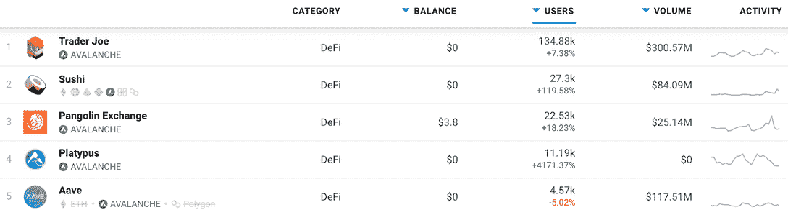

# 1 英寸深度扩展到雪崩和认知

> 原文：<https://web.archive.org/web/https://dappradar.com/blog/1inch-dex-expands-to-avalanche-gnosis>

## 更多便宜快捷的交易选择

**领先的 DeFi 聚合协议 1inch 已经** [**宣布其意图**](https://web.archive.org/web/20221208154114/https://blog.1inch.io/the-1inch-network-expands-to-avalanche-and-gnosis-chain-67875fdbf73c) **扩展到雪崩和 Gnosis 网络以扩大其服务的吸引力。该网络计划在 Avalanche 上部署 1inch 聚合协议，在 Gnosis Chain(以前称为 xDai Chain)上部署 1inch 限制订单协议。**

1inch 最初在以太坊推出，后来扩展到了 [BSC](https://web.archive.org/web/20221208154114/https://dappradar.com/rankings/protocol/binance-smart-chain) 、Arbitrum、乐观和 [Polygon](https://web.archive.org/web/20221208154114/https://dappradar.com/rankings/protocol/polygon) ，为用户提供更多种类，更重要的是，提供快速、低成本的交易。将 1inch 聚合平台扩展到 Avalanche 非常符合这种精神。

[雪崩](https://web.archive.org/web/20221208154114/https://dappradar.com/rankings/protocol/avalanche)2021 年表现强劲，2022 年继续推进。该平台锁定的总价值已经从去年 8 月的约 2.59 亿美元上升到今天的近[100 亿美元](https://web.archive.org/web/20221208154114/https://defillama.com/chain/Avalanche)。与此同时，其原生的 [AVAX token 在一年内上涨了 500%以上](https://web.archive.org/web/20221208154114/https://www.coingecko.com/en/coins/avalanche/usd#panel)。Avalanche 上的 DeFi 生态系统非常强大，有一些明确的领导者。寿司是不久前移植过来的，现在正受到追捧。与此同时, [Trader Joe](https://web.archive.org/web/20221208154114/https://dappradar.com/avalanche/defi/trader-joe) 仍然是 Avalanche 上的明显领导者，在过去的七天里有近 135，000 个钱包被连接。而且，Crabada 等[玩赚游戏的到来，会给雪崩带来更多的用户和交易量。](/web/20221208154114/https://dappradar.com/blog/what-is-crabada-new-play-to-earn-game-on-avalanche/)

[根据公告](https://web.archive.org/web/20221208154114/https://1inch.medium.com/)，Avalanche 上的几个协议将立即通过 1inch 可用，包括 1inch 限价单协议、Aave、Baguette、Canary Exchange、穿山甲、SushiSwap 和 Trader Joe。

另一方面，据 DeFi Llama 称，Gnosis Chain 在 2022 年 1 月中旬的 TVL 为 2.08 亿美元。根据 Dune Analytics 的数据，2021 年 12 月，该连锁店平均每天交易 223，814 笔，每天有 11，318 个活跃钱包。虽然是一个较小的命题，灵知生态系统正显示出向 DeFi 的稳步增长。

## 1 对客户的承诺

1inch 服务的核心是致力于持续为用户提供最快、最便宜的交易。因此增加了可以向客户提供这种服务的网络。更进一步，该平台在 2021 年 8 月宣布，他们将向那些在 8 月份使用以太坊 1 英寸 dapp 的人报销燃气费。符合退款计划所有条件的用户总共可以申请 155，500 个 1 英寸令牌。

有许多区块链和扩展解决方案可供选择。每一种都有其特点，从更便宜的费用到更快的交易速度，再到更广泛的流动性来源选择。点击了解更多关于在不同网络上使用 1inch 的信息[。如果你有兴趣将更多的区块链生态系统添加到你的 Metamask 中，我们建议你](https://web.archive.org/web/20221208154114/https://help.1inch.io/en/articles/5528619-how-to-use-different-networks-on-1inch)[阅读这本方便的指南](https://web.archive.org/web/20221208154114/https://dappradar.com/blog/guide-on-how-to-switch-network-in-metamask)。

 NewsletterUnsubscribe at any time. [T&Cs](https://web.archive.org/web/20221208154114/https://dappradar.com/terms) and [Privacy Policy](https://web.archive.org/web/20221208154114/https://dappradar.com/privacy-policy)

***以上不构成投资建议。此处给出的信息仅供参考。请行使尽职调查，做你的研究。作者持有 ETH、BTC、AGIX、HEX、LINK、GRT、CRO、OMI、不变 X、ENS、GALA、AVASTR、GMEE、CUBE、RADAR、FLOW、FTM、BNB、SPS、WRLD、ATOM 和 ADA。***