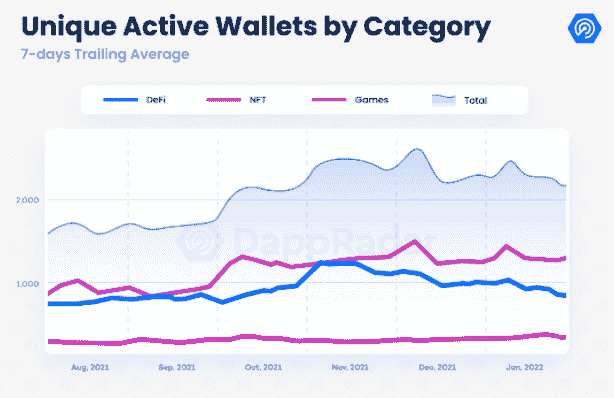
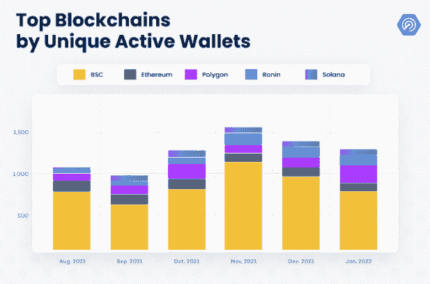

# 1 月份每天有 240 万个钱包连接到 Dapps

> 原文：<https://web.archive.org/web/https://dappradar.com/blog/2-4-million-wallets-per-day-connected-to-dapps-in-january>

## 52%的 dapp 用户来自游戏

**尽管加密货币市场呈现负面趋势，但**[**DappRadar 1 月 Dapp 行业报告**](https://web.archive.org/web/20220929050808/https://dappradar.com/blog/dapp-industry-report-january-2022) **显示 Dapp 的使用情况与 2021 年 12 月观察到的结果基本保持一致。1 月份，平均每天有 247 万个独立活跃钱包(UAW)连接到区块链应用程序，比 2021 年第四季度仅下降 2%。**

自 2021 年 6 月以来，区块链行业连接到 dapps 的钱包数量首次略有下降，这与加密市场的熊市趋势相吻合。然而，这一次，用户活动的下降幅度[要小得多](https://web.archive.org/web/20220929050808/https://dappradar.com/blog/dapp-industry-report-january-2022)。从长远来看，2021 年 6 月，在 5 月份价格暴跌后，UAW 的数量下降了 23%。这一次，2%的下降表明 dapp 的使用，尤其是游戏，变得更有抵抗力。

如上所述，在 1 月份与 dapps 互动的 240 万每日活跃钱包中，区块链游戏用户占 52%。这比 2021 年底测得的 49%有所提高。

从区块链的角度来看， [Polygon](https://web.archive.org/web/20220929050808/https://dappradar.com/rankings/protocol/polygon) 是最大的赢家。与去年 12 月相比，第 1 层扩展协议的钱包基数增长了 78%，推动这一增长的是玩赚游戏[【疯狂防御英雄】](https://web.archive.org/web/20220929050808/https://dappradar.com/ethereum/games/crazy-defense-heroes)[【向日葵农民】](https://web.archive.org/web/20220929050808/https://dappradar.com/polygon/games/sunflower-farmers)，以及移动友好平台 [Arc8](https://web.archive.org/web/20220929050808/https://dappradar.com/polygon/games/arc8-by-gamee-1) 。

也许更有趣的是，虽然在 2021 年的大部分时间里， [DeFi 聚焦的 BSC 协议](https://web.archive.org/web/20220929050808/https://dappradar.com/rankings/protocol/binance-smart-chain)在主动钱包方面领先，但随着 Polygon show 等更多专注于游戏的平台的增加，我们看到 1 月份的下降。Axie Infinity 的定制[浪人区块链脱颖而出](https://web.archive.org/web/20220929050808/https://dappradar.com/rankings/protocol/ronin)，尽管活动完全由领先的玩赚游戏及其武士刀 DEX 驱动。它展示了一个平台如何在区块链游戏的财务和游戏方面创造一个无缝的循环。此外，游戏类别中的[dapp 似乎成功地保留了玩家基础，这是成功的关键指标。](https://web.archive.org/web/20220929050808/https://dappradar.com/rankings/category/games)

对于 2022 年 1 月在 dapp 和区块链空间发生的所有事情的完整图片，请在这里阅读我们的[最新报告](https://web.archive.org/web/20220929050808/https://dappradar.com/blog/dapp-industry-report-january-2022)，或者观看下面的摘要视频。

[https://web.archive.org/web/20220929050808if_/https://www.youtube.com/embed/Ut8RbzDmeCk?feature=oembed](https://web.archive.org/web/20220929050808if_/https://www.youtube.com/embed/Ut8RbzDmeCk?feature=oembed)

 NewsletterUnsubscribe at any time. [T&Cs](https://web.archive.org/web/20220929050808/https://dappradar.com/terms) and [Privacy Policy](https://web.archive.org/web/20220929050808/https://dappradar.com/privacy-policy)

***以上不构成投资建议。此处给出的信息仅供参考。请行使尽职调查，做你的研究。作者持有 ETH、BTC、AGIX、HEX、LINK、GRT、CRO、OMI、不可变 X、GALA、AVASTR、GMEE、CUBE、RADAR、FLOW、FTM、BNB、SPS、WRLD、ATOM 和 ADA。***