# 2023 年开始卷土重来:NFTs 和 DeFi 显示出复苏迹象

> 原文：<https://web.archive.org/web/https://dappradar.com/blog/2023-begins-with-a-comeback-nfts-and-defi-show-recovery-signs>

## 随着 NFT 市场和区块链市场的多元化，该市场持续增长

2023 年以强劲的牛市趋势开始，尤其是在 NFT 市场。链上指标显示了显著的增长和活动，表明 NFTs、DeFi 和游戏是一个蓬勃发展和充满希望的季度。

## 关键要点

*   DeFi 的 TVL 继续增长，达到 746 亿美元，环比增长 26.82%；利多金融成为证明 LSD 需求的最大 DeFi 协议。
*   NFT 市场的交易量为 9.46 亿美元，销售额为 950 万美元，较去年 12 月分别增长了 38%和 42%。
*   在 NFT 系列受欢迎程度上升的推动下，Polygon 的交易量和销售额分别增长了 124%和 157.39%。
*   OpenSea 的交易量增长了 66.58%，在 2023 年 1 月达到 4.95 亿美元。这相当于 NFT 市场总交易量的 58%。
*   2023 年 1 月，由于漏洞利用，损失了超过 1460 万美元，这是自 2022 年 1 月以来的最低金额。

## 目录

1.  [Dapp 行业概述](https://web.archive.org/web/20230310185500/https://dappradar.com/blog/2023-begins-with-a-comeback-nfts-and-defi-show-recovery-signs/#Chapter-1)
2.  [德菲的 TVL 增长 26.8%，显示出复苏迹象](https://web.archive.org/web/20230310185500/https://dappradar.com/blog/2023-begins-with-a-comeback-nfts-and-defi-show-recovery-signs/#Chapter-2)
    *   [Lido 成为最大的 DeFi 协议](https://web.archive.org/web/20230310185500/https://dappradar.com/blog/2023-begins-with-a-comeback-nfts-and-defi-show-recovery-signs/#Chapter-2-2)
    *   [Uniswap 的机构群体以压倒性优势投票支持 BNB 连锁行动](https://web.archive.org/web/20230310185500/https://dappradar.com/blog/2023-begins-with-a-comeback-nfts-and-defi-show-recovery-signs/#Chapter-2-3)
3.  [NFT 市场销售额飙升至 9.46 亿美元，销售额达到 950 万美元](https://web.archive.org/web/20230310185500/https://dappradar.com/blog/2023-begins-with-a-comeback-nfts-and-defi-show-recovery-signs/#Chapter-3)
4.  [Blur 以 1.87 亿美元的交易额成为 NFT 市场的主要参与者](https://web.archive.org/web/20230310185500/https://dappradar.com/blog/2023-begins-with-a-comeback-nfts-and-defi-show-recovery-signs/#Chapter-4)
5.  [游戏行业占整个行业使用量的 48%](https://web.archive.org/web/20230310185500/https://dappradar.com/blog/2023-begins-with-a-comeback-nfts-and-defi-show-recovery-signs/#Chapter-5)
6.  [与去年相比，一月份的漏洞利用损失最低](https://web.archive.org/web/20230310185500/https://dappradar.com/blog/2023-begins-with-a-comeback-nfts-and-defi-show-recovery-signs/#Chapter-6)
7.  [结论](https://web.archive.org/web/20230310185500/https://dappradar.com/blog/2023-begins-with-a-comeback-nfts-and-defi-show-recovery-signs/#Conclusion)

## 1.Dapp 行业概述

dapp 行业在 2023 年 1 月经历了每日唯一活跃钱包(dUAW)数量的减少，平均为 170 万个 dUAW。与 2022 年 12 月相比，下降了 9.55%。

DeFi 板块持有 377，039 个 dUAW，下降了 9.23%，而区块链博彩业持有 839，436 个 dUAW，下降了 0.89%。1 月份最有前景的行业是 NFT 市场，环比增长 24.56%，达到 146，516 dUAW。

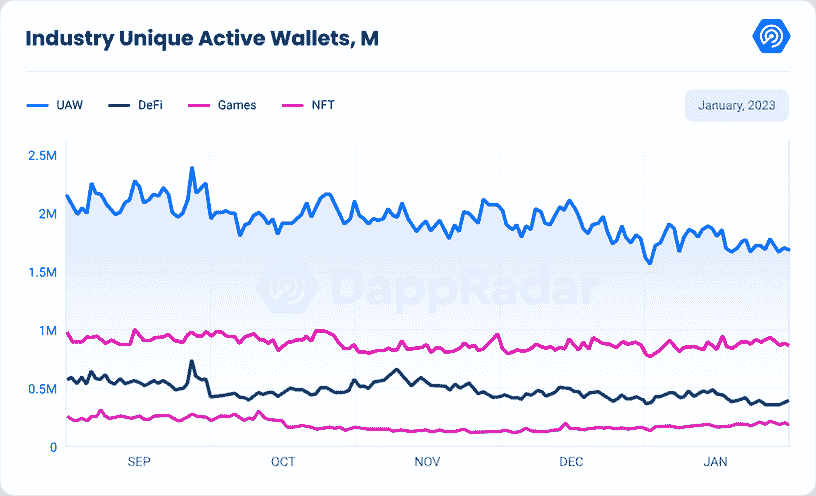

区块链对连锁活动的分析显示, [WAX](https://web.archive.org/web/20230310185500/https://dappradar.com/rankings/protocol/wax) 是一月份最受欢迎的网络。博彩和 NFT 区块链平均为 394，480 dUAW，环比增长 3.39%。[外星世界](https://web.archive.org/web/20230310185500/https://dappradar.com/wax/games/alien-worlds)和 NFT 市场[原子资产](https://web.archive.org/web/20230310185500/https://dappradar.com/wax/other/atomicassets)是蜡像区块链上的顶级 dapps。 [BNB 链家](https://web.archive.org/web/20230310185500/https://dappradar.com/rankings/protocol/binance-smart-chain)以 392，882 dUAW 位居第二，环比下降 27.69%。PancakeSwap 仍然是 BNB 连锁店中最受欢迎的 dapp，一月份有 129 万 UAW。

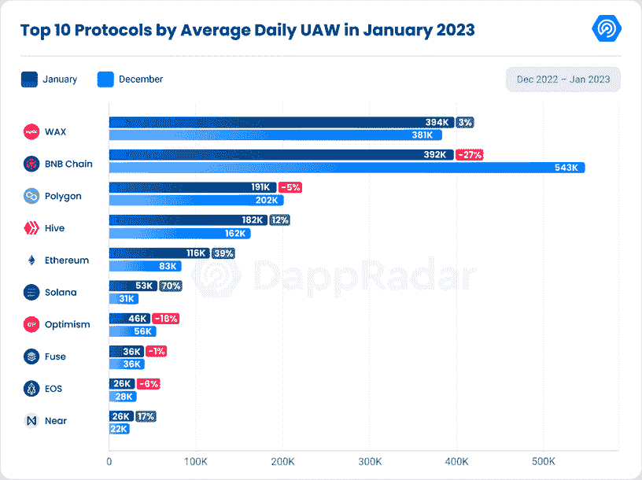

在第三个位置，我们找到了有 191，985 dUAW 的多边形。侧链生态系统在 2022 年末引起了轰动，现在比上个月下降了 5.22%。[班吉香蕉](https://web.archive.org/web/20230310185500/https://dappradar.com/polygon/games/benji-bananas)和[行星九](https://web.archive.org/web/20230310185500/https://dappradar.com/polygon/games/planet-ix)是多边形上最受欢迎的 dapps。尤其是行星九有一个很好的月份，看到 44%的增长，达到 141，580 UAW。

蜂巢排名第四，增长 12.31%，达到 18.28 万 dUAW。与往常一样，[夹板岛](https://web.archive.org/web/20230310185500/https://dappradar.com/hive/games/splinterlands)在 Hive 上的活动中占据主导地位，交易卡游戏在其 UAW 中的增长了 5.87%，达到 340，520 UAW。

一月份表现最好的区块链是索拉纳，增长了 70%,平均达到 53，683 dUAW。这一增长是由越来越多的采用茄科植物推动的，如 [Raydium](https://web.archive.org/web/20230310185500/https://dappradar.com/solana/defi/raydium) 、 [MeanFi](https://web.archive.org/web/20230310185500/https://dappradar.com/solana/defi/meanfi) 、 [Saber](https://web.archive.org/web/20230310185500/https://dappradar.com/solana/defi/saber) 和 [Orca](https://web.archive.org/web/20230310185500/https://dappradar.com/solana/defi/orca) 。看起来索拉纳生态系统正在从 FTX 崩溃造成的破坏中恢复。

[以太坊](https://web.archive.org/web/20230310185500/https://dappradar.com/rankings/protocol/ethereum)生态系统的独特活跃钱包也有所增加，活跃度增长 39%，平均达到 116，255 dUAW。OpenSea 和 Manifold 等 NFT 市场的受欢迎程度以及市场活动的增加可以被视为这些数字的驱动因素。。

总之，尽管行业的总体 dUAW 有所下降，NFT 的连锁指标显示活动有所增加。这对市场来说是一个看涨的信号。下一节将关注 DeFi 的总价值锁定(TVL)，探索 Solana DeFi dapps 增长背后的原因。

## 2.DeFi 的 TVL 增长了 26.8%，显示出复苏的迹象

DeFi 市场在 2023 年 1 月显示出复苏的迹象，锁定的总价值(TVL)比上个月增长了 26.82%，达到 746 亿美元。虽然这一指标在很大程度上受益于加密价格的上涨，但其他连锁指标显示了牛市趋势。

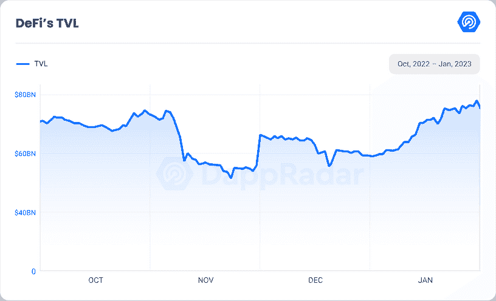

看看 TVL 排名前十的区块链，所有这些城市的 TVL 都有所上升。DeFi 表现最好的是[乐观](https://web.archive.org/web/20230310185500/https://dappradar.com/rankings/protocol/optimism)，其 TVL 增长了 57.44%，达到 8.08 亿美元。有趣的是，在 1 月 17 日“学会赚钱”激励计划结束后，乐观情绪下的交易量直线下降。根据我们的数据，截至 1 月 17 日，乐观每天平均有 174，810 笔交易。然而，在该日期之后，日均交易量下降至 41，026 笔，大幅下降了 76.53%。

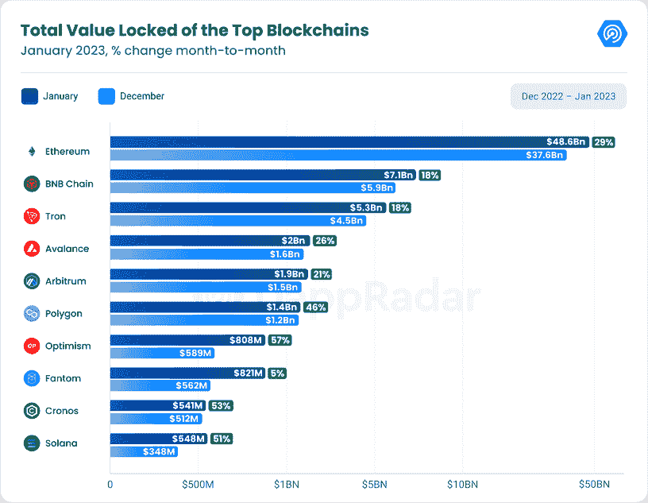

Solana 是另一个表现最好的 DeFi，其 TVL 增长了 57.33%，达到 5.48 亿美元。这一增长是由 [Marinade Finance](https://web.archive.org/web/20230310185500/https://dappradar.com/solana/defi/marinade-finance) 的业绩推动的，过去 30 天，该公司在 TVL 的收入增长了 84.32%，达到 1.52 亿美元。Marinade Finance 推出了一项代币奖励计划，奖励那些存入 sola(SOL)代币以换取 mSOL(一种流动性赌注衍生品)的用户。Orca 和 Raydium 的 TVL 也有所增加，分别增长了 37%和 33%，达到 4600 万美元和 3800 万美元。

[雪崩](https://web.archive.org/web/20230310185500/https://dappradar.com/rankings/protocol/avalanche)再次达到 20 亿美元，增长 26.84%，受[宣布与亚马逊网络服务(AWS)合作以鼓励雪崩区块链发展的](https://web.archive.org/web/20230310185500/https://twitter.com/avalancheavax/status/1613235554711400448)推动。

此外，计划于 2023 年 3 月举行的上海升级正在吸引市场的注意力，预计将通过允许从以太坊赌注合同中提款来显著降低赌注风险。

升级还将为流动性赌注协议的增长提供机会，自今年年初以来，其中一些协议的治理令牌已经跃升。

在下一节中，我们分析了以太坊上最流行的液体赌注利多。升级有可能将这些代币推向去年的历史高点。由于以太坊赌注空间仍处于早期阶段，这些协议的发展存在市场机会。

## 利多成为最大的 DeFi 协议

在 DeFi 或分散金融中，锁定在这些金融服务中的所有加密硬币的总价值也称为锁定总价值(TVL)。TVL 越多，DeFi 平台的流动性和信任度就越高。有趣的 APY 或 APR 和链上活动，如产量农业，需要引诱投资者把他们的钱投入流动性池和支持这些 DeFi 平台。

[丽都金融](https://web.archive.org/web/20230310185500/https://dappradar.com/multichain/defi/lido)本月推翻制造商道，成为最大的 DeFi 协议。这在很大程度上是由液体衍生药物(LSD)方案的日益流行所推动的，乙醚在过去 30 天内显著上升了 33%。

以太坊向股份证明(PoS)的转变是对 LSD 日益增长的兴趣的催化剂。Lido 很快利用了这一点，它的费用收入与以太坊 PoS 的收入成正比，因为它将收到的以太网发送到赌注协议。

Lido 与其他 DeFi 协议的不同之处在于其创新的定位解决方案，该解决方案允许用户访问液态乙醚定位，而无需满足传统的 32 ETH 最低要求。事实证明，这对于希望从赌注中获得最大回报的用户来说是一个主要的吸引力。

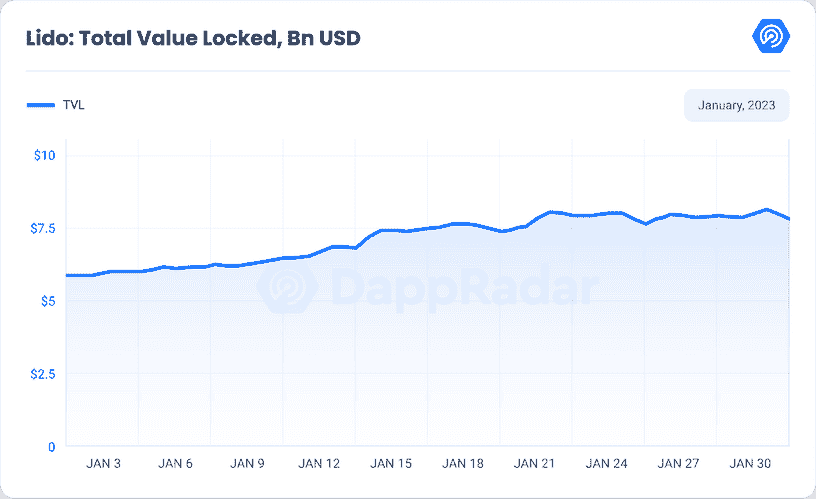

由于表现强劲，丽都的 TVL(锁定总价值)自本月初以来上涨了 36.77%。加密社区现在通过 Lido 平台投入了令人印象深刻的 80 亿美元。这表明了丽都创新的打桩解决方案对 DeFi 空间的重大影响，以及它如何成为市场的主要参与者。

沿着利多，比特币基地 WETH 和 Rocket Pool 是最受欢迎的持有 ETH 液体衍生品的 dapps。

## Uniswap 的社区投票压倒性地支持 BNB 连锁移动

最近进行了一项名为“温度检查”的投票，以评估 Uniswap 社区对将分散式 exchange 的 V3 协议迁移到 BNB 链的支持。结果显示，80%的 UNI token 持有者投票支持这一举措，约有 2000 万枚令牌投了赞成票。提出该提议的公司 0x plasma Labs[在推特上称](https://web.archive.org/web/20230310185500/https://twitter.com/0xPlasma/status/1617022128414687232)这是“整个 Uniswap 治理历史上最大的数字”。

与其他分散式交易所(dex)一样，Uniswap 通过智能合约来匹配交易，并在交易者之间提供流动性。截至 1 月底，该平台锁定的总价值为 27 亿美元(TVL)，较 1 月 1 日增长 12.48%。在同一时期，它平均每天有 3，310 个独特的活跃钱包，总共有 592，184 笔交易。由于币安的 BNB 连锁店不断增长的用户基础、高交易速度和低费用，他们考虑将其转移到该连锁店。BNB 链连接中央加密货币交易所币安。因此，开发人员认为，在 BNB 链上部署 Uniswap V3 可以利用币安生态系统中日益流行的 DeFi。币安区块链还提供独特的功能，如打桩和跨链支持，这可以增强 Uniswap 的功能。

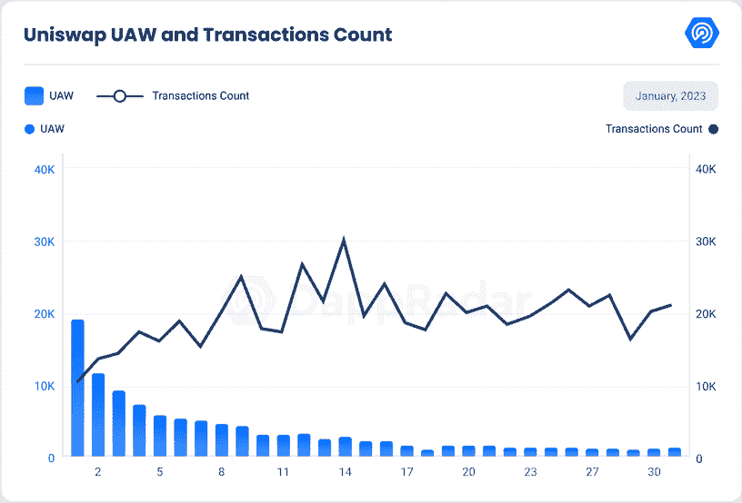

根据 0xPlasma Labs 的说法，转移到币安链可以从币安生态系统中带来至少 10 亿美元的额外流动性，并吸引 100-200 万新用户。这只是潜在迁移的众多好处之一，未来 Uniswap 社区和更广泛的 DeFi 生态系统对此提议的反应将会非常有趣。请记住，目前 PancakeSwap 仍然是 BNB 链上领先的 DEX。他们在一月份吸引了 129 万 UAW。

## 3.NFT 市场飙升至 9.46 亿美元和 950 万笔交易

随着 2023 年 1 月 NFT 交易量和销售数量的激增，NFT 市场似乎正在复苏。NFT 交易量较上月增长 38%，达到 9.46 亿美元。这是自 2022 年 6 月以来录得的最高交易量。NFT 的销量也环比增长 42%，达到 920 万辆。

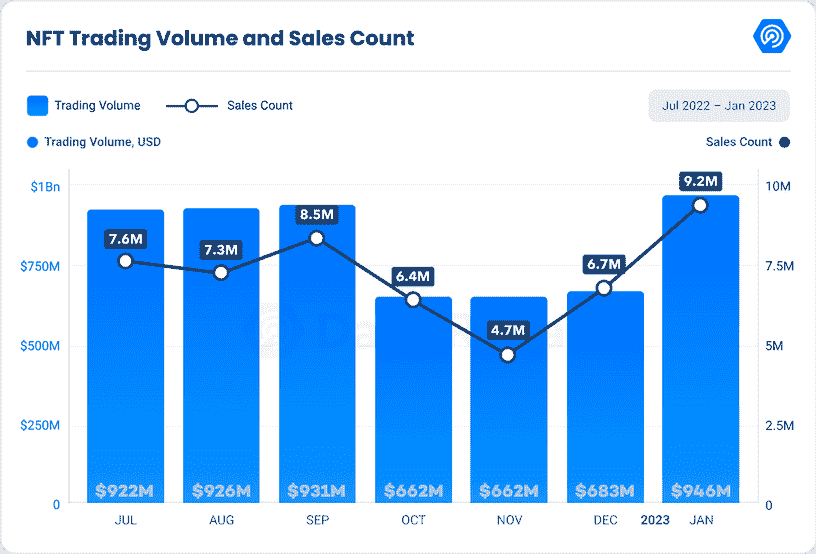

领先的 NFT 区块链以太坊占据了 NFT 市场 78.5%的份额。其交易量增长了 37.29%，达到 6.59 亿美元。以太坊 NFT 的销售数量也较上月增长了 7.37%，目前达到 200 多万。

毫无疑问，宇迦实验室的 NFT 收藏再次为生态系统的增长做出了重大贡献，因为本月所有收藏的交易量为 3.248 亿美元。这占整个 NFT 交易量的 34.3%。此外，他们最新的 NFT 系列，一种被称为[下水道通行证](https://web.archive.org/web/20230310185500/https://dappradar.com/ethereum/collectibles/sewer-pass)的 NFT 通行证，允许持有者进入在线游戏，在 NFT 世界引起了轰动。

Solana 位居第二，其交易额增长了 23.7%，达到 8600 万美元。 [DeGods](https://web.archive.org/web/20230310185500/https://dappradar.com/solana/collectibles/degods) 和《猴子王国》是索拉纳上最顶级的 NFT 系列。虽然交易量增加，但销售数量减少了 5.79%，达到 788，992。成交量的增长主要来自于原生加密货币 SOL 的强劲表现。

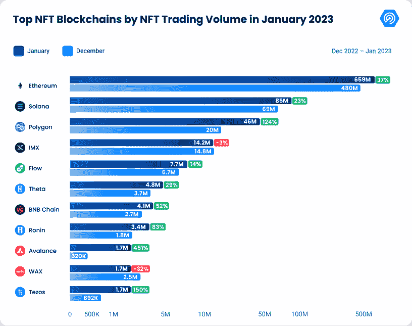

Polygon 在 NFT 的交易额惊人地增长了 124%,达到 4600 万美元。多边形 NFTs 的销售计数也环比增长 157.39%，达到 450 万。[收集唐纳德王牌](https://web.archive.org/web/20230310185500/https://dappradar.com/polygon/collectibles/collect-trump-cards)的流行和最近推出的[摩科诺领域门票](https://web.archive.org/web/20230310185500/https://dappradar.com/polygon/collectibles/mocaverse-realm-ticket)推动了这一增长。

[Immutable X](https://web.archive.org/web/20230310185500/https://dappradar.com/nft/protocol/immutablex) 录得其 NFT 交易量下降 3.67%，区块链网络录得 1420 万美元交易量。然而，销量却增长了 2.39%，超过了 56.4 万辆。[《被解放的神》](https://web.archive.org/web/20230310185500/https://dappradar.com/multichain/games/gods-unchained)和 [Illuvium Land](https://web.archive.org/web/20230310185500/https://dappradar.com/multichain/games/illuvium-1) 是 Immutable X 上领先的 NFT 收藏，过去 30 天的交易量分别为 989 万美元和 146 万美元。

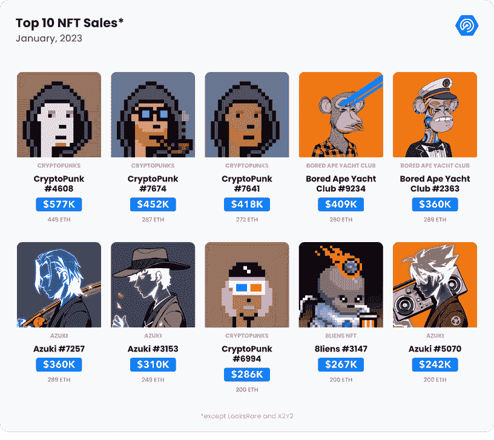

总之，在 NFT 市场经历了六个月的熊市趋势后，2023 年 1 月是该空间的积极月份，交易量和销售数量显著增加。下一节将深入分析 NFT 顶级市场的表现。

## 4.Blur 以 1.87 亿美元的交易量成为 NFT 市场的主要参与者

2023 年 1 月，前 10 大 NFT 市场中的一些市场的 NFT 交易量显著增加。 [OpenSea](https://web.archive.org/web/20230310185500/https://dappradar.com/multichain/marketplaces/opensea) 是市场上最具支配地位的参与者，交易量为 4.95 亿美元，占整个市场的 58%。

OpenSea 仍然是领先的市场，NFT 交易量增长了 66.58%，达到惊人的 4.95 亿美元。这清楚地表明了 OpenSea 在 NFT 市场的持续优势，该市场占 2023 年 1 月整个 NFT 交易量的 58%。此外，根据登记的交易量和 OpenSea 对每笔交易收取的 2.5%的费用，该平台的收入约为 1230 万美元。

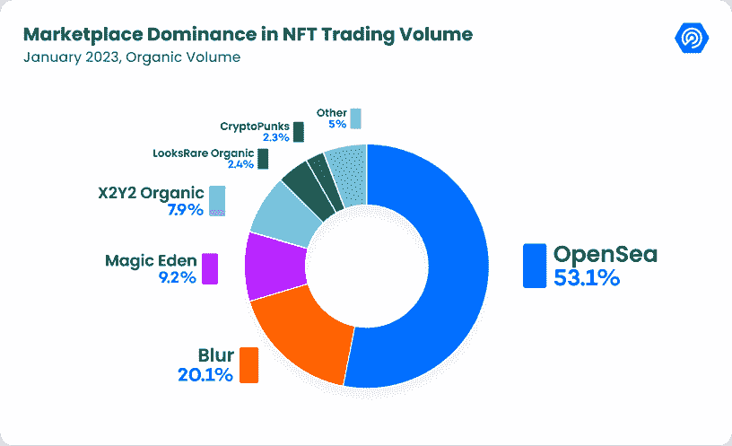

[Blur](https://web.archive.org/web/20230310185500/https://dappradar.com/ethereum/marketplaces/blur) 也表现强劲，以 1.87 亿美元的交易额位居第二，占市场份额的 20%。尽管是一个相对较新的玩家，但 Blur 已经设法扩大了规模，并成为增长最快的 NFT 市场之一。然而，Blur 被列入了交易下水道通行证 NFT 收藏的黑名单，与 [LooksRare](https://web.archive.org/web/20230310185500/https://dappradar.com/ethereum/marketplaces/looksrare) 和其他市场一起，因为宇迦实验室通过封锁不支持版税的市场，引发了 NFT 市场的版税辩论。

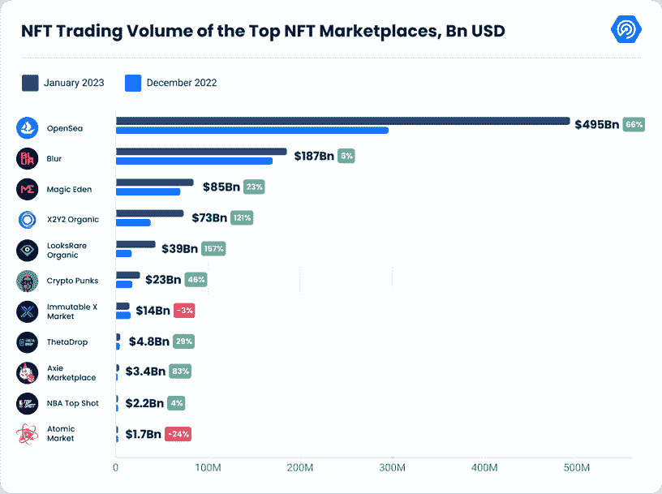

魔术伊甸园(Magic Eden)以 8500 万美元的交易额占据了 9.7%的市场份额，稳居第三。市场最近[实施了一种新的收费结构](https://web.archive.org/web/20230310185500/https://twitter.com/MagicEden/status/1620200726571139073?ref_src=twsrc%5Egoogle%7Ctwcamp%5Eserp%7Ctwgr%5Etweet)，称为制造者/接受者模式，它基于用户的活动和奖励中心级别。这一变化在用户中引起了很大的兴趣，使它成为一个有吸引力的交易选择。

[X2Y2](https://web.archive.org/web/20230310185500/https://dappradar.com/ethereum/marketplaces/x2y2) 和 LooksRare 的有机销量也有大幅增长，分别增长了 121%和 157%。这证明了这些市场在 NFT 买家和卖家中越来越受欢迎。

我们不仅在开放市场上实现了增长，而且定制市场也出现了增长。1 月份，Axie Marketplace 的交易量大幅增长，增幅为 83.47%。这可以归功于农耕游戏 Axie Infinity Homeland 的 alpha 推出，在用户中制造了大量的炒作。事实上，Axie Infinity AXS 的代币自 1 月 1 日以来已经上涨了 77%，达到 10.81 美元。

## 5.游戏行业占整个行业使用量的 48%

[区块链游戏](https://web.archive.org/web/20230310185500/https://dappradar.com/topic/games)是 Web3 行业中增长最快的领域之一。2023 年 1 月，每日唯一活跃钱包数达到 839436。这标志着该行业的主导地位显著上升，从去年 12 月的 45.2%升至今年 1 月的 48%。这是区块链博彩业长期潜力的乐观指标。

游戏 alphas 和更新不断出现在区块链空间，人们对未来的期待和兴奋感与日俱增。随着该领域的不断成熟，我们可以期待在未来的几个月和几年里看到更多令人兴奋的发展。

为了更多地了解区块链博彩及其表现，我们刚刚发布了[我们的年度博彩报告 2022](https://web.archive.org/web/20230310185500/https://dappradar.com/blog/dappradar-x-bga-games-report-2022-overview) ，对该行业的趋势、挑战和机遇进行了深入分析。不要错过深入了解区块链游戏世界及其未来潜力的机会。

## 6.与去年相比，一月份的开采损失最低

根据 [REKT 数据库](https://web.archive.org/web/20230310185500/https://defiyield.app/rekt-database)的数据，2023 年 1 月发生了 11 起区块链漏洞攻击，共造成 1460 万美元的损失。这些攻击大多发生在 BNB 链上，记录了四起事件。尽管如此，2023 年 1 月的损失金额低于前几年，标志着区块链行业的积极趋势。

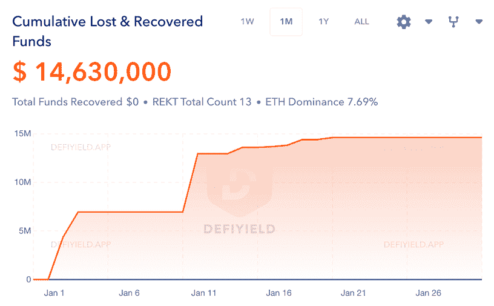

Source: [REKT Database](https://web.archive.org/web/20230310185500/https://defiyield.app/rekt-database)

本月最大的漏洞发生在 Heco 网络的 LendHub 借贷协议上，导致大约 600 万美元的损失。该漏洞存在于 lBSV 合同复制中，允许攻击者将资金存入旧版本并从新市场借款。通过利用铸造和兑换过程的流程，攻击者在将被盗资产转移到以太坊和乐观主义等其他连锁店之前，赚取了价值 600 万美元的利润。

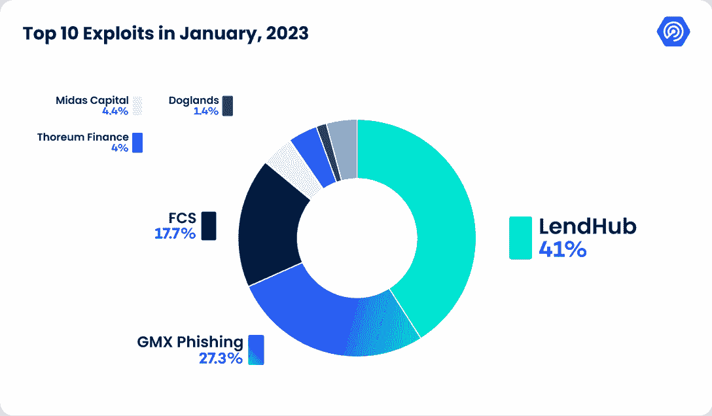

本月第二大漏洞是 Arbitrum 网络上的 GMX 协议，造成 280 万美元的损失。这个钱包要么被攻破了，要么被网络钓鱼攻击利用了，受害者调用了 GMX:奖励路由器上的 signalTransfer()函数，该函数用 ETH 资助了攻击者。恶意行为者随后从 GMX:奖励路由器转移受害者的未决资产并解除堆叠，将偷来的 GMX 令牌交换为 ETH，并将其移动到以太坊网络上的另一个 EOA。

虽然区块链行业在 2023 年 1 月面临许多漏洞，但与前几年相比，损失的数量明显减少。这对该行业来说是一个积极的信号，表明区块链网络和协议实施的安全措施在防止大规模损失方面变得更加有效。通过跟踪 rekt 数据库，了解最新的区块链新闻和趋势。

## 7.结论

总之，2023 年以一个高音符开始，在 DeFi 和 NFT 市场上看多链指标。本月因漏洞造成的金钱损失减少，是 2022 年有史以来的最低水平，这是区块链安全局势改善的积极迹象。

NFT 市场的上升趋势和 DeFi 平台的增长让我们有理由对加密市场的未来保持乐观。有了这些有希望的发展，我们可以期待未来几个月的复苏和持续增长。