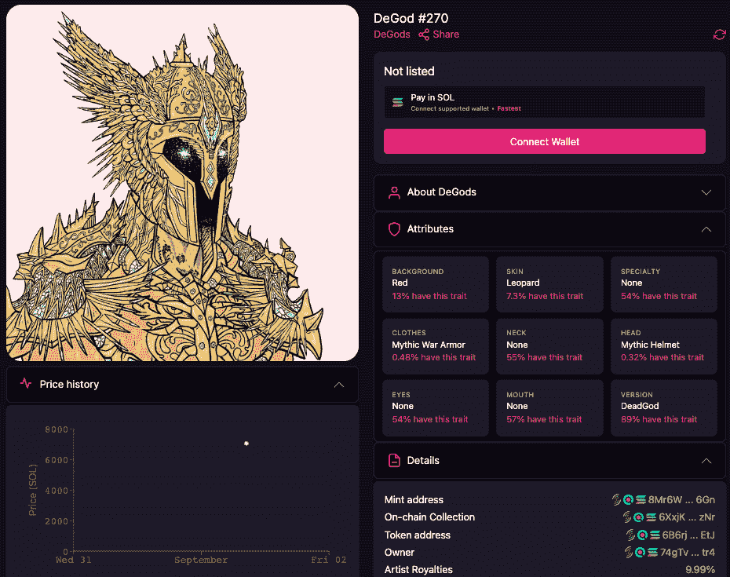
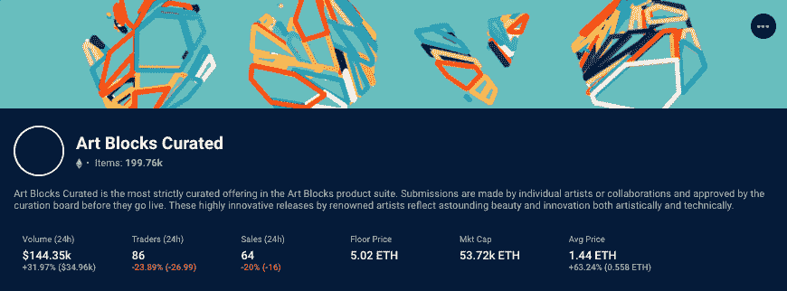
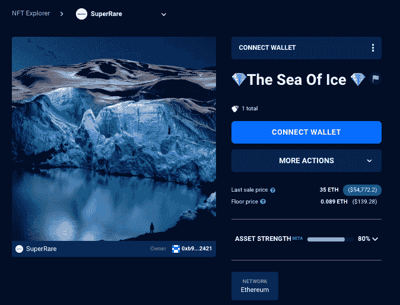
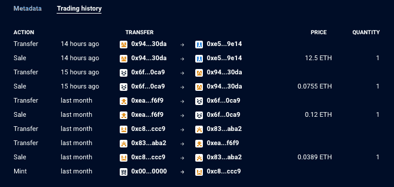

# y00ts 下降前 22 万美元的 DeGods 销售额–NFT 十大亮点

> 原文：<https://web.archive.org/web/https://dappradar.com/blog/220k-degods-nft-sale-before-y00ts-drop-top-10-nft-highlights>

## 查看 8 月 28 日至 9 月 4 日之间的 NFT 销售亮点排名

Solana DeGods 系列的一幅 NFT 作品拍出了 7033 索尔的天价，比 creators Dust Labs 的最新作品[**y00ts NFT drop**](https://web.archive.org/web/20220929223414/https://dappradar.com/blog/what-are-y00ts-nfts-are-you-on-the-y00tlist)**高出约 22 万美元。此次拍卖的价格比德戈斯 NFT 600 索尔的平均价格高出 6400 索尔，成为过去一周 NFT 第三高的拍卖价格。**

就更高价值的 NFT 拍卖而言，击败了德古德拍卖，我们看到来自 Axie Infinity universe 的一块土地以近 260，000 美元的价格转手， [Bored Ape 游艇俱乐部#6588](https://web.archive.org/web/20220929223414/https://dappradar.com/hub/assets/eth/0xbc4ca0eda7647a8ab7c2061c2e118a18a936f13d/6588) 以 119 万美元的价格出售。

然而，[BAYC # 6588](https://web.archive.org/web/20220929223414/https://dappradar.com/hub/assets/eth/0xbc4ca0eda7647a8ab7c2061c2e118a18a936f13d/6588)的出售看起来是虚假的，因为交易历史显示，该个人使用一个新钱包以 77 ETH 的价格购买了 BAYC，然后在 24 小时后以 700 ETH 的价格将其出售给另一个新钱包。[我们一次又一次地看到这种做法](/web/20220929223414/https://dappradar.com/blog/looksrare-nft-marketplace-hit-by-wash-trading-amidst-airdrop/)，因为持有者试图人为地夸大其非金融资产的价值。

[DeGods 平均价格和销售价格](https://web.archive.org/web/20220929223414/https://dappradar.com/nft/sales/protocol/solana)在过去一周[飙升](https://web.archive.org/web/20220929223414/https://dappradar.com/blog/what-are-y00ts-nfts-are-you-on-the-y00tlist)，因为关于 creators Dust Labs 最新 [y00ts NFT 掉落](https://web.archive.org/web/20220929223414/https://dappradar.com/blog/what-are-y00ts-nfts-are-you-on-the-y00tlist)的谣言在秘密世界流传。在过去的几天里，我们还看到了大约 2 万美元的更多 DeGod 销售。

然而，[德古德#270 以 7，033 索尔](https://web.archive.org/web/20220929223414/https://dappradar.com/nft/sales)的价格售出，这是德古德 NFT 的最高成交价，看一眼元数据就能揭示为什么这个特殊的[德古德](/web/20220929223414/https://dappradar.com/blog/tag/degods/)可能比其他的更值钱。

衣服、头部、皮肤和背景特征使这个 NFT 与众不同，因为这个德戈德拥有神话般的战争盔甲和神话般的头盔，而在德戈德收藏中的[NFT 中，这两项分别只有 0.4%和 0.3%。](https://web.archive.org/web/20220929223414/https://dappradar.com/nft/sales/protocol/solana)

有趣的是，[看看收藏中其他具有相似特征的物品](https://web.archive.org/web/20220929223414/https://magiceden.io/marketplace/degods?attributes=%7B%22clothes%22%3A%5B%22Mythic+War+Armor%22%5D%2C%22head%22%3A%5B%5D%7D)，我们只看到[另外两件出售的带有神话中的战铠](https://web.archive.org/web/20220929223414/https://magiceden.io/marketplace/degods?attributes=%7B%22clothes%22%3A%5B%22Mythic+War+Armor%22%5D%2C%22head%22%3A%5B%5D%7D)，没有一件带有神话中的头盔。

随着对索拉纳推出[蓝筹股 NFT 系列](/web/20220929223414/https://dappradar.com/blog/what-are-blue-chip-nft-collections/)的能力的猜测增多，一旦该系列下跌，观察其交易活动将会非常有趣。

## 秘密艺术闪耀

一个主要趋势是从诸如[艺术板块](https://web.archive.org/web/20220929223414/https://dappradar.com/hub/nft-explorer/collection/art-blocks-curated)和 SuperRare 等平台上抢购[蓝筹加密艺术品](/web/20220929223414/https://dappradar.com/blog/what-are-blue-chip-nft-collections/)。上周的文章强调了几起生成性加密艺术的拍卖，上周最高价值的拍卖是来自 [XCOPY 的一件名为《不要恐慌》的作品，售价为 500 ETH](https://web.archive.org/web/20220929223414/https://dappradar.com/hub/assets/eth/0x41a322b28d0ff354040e2cbc676f0320d8c8850d/2076) ，约合 78.3 万美元。

Art Blocks 平台重新激起了投资者的兴趣，他们希望用有价值的加密艺术品来对冲通胀。截至发稿时，该平台上一件 NFT 艺术品的平均价格上涨了 63%，而 [24 小时交易量飙升了 30%](https://web.archive.org/web/20220929223414/https://dappradar.com/hub/nft-explorer/collection/art-blocks-curated) 。

本周，我们看到更多来自 NFT 艺术街区市场的作品出售。 [Chromie Squiggle #1751](https://web.archive.org/web/20220929223414/https://dappradar.com/hub/assets/eth/0x059edd72cd353df5106d2b9cc5ab83a52287ac3a/1751) 以 109 ETH 易手，约合 17.1 万美元，而 [Fidenza #696 以 69.9 ETH](https://web.archive.org/web/20220929223414/https://dappradar.com/hub/assets/eth/0xa7d8d9ef8d8ce8992df33d8b8cf4aebabd5bd270/78000696) 成交，约合 10.9 万美元。

有趣的是，Fidenza #696 的售价比去年的最高售价低了 100 ETH ，而 T2 的 Chromie Squiggle #1751 则从之前的最高售价中净赚了 91 ETH。

在天平的低端，我们看到一位收藏家以 80 ETH 的价格收购了[第 362 号](https://web.archive.org/web/20220929223414/https://dappradar.com/hub/assets/eth/0xa7d8d9ef8d8ce8992df33d8b8cf4aebabd5bd270/215000362)和另一件名为[的冰海](https://web.archive.org/web/20220929223414/https://dappradar.com/hub/assets/eth/0xb932a70a57673d89f4acffbe830e8ed7f75fb9e0/30756)，约合 12.1 万美元。

## Axie 无限土地

上周，DappRadar 报道了领先的区块链游戏 Axie Infinity 中第 30，14 号地块的销售价格接近 234，000 美元。这个星期我们看到隔壁的地块，30，13，已经卖了 164.4 WETH，或近 26 万美元。交易中使用的[钱包与购买-30，14 时使用的钱包不同。](https://web.archive.org/web/20220929223414/https://explorer.roninchain.com/address/0x2b38b623013b77d2b2861cffd63b324cdf032416/txs)

尽管如此，还是有可能有人在 Axie Infinity 玩垄断游戏，或者游戏地图上的这个区域非常受欢迎，而且上周的拍卖推高了邻近土地的价值。

## 查看 NFT 销售亮点列表

***注意:出售时给出的美元价值是正确的***

*   [Bored Ape 游艇俱乐部# 6588](https://web.archive.org/web/20220929223414/https://dappradar.com/hub/assets/eth/0xbc4ca0eda7647a8ab7c2061c2e118a18a936f13d/6588)-119 万美元/769.9 ETH-[买家钱包](https://web.archive.org/web/20220929223414/https://dappradar.com/hub/wallet/eth/0xec7e5a49ee8e95a89a1a881bbf1aae2ec854d790)
*   [Axie Infinity 地块 30，-13](https://web.archive.org/web/20220929223414/https://dappradar.com/nft/sales)-259.35 万美元/164.61 WETH-[买家钱包](https://web.archive.org/web/20220929223414/https://explorer.roninchain.com/address/0x2b38b623013b77d2b2861cffd63b324cdf032416/txs)
*   [DeGod # 270](https://web.archive.org/web/20220929223414/https://dappradar.com/nft/sales)——221.12 万美元/7.03 万索尔—[买家钱包](https://web.archive.org/web/20220929223414/https://dappradar.com/nft/sales)
*   [chrome Squiggle # 1751](https://web.archive.org/web/20220929223414/https://dappradar.com/hub/assets/eth/0x059edd72cd353df5106d2b9cc5ab83a52287ac3a/1751)-173.04 万美元/109 ETH-[买家钱包](https://web.archive.org/web/20220929223414/https://dappradar.com/hub/wallet/eth/0x4e2e67836d10b02b1dce78591af6dfd1e2d7bcba)
*   [CloneX # 18374](https://web.archive.org/web/20220929223414/https://dappradar.com/hub/assets/eth/0x49cf6f5d44e70224e2e23fdcdd2c053f30ada28b/18049)——143.57 万美元/99 WETH—[买家钱包](https://web.archive.org/web/20220929223414/https://dappradar.com/hub/wallet/eth/0x8b86fd0371fe2dea64ad7c23c8a7d4f80ba2d20e)
*   [月鸟# 6949](https://web.archive.org/web/20220929223414/https://dappradar.com/hub/assets/eth/0x23581767a106ae21c074b2276d25e5c3e136a68b/6949)-$ 114.88k/73 ETH-[买家钱包](https://web.archive.org/web/20220929223414/https://dappradar.com/hub/wallet/eth/0xa3b49bd30902a75e7452691ae37688a56cd365fc)
*   [fide nza # 696](https://web.archive.org/web/20220929223414/https://dappradar.com/hub/assets/eth/0xa7d8d9ef8d8ce8992df33d8b8cf4aebabd5bd270/78000696)-$ 111.48k/70 WETH-[买家钱包](https://web.archive.org/web/20220929223414/https://dappradar.com/hub/wallet/eth/0x6e0965335919d35329a7233797eff65c0bbb4495)
*   [证明集体](https://web.archive.org/web/20220929223414/https://dappradar.com/hub/assets/eth/0x08d7c0242953446436f34b4c78fe9da38c73668d/331)–$ 102.5k/69 ETH——[买家钱包](https://web.archive.org/web/20220929223414/https://dappradar.com/hub/wallet/eth/0x67f72412a592d066a2e688e62664116deabeab29)
*   [Gazers # 362](https://web.archive.org/web/20220929223414/https://dappradar.com/hub/assets/eth/0xa7d8d9ef8d8ce8992df33d8b8cf4aebabd5bd270/215000362)-$ 68.66k/44.44 ETH-[买家钱包](https://web.archive.org/web/20220929223414/https://dappradar.com/hub/wallet/eth/0x2a193336b79d9462bb36215210d44e9d60878c65)
*   [冰之海](https://web.archive.org/web/20220929223414/https://dappradar.com/hub/assets/eth/0xb932a70a57673d89f4acffbe830e8ed7f75fb9e0/30756)——52.81 万美元/ 35 瑞士法郎—[买家钱包](https://web.archive.org/web/20220929223414/https://dappradar.com/hub/wallet/eth/0x2a193336b79d9462bb36215210d44e9d60878c65)

## 骗局预警！

在整理十大 NFT 销售亮点列表时，我们遇到了可疑的，有时甚至是彻头彻尾的诈骗 NFT 项目，我们必须向我们的社区强调。DappRadar 跟踪链上数据，并从 OpenSea 共享店面拉 NFT 集合。

通过查看 NFT 的[交易历史，我们可以看到销售的频率和价值以及进行交易的钱包。当我们在几个钱包之间的短时间内看到许多交易时，可以肯定地认为](https://web.archive.org/web/20220929223414/https://dappradar.com/hub/assets/eth/0x8dcb8b2d721c022552d826f8bcf2995747248d31/7)[清洗交易正在发生](https://web.archive.org/web/20220929223414/https://dappradar.com/blog/looksrare-nft-marketplace-hit-by-wash-trading-amidst-airdrop/)以人为抬高藏品的平均价格和底价。

为什么？因为增加这些指标将提升该系列在 DappRadar 等网站上的排名，并可以欺骗人们认为有一个他们应该模仿的[热门新 NFT 系列。](https://web.archive.org/web/20220929223414/https://dappradar.com/blog/marketing-genius-or-foul-play-two-wallets-generate-1-1-billion-on-looksrare/)

点击每一个链接将带你到集合中的一个 NFT，那里的交易历史看起来非常可疑，你可以自己进一步调查，并开始了解在研究潜在的 NFT 投资时要寻找什么。

*   我美丽的黑暗扭曲的幻想
*   [懒猿游艇俱乐部](https://web.archive.org/web/20220929223414/https://dappradar.com/hub/assets/eth/0x1b1bff222999bcd6fd07b64d7880e6a95d54acaa/742)

## 脱离区块链直播！

加入他们，因为他们涵盖 Vitalik 泵 NFTs 和臭名昭著的照片，并谈论新的 Digidaigaku NFT 收集和 2 亿美元的极限突破投资。他们深入探讨了以太坊合并和 dapps 的潜在问题，并以蜘蛛坦克、行尸走肉和幻影星系的一些游戏更新结束了这场表演。

[https://web.archive.org/web/20220929223414if_/https://www.youtube.com/embed/jIxx4X3440w?feature=oembed](https://web.archive.org/web/20220929223414if_/https://www.youtube.com/embed/jIxx4X3440w?feature=oembed)

***以上不构成投资建议。此处给出的信息仅供参考。请行使尽职调查，做你的研究。作者持有多种加密货币的头寸，包括 BTC、瑞士法郎和雷达。***

 NewsletterUnsubscribe at any time. [T&Cs](https://web.archive.org/web/20220929223414/https://dappradar.com/terms) and [Privacy Policy](https://web.archive.org/web/20220929223414/https://dappradar.com/privacy-policy)