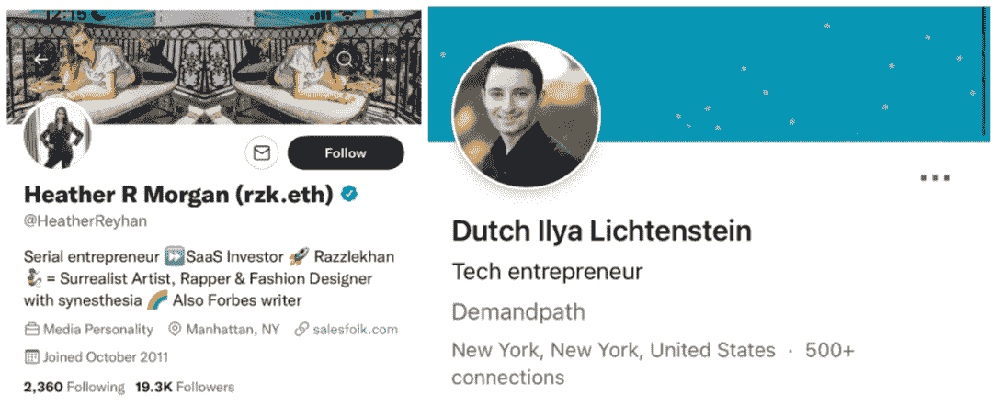

# 从 2016 年 Bitfinex 黑客攻击中缴获 36 亿美元

> 原文：<https://web.archive.org/web/https://dappradar.com/blog/3-6-billion-seized-from-2016-bitfinex-hack>

## 六年后，法律赶上了

美国司法部宣布，在 2016 年黑客攻击老牌加密货币交易所 Bitfinex 期间，据称缴获了价值超过 36 亿美元的比特币。美国当局在纽约逮捕了一对涉嫌试图洗钱的夫妇。值得注意的是，法庭文件并没有指控这对夫妇的黑客行为本身。

2016 年 Bitfinex 上的抢劫案在当时捕获了近 12 万个比特币，价值约 7200 万美元。由于自那以后 BTC 的快速升值，这次抢劫的价值现在被认为接近 52 亿美元。

因为资金被法院命令没收，法官将最终决定如何分配这笔钱。尽管如此，人们相信政府会设法将资金归还给合法的所有者。Bitfinex 在一份书面声明中表示，该公司承诺“遵循适当的法律程序，确立我们收回被盗比特币的权利。”

## 他们是谁？

根据官方声明，34 岁的科技企业家[伊利亚·利希滕斯坦](https://web.archive.org/web/20221208163051/https://pbs.twimg.com/media/FLFyMjGWUAcNpLi.jpg)和他的企业家妻子[希瑟·摩根](https://web.archive.org/web/20221208163051/https://pbs.twimg.com/media/FLFyMjWXoAcreG8.jpg)被指控合谋洗钱。

他们被指控清洗 119，754 枚比特币，这些比特币是在一名黑客攻破 Bitfinex 并发起 2000 多起未经授权的交易后被盗的。检察官表示，比特币被发送到一个由伊利亚·利希滕斯坦控制的数字钱包。联邦官员表示，他们缴获了大约 9.4 万枚被盗比特币，估计价值 36 亿美元。

## 跟着钱走

该案件标志着司法部历史上最重大的一次资金扣押，也是调查涉及加密货币的犯罪活动中最引人注目的起诉。此外，它表明，尽管这些特定的个人设法逃避了法律长达五年多，但最终，当局已经能够将无数的区块链交易和钱包地址串在一起，以确定他们并采取行动。

虽然追踪资金线索几乎是揭露犯罪活动的可靠方法，但缺乏了解和复杂的路由传统上使加密货币成为非法活动的避风港。Bitfinex 曾提供价值数亿美元的奖励，以获取导致 2016 年被盗资金返还的信息，但没有结果。然而，美国官员不愿透露该奖励是否在此案中发挥了作用，因为他们似乎是在没有帮助的情况下将拼图拼在一起的。

根据所提供的信息，被盗的比特币中有很大一部分被放在 AlphaBay 的账户中，alpha bay 是一个平台[，2017 年](https://web.archive.org/web/20221208163051/https://www.washingtonpost.com/world/national-security/justice-dept-announces-takedown-of-alphabay-dark-web-marketplace-for-drugs-and-other-illicit-goods/2017/07/20/a8950458-6d55-11e7-9c15-177740635e83_story.html?itid=lk_inline_manual_14)被当局关闭，成为毒品、枪支和假文件的非法市场。当局可以简单地回溯导致他们找到这对夫妇的交易和活动。然而，一名国税局代理人对这对夫妇提交的宣誓书声称，他们只花了被盗资金的一小部分，其中一些用于黄金，一些用于非金融信托。

随着故事的进一步展开，我们将继续关注。对于这位作者来说，仍然有一些问题围绕着为什么这对夫妇选择居住在一个完全运作和积极执法的国家，知道他们冒着一切危险。此外，感觉更多的人卷入了这一事件，也许伊利亚·利希滕斯坦和他的妻子希瑟·摩根正在为一个更大的行动背黑锅。不管怎样，把你的爆米花拿出来，因为这个故事会拖一段时间。

 NewsletterUnsubscribe at any time. [T&Cs](https://web.archive.org/web/20221208163051/https://dappradar.com/terms) and [Privacy Policy](https://web.archive.org/web/20221208163051/https://dappradar.com/privacy-policy)

***以上不构成投资建议。此处给出的信息仅供参考。请行使尽职调查，做你的研究。作者持有 ETH、BTC、AGIX、HEX、LINK、GRT、CRO、OMI、不可变 X、GALA、AVASTR、GMEE、CUBE、RADAR、FLOW、FTM、BNB、SPS、WRLD、ATOM 和 ADA。***