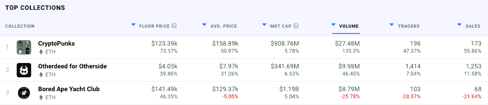
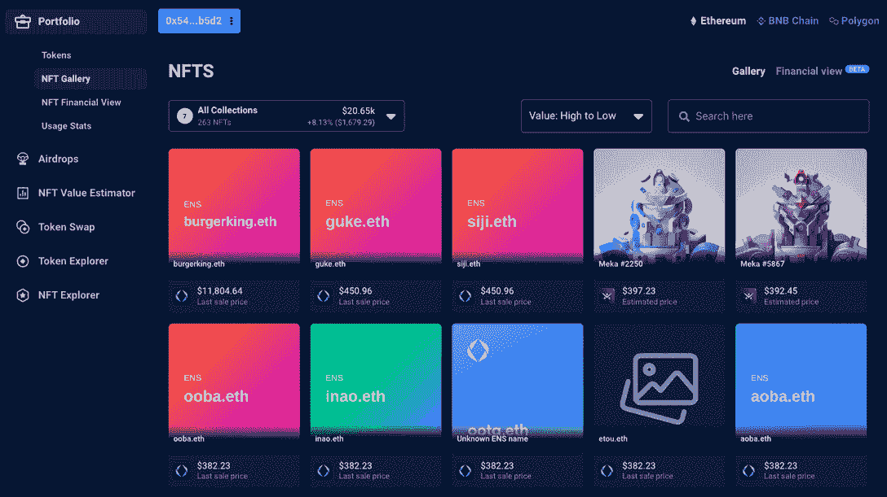

# 390 万美元 CryptoPunk & ENS 品牌名称 Rush

> 原文：<https://web.archive.org/web/https://dappradar.com/blog/3-9m-cryptopunk-ens-brand-name-rush>

## 查看 7 月 10 日至 17 日之间的 NFT 销售亮点排名

**NFT 系列，如 [Bored Ape Yacht Club](https://web.archive.org/web/20230104011252/https://dappradar.com/hub/nft-explorer/collection/bored-ape-yacht-club) 和 [CryptoPunk](https://web.archive.org/web/20230104011252/https://dappradar.com/hub/nft-explorer/collection/cryptopunks) 最近占据了 NFT 销售额前十名，因为逢低买入者继续利用 ETH 的低价获利。另一个更值得注意的趋势是，随着更多品牌进入 Web3 和元宇宙机会主义者采取行动，一些知名品牌的 ENS 域名被出售。**

在过去的七天里，NFT 拍卖的最高价格是一件稀有的带头巾的猿猴，以 2,691 ETH 的价格易手，约合 390 万英镑。在这次拍卖的背后，我们看到一群朋克和[NFT 湾](https://web.archive.org/web/20230104011252/https://dappradar.com/hub/nft-explorer/collection/bored-ape-yacht-club)收藏品易手。更有趣的是， [CryptoPunk NFTs](https://web.archive.org/web/20230104011252/https://dappradar.com/hub/nft-explorer/collection/cryptopunks) 的底价上涨了 73%以上，平均成本在过去七天里上涨了 50%以上。

与过去几周类似，我们也看到一些生成性加密艺术作品通过艺术块平台出售。我们看到[许多 Fidenza 销售额约为 200，000 美元](https://web.archive.org/web/20230104011252/https://dappradar.com/nft/sales/2)，最高销售额为 [Fidenza #589 的 150 ETH，](https://web.archive.org/web/20230104011252/https://dappradar.com/hub/assets/eth/0xa7d8d9ef8d8ce8992df33d8b8cf4aebabd5bd270/78000589)或过去七天的约 203，000 美元。

另一个主要趋势是出售公认品牌名称的域名。类似于早期的互联网，公司现在期望有一天需要获得一个 ENS 域名来在 Web3 中代表他们自己。因此，在 Web3 出现之前，机会主义者就开始抢注品牌名称，如 Tesla.eth、Coke.eth 和 Adidas.eth。值得注意的是，[一些品牌走在了游戏的前面，并在很久以前就获得了它们的 ENS](/web/20230104011252/https://dappradar.com/blog/speculators-eye-up-ens-nft-domains/)。

然而，几年后，越来越多的品牌试图获得 Web3 的份额，可以说 web 3 是以 ENS 域名开始的，从这个域名可以锚定一切。

本周我们看到[三星. eth](https://web.archive.org/web/20230104011252/https://dappradar.com/hub/assets/eth/0x57f1887a8bf19b14fc0df6fd9b2acc9af147ea85/32874688416862582133947633994854615433728021352752723391539385381884791098195) 、[耐克. eth](https://web.archive.org/web/20230104011252/https://dappradar.com/hub/assets/eth/0x57f1887a8bf19b14fc0df6fd9b2acc9af147ea85/58229628887636044882372953174745135299233155338052253949785372330985740196460) 和[星巴克. eth](https://web.archive.org/web/20230104011252/https://dappradar.com/hub/assets/eth/0x57f1887a8bf19b14fc0df6fd9b2acc9af147ea85/40274598749731829610336635163447228327862771359534322740478316032012743633643) 都在之前的七天内易手。[举例来说，Samsung.eth](https://web.archive.org/web/20230104011252/https://dappradar.com/hub/assets/eth/0x57f1887a8bf19b14fc0df6fd9b2acc9af147ea85/32874688416862582133947633994854615433728021352752723391539385381884791098195) 是两年多前为 3 WETH 打造的，2022 年 7 月 14 日以 60 ETH 出售。

***查看以下 NFT 销售亮点完整列表:***

*   [CryptoPunk # 4156](https://web.archive.org/web/20230104011252/https://dappradar.com/hub/assets/eth/0xb47e3cd837ddf8e4c57f05d70ab865de6e193bbb/4156)–2691 ETH/$ 398 万-[买家钱包](https://web.archive.org/web/20230104011252/https://dappradar.com/hub/wallet/eth/0x67954ac510255b6b3724073022196b67bdf260b6)
*   [名词 196](https://web.archive.org/web/20230104011252/https://dappradar.com/hub/assets/eth/0x9c8ff314c9bc7f6e59a9d9225fb22946427edc03/196)–115 ETH/$ 169376.59—[买家钱包](https://web.archive.org/web/20230104011252/https://dappradar.com/hub/wallet/eth/0xf476cd75be8fdd197ae0b466a2ec2ae44da41897)
*   [Ringers # 244](https://web.archive.org/web/20230104011252/https://dappradar.com/hub/assets/eth/0xa7d8d9ef8d8ce8992df33d8b8cf4aebabd5bd270/13000244)–79.97 ETH/$ 117，789.52—[买家钱包](https://web.archive.org/web/20230104011252/https://dappradar.com/hub/wallet/eth/0x6478b1a936882d1a59222094d9cf2ee37c7044de)
*   [Samsung . ETH](https://web.archive.org/web/20230104011252/https://dappradar.com/hub/assets/eth/0x57f1887a8bf19b14fc0df6fd9b2acc9af147ea85/32874688416862582133947633994854615433728021352752723391539385381884791098195)–60 ETH/$ 88741.80—[买家钱包](https://web.archive.org/web/20230104011252/https://dappradar.com/hub/wallet/eth/0x542f0c3f91a75500bb446a105f468ed1297fb5d2)
*   [goblintown # 8041](https://web.archive.org/web/20230104011252/https://dappradar.com/hub/assets/eth/0xbce3781ae7ca1a5e050bd9c4c77369867ebc307e/8041)–60 ETH/$ 88621.8—[买家钱包](https://web.archive.org/web/20230104011252/https://dappradar.com/hub/wallet/eth/0x64ac64ab7791941c946a5f6685acd61a6d10a09b)
*   [STEPN 普通运动鞋盒# 53637](https://web.archive.org/web/20230104011252/https://dappradar.com/hub/assets/eth/0x495f947276749ce646f68ac8c248420045cb7b5e/31286089499503741959782111886512120281924005796691348909683106023547626061825)–50 ETH/$ 73851.5—[买家钱包](https://web.archive.org/web/20230104011252/https://dappradar.com/hub/wallet/eth/0x039284618ec890ab5b4911103e8da52acc0ce032)
*   [Nike . ETH](https://web.archive.org/web/20230104011252/https://dappradar.com/hub/assets/eth/0x57f1887a8bf19b14fc0df6fd9b2acc9af147ea85/58229628887636044882372953174745135299233155338052253949785372330985740196460)–60 ETH/$ 88621.8—[买家钱包](https://web.archive.org/web/20230104011252/https://dappradar.com/hub/wallet/eth/0x02eca8cc78b7d30c1ac5e16988ed2c8a9da658d6)
*   [Starbucks . ETH](https://web.archive.org/web/20230104011252/https://dappradar.com/hub/assets/eth/0x57f1887a8bf19b14fc0df6fd9b2acc9af147ea85/40274598749731829610336635163447228327862771359534322740478316032012743633643)–50 ETH/$ 73951.50—[买家钱包](https://web.archive.org/web/20230104011252/https://dappradar.com/hub/wallet/eth/0x542f0c3f91a75500bb446a105f468ed1297fb5d2)
*   [Hermes . ETH](https://web.archive.org/web/20230104011252/https://dappradar.com/hub/assets/eth/0x57f1887a8bf19b14fc0df6fd9b2acc9af147ea85/89566425882748699877128164990444504151305942551129198197159746136842287282935)–49.92 ETH/$ 73734.98—[买家钱包](https://web.archive.org/web/20230104011252/https://dappradar.com/hub/wallet/eth/0x02eca8cc78b7d30c1ac5e16988ed2c8a9da658d6)
*   [VEE Friends 耐心猪](https://web.archive.org/web/20230104011252/https://dappradar.com/hub/assets/eth/0xa3aee8bce55beea1951ef834b99f3ac60d1abeeb/6956)–33.99 ETH/$ 50079.38——[买家钱包](https://web.archive.org/web/20230104011252/https://dappradar.com/hub/wallet/eth/0x2e7336d17d1276b281cab22174981036c3e4fbc8)

## NFT 市场战争

[2022 年第二季度](https://web.archive.org/web/20230104011252/https://dappradar.com/blog/dapp-industry-report-q2-nfts-and-web3-games-keep-enduring-market-conditions-as-shockwaves-from-the-terra-collapse-reach-cefi-and-vcs)尽管美元贬值，NFT 工业仍取得了重大发展。NFT 在瑞士联邦交易所的交易数量和交易量没有受到太大影响，这对许多投资者来说是看涨的信号。此外， [Gamestop 的](/web/20230104011252/https://dappradar.com/blog/gamestop-preparing-to-open-nft-marketplace/)新 NFT 市场在不到一周前推出，几天内产生的交易量超过了[比特币基地的 NFT 市场](/web/20230104011252/https://dappradar.com/blog/coinbase-nft-marketplace-anti-climax/)自推出以来的尝试。

以太坊领先的 DEX Uniswap 已经收购了 NFT 聚合器平台 Genie，为用户提供来自所有连锁店的各种市场的 NFT，同时能够以更低的燃气费获得 NFT 市场的整体视图。作为以太坊事实上的做市商，Uniswap 的收购将允许 DeFi 协议改善其产品供应。

随着 DEX 的 T1 和 T2 的 T3 在风暴中前行，我们期待看到更多的多样化和界限的模糊。你可以使用我们专门的 [NFT 浏览器](https://web.archive.org/web/20230104011252/https://dappradar.com/nft)在[DappRadar](https://web.archive.org/web/20230104011252/https://dappradar.com/nft)上探索 NFT，并使用 [DappRadar 投资组合跟踪器](https://web.archive.org/web/20230104011252/https://dappradar.com/hub/wallet)跟踪和分析你自己的 NFT 股票。

[See how many ENS domains this wallet collected!](https://web.archive.org/web/20230104011252/https://dappradar.com/hub/wallet/eth/0x542f0c3f91a75500bb446a105f468ed1297fb5d2/nfts)

***以上不构成投资建议。此处给出的信息仅供参考。请行使尽职调查，做你的研究。作者持有多种加密货币的头寸，包括 BTC、瑞士法郎和雷达。***

 NewsletterUnsubscribe at any time. [T&Cs](https://web.archive.org/web/20230104011252/https://dappradar.com/terms) and [Privacy Policy](https://web.archive.org/web/20230104011252/https://dappradar.com/privacy-policy)