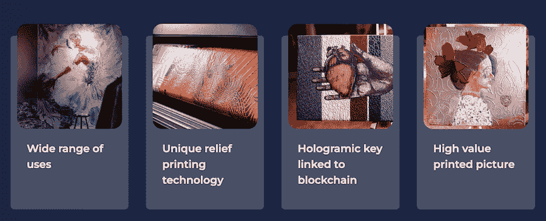

# 0x0 的 3 个理由。艺术值得你关注

> 原文：<https://web.archive.org/web/https://dappradar.com/blog/3-reasons-why-0x0-art-deserves-your-attention>

## 0x0。艺术是一个 NFT 平台，赋予每一个数字创作者

**0x0。Art 是一个独特的 NFT 艺术平台，以多种方式在当前不断发展的数字环境中赋予数字创作者权力。这个由人工智能支持的数字艺术平台提供数字艺术作品创作、符号化、复制和认证功能。**

**概要:**

*   自成立以来，0x0Art 已经取得了几个里程碑式的成就，例如最近成功融资 25 万美元，以及[推出 NFT 系列](/web/20220906092752/https://dappradar.com/blog/0x0-art-lets-users-make-money-from-nfts-without-selling-them/)。
*   0x0。由 10000 幅独特的非艺术作品组成的 NFT 艺术收藏将授予持有者其数字和物理格式的版税。
*   另外值得一提的是 0x0。Art 作为 NFT 艺术项目脱颖而出，它开创了艺术展示形式，尝试人工智能，并让所有人都能接触到 NFT 艺术。

NFT 艺术浪潮刚刚开始，这个地区已经迎来了一系列实验性和创造性的艺术品和平台。其中有 0x0。艺术，下一代 NFTs，利用独特的技术将数字艺术形式与现实世界的绘画联系起来。

## 0x0。艺术的最新里程碑

## 最近的 0x0。艺术团队与立陶宛创新机构达成协议，获得超过 25 万美元的资金来开发该项目及其生态系统。值得注意的是，这笔资金将确保团队能够实现他们的路线图和信纸上的目标，并在未来推出更强大的计划。

而且，0x0。Art 推出了 10000 个 NFT 集合，授予持有者其数字和物理格式的版税。持有者可以通过拥有一个 0x0 来享受各种特权。阿特·NFT。这些好处包括获得免费的高端打印和使用人工智能绘图工具。

接下来是将用户自己的作品转换成 NFT 的机会，并免费请求高质量的印刷版本。这项福利将于今年 8 月开始实施。

0x0。艺术团队致力于建立一个终极的数字艺术创作体验，为每个人配备易于使用的艺术工具。为用户提供对 0x0 更全面的理解。艺术，本文将从三个方面解释为什么这个项目成为备受期待的 NFT 艺术平台。

## 实体艺术和数字艺术的共存

许多人认为它仍然缺乏一个展示 NFT 艺术品的好方法。目前的虚拟展览空间暂时还远不能提供像样的观看体验。好在有了 0x0。Art 的技术，用户不需要牺牲实体显示器提供的极致艺术体验。

利用独特的印刷技术，0x0。艺术允许创作者和艺术家同时展示实物和数字内容。因此，它使 NFT 艺术品更具收藏价值，原因如下。

1.  全息安全认证协议在艺术品和区块链之间架起了桥梁，使得实物和 NFT 一样可追踪。
2.  NFT 持有者可以解锁实物艺术品和 NFT 艺术品的货币化机会。
3.  收藏家可以免费获得高端数字印刷服务，为画作的实物版本定制框架。

## 艺术品和人工智能之间的协同作用

新技术给艺术家带来了更复杂的媒体和内容创作方法，从而使他们受益。此外，艺术家总是着迷于通过隐喻的方式来解释他们周围的世界。

0x0。艺术致力于协助艺术家探索人类创造者和人工智能技术之间的协同作用。目的是实验未来数字艺术的创造和创新。

美工可以用 0x0。Art 的人工智能工具可以产生有意义的内容。0x0 有什么让人印象深刻的？艺术的本质在于它能理解文本，并能通过绘画来诠释文字。

另外值得一提的是 0x0。Art 的 AI 还在继续进化。随着越来越多的用户输入他们的需求，0x0。Art 的 AI 会学习，变得更强大。这意味着，通过更准确地理解艺术家的概念，平台将能够创作出更复杂、更多样的画作。

## 面向所有人的强大平台

0x0 的另一个重要特性是。艺术作为 NFT 艺术平台的突出之处在于它的多功能性。它不仅让艺术家受益，也让设计师、营销人员和许多其他类型的创作者受益。

0x0。Art 的创作工具可以生成各种风格的图纸，以满足用户的要求和目的。值得注意的是，它支持抽象、超现实主义、极简主义等风格。最重要的是，该平台可以支持创作者创作出具有美学吸引力、在讲故事和叙事方面有意义的艺术品。

## 最后的想法

0x0。艺术旨在成为一个 Web 3.0 NFT 艺术平台，专注于为每个希望欣赏、创作、体验和收藏 NFT 艺术的人创造的创新艺术。利用区块链和人工智能技术，0x0。艺术将继续培养和激励新一代的艺术家和收藏家来释放 NFT 艺术的潜力

了解有关 0x0 的更多信息。艺术:

[0x0.art](https://web.archive.org/web/20220906092752/https://0x0.art/)

[推特](https://web.archive.org/web/20220906092752/https://twitter.com/0x0_Art)

[不和](https://web.archive.org/web/20220906092752/https://discord.com/invite/9E6VMeTJny)

**免责声明** —这是一篇赞助文章。DappRadar 不认可本页面上的任何内容或产品。DappRadar 旨在提供准确的信息，但读者应该在采取行动之前总是自己做研究。DappRadar 的文章不能被认为是投资建议。