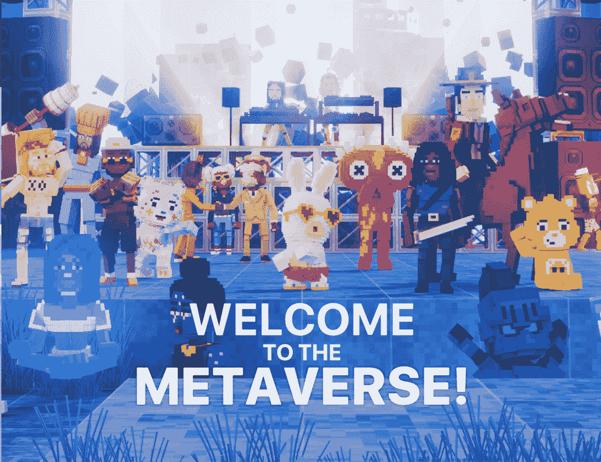
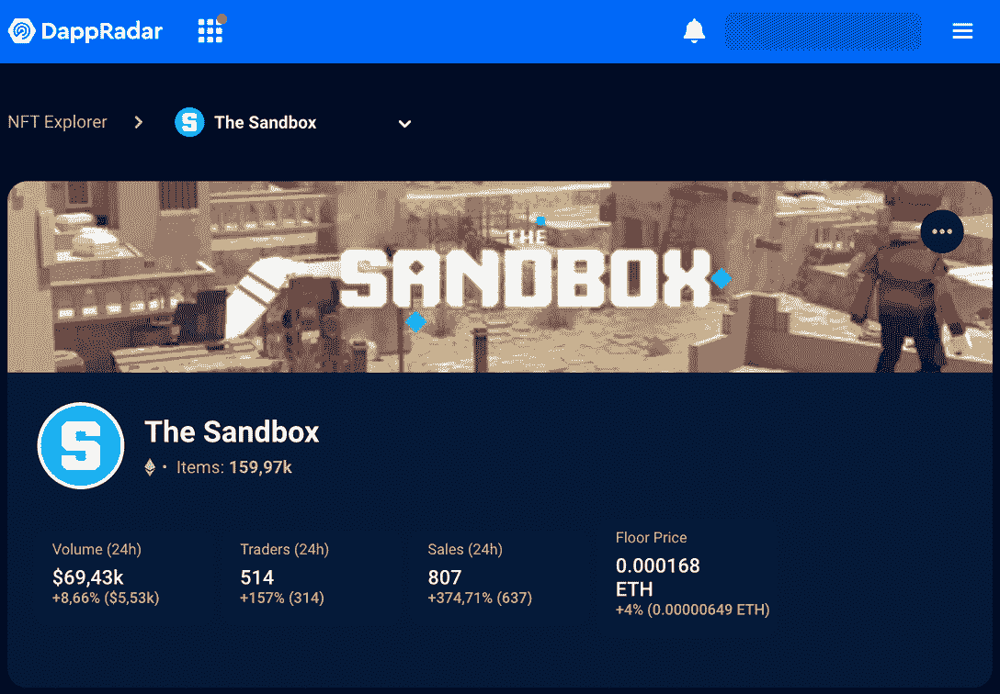

# 沙盒阿尔法第三季值得炒作的 3 个理由

> 原文：<https://web.archive.org/web/https://dappradar.com/blog/3-reasons-why-the-sandbox-alpha-season-3-deserves-the-hype>

## 进入元宇宙从未如此简单

领先的虚拟世界沙盒再一次让整个网络掀起了元宇宙狂潮。虽然这一季在不确定的时间推出，但社区已经明确表示，Alpha 第三季不会在看不见的情况下过去。以下是沙盒如何将 Web3 游戏策略提升到下一个水平的展望。

从今天开始，阿尔法第三季将允许人们在一系列的任务中探索他们广阔的元宇宙虚拟世界。任何人都可以免费玩，有机会在 10 周内赢得 30.000 [和](https://web.archive.org/web/20220929074137/https://dappradar.com/hub/token/eth/SAND?from=0x3845badade8e6dff049820680d1f14bd3903a5d0)的一等奖。

感觉有点失落？回到我们文章的开头:[什么是沙盒&如何加入元宇宙](https://web.archive.org/web/20220929074137/https://dappradar.com/blog/what-is-the-sandbox-how-to-join-the-metaverse)？然后，让我们深入文章！

## 沙盒阿尔法第三季是如何得到它的权利

正如 DappRadar 的 CDO 曾经说过的那样，[游戏玩家将为大规模采用铺平道路](https://web.archive.org/web/20220929074137/https://dappradar.com/blog/gamers-will-pave-the-way-to-mass-adoption)。因此，可以肯定地说，区块链游戏的任何胜利都是整个分布式应用(dapp)行业的胜利。

通过发起这种规模的活动，沙盒不仅做得很好，而且为整个网络提供了真正的公共服务 3。怎么会？

### 1.它汇集了最重要的 Web3 项目

虽然许多 dapps 相互竞争，但社区协作确实比其他方式更有益。同样，NFT 的项目在一起工作时会蓬勃发展。更何况是[游戏相关的 NFT](https://web.archive.org/web/20220929074137/https://dappradar.com/blog/new-trend-borrow-nfts-to-play-blockchain-games)。

在阿尔法第三季中，沙盒允许特定蓝筹项目的 NFT 收藏家使用他们的代币作为游戏中的化身。你可以玩你的无聊猿，酷猫，月鸟，克隆 X，女人的世界，等等体素化的 NFT。

沙盒的首席运营官指出，这种方式

> 该团队很高兴为这些集合的所有者开发新的用例，从数字身份和创建这些 NFT 的世界的能力开始。
> 
> Sébastien Borget

随着行业联合起来进行征服，该团队开发了一款比之前的 Alpha 赛季更易于使用的游戏。它让传统游戏玩家更进一步，将沙盒视为一种恰好使用区块链技术来有益于其生态系统的游戏。这比它看起来更有价值。向上分！

*   **值得一读** : [什么是元宇宙:下一代虚拟世界](https://web.archive.org/web/20220929074137/https://dappradar.com/blog/what-is-the-metaverse)

### 2.它正在向世界敞开大门

忘掉封闭的游戏社区吧。沙盒第三季让任何好奇的游戏玩家都有可能再一次先睹为快地了解元宇宙的宣传。当然，还有机会赢得阿尔法通行证和[和](https://web.archive.org/web/20220929074137/https://dappradar.com/hub/token/eth/SAND)。

在十周的时间里，沙盒带来了 90 多种体验，将大品牌和全球名人带到了元宇宙。

沙盒阿尔法第三季清楚地表明，它不仅仅是一个[玩赚游戏](https://web.archive.org/web/20220929074137/https://dappradar.com/blog/what-are-play-to-earn-games-and-why-play-them)。当然，赚钱是竞争的一部分，但远不止如此。游戏是复杂的，多样性、质量和社会因素让一切变得更加光明。

让我们不要忘记重申该项目的权威的著名的名字。玩家不仅可以在元宇宙上看到他们喜欢的 NFT，还可以看到[最大的 web2 品牌](https://web.archive.org/web/20220929074137/https://dappradar.com/blog/10-major-brands-in-the-metaverse)和[名人](https://web.archive.org/web/20220929074137/https://dappradar.com/blog/celebrity-wallets-a-dive-into-crypto-hollywood)。例如，古驰、蓝精灵、[、地狱厨房](https://web.archive.org/web/20220929074137/https://dappradar.com/blog/gordon-ramsay-brings-hells-kitchen-to-the-sandbox)、[帕丽斯·希尔顿](https://web.archive.org/web/20220929074137/https://dappradar.com/blog/paris-hilton-enters-the-sandbox)、[史努比·道格](https://web.archive.org/web/20220929074137/https://dappradar.com/hub/wallet/eth/0xce90a7949bb78892f159f428d0dc23a8e3584d75)和[史蒂夫·青木](https://web.archive.org/web/20220929074137/https://dappradar.com/hub/wallet/eth/0xe4bbcbff51e61d0d95fcc5016609ac8354b177c4)，这些都是任何刚接触加密领域的人都可能认识到的吸引力。

### 3.这是网络营销活动

对于我们这些在 dapp 行业工作的人来说，采用是一个反复出现的主题。此外，对于任何在加密货币市场寻找机会的人来说。

尽管区块链技术背后的知识和思想可能是创新的，但如果它们不能触及那些可能从中受益的人，那么什么都不重要。

根据我们最新的[区块链游戏报告](https://web.archive.org/web/20220929074137/https://dappradar.com/reports)，区块链游戏受熊市影响最小。在困难时期，人们呆在他们感到安全的地方。一个活跃而强大的社区对于推进项目和建立用户忠诚度非常重要。

虽然公众对密码项目的兴趣很低，但游戏已经设法与 C-word 保持距离。

以这种方式将 Web2 品牌包装到元宇宙，同时温和地将 Web3 和去中心化的金融概念引入游戏经济，这表明该行业终究没有结束。

*   **阅读** : [游戏:达普拉达的终极指南](https://web.archive.org/web/20220929074137/https://dappradar.com/blog/gaming-dappradars-ultimate-guide)

## 如何开始玩沙盒阿尔法第三季？

如果你想在比赛中碰碰运气，开始免费玩，这里有一步一步的过程开始。剧透:你实际上不需要拥有任何沙子代币。

1.  访问[沙盒官网](https://web.archive.org/web/20220929074137/https://www.sandbox.game/en/)；
2.  连接你的 web3 钱包(如果你还没有，我们建议[meta mask](https://web.archive.org/web/20220929074137/https://dappradar.com/blog/what-is-metamask))；
3.  创建您的[头像](https://web.archive.org/web/20220929074137/https://dappradar.com/blog/the-sandbox-season-3-nft-avatars-at-the-ready)或选择钱包上可用的一个体素 NFTs
4.  下载 Alpha game(非 Game Maker)，可用于 Windows 和 macOS，并开始探索。

在网站的仪表盘上，你可以选择下一个你想玩的世界。而在第一天，玩家可以在阿尔法大厅和 XYZ 俱乐部玩(专长。史蒂夫·青木)在线，许多其他不同任务的虚拟世界将在预先设定的特定日期提供。

比赛将于 11 月初结束，所以在此之前，你可以尝试一下游戏——或者挑战传统玩家朋友，给区块链游戏第二次机会。

## 继续用 DappRadar 跟踪沙盒

在我们的博客上，你会发现关于沙盒世界的报道、教育文章和最新消息。所有这些对于了解最新信息都是必不可少的。

如果你对数字感兴趣，请前往 [DappRadar 的排名](https://web.archive.org/web/20220929074137/https://dappradar.com/rankings)来追踪游戏的统计数据。你还可以看到沙盒的虚拟土地 NFT 销售情况如何，甚至可以使用[达普拉达 NFT 收藏浏览器](https://web.archive.org/web/20220929074137/https://dappradar.com/hub/nft-explorer/collection/the-sandbox)进行买卖。

[<picture></picture>](https://web.archive.org/web/20220929074137/https://dappradar.com/hub/nft-explorer/collection/the-sandbox)

[Click here to access stats for The Sandbox Land NFTs after Alpha Season 3 launched](https://web.archive.org/web/20220929074137/https://dappradar.com/hub/nft-explorer/collection/the-sandbox)

我们将继续关注沙盒的 Web3 游戏之旅。如果你想在游戏中保持领先地位，成为第一个了解此类内容的人，请在 [Twitter](https://web.archive.org/web/20220929074137/https://twitter.com/dappradar) 上关注我们，并加入我们的 [Discord](https://web.archive.org/web/20220929074137/https://discord.com/invite/4ybbssrHkm) 服务器。

 NewsletterUnsubscribe at any time. [T&Cs](https://web.archive.org/web/20220929074137/https://dappradar.com/terms) and [Privacy Policy](https://web.archive.org/web/20220929074137/https://dappradar.com/privacy-policy)

***以上不构成投资建议。此处给出的信息仅供参考。请尽职调查并自行研究。***