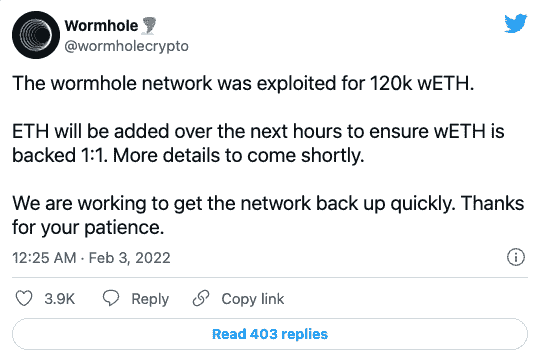
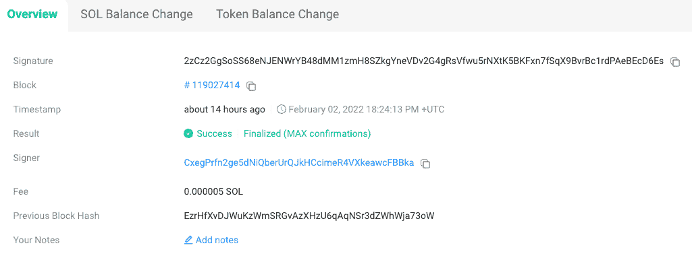
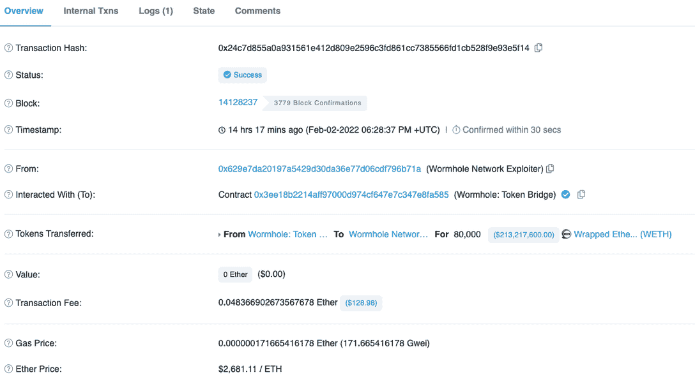
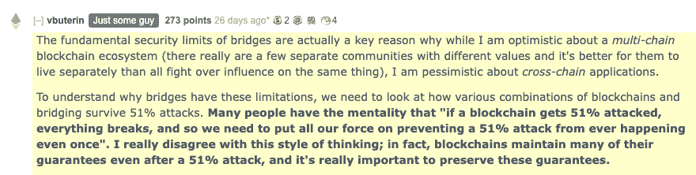

# 索拉纳虫洞桥被黑，损失 3 . 21 亿美元

> 原文：<https://web.archive.org/web/https://dappradar.com/blog/321-million-taken-as-solana-wormhole-bridge-hacked>

## 2022 年迄今为止最大的黑客攻击

本周， [**【索拉纳区块链】**](https://web.archive.org/web/20221201192554/https://dappradar.com/rankings/protocol/solana) **又有坏消息，因为其领先的虫洞桥被黑客利用，损失 3.21 亿美元。以太坊和索拉纳之间的令牌桥看到 120，000 个包装好的 ETH (WETH)令牌被移除并分发到黑客的索拉纳和以太坊钱包中。这是 2022 年最大的加密黑客攻击，也是迄今为止第二大 DeFi 黑客攻击。虫洞小组提供了 1000 万美元的虫赏金来归还资金。**

[虫洞是一个令牌桥](https://web.archive.org/web/20221201192554/https://dappradar.com/multichain/defi/wormhole)，它让用户在以太坊、索拉纳、BSC、Polygon、Avalanche、Oasis 和 Terra 之间发送和接收加密货币，而无需使用集中式交换。一个受欢迎的功能是让用户从以太坊网络转移代币，并在替代网络上以低得多的费用进行交易。

黑客攻击发生在桥梁的[索拉纳一侧，有人担心虫洞通往 Terra 的桥梁可能同样脆弱。然而，在撰写本文时，虫洞团队向社区保证，它将补充其 ETH 供应，但还没有关于这些资金将来自哪里或何时到达的消息。](https://web.archive.org/web/20221201192554/https://twitter.com/samczsun/status/1489044939732406275/photo/1)

## 发生了什么事？

使用 [Solscan](https://web.archive.org/web/20221201192554/https://solscan.io/tx/2zCz2GgSoSS68eNJENWrYB48dMM1zmH8SZkgYneVDv2G4gRsVfwu5rNXtK5BKFxn7fSqX9BvrBc1rdPAeBEcD6Es) 和 [Etherscan](https://web.archive.org/web/20221201192554/https://etherscan.io/tx/0x24c7d855a0a931561e412d809e2596c3fd861cc7385566fd1cb528f9e93e5f14) ，我们可以看到黑客攻击的细节。这一切都始于 2 月 2 日下午 6 点左右。首先，[攻击者在 Solana](https://web.archive.org/web/20221201192554/https://solscan.io/tx/2zCz2GgSoSS68eNJENWrYB48dMM1zmH8SZkgYneVDv2G4gRsVfwu5rNXtK5BKFxn7fSqX9BvrBc1rdPAeBEcD6Es) 上赢得了 120，000 wet，然后在大约下午 6 点 30 分在 ETH [上兑换了 93，750 wet，兑换了大约 2 . 54 亿美元。](https://web.archive.org/web/20221201192554/https://solscan.io/tx/2zCz2GgSoSS68eNJENWrYB48dMM1zmH8SZkgYneVDv2G4gRsVfwu5rNXtK5BKFxn7fSqX9BvrBc1rdPAeBEcD6Es)

Solscan transaction details 

Etherscan transaction details 

这位黑客后来用一些资金购买了各种代币，最有趣的是，一个无聊的 APE 游艇俱乐部代币(Ape)。剩余的 WETH 在 Solana 上被 SOL 和 USDC 交换，目前，黑客的 Solana 钱包里有 432，662 SOL，或大约 4，400 万美元。

在撰写本文时，虫洞服务的其他资产或链没有受到影响。尽管如此，智能合同审计公司 Certik 在一份报告中说,“虫洞通往特拉区块链的桥梁有可能和他们的索拉纳桥有同样的弱点。”

虫洞团队通过他们的以太坊地址联系黑客，让资金返还。如果剩余的资金被归还，他们向坏演员提供价值 1000 万美元的资金。在撰写本文时，在虫洞团队试图解决这个问题时，跨桥发送的令牌还不可兑换。

## 令牌桥涉及的风险

以太坊创始人 Vitalik Butterin 最近表达了对令牌桥的担忧，更准确地说是警告它们在 51%攻击事件中的脆弱性。他的评论是在本月早些时候发表的，因为更多的低成本 EVM 兼容第一层网络，如 Solana，寻求利用以太坊的高额燃气费。

鉴于跨链协议是 2021 年遭受黑客攻击最严重的协议之一，他有一个很强的观点。THORChain 遭受了多次攻击，而 Poly Network 受到了有记录以来最严重的 DeFi 黑客攻击，价值 6 亿美元，尽管在这种情况下，资金最终被归还。1 月 8 日，Buterin 在 Reddit 上发表评论，强调“桥梁的基本安全限制”是他对跨链应用持怀疑态度的基础。

这是七天内第二次对令牌桥的智能合约攻击。1 月 28 日，币安智能链[上的 DeFi 协议 Qubit Finance 被利用其令牌桥以 8000 万美元的价格利用](https://web.archive.org/web/20221201192554/https://cointelegraph.com/news/qubit-finance-suffers-80-million-loss-following-hack)。

## 索拉纳加冰

在对 Solana 来说只能被描述为[恒星 2021】之后，事情已经开始在 2022 年对 EVM 兼容的网络稍微解开。在过去的三个月里，其原生令牌 SOL 的价值已经下跌了 50%以上，而围绕压力下表现不佳的多个问题不断出现。随着对 Solana 的完整性和长期网络性能的日益担忧成为问题，几个月内发生的四起事件和过去一周的一起严重利用事件正在让投资者感到恐慌。](/web/20221201192554/https://dappradar.com/blog/raydium-on-solana-surpasses-100-000-active-wallets-per-week/)

此外，重要的是要记住，整个行业仍应被视为一个试验场。然而，这种态度不会让投资者或交易者受到这类攻击的影响。

更重要的是，[成为领先的 EVM 兼容第一层网络的竞争肯定在升温，像](/web/20221201192554/https://dappradar.com/blog/10-blockchains-that-could-replace-ethereum/) [Fantom](/web/20221201192554/https://dappradar.com/blog/dappradar-now-tracking-fantom-dapps/) 、 [Avalanche](/web/20221201192554/https://dappradar.com/blog/avalanche-dapps-see-increased-activity-as-avax-soars/) 和 [Harmony](/web/20221201192554/https://dappradar.com/blog/defi-kingdoms-takes-harmony-to-the-top-of-gaming-charts/) 这样的区块链公司面临着巨大的挑战。索拉纳将不得不努力在众多可供选择的产品中重新赢得用户的信任。更重要的是，该行业可能需要更仔细地听取布特林的话，并寻求作为一个集体而不是孤岛来解决这些问题。

 NewsletterUnsubscribe at any time. [T&Cs](https://web.archive.org/web/20221201192554/https://dappradar.com/terms) and [Privacy Policy](https://web.archive.org/web/20221201192554/https://dappradar.com/privacy-policy)

***以上不构成投资建议。此处给出的信息仅供参考。请行使尽职调查，做你的研究。作者持有 ETH、BTC、AGIX、HEX、LINK、GRT、CRO、OMI、不可变 X、GALA、AVASTR、GMEE、CUBE、RADAR、FLOW、FTM、BNB、SPS、WRLD、ATOM 和 ADA。***