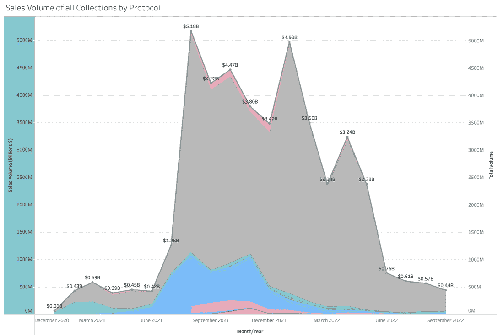
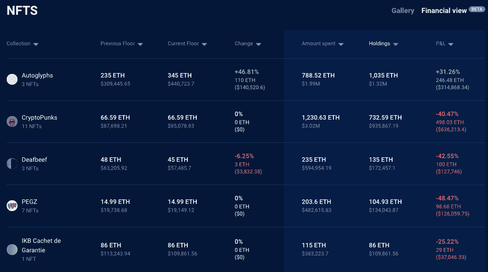

# 3AC 的星夜资本基金受到 NFT 市场重创

> 原文：<https://web.archive.org/web/https://dappradar.com/blog/3acs-starry-night-capital-fund-hit-by-decimated-nft-market>

## 加密和 NFT 的冬天还在继续，但数据显示这可能是底部

随着市场走软，三箭资本的剩余资产变得更加不值钱，该基金继续遭受损失。我们来看看他们的星夜资本蓝筹 NFT 基金是如何受到加密价格下跌和对昂贵收藏品兴趣减少的影响的。

**总结**

*   3AC 的星夜资本基金旨在让用户通过他们的蓝筹股投资组合接触 NFT 市场。现在，管理人员正在拍卖这些资产，试图弥补损失并偿还债务人。
*   NFT 市场未能恢复到接近峰值的水平，任何押注价格持续上涨的人现在都在遭受损失。
*   ***按一个指标计算，市场下跌了近 92%。但在经历了 4 个月的相对稳定后，有迹象表明这已经是底部了。市场是否会再次攀升仍存在疑问。***

三箭资本最近的投降符合我们目睹的席卷 DeFi 和 Web3 的更大模式。企业在牛市期间过度扩张，然后发现当市场收缩时，它们无法保持流动性。

这是一个古老的故事，过去一年的赢家将是那些能够看到美好时光不会永远持续下去的人。但对于那些投资于不稳定债券并认为价格会持续上涨的公司来说，这将是一段艰难的时期。

View DappRadar NFT Rankings

## 3AC 和他们的星夜资本基金

3AC 的故事在 6 月底爆发，自那以来，投资基金的故事一直没有改善。今年 7 月，该公司申请第 15 章破产，报告显示，该公司在 2021 年和 2022 年亏损超过 30 亿美元。

投降是今年打击该行业的更广泛的加密危机的一部分。TerraUSD 崩盘，加上 Tornado 现金制裁和 Celsius 冻结客户提款，影响了对 DeFi 的信心。3AC 的故障是由这些问题引起的，但现在也引发了更广泛的问题。

[https://web.archive.org/web/20221130040338if_/https://www.youtube.com/embed/4dLChMsgq6M?feature=oembed](https://web.archive.org/web/20221130040338if_/https://www.youtube.com/embed/4dLChMsgq6M?feature=oembed)

Three Arrows Controversy at 4:49

3AC 的巨额亏损和破产意味着当局现在正寻求收回资金，并将资金返还给投资者。这就是星夜资本基金的用武之地。

星夜资本是 3AC 的蓝筹股 NFT 系列，旨在让投资者投资于一度繁荣的 NFT 市场。这个 1 亿美元的基金成立于 2021 年 8 月，由 3AC 和笔名为 Vincent Van Dough 的 NFT 收藏家合作成立。

现在，不幸的是，这家投资公司遇到了加密冬天带来的复杂问题。由于 DeFi 的系统问题，他们已经没钱了。他们持有的用于偿还债务的资产已经贬值，这也是由于 DeFi 的系统性问题。这是一个包裹在危机中的问题中的问题。

[Explore Vincent Van Dough’s Wallet](https://web.archive.org/web/20221130040338/https://dappradar.com/hub/wallet/eth/0x0f0eae91990140c560d4156db4f00c854dc8f09e)

## 2022 年的 NFT 市场崩盘

Q2 开始出现关于 NFT 市场问题的报道。随着不可替代代币的销量持续下降，这些小涟漪很快就变成了波浪。下图显示，非金融交易量已回落至牛市之前 2021 年 6 月的水平。

Source: DappRadar

NFT 交易最好的月份是 2021 年 8 月，当时用户买卖了价值 51.8 亿美元的不可替代的收藏品、数字艺术品、物品和资产。上个月，即 2022 年 9 月，交易量下降了 4.4 亿美元。跌幅高达 91.85%，这在很大程度上解释了三箭资本的困境。

随着加密价格的下降，投机泡沫的彻底破灭，之前对 NFTs 的狂热兴趣已经消退。现在，只有坚定的和充满希望的人留在市场上，所以总体需求已经下降。下图显示，自 1 月份以来，销售数量一直在下降，当时交易商买卖了 1023 万份 NFT。

2022 年 9 月，销量已降至 421 万辆，降幅为 58.85%。从 1 月份的峰值到 5 月份，交易量稳步下降，直到 6 月份突然下降。如果这个故事对 NFT 社区有任何一线希望的话，销售计数在过去四个月已经稳定下来，所以这可能是任何潜在牛市之前的底部。

看看这些信息，就很清楚为什么任何完全依赖高风险加密货币和 NFT 的价值来生存的基金或公司现在都陷入了困境。使用 DappRadar 的投资组合跟踪器，我们还可以详细了解星夜资本的 Web3 钱包中的非金融资产在收购后是如何贬值的。

## 星夜资本基金 NFT 钱包

根据 Dune Analytics 的信息，星夜资本基金在 NFT 上的投资刚刚超过 3500 万美元。这只是整个 1 亿美元基金的 35%，所以剩下的钱在哪里仍然是个问题。需要注意的是，Dune 的数据并不完整，因为它并没有跟踪基金持有或购买的每一项资产。

使用 DappRadar 的 Portfolio 工具，我们可以看到这些钱包的内部，并发现里面有什么。我们还可以看到每个项目在财务上的表现。这让我们很好地了解了星夜资本基金因 NFT 贬值而损失了多少钱。

#### 钱包 A

这个钱包里装着我们认为是星夜资本持有的最昂贵的一笔 NFTs。使用 DappRadar 的 NFT 估值器，我们认为它目前价值 1739 万美元。这与该基金预计花费的 3500 万美元相差甚远，与他们最初启动的 1 亿美元相差甚远。

如果我们看下面的图表，我们可以看到它持有的每个项目的价值都下降了。他们的 CryptoPunks 收藏从 302 万美元下降到 940，776 美元，降幅达 69%。该基金在 T2 的坏账持有量从 594，954 美元降至 173，362 美元，下降了 70%。

甚至他们的三种价值已经上升的自生自灭债券，以美元计算也下跌了。这是 ETH 价格贬值的结果。星夜资本在他们的自动直升机上花了 199 万美元，现在价值 132 万美元。这是 34%的降幅。

[Check ETH Price](https://web.archive.org/web/20221130040338/https://dappradar.com/hub/token/eth/ETH)[<picture></picture>](https://web.archive.org/web/20221130040338/https://dappradar.com/hub/wallet/eth/0x2e675eeae4747c248bfddbafaa3a8a2fdddaa44b/nfts-financial)

[DappRadar’s Portfolio Financial View](https://web.archive.org/web/20221130040338/https://dappradar.com/hub/wallet/eth/0x2e675eeae4747c248bfddbafaa3a8a2fdddaa44b/nfts-financial)

为了计算星夜资本钱包 A 的盈亏，我们使用机器学习算法，并考虑到类似 NFT 的价格和整体收藏的当前交易活动等因素。

我们行业领先的 NFT 价值评估工具可以免费使用，是了解您是否物有所值的好方法。[找出它是如何工作的](https://web.archive.org/web/20221130040338/https://dappradar.com/blog/nft-value-estimator)和[用你自己的 NFT 试一试](https://web.archive.org/web/20221130040338/https://dappradar.com/hub/nft-value-estimator)。

[View Wallet A](https://web.archive.org/web/20221130040338/https://dappradar.com/hub/wallet/eth/0x2e675eeae4747c248bfddbafaa3a8a2fdddaa44b)

#### Gnosis 安全钱包

随着三箭资本公司宣布破产并处于清算过程中，管理人已被带进来进行公司资产的定位和出售。Teneo 是一家位于英属维尔京群岛的公司，负责领导这一进程。

Teneo 发布了一份声明，其中包含以下信息:

> 由于文森特·范多(" **VVD** ")的合作，VVD 所知的所有星夜资本的非功能性交易都已清点完毕，并在我们手中或正在转让给我们。
> 
> Teneo

声明接着说:

> 为了尽可能保留更多的资本，VVD 已提出协助最终出售所有 3AC NFTs，并可能与我们合作监督这些资产的处置。
> 
> Teneo

查看最近的钱包活动，我们可以看到从 10 月初开始，Teneo 开始将 NFTs 从[这个钱包](https://web.archive.org/web/20221130040338/https://dappradar.com/hub/wallet/eth/0xAeb7855A713b4d8354f659c15A25cda11F466C28)转移到这个 [Gnosis 安全钱包](https://web.archive.org/web/20221130040338/https://dappradar.com/hub/wallet/eth/0xbeddf3e43015f5221f5d1ac0fd0d2ab3352d2f7b)。据推测，他们的最终目标是将星夜资本的所有非金融资产集中到一个钱包里，然后开始清算它们。

这可能是一个买入一些低价蓝筹股的好机会。所以请点击下面的按钮，关注 Gnosis 钱包。

[View Gnosis Wallet](https://web.archive.org/web/20221130040338/https://dappradar.com/hub/wallet/eth/0xbedDF3e43015f5221F5d1Ac0fD0d2Ab3352D2f7B)

## NFT 各地的火灾销售

#### 奔岛无聊猿

三箭资本(Three Arrows Capital)和他们的星夜资本基金(Starry Night Capital fund)并不是唯一被抓到背黑锅的 NFT 巨鲸，其他人则带着利润跑路了。BendDAO 是另一个受到价格下跌影响的平台；在他们的例子中，是无聊的猿类的陨石坑值。

BendDAO 是一个 P2P 贷款平台，允许人们使用他们的 NFT 作为借款抵押。用户可以借用 NFT 底价的 30%到 40%，但如果这个底价下降到一定水平，NFT 将自动被拍卖。

有 272 只无聊的猿是用本道贷款买的，相当于整个 BAYC 收藏的 2.72%。既然底价徘徊在 74 ETH 关口附近，许多非功能性房地产将进入红色区域并被出售的风险就很大。

请记住，在 5 月份，BAYC 的底价是 144.9 ETH，当时是 40 多万美元。这场持续的加密冬天可能会导致大量廉价猿类上市。

[Explore BAYC Data](https://web.archive.org/web/20221130040338/https://dappradar.com/hub/nft-explorer/collection/bored-ape-yacht-club)

#### 罗根·保罗的高价迫使 NFT

罗根·保罗最近也在新闻中成为另一个在非功能性饮食上损失惨重的大富豪。他在 2021 年 8 月 23 日花 188 WETH 买了 K4M-1 #03，当时是 626393 美元。它现在的价值？据说是 10 美元。

[<picture></picture>](https://web.archive.org/web/20221130040338/https://dappradar.com/hub/assets/eth/0x3bf2922f4520a8ba0c2efc3d2a1539678dad5e9d/717)

[K4M-1 #03: Logan Paul’s 0N1 Force NFT](https://web.archive.org/web/20221130040338/https://dappradar.com/hub/assets/eth/0x3bf2922f4520a8ba0c2efc3d2a1539678dad5e9d/717)

尽管这还不是事情的全部。如果我们[在 DappRadar 的 NFT 探索者上查看 K4M-1 #03](https://web.archive.org/web/20221130040338/https://dappradar.com/hub/assets/eth/0x3bf2922f4520a8ba0c2efc3d2a1539678dad5e9d/717) ，我们可以看到它目前的估计价格为 8728 美元。这仍然是 98.6%的巨大跌幅，但至少保罗仍然可以收回一些他浪费的钱。

[https://web.archive.org/web/20221130040338if_/https://www.youtube.com/embed/fkEaXYLOW-s?feature=oembed](https://web.archive.org/web/20221130040338if_/https://www.youtube.com/embed/fkEaXYLOW-s?feature=oembed)

DappRadar’s NFT Explorer

[DappRadar’s NFT Explorer](https://web.archive.org/web/20221130040338/https://dappradar.com/hub/nft-explorer)

## 随身携带您的 Web3 之旅

使用 DappRadar 移动应用程序，再也不会错过 Web3。查看最受欢迎的 dapps 的性能，并关注您投资组合中的 NFT。您在 DappRadar 上的帐户会与我们的移动应用程序同步，这样您很快就可以选择实时接收提醒。

[Download the DappRadar app now](https://web.archive.org/web/20221130040338/https://dappradar.app.link/blog)[<picture></picture>](https://web.archive.org/web/20221130040338/https://play.google.com/store/apps/details?id=com.portfolio.dappradar) NewsletterUnsubscribe at any time. [T&Cs](https://web.archive.org/web/20221130040338/https://dappradar.com/terms) and [Privacy Policy](https://web.archive.org/web/20221130040338/https://dappradar.com/privacy-policy)