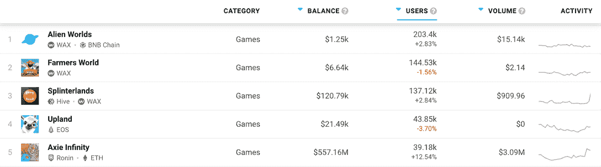

# 5 枚最佳游戏币

> 原文：<https://web.archive.org/web/https://dappradar.com/blog/5-best-gaming-coins>

## 区块链游戏在社区中保持流行

**玩赚游戏相对于 web3 世界的其他游戏来说，有一个******的好时机。但是代币和游戏内 NFT 的价格下降了。因此，现在可能是加入一个项目并成为他们未来的一部分的最佳时机。****

 **web3 的世界可能会经历一段坎坷的时期，但游戏玩家仍然想玩游戏。看看 [DappRadar 的排名页面](https://web.archive.org/web/20220707065149/https://dappradar.com/rankings/category/games)中七天的用户数，我们可以看到参与度仍然很高。

[DappRadar’s game rankings](https://web.archive.org/web/20220707065149/https://dappradar.com/rankings/category/games)

看一个代币过去的表现并不是判断是否购买它以期望将来升值的最佳方法。当你决定把资源放在哪里时，选择一个你认为经得起时间考验的项目是一个更好的选择。

*要想知道哪些游戏在未来会表现良好，你可以[注册 DappRadar PRO](https://web.archive.org/web/20220707065149/https://dappradar.com/token/pro) 来阅读我们深入的[游戏指南](https://web.archive.org/web/20220707065149/https://dappradar.com/blog/the-ultimate-guide-to-playing-games-earning-crypto)。*

请记住，当炒作平息下来，真正的信徒是唯一剩下的，这是最好的产品将仍然存在。把噪音和事实分开是很重要的。

因此，在这个列表中，我们选择了用户数量最高的游戏，我们认为这些游戏在未来很有可能蓬勃发展。

## 外星世界

《异形世界》刚刚发布了一系列新的任务和 NFT，让它的社交元宇宙更加互动。如果区块链世界此刻正在崩溃，没有人告诉这些游戏开发者。

> 《异形世界》发布了一系列新的任务和 NFT，因为社交元宇宙计划为其生态系统的成员提供更身临其境的体验。
> 
> 自己去看看:抓住一艘宇宙飞船，Vrooooooooom 进入[#外星人世界](https://web.archive.org/web/20220707065149/https://twitter.com/hashtag/AlienWorlds?src=hash&ref_src=twsrc%5Etfw)[#元宇宙](https://web.archive.org/web/20220707065149/https://twitter.com/hashtag/Metaverse?src=hash&ref_src=twsrc%5Etfw)
> 
> ✮☆[https://t.co/mQpLWcxoHI](https://web.archive.org/web/20220707065149/https://t.co/mQpLWcxoHI)[pic.twitter.com/GKPM2dPCXz](https://web.archive.org/web/20220707065149/https://t.co/GKPM2dPCXz)
> 
> — AlienWorlds (@AlienWorlds) [June 13, 2022](https://web.archive.org/web/20220707065149/https://twitter.com/AlienWorlds/status/1536380849037398017?ref_src=twsrc%5Etfw)

Source: Twitter

粉丝们仍然蜂拥而至，在这个建立在区块链蜡像上的虚拟世界里玩耍。《外星世界》有六个区域，每个区域有 500 块土地。

玩家可以通过各种方式获得游戏内的象征延龄草(TLM)。从你拥有的土地上获利是一种方式。赌注、交易和采矿是将你的时间变成现金的其他方法。

*查看当前代币价格:*

 *## 农民世界

在[农民世界](https://web.archive.org/web/20220707065149/https://dappradar.com/wax/games/farmers-world)中，玩家使用能量和工具获取各种资源。无论是木材、食物、黄金还是动物，它们都可以在二级市场上出售。持有人可以把它变成真钱。

回到 2022 年 2 月，在农民世界(Farmers World)开始做一名金矿工人需要大约 1500 美元到 2000 美元。仅仅是购买一台采矿挖掘机，用户就需要支付 1600 美元。现在，你可以用不到 1 美元买到一个。

价格下跌对一些人来说是坏消息。但对于任何希望进入一个可能在几年内复苏的市场的人来说，现在可能是介入的时候了。游戏货币 FWW 较其 ATH 下跌了 96.8%。如果你相信这个项目，现在是时候开始玩了。

*查看当前代币价格:*

 *## 夹板岛

在过去的 24 小时内，有超过 137，000 个独特的活动钱包与[夹板地](https://web.archive.org/web/20220707065149/https://dappradar.com/multichain/games/splinterlands)互动，这款游戏显然仍能吸引观众。这是 web3 中最具收藏价值的交易卡游戏。

基于 [Hive](https://web.archive.org/web/20220707065149/https://dappradar.com/rankings/protocol/hive/category/games) 和 [WAX](https://web.archive.org/web/20220707065149/https://dappradar.com/rankings/protocol/wax/category/games) 网络，Splinterlands 最近的验证器节点许可销售在 11 分钟内售罄。该平台经常在 DappRadar 的全区块链游戏排名中名列前五。

[https://web.archive.org/web/20220707065149if_/https://www.youtube.com/embed/PXj7594jgaM?feature=oembed](https://web.archive.org/web/20220707065149if_/https://www.youtube.com/embed/PXj7594jgaM?feature=oembed)

Splinterlands trailer

Splinterlands 的 SPS token 较 2021 年 7 月 1.07 美元的高点下跌了 94.6%。但随着游戏成功维持了大量的追随者，现在可能是加入并开始玩游戏的正确时间。

*查看当前令牌价格:* [*SPS*](https://web.archive.org/web/20220707065149/https://dappradar.com/hub/token/bsc/SPS/BNB?from=0x1633b7157e7638c4d6593436111bf125ee74703f)

## 山地

高地是领先的区块链元宇宙平台之一，玩家可以在这里工作、创作和赚钱。在过去的 30 天里，有近 250，000 个不同的活动钱包与 dapp 互动，这个社区仍然足够大，足以维持一个可行的经济。

高地虚拟世界被映射到现实世界的位置，所有这些都在美国。在游戏中，你可以购买，升级和出售 NFT 的财产。假以时日，你可以把这些变成游戏中的生意，从中你可以获得真正的收入。

[https://web.archive.org/web/20220707065149if_/https://www.youtube.com/embed/ERNn35_iqtE?feature=oembed](https://web.archive.org/web/20220707065149if_/https://www.youtube.com/embed/ERNn35_iqtE?feature=oembed)

What is Upland?

2019 年推出的 UPX 令牌在其一生中经历了风风雨雨。但由于仍有如此多的人在玩这个游戏，未来很长一段时间情况都很好。

*查看当前代币价格:*

 *## 无限轴

Axie Infinity 在游戏收入方面的领先地位今年遇到了麻烦。破纪录的黑客攻击打击了用户的信心。游戏内经济的[问题](https://web.archive.org/web/20220707065149/https://dappradar.com/blog/axie-lunar-event-ending-february-20th)导致了 NFT 和硬币价格的下跌。

从那以后，情况有所改善。Axie Infinity [最近以每块超过 130 ETH 的价格出售了几块土地](https://web.archive.org/web/20220707065149/https://dappradar.com/blog/axie-infinity-land-nfts-attract-new-investments)，它仍然每月吸引大量玩家。仅在过去 30 天，就有超过 770，000 个独特的活动钱包连接到 dapp。

[https://web.archive.org/web/20220707065149if_/https://www.youtube.com/embed/X2z_YIeettE?feature=oembed](https://web.archive.org/web/20220707065149if_/https://www.youtube.com/embed/X2z_YIeettE?feature=oembed)

Axie Infinity: Origin trailer

游戏中的货币 AXS 比 164.90 美元的历史高点低了 91%。因此，即使每一枚硬币仍不在廉价品中，它们也比以前便宜多了。此外，购买所需的三个轴来玩游戏现在更实惠了。你现在可以花不到 10 美元买一套。

*查看当前代币价格:*

 *## 研究是关键

正如我们在 DappRadar 常说的，进行你自己的研究，这样你就能找到适合你的方法。使用我们的专业游戏指南[玩游戏&赚取密码](https://web.archive.org/web/20220707065149/https://dappradar.com/blog/the-ultimate-guide-to-playing-games-earning-crypto)的指针，在哪里开始寻找。

我们的[游戏排名页面](https://web.archive.org/web/20220707065149/https://dappradar.com/rankings/category/games)也有助于查看目前哪些游戏最受欢迎，我们的 [NFT 浏览器](https://web.archive.org/web/20220707065149/https://dappradar.com/hub/nft-explorer)将帮助你判断一个收藏的真正价值。

然而最重要的是，任何投入时间和资源进行投资的人都应该为自己做出了正确的选择而高兴。因此，参与一个项目，与志同道合的人交谈，了解最新消息，保持消息灵通。

 NewsletterUnsubscribe at any time. [T&Cs](https://web.archive.org/web/20220707065149/https://dappradar.com/terms) and [Privacy Policy](https://web.archive.org/web/20220707065149/https://dappradar.com/privacy-policy)******