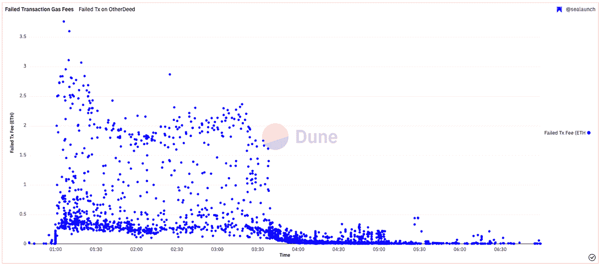
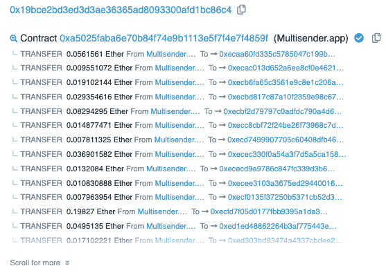
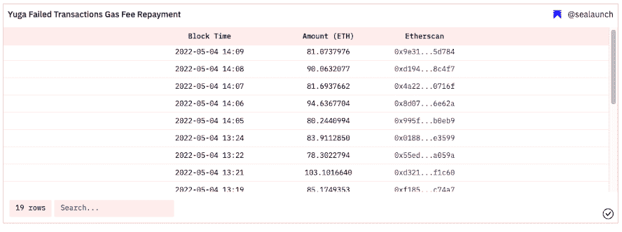

# 失败的他方交易的 500 万美元退款–您有资格吗？

> 原文：<https://web.archive.org/web/https://dappradar.com/blog/5-million-refund-failed-otherside-transactions-are-you-eligible>

## 天然气费用的最高损失金额为 5.369 ETH，约合 16，000 美元

宇迦实验室向客户发放了近 500 万美元的退款，以补偿 4 月 30 日另一方 NFT 土地出售导致的交易失败所产生的天然气费用。值得注意的是，一次失败的交易导致没有铸币，留下了许多不高兴的客户，他们不希望天然气达到这样的水平。

“彼岸”土地销售在 NFT 社区创造了前所未有的炒作水平，因此宇迦实验室创造了一个 KYC 门控销售。尽管采取了预防措施，以太坊上的网络拥塞变得如此糟糕，以至于人们为一笔交易支付高达 11，000 美元。其中一些交易由于网络拥塞而失败，导致客户两手空空。谢天谢地，宇迦实验室站出来给他们退款。然而，有一些合格的标准。

## 摘要

*   宇迦实验室 Otherdeeds NFT 土地销售公司将以太坊的天然气费用推上了屋顶，导致 14000 笔交易失败，导致近 500 万美元的天然气费用损失
*   宇迦使用 Multisender 写作，在瑞士联邦理工学院获得了 460 万美元的回报

## 14，000 次失败的交易

压倒性的需求和土地销售的成功导致 11，828 个钱包中超过 [14，000 笔失败交易](https://web.archive.org/web/20221130030524/https://dune.com/sealaunch/Failed-Transactions-Gas-Cost-on-Otherdeed-Mint)，导致在撰写本文时损失了 480 万美元的汽油费。

天然气费用的最高损失金额为 5.369 埃及镑，约 16，000 美元，而单笔交易的最高损失金额为 3.76 埃及镑，约 11，000 美元。宇迦正在使用 [Multisender 应用程序](https://web.archive.org/web/20221130030524/https://dappradar.com/ethereum/other/token-multisender)返还资金，这是一个有用的工具，允许将多个交易批量化为一个交易，如下所示。

从 5 月 4 日开始，宇迦实验室在 19 次交易中发出了超过 1589 个 ETH，价值约 460 万美元。快速看一下几个收件人的钱包，就知道 ETH 已经寄出，宇迦实验室也兑现了承诺。

## 如何检查你是否得到退款

如果你是受影响的人之一，你可以几步检查你的钱包，看看宇迦实验室是否退还了损失的汽油费。

1.  转到 [Etherscan.io](https://web.archive.org/web/20221130030524/http://etherscan.io/)
2.  在搜索栏中输入您的钱包地址
3.  点击“内部事务”
4.  他们从 [Multisender.app](https://web.archive.org/web/20221130030524/https://dappradar.com/ethereum/other/token-multisender) 处退款。如果您有多次失败的交易，他们会将退款合并到一次交易中。
5.  注意安全。退款在 ETH，通过 [Multisender.app](https://web.archive.org/web/20221130030524/https://dappradar.com/ethereum/other/token-multisender) 发出。

*   不要与你钱包里的任何你不期望的代币互动。也不要点击它们，也不要试图删除它们。
*   不要将你的钱包连接到任何声称可以退款的网站。

如果您有任何问题，请前往[http://discord.gg/the-otherside](https://web.archive.org/web/20221130030524/https://t.co/F3QQuPiwch)的 Otherside Discord 或联系[【电子邮件保护】](/web/20221130030524/https://dappradar.com/cdn-cgi/l/email-protection)

## 向前和向上

在可以被描述为迄今为止最令人期待的 NFT 下跌之后，一些关键的事情被留在桌面上进行辩论。首先，NFT 系列几乎让以太坊屈服。其次，成千上万满怀希望的买家两手空空，比开始时更穷。这发生在区块链以太坊挤满了密码猫五年多之后。可以肯定地说，这对那些叫嚣以太坊可扩展性的人来说是一个警钟。

Otherdeeds 的薄荷带着有点苦乐参半的经历离开了 NFT 市场。一方面，令人印象深刻的是，宇迦实验室在仅仅一年的时间里创建了一个 Web3 公司的品牌，成为世界上最排外的社区之一。这一下降为宇迦提供了来自直接销售的 3.4 亿美元的 APE 和来自二级市场交易的 15 万 ETH(4.2 亿美元)的至少 2100 万美元的创作费。Otherside 将宇迦实验室定位于探索游戏和 Web3 元宇宙之间激动人心的融合的最前沿。

问题仍然是，车队是否可以采取不同的方式来避免 55，000 ETH(约 1.5 亿美元)。)烧焦了。此外，该事件让 Web3 社区审视未来交付 NFT 滴滴的最佳方式。尽管如此，销售情况向我们表明，NFT 市场正在走向成熟。仅在 4 月份，NFT 的交易量就超过了 60 亿美元，这股热潮远未结束。最具创新精神的品牌正在引领 NFTs 的漫漫长路。

 NewsletterUnsubscribe at any time. [T&Cs](https://web.archive.org/web/20221130030524/https://dappradar.com/terms) and [Privacy Policy](https://web.archive.org/web/20221130030524/https://dappradar.com/privacy-policy)

* * *

*以上不构成投资建议。此处给出的信息仅供参考。请行使尽职调查，做你的研究。作者持有多种加密货币的头寸，包括 BTC、瑞士法郎和雷达。*