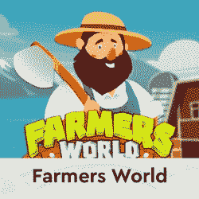
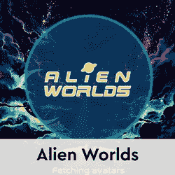
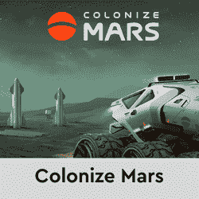

# 5 个新的 NFT 蜡上游戏，让你赚取加密奖励

> 原文：<https://web.archive.org/web/https://dappradar.com/blog/5-new-nft-games-on-wax-that-let-you-earn-crypto-rewards>

## 浏览列表，并在 WAX 上找到您最喜欢的“玩即赚”游戏

NFT 游戏正在接管加密领域，而 WAX 是新游戏平台越来越受欢迎的温床。尽管 NFT 空间仍处于早期阶段，但它已经成为吸引投资和创新的强大磁石。因此，旨在支持不可替代令牌(NFT)的区块链协议具有强大的增长潜力。

全球资产交易所(WAX)是目前业内顶尖的区块链协议之一，承诺让交易变得更容易、更快捷、更安全。它还支持各种分散的应用程序、市场，以及最重要的 NFTs。

这些只是 NFT 游戏设计师越来越被这个平台吸引的部分原因。在本帖中，我们来看看五款引起我们注意的游戏。

## 拉格纳洛克的记录

《仙境传说的记录》是一款 NFT 电子游戏，灵感来自一部同名动画系列(也被称为《瓦尔基里之松》或《末日瓦尔基里》)。这个故事围绕着神和人之间的冲突展开，在这个故事中，人类历史上 13 个著名的人与来自不同神话的 13 个最强大的神展开了战斗。

英雄、装备和卡包都由 NFT 卡代表，除了怪物。除了 NFTs，游戏还使用了三种数字货币。

SSC(金币)令牌用于升级 NFT 英雄和装备，召唤 NFT，并通过游戏的道进行管理。SSS(水晶石)可以用来升级和修理 NFT 设备。最后，SSR(游戏符文)令牌用于更新和恢复 NFT 英雄。

[https://web.archive.org/web/20221007162520if_/https://www.youtube.com/embed/8pd0RijIPNQ?feature=oembed](https://web.archive.org/web/20221007162520if_/https://www.youtube.com/embed/8pd0RijIPNQ?feature=oembed)

## 龙之谷

在[龙之谷](https://web.archive.org/web/20221007162520/https://dappradar.com/wax/games/dragons-valley)，用户通过空投或者在 WAX 的[原子市场](https://web.archive.org/web/20221007162520/https://dappradar.com/multichain/marketplaces/atomicmarket)中心获得鸡蛋。这些蛋然后在巢穴或孵化器中孵化成龙，之后它们通过与地精战斗获得经验值。

龙可以被训练、成长和进化到它们的终极形态，这样它们就可以保卫龙之谷免受妖精王的入侵。通过与地精战斗，龙从宝藏守护者 Snag 那里获得代币和 NFT 奖励。所有的龙都由独特而珍贵的 NFT 人物卡片代表，根据四种元素——水、火、风和土——具有不同的特征。

游戏使用 DVG(龙之谷宝石)解锁小队，孵化器，炼金术槽，以及充电能量。它可以通过 Alcor exchange 门户进行交换。龙之谷也使用 DMD(龙之尘),它在赢得战斗后被分配给训练者，并可以通过 Alcor 交换。DMD 可以用于解锁新的小队和孵化槽，在炼金术模式下获得 DVG，以及其他活动。

[https://web.archive.org/web/20221007162520if_/https://www.youtube.com/embed/J53v73QPAA4?feature=oembed](https://web.archive.org/web/20221007162520if_/https://www.youtube.com/embed/J53v73QPAA4?feature=oembed)

## goldman 先生

《黄金指令》设定在未来，为三个不同星球上的三个不同物种呈现了三个不同的场景。这三个星球的共同点是存在一个高度智慧的外星物种，它帮助在所有三个星球上保存生命，以换取某些资源。

不同场景的游戏机制也是相似的——玩家选择他们的物种，挑选一个星球和合适的土地，然后开始采矿。玩家需要监控他们使用的资源，如果他们愿意，可以和其他玩家进行交易。他们可以开采土地，制造工具，甚至为游戏的 PVP 阶段创造一支军队。

可以开采的主要资源包括 GMF(食物)、GME(能源)、GMM(矿产)和 GMD(黄金，当地货币)代币。工具、护身符、土地和角色都用 NFTs 来表示。

[https://web.archive.org/web/20221007162520if_/https://www.youtube.com/embed/t9EyZnr31No?feature=oembed](https://web.archive.org/web/20221007162520if_/https://www.youtube.com/embed/t9EyZnr31No?feature=oembed)

## NOA 游戏

在 [NOA 游戏](https://web.archive.org/web/20221007162520/https://dappradar.com/wax/games/noa-game)中，用户可以用独一无二的英雄和支持卡建造强大的卡牌，指挥他们的队伍进入地牢战斗，并获得有价值的奖励。这些奖励有不可替换和可替换两种形式，可以通过完成每日或每周的任务获得。

所有的卡都由 NFT 代表，可以通过游戏内的锻造升级到更高的稀有程度，以进一步提高玩家的战斗能力。这副牌由 16 张英雄牌和 10 张支援牌组成，而游戏从战场上随机放置的四张英雄牌开始。

每当一个英雄的生命值降到 0 时，就会抽取一张新的英雄牌，直到牌堆里没有牌了。战场上至少有一张英雄卡的玩家获胜，获得 NOA 代币作为奖励。幸运的人还将获得稀有战利品来升级他们的卡，专属英雄，助推器，魅力，等等。

[https://web.archive.org/web/20221007162520if_/https://www.youtube.com/embed/l_VcRHLHxD8?feature=oembed](https://web.archive.org/web/20221007162520if_/https://www.youtube.com/embed/l_VcRHLHxD8?feature=oembed)

## 背井离乡；远离家乡

一款即将推出的 NFT 太空元宇宙 PVP 游戏[远离家乡](https://web.archive.org/web/20221007162520/https://dappradar.com/wax/games/far-from-home)承诺在不断扩张的宇宙中进行开放世界的多人冒险。到目前为止，除了这些基础知识和一张路线图之外，人们对这款游戏知之甚少。

目前，用户可以注册并申请有机会赢得免费的 NFT 宣传片和支持包，而在未来，将通过游戏内的活动找到稀有的 NFT 收藏。

主要的游戏令牌 Soren 在年初发布，同时推出了远离家乡的赌注平台。这款游戏也被列入 AtomicHub 的白名单，随后推出了其 Discord 服务器。接下来的步骤包括浏览器游戏启动、PVP 对战比赛发布、游戏内装备、人物、土地、高级资产的预售。

> 游戏内预览:程序宇宙的第一站。
> 
> 关注我们，转发、评论您的蜡像地址&标记 3 位朋友，有机会赢得一份免费的 [#NFT](https://web.archive.org/web/20221007162520/https://twitter.com/hashtag/NFT?src=hash&ref_src=twsrc%5Etfw) /推广包
> 
> 感谢您的参与！[# WAX](https://web.archive.org/web/20221007162520/https://twitter.com/hashtag/WAX?src=hash&ref_src=twsrc%5Etfw)[# WAXP](https://web.archive.org/web/20221007162520/https://twitter.com/hashtag/WAXP?src=hash&ref_src=twsrc%5Etfw)[# WAX gaming](https://web.archive.org/web/20221007162520/https://twitter.com/hashtag/WAXgaming?src=hash&ref_src=twsrc%5Etfw)[# NFTart](https://web.archive.org/web/20221007162520/https://twitter.com/hashtag/NFTart?src=hash&ref_src=twsrc%5Etfw)[# NFT collector](https://web.archive.org/web/20221007162520/https://twitter.com/hashtag/NFTcollector?src=hash&ref_src=twsrc%5Etfw)[# FreeNFT](https://web.archive.org/web/20221007162520/https://twitter.com/hashtag/FreeNFT?src=hash&ref_src=twsrc%5Etfw)[# Crypto](https://web.archive.org/web/20221007162520/https://twitter.com/hashtag/Crypto?src=hash&ref_src=twsrc%5Etfw)[#区块链](https://web.archive.org/web/20221007162520/https://twitter.com/hashtag/Blockchain?src=hash&ref_src=twsrc%5Etfw)[# NFT](https://web.archive.org/web/20221007162520/https://twitter.com/hashtag/NFT?src=hash&ref_src=twsrc%5Etfw)[pic.twitter.com/kaWqnwu5dp](https://web.archive.org/web/20221007162520/https://t.co/kaWqnwu5dp)
> 
> — Far From Home (@FarFromHomeNFT) [December 9, 2021](https://web.archive.org/web/20221007162520/https://twitter.com/FarFromHomeNFT/status/1469075336453308419?ref_src=twsrc%5Etfw)

## NFT 游戏让你一边玩一边赚钱

以太坊、BSC 和 Polygon 远远不是唯一一个举办雄心勃勃的 NFT 游戏项目的区块链。WAX 凭借《异形世界》和《农民世界》等项目，在 NFT 顶级游戏开发领域占据了一席之地。

随着这些庞然大物继续吸引大量观众，新项目变成了蜡像。其中一些游戏仍在开发中，而另一些已经提供了通过玩来赚钱的选项。所以，如果你想赶上潮流，成为第一批利用这些赚钱机会的人，今天就注册吧。你可以在这里浏览整个游戏生态系统。此外，您可以访问 DappRadar 上的完整[蜡排名](https://web.archive.org/web/20221007162520/https://dappradar.com/rankings/protocol/wax)，浏览协议的所有可能性。

如果你想了解更多关于区块链世界、NFT 游戏和其他与密码相关的发展，一定要在 Twitter 上关注 DappRadar。也欢迎您加入独家 [DappRadar PRO](https://web.archive.org/web/20221007162520/https://dappradar.com/token/pro) 社区，参与 [Discord](https://web.archive.org/web/20221007162520/https://discord.gg/4ybbssrHkm) 讨论，并从最新的 DeFi 统计数据中受益。

[<picture></picture>](https://web.archive.org/web/20221007162520/https://dappradar.com/wax/games/farmers-world)[<picture></picture>](https://web.archive.org/web/20221007162520/https://dappradar.com/wax/games/alien-worlds-1)[<picture></picture>](https://web.archive.org/web/20221007162520/https://dappradar.com/rankings/protocol/wax/category/games) NewsletterUnsubscribe at any time. [T&Cs](https://web.archive.org/web/20221007162520/https://dappradar.com/terms) and [Privacy Policy](https://web.archive.org/web/20221007162520/https://dappradar.com/privacy-policy)