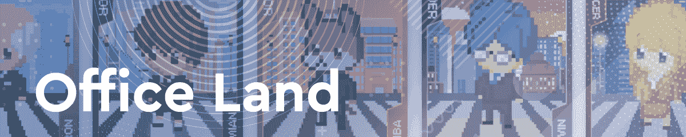
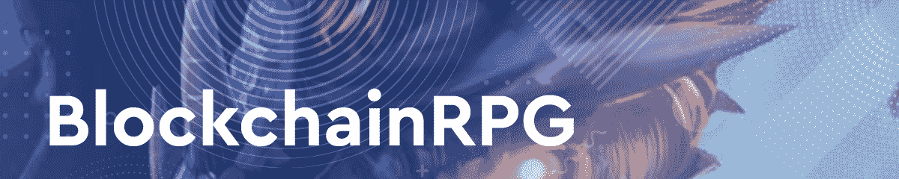
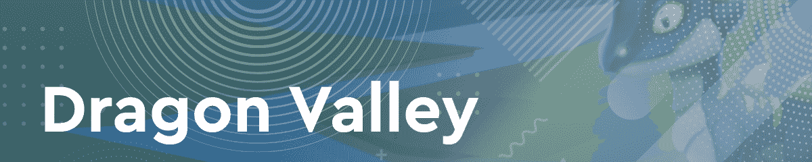
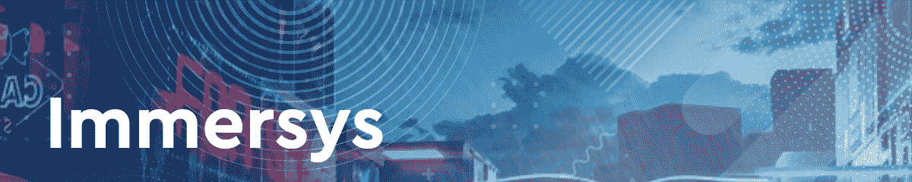
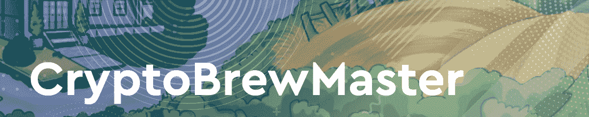

# Wax 上的 5 场即玩即赚游戏成为焦点

> 原文：<https://web.archive.org/web/https://dappradar.com/blog/5-play-to-earn-games-on-wax-step-into-the-spotlight>

## Wax 拥有一些迄今为止最成功的游戏赚取平台，但后起之秀也在地平线上

“玩即赚”游戏正在稳步寻找新的观众，蜡像区块链已经被证明是这类项目的合适主持人。在这篇文章中，我们来看看五个有前途的蜡为基础的游戏赚取的目标是在游戏排名中名列前茅。

随着区块链空间在 2022 年开始新的道路，从玩到赚运动继续获得牵引力。2021 年下半年观察到的积极趋势将在新年的头几周变得强劲。着眼于未来，这五个项目最近取得了令人印象深刻的成果，并正在成为蜡像游戏领域的下一个大热门。事不宜迟，这里有五款 Wax 上的游戏，将于 2022 年推出。

## 立即查看 Wax 上的“玩即赚”游戏

办公用地允许玩家创建自己的企业，并从头开始建设。以各种 NFT 角色的形式雇佣员工，并雇佣他们使你的企业尽可能成功。

该平台由本地 OCOIN 提供支持。企业主将任务分配给他们的 NFT 员工，当任务完成时，他们将获得 OCOIN 奖励。员工 NFT 有六种不同的稀有类型，最稀有的提供最快的任务完成时间和最高的奖励。

BlockchainRPG 是一款基于狩猎的角色扮演游戏(RPG)，允许冒险者在各种独特的狩猎场狩猎，以平台原生令牌黄金的形式寻找财富。

此外，玩家可以搜索宝藏，如制作材料或装备角色的物品。这些物品增加了角色的属性，并允许玩家更有效地狩猎，从而增加了他们获得黄金的机会。重要的是，玩家要时刻关注自己的生命值。他们探索 BlockchainRPG 宇宙越多，他们的健康状况就越差。

龙之谷是一个可爱的蜡像战斗游戏，玩家可以孵化自己的龙，并面对巨魔赢得奖励。奖励来自平台的原生令牌龙魔尘(DMD)。龙之谷让玩家有机会训练他们的龙新技能，装备物品，并提高他们的奖励潜力。

有几种不同类型的龙蛋，都有不同的孵化率和随后的能力。这允许玩家在他们的游戏团队中有多样性，并且在战斗策略中，他们可以用来对抗巨魔。龙之谷还整合了龙之谷宝石(DVG)令牌，允许玩家购买额外的孵化槽，并为能量槽充电以更频繁地战斗。

Immersys 将元宇宙和虚拟世界的宣传带到了区块链蜡像馆。该平台旨在提供身临其境的虚拟体验，让玩家享受基于区块链的全方位功能。从交易 NFT 和数字资产到从基于加密货币的游戏经济中获益。

Immersys 虚拟世界非常依赖 NFTs 作为验证方法。NFTs 可以开放世界上的限制区域，允许访问独家活动和内容。重要的是，Immersys 旨在创造一个自给自足的创作环境，艺术家和粉丝可以通过蜡像区块链进行合作和互动。

最后但并非最不重要的是，我们有 CryptoBrewMaster，一个基于蜡的啤酒酿造游戏。这个游戏也存在于区块链蜂巢上，但是现在希望在 Wax 上找到更多的观众。收集各种成分(以 NFTs 的形式)并酿造最好的啤酒。参加酿造比赛，赢取本地 CBM 代币奖励。

重要的是，该平台还使用 ASH token 作为游戏内货币。ASH 允许你租借酿造设备，或者进入讲堂的酿造大师班。CryptoBrewMaster 为玩家提供了一种有趣的互动方式来学习和体验啤酒酿造技术和风格。更重要的是，游戏中的所有资产都是以蜡质 NFT 的形式呈现的。玩家可以在原子市场等二级市场进行交易。

## Wax 正在成为一个游戏中心

蜡像区块链一直是采矿游戏《外星世界》的故乡。这可能是所有协议中最受认可的玩赚采矿游戏，经常达到 DappRadar 顶级游戏第一名的位置。

然而，随着游戏挣钱运动的推进，Wax 吸引了越来越多的开发者。Wax 提供闪电般的交易和难以置信的可访问的 Wax cloud 钱包集成。这使得该协议非常适合托管游戏 dapps。此外，已经开发的支持 dapps 的生态系统，如 Atomic Hub 和 Atomic Market，允许玩家轻松地交易和购买众多基于 Wax 的游戏的游戏内资产。

DappRadar 将继续关注 Wax，因为更多的游戏加入了该协议。如果你也想获得最新的区块链数据，请查看 DappRadar PRO。它还能让你接触到专门针对 NFT 的[不和](https://web.archive.org/web/20220630132925/https://discord.gg/4ybbssrHkm)频道和讨论。

 NewsletterUnsubscribe at any time. [T&Cs](https://web.archive.org/web/20220630132925/https://dappradar.com/terms) and [Privacy Policy](https://web.archive.org/web/20220630132925/https://dappradar.com/privacy-policy)