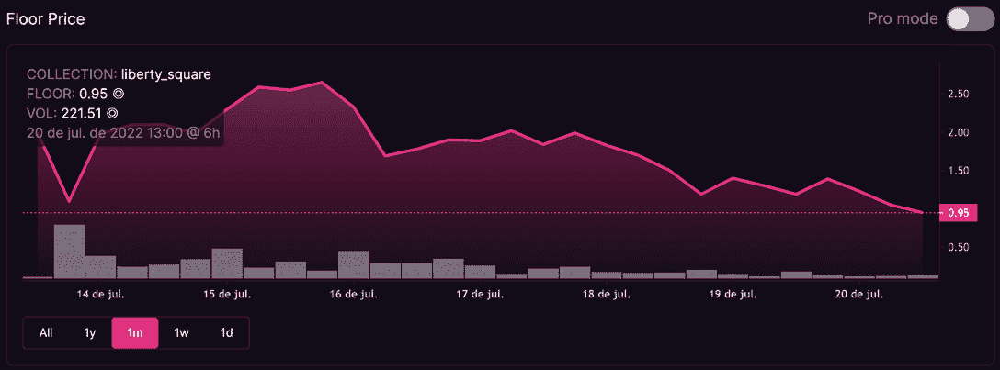
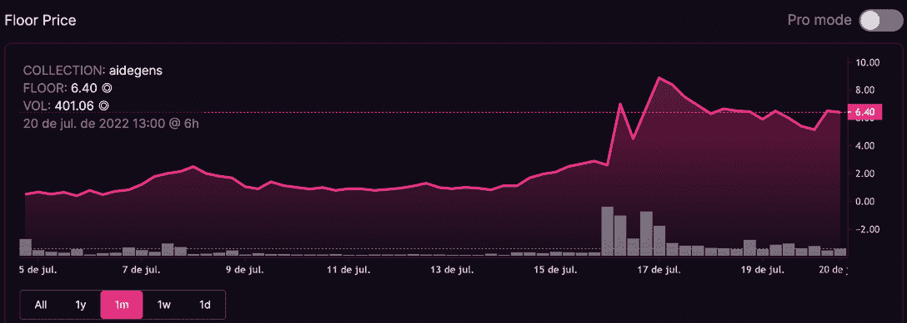
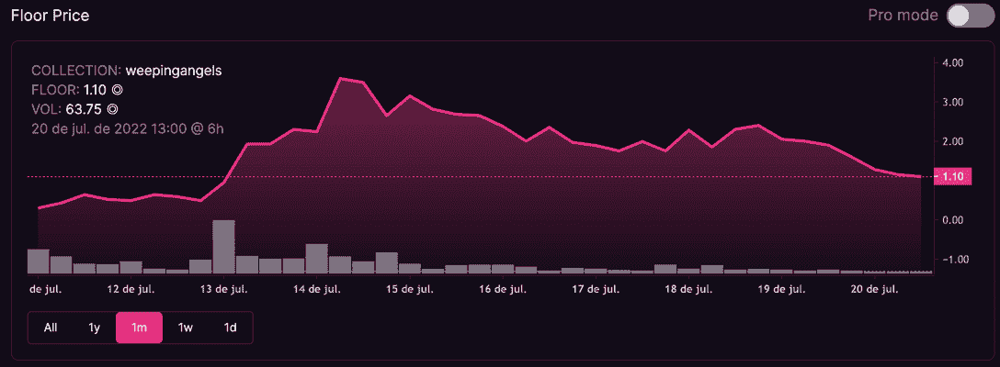
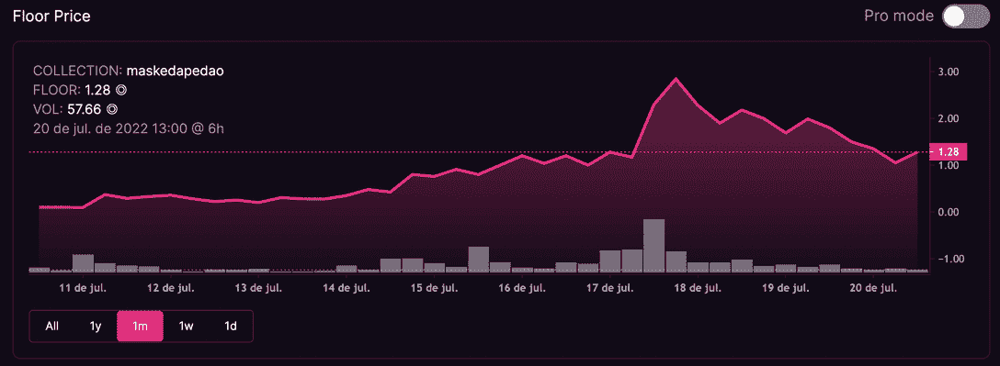
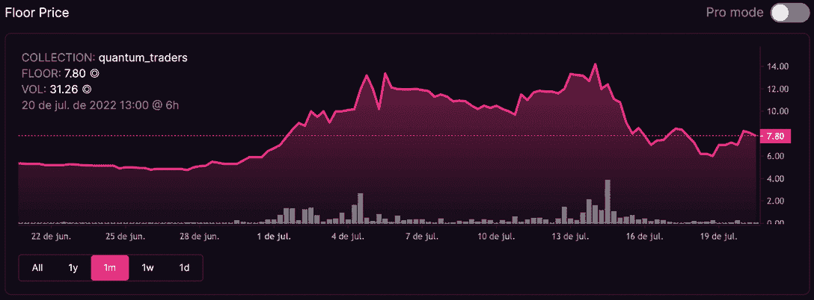
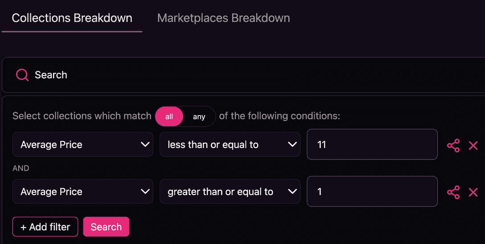

# Solana 上 5 个价格低于 500 美元的 NFT 流行系列

> 原文：<https://web.archive.org/web/https://dappradar.com/blog/5-popular-nft-collections-under-500-on-solana>

## 在 NFT 的下一波炒作变得疯狂之前，赶快行动吧

随着数字收藏品的崇拜者开始探索以太坊之外的非功能性艺术，索拉纳上的 NFT 收藏品最近吸引了更多的注意力。虽然有些正在成为 Solana 上第一批标价 2 万美元的蓝筹系列，但其他一些售价不到 500 美元，可能很快就会加入当前流行的系列。

## Solana 上 5 个价格低于 500 美元的 NFT 流行系列

编写时的 SOL 价格为 **$44** ，项目按七天交易量最高的顺序排列在前。

Screenshot Taken 2022-07-20 at 17:57

请注意:以下内容不是投资建议，而是如何使用可靠的数据指标发现潜在客户的指南。

### 1.自由广场:邪恶的松鼠集团

*   收藏 9499
*   过去 24 小时的 NFT 平均售价:1.45 索尔/**；63.8 美元**
*   7 日交易量:28710.29 索尔/1263252.76 美元

### 2.艾德根斯

*   3333 的收藏
*   过去 24 小时 NFT 平均售价:9.47 索尔/**；416.68 美元**
*   7 日交易量:20096.46 索尔/8，842，44.24 美元

### 3.哭泣的天使

*   未知的集合大小
*   过去 24 小时 NFT 平均售价:1.36 索尔/**；59.84 美元**
*   7 日交易量:7166.40 索尔/315，321.6 美元

### 4.假面猿刀

*   收藏 4444
*   过去 24 小时的 NFT 平均售价:1.19 索尔/**；52.36 美元**
*   7 日交易量:7142.24 索尔/314，258.56 美元

### 5.量子交易员

*   未知的集合大小
*   过去 24 小时的 NFT 平均售价:7.51 索尔/**；330.44 美元**
*   7 日交易量:5877.66 索尔/258，617.04 美元

## 如何在 Solana 上找到 500 美元以下的热门 NFT 系列？

使用领先的[索拉纳 NFT 市场魔术伊甸园](https://web.archive.org/web/20220927120036/https://magiceden.io/)我们可以放大吸引七天交易量高水平的特定集合。

这是一个迹象，表明随着买家和卖家的交易，一个收藏正在引起人们的兴趣。

值得注意的是，我们将放大平均价格范围在 1 至 11 索尔之间的项目，这些项目在撰写时的预算在 44 至 484 美元之间。

这种方法可以重复应用到[Magic Eden analytics explorer](https://web.archive.org/web/20220927120036/https://dappradar.com/solana/marketplaces/magic-eden)中，以找到 500 美元以下的最新潜在客户。

只需通过交易量进行筛选，并在适当的预算中突出项目。

## 用 DappRadar 跟踪 Solana dapps

对 Solana NFTs 感兴趣？然后你必须查看我们在 DappRadar 博客上的文章[如何交易索拉纳 NFTs](https://web.archive.org/web/20220927120036/https://dappradar.com/blog/how-to-trade-solana-nfts) 。

我们将继续密切关注最优秀的 NFT 项目。请关注我们的[达普拉达 NFT 排名](https://web.archive.org/web/20220927120036/https://dappradar.com/nft/protocol/solana)以保持领先地位。

如果你想进一步了解令人兴奋的去中心化应用世界中的最佳项目，请关注我们的[博客](https://web.archive.org/web/20220927120036/https://dappradar.com/blog/)、 [YouTube](https://web.archive.org/web/20220927120036/https://www.youtube.com/c/DappRadar) 频道和 [Twitter](https://web.archive.org/web/20220927120036/https://twitter.com/dappradar) 。

***以上不构成投资建议。此处给出的信息仅供参考。请行使尽职调查，做你的研究。作者持有多种加密货币的头寸，包括 BTC、瑞士法郎和雷达。***

[<picture></picture>](https://web.archive.org/web/20220927120036/https://dappradar.com/blog/what-are-non-fungible-tokens-nfts)[<picture></picture>](https://web.archive.org/web/20220927120036/https://dappradar.com/nft/marketplaces)[<picture></picture>](https://web.archive.org/web/20220927120036/https://dappradar.com/nft/sales)