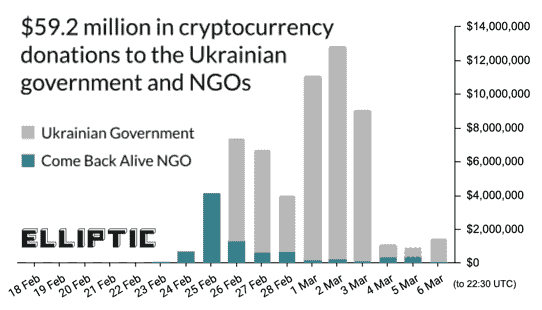
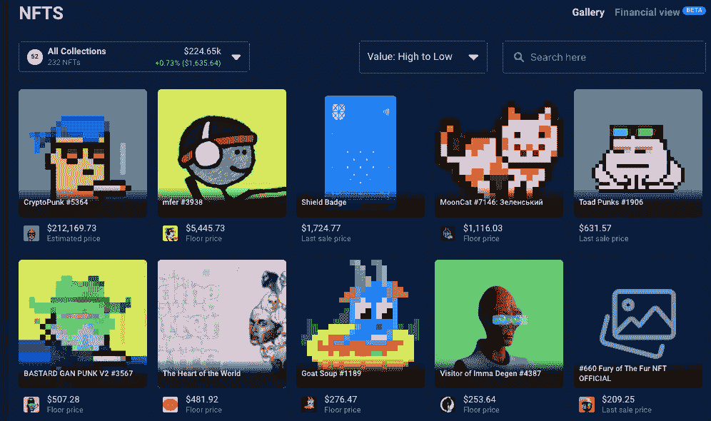
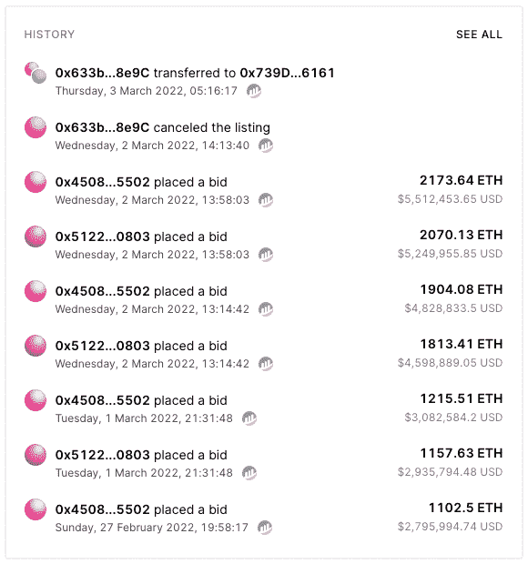
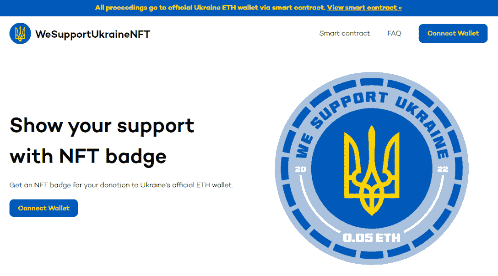
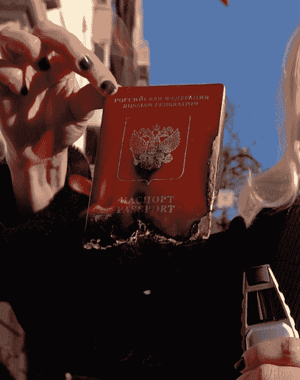
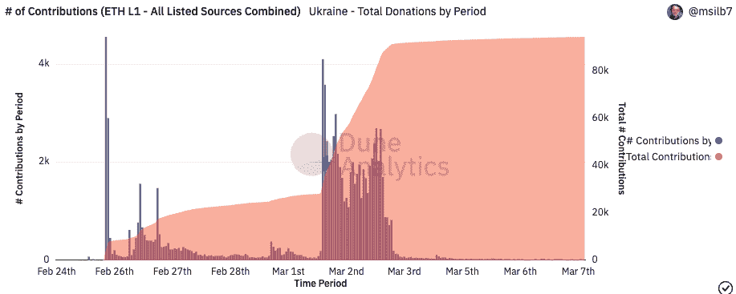
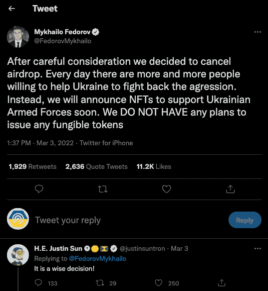
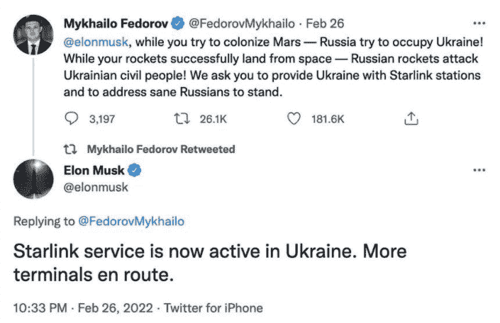

# 5900 万美元，还在攀升:加密社区继续支持乌克兰

> 原文：<https://web.archive.org/web/https://dappradar.com/blog/59-million-and-climbing-crypto-community-continues-support-for-ukraine>

## 自战争开始以来，已有 100 多万难民逃离乌克兰

**crypto 社区已经向乌克兰政府捐赠了超过 5900 万美元，这是一个为军方提供支持的非政府组织。随着乌克兰冲突进入自 2022 年 2 月 24 日俄罗斯入侵以来的第二周，ETH、BTC 和其他加密货币的捐赠继续涌入。**

根据区块链分析公司 Elliptic 的数据，乌克兰政府收到的捐款总额为 5030 万美元，而“活着回来”收到了约 900 万美元。

自入侵以来，乌克兰政府和一个为军方提供支持的非政府组织通过超过 118，000 次加密和 NFT 捐款，筹集了 5，920 万美元。筹集到的资金包括 Polkadot 的创始人加文·伍德(Gavin Wood)的一份 580 万美元的礼物，他上周在 Twitter 上要求提供一个点地址来发送资金，以及一部价值超过 20 万美元的 CryptoPunk NFT。此外，我们看到一个[新发布的 mfer NFT 在钱包](https://web.archive.org/web/20221217130015/https://dappradar.com/hub/wallet/eth/0x165cd37b4c644c2921454429e7f9358d18a45e14/nfts)。这些捐赠还包括一笔价值 186 万美元的交易，由密码艺术家 Pak 支付。

使用 DappRadar 投资组合跟踪器查看乌克兰政府官方以太坊钱包

支持军方的乌克兰非政府组织“活着回来”也收到了数百万美元的秘密捐款。这个非政府组织被迫求助于 crypto。2 月 24 日，会员平台 Patreon [宣布，由于其军事活动导致的违规行为，它已经暂停了 return Alive 的页面](https://web.archive.org/web/20221217130015/https://blog.patreon.com/on-the-removal-of-come-back-alive)。

虽然这两个官方渠道肯定是最受大众媒体关注的，但全球各地还有无数其他活动，为这项事业筹集了数百万美元。

## 乌克兰道& NFTs 筹集数百万

乌克兰岛，一个由 Pussy Riot 的 Nadya Tolokonnikova、Trippy Labs 和 PleasrDAO [创建的分散自治组织，众筹了](https://web.archive.org/web/20221217130015/https://etherscan.io/address/0x633b7218644b83d57d90e7299039ebab19698e9c)2188 ETH(ETH)，或 550 万美元，用于 1/1 [乌克兰国旗 NFT](https://web.archive.org/web/20221217130015/https://twitter.com/Ukraine_DAO/status/1499124170981998592?ref_src=twsrc%5Etfw%7Ctwcamp%5Etweetembed%7Ctwterm%5E1499124170981998592%7Ctwgr%5E%7Ctwcon%5Es1_&ref_url=https%3A%2F%2Fcointelegraph.com%2Fnews%2Fukraine-dao-raises-over-6m-via-nft-sale-to-aid-ukrainian-citizens) 。使其成为[有史以来卖出的最贵的 NFTs】。](https://web.archive.org/web/20221217130015/https://dappradar.com/nft/sales)

NFT 的出售是为了让人们集中资源，集体竞标数字国旗的所有权。贡献者将获得 ERC-20 代币的形式，根据捐赠金额的爱情代币。在编写本报告时，NFT 尚未分裂，资金尚未发放。

乌克兰表示，他们将分配销售收入，以活着回来。然而，他们决定这笔钱将只用于医疗救助，而不是军事装备。

DAOs 无疑需要一个积极的助推器，因为去年主流注意力落在了 ConstitutionDAO 上，该组织筹集了 4000 多万美元，但未能获得他们想要的项目。最近，一位道购买了《沙丘圣经》，这是一部从未制作的沙丘电影的剧本，他错误地认为拥有实物就拥有了内容的知识产权。

乌克兰道展示了一个道在当今世界中的真正力量，当它被正确地应用到一个可以说是简单的前提下。在出售结束后举办的 Twitter Spaces 会议上，Tolokonnikova 表示，其使命是利用加密社区的力量来帮助那些最需要它的人。顾名思义，乌克兰到目前为止是成功的。

## WeSupportUkraineNFT

过去几天出现的另一个倡议是 [WeSupportUkraineNFT 项目](https://web.archive.org/web/20221217130015/http://wesupportukrainenft.com/)。组织者[已经开发了一个智能合同](https://web.archive.org/web/20221217130015/https://etherscan.io/address/0xc8550a172b99e3e7628607904a70e8ec098d5494#code)，这样每次 NFT 销售的钱将直接进入[乌克兰官方的 ETH 钱包](https://web.archive.org/web/20221217130015/https://twitter.com/Ukraine/status/1497594592438497282)，在交易中没有任何其他钱包，以避免浪费任何 ETH 在汽油费上。值得注意的是，智能合约中的捐款每天可以提取一次。

看着团队成员的名字，很容易确定(对作者来说)核心团队是由立陶宛人组成的。波罗的海国家，与亲俄罗斯的白俄罗斯接壤，白俄罗斯在 1991 年前是前苏联的一部分。

NFT 的数量目前是无限的，因为该团队认为每个捐款的人都应该被授予 NFT 徽章。此外，这个前提很简单，给了那些捐款人一个实实在在的提醒，让他们记起自己的善行。可以说，NFT 将变得像一个 POAP 或出席证明 NFT，骄傲的支持者在未来会像昔日的战争英雄一样炫耀他们的徽章。

[向组织](https://web.archive.org/web/20221217130015/https://wesupportukrainenft.com/)捐款，支持乌克兰，在这里获得 NFT。

[<picture></picture>](https://web.archive.org/web/20221217130015/https://wesupportukrainenft.com/)

Donate and earn an NFT badge

## 迪法恩斯销售

随着大型团体纷纷捐款并聚集起来支持乌克兰，拥有坚定思想和道德的个人也在发挥自己的作用。上周，艺术家们在 Rarible 集会上支持乌克兰艺术家，许多收藏品也纷纷抵达，声称要将所有收益捐给这项活动。俄罗斯数字艺术家 Olive Allen 公开焚烧她的俄罗斯护照，并将视频变成 NFT，以示支持。它现在在 NFT 市场上已经卖到了将近 10，000 美元。有趣的是，[被 UnicornDAO](https://web.archive.org/web/20221217130015/https://twitter.com/unicorndao_xyz/status/1500186932021710849) 收购，UnicornDAO 是一个联合起来投资女性和 LGBTQ+创造者的团体。他们现在将如何处理这件物品还不得而知。

## 给予的阴暗面

上周发生的一件令人失望的事情是，当乌克兰政府宣布他们将向捐赠者发放空投物资时，一些人的反应。3 月 3 日公布了一份快照，请看下图；你可以看到人们在 3 月 3 日涌入大量的低价值捐赠，试图获得空投机会。在这种情况下，人们似乎更看重空投而不是帮助。

3 月 4 日，星期四，[乌克兰副总理兼乌克兰数字转型部长米哈伊洛·费多罗夫](https://web.archive.org/web/20221217130015/https://twitter.com/FedorovMykhailo)宣布，他们已经取消了空投，并补充道:“取而代之的是，我们将很快宣布支持乌克兰武装力量的 NFT。我们没有发行任何可替代代币的计划。”有趣的是，TRON 区块链的 Justin Sun 是第一个评论并支持费多罗夫决定的人。

## 技术 vs 蛮力

副总理在筹集和采购乌克兰政府继续有效运作所需的技术方面发挥着举足轻重的作用。乌克兰最年轻的内阁部长正在基辅的一个秘密地点的地下避难所对俄罗斯发动一场数字战争。费多罗夫利用他的武器——社交媒体——敦促大企业的首席执行官切断与俄罗斯的联系。他还采取了前所未有的举措，成立了乌克兰信息技术志愿者军，对敌人发动网络攻击。

迄今收到的大部分捐款来自 BTC 和瑞士联邦理工学院，与美元挂钩的稳定货币也贡献了很大一部分。但是捐赠的不仅仅是加密资产；人们也向乌克兰政府的以太坊账户发送 NFT。

乌克兰运动的很大一部分源于社交媒体巨头 Twitter，其公正和自由的方式有助于揭示真实事件，同时也产生了巨大的捐赠热潮。#cryptoforhumanity 这个标签很有影响力，并得到了币安和他们社区的巨大推动。

币安承诺帮助乌克兰的家庭和儿童，币安慈善机构敦促个人捐款提供帮助。该组织发起了一项救助基金项目，旨在保护乌克兰的儿童、难民和国内流离失所者。在宣布将通过捐赠为持续的乌克兰危机捐赠 1000 万美元后，[币安慈善机构与联合国儿童基金会(Unicef)建立了合作关系](https://web.archive.org/web/20221217130015/https://twitter.com/BinanceBCF/status/1498003467729838083?s=20&t=c16Xwbj-kQJSRuNgO4ECYA)。

## 分散但团结

随着加密货币和数字资产在最令人不安的情况下显示出它们的真正潜力，不能忘记的是，非加密世界正在以更大规模的捐赠做出反应。然而，值得记住的是，这些捐赠来自有能力迅速采取重大行动的中央集权实体。相比之下，秘密捐款基本上是乌克兰政府的众包捐款，显示了全球对他们困境的支持。除了从区块链和加密领域筹集的近 6000 万美元资金，白宫还授权向乌克兰提供 3.5 亿美元的军事援助。与此同时，美国国际开发署承诺向基辅再提供 5400 万美元的人道主义援助。

据半岛电视台 3 月 3 日报道，自战争开始以来，已有超过 100 万难民逃离乌克兰。来自 crypto 社区的捐款将为乌克兰剩余的人提供即时救济，我们敦促 DappRadar 社区在这个困难的时刻表现出力量和爱心。

 NewsletterUnsubscribe at any time. [T&Cs](https://web.archive.org/web/20221217130015/https://dappradar.com/terms) and [Privacy Policy](https://web.archive.org/web/20221217130015/https://dappradar.com/privacy-policy)

***以上不构成投资建议。此处给出的信息仅供参考。请行使尽职调查，做你的研究。作者持有 ETH、BTC、AGIX、HEX、LINK、GRT、CRO、OMI、不可变 X、GALA、AVASTR、GMEE、CUBE、RADAR、FLOW、FTM、BNB、SPS、WRLD、ATOM 和 ADA。***