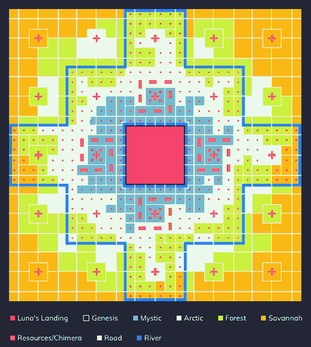
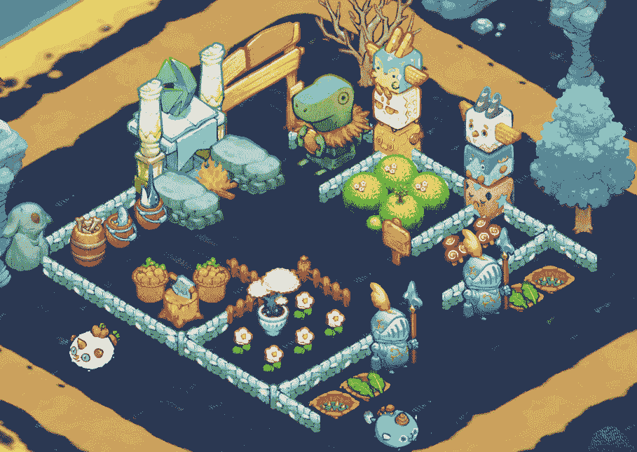

# 关于 Axie Infinity Land Alpha 你需要知道的 6 件事

> 原文：<https://web.archive.org/web/https://dappradar.com/blog/6-things-you-need-to-know-about-axie-infinity-land-alpha>

## 新的细节和令人兴奋的更新揭示了期待已久的 Axie 土地功能

Axie Infinity land 是游戏的一个方面，它已经产生了数百万的交易量，但在游戏本身中仍然没有任何效用。Sky Mavis 并没有忘记这件事。 **在最近的一次问答中&游戏产品负责人 Philip La 透露了一些玩家和土地所有者可以期待的东西。请继续阅读，在即将到来的拓荒者时代 Alpha 版本中找到陆地游戏的六个最重要的方面。**

*概要:*

*   *[拓荒者时代 Alpha 预计在 2022 年底推出](https://web.archive.org/web/20220927111501/https://dappradar.com/blog/6-things-you-need-to-know-about-axie-infinity-land-alpha/#end-of-this-year)*
*   *[阿尔法将只对土地所有者开放](https://web.archive.org/web/20220927111501/http://land-nft-holders/)*
*   *[资源成为游戏中的焦点](https://web.archive.org/web/20220927111501/https://dappradar.com/blog/6-things-you-need-to-know-about-axie-infinity-land-alpha/#key-role)*
*   *[NPC 会战斗而不是 Axie NFTs](https://web.archive.org/web/20220927111501/https://dappradar.com/blog/6-things-you-need-to-know-about-axie-infinity-land-alpha/#NPCs-will-battle)*
*   *[未来的计划和 AXS 的玩法](https://web.archive.org/web/20220927111501/https://dappradar.com/blog/6-things-you-need-to-know-about-axie-infinity-land-alpha/#Axie-Infinity-land)*

Axie land NFTs 已经在市场上销售了多年，有些已经创造了数百万美元的销售额。虽然 Sky Mavis 最初曾试图在 2021 年底发布 alpha 版本，但他们推迟了这些计划。延迟的主要原因之一是设计师仍然必须将所有轴转换为 3D 角色。这比预期花费更多的时间。

不过，根据菲利普·拉的说法，Axie Infinity:时代先锋 Alpha 版应该会在今年年底推出。在一个详细的问答环节中，他介绍了 Sky Mavis 目前正在进行的工作。他还透露了即将发布的一些有趣的细节。

## 关于 Axie Infinity 你需要知道的事情:拓荒者时代

#### **拓荒者时代将只对 Axie land NFT 持有者开放**

陆地游戏是 Axie 社区最期待的更新之一。不幸的是，不拥有土地的玩家将无法参与 Alpha 发布。它将只对土地所有者开放。尽管如此，在发布之前还有足够的时间，所以感兴趣的玩家可以提前购买土地。这就引出了第二个重要的细节——土地位置的重要性。

#### **土地位置对资源交付时间很重要**

就像任何虚拟世界一样，Axie infinity 中的地块被放置在不同的区域，这些区域符合不同的稀有性。重要的是，土地位置也将在玩家之间的商品、资源和物品交换中发挥作用。Sky Mavis 计划整合一个基于距离的传输系统。它将根据交易玩家的位置计算交易发生所需的时间。从这个意义上说，如果一个玩家决定与邻居交换资源，交易会很快发生。另一方面，如果他们与 Lunacia 另一边的人交易，交易可能需要一段时间。

#### **资源将在 Axie Infinity land 游戏中扮演关键角色**

拓荒者新时代的一个主要特点是允许玩家收集物品和资源。这些资源将被用来为非玩家角色(NPC)提供力量，他们将面对怪物并与之战斗。重要的是，你的土地越稀有，你在搜寻资源时得到的 buffs 就越多。

#### **没有 Axie NFTs，NPC 将代替玩家战斗**

在 Axie Infinity land 游戏的 Alpha 版本中，玩家将无法使用他们的 Axie NFTs。相反，所有的战斗都将由 NPC 来完成。然而，游戏中仍然会有竞争的成分。你给 NPC 的资源越多，他们在战斗排行榜上的排名就越高。重要的是，对于 alpha 版本，Sky Mavis 将不会包含任何游戏内的令牌机制，包括 AXS 或 SLP。

#### 地面物品将会出现，但不会带来增益效果

在 alpha 版本中，一个主要的娱乐价值点将来自于构建你的剧情。尤其是用建筑、结构和物品来丰富它。虽然这些活动的总体想法是提高你的土地及其资源生产能力，但在 alpha 版本中 buffs 将不可用。尽管如此，玩家将有机会定制他们的剧情，并为正式推出做准备。

#### **Axie Infinity land 游戏 alpha foundation**

最后但同样重要的是，要注意的最重要的细节之一是，作为 alpha 版本，这个版本将作为进一步开发的基础。从这个意义上来说，它将只在桌面上可用，我们鼓励玩家向 Sky Mavis 发送关于任何错误、问题或一般建议的反馈。此外，这个早期版本的陆地游戏不应该被视为最终产品。

## Axie Infinity land 的未来计划

作为一个处于发展初期的项目，Axie Infinity land 有很多发展和成长的机会。根据 Philip La 的说法，Sky Mavis 目前的重点之一是与玩家进行透明的沟通，并尽可能多地接收关于 alpha 版本的反馈。

当然，随着 alpha 的推出和游戏找到一个坚实的基础，新的功能将会推出。大多数玩家等待听到的是游戏赚钱机制。就目前而言，这种机制何时被引入陆地游戏还没有明确的最后期限。然而，菲利普·拉透露，盈利机制将涉及 AXS，而不是 SLP，因为这是目前可用的战斗游戏模式的情况。有一个初步的预期，AXS 收入将在 2023 年初在陆地游戏中推出，然而，这并不是板上钉钉的时刻。

DappRadar 将继续关注 Axie Infinity 生态系统，因为它推动了创新和新的游戏模式。如果你想了解更多关于 Axie Infinity 的信息，请点击下面的链接。此外，您还可以成为 DappRadar PRO 会员，享受独家报道以及关于 Axie Infinity 性能、销量和销售额的最新数据。

[<picture></picture>](https://web.archive.org/web/20220927111501/https://dappradar.com/ethereum/games/axie-infinity)[<picture></picture>](https://web.archive.org/web/20220927111501/https://dappradar.com/blog/axie-infinity-biggest-contributor-to-august-game-nft-trading/)[<picture></picture>](https://web.archive.org/web/20220927111501/https://dappradar.com/hub/swap/eth/ETH/AXS?to=0xbb0e17ef65f82ab018d8edd776e8dd940327b28b) NewsletterUnsubscribe at any time. [T&Cs](https://web.archive.org/web/20220927111501/https://dappradar.com/terms) and [Privacy Policy](https://web.archive.org/web/20220927111501/https://dappradar.com/privacy-policy)