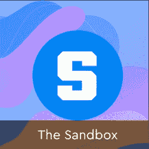

# 元宇宙已经存在的 7 个工作岗位

> 原文：<https://web.archive.org/web/https://dappradar.com/blog/7-jobs-that-already-exist-in-the-metaverse>

## 从地主到农民和建筑商

每一项新技术都会创造新的职业机会，元宇宙也会引入新的工作类型。在游戏化和数字商品的驱动下，用户会发现其他人认为有用的专业化。因此，零工经济将进入虚拟世界，人们将在元宇宙找到工作和副业。

不难想象，元宇宙的崛起会带来新的就业机会。互联网和 web 2.0 已经给我们带来了内容创建者、网页设计者、程序员、社区管理者、版主等等。多亏了互联网，我们有了外卖、优步和 Spotify 等服务。在 Web3 和元宇宙，我们已经可以看到新的工作岗位正在出现。

## 元宇宙的工作

1.  [农民和采集者](https://web.archive.org/web/20221129142002/https://dappradar.com/blog/7-jobs-that-already-exist-in-the-metaverse/#farmers)
2.  [饲养者和手工艺者](https://web.archive.org/web/20221129142002/https://dappradar.com/blog/7-jobs-that-already-exist-in-the-metaverse/#breeders)
3.  [馆长和导游](https://web.archive.org/web/20221129142002/https://dappradar.com/blog/7-jobs-that-already-exist-in-the-metaverse/#curators)
4.  [房东](https://web.archive.org/web/20221129142002/https://dappradar.com/blog/7-jobs-that-already-exist-in-the-metaverse/#landlords)
5.  [建筑商](https://web.archive.org/web/20221129142002/https://dappradar.com/blog/7-jobs-that-already-exist-in-the-metaverse/#builders)
6.  [头像设计师](https://web.archive.org/web/20221129142002/https://dappradar.com/blog/7-jobs-that-already-exist-in-the-metaverse/#avatar)
7.  [时装设计师](https://web.archive.org/web/20221129142002/https://dappradar.com/blog/7-jobs-that-already-exist-in-the-metaverse/#fashion)

## Web3 带来用户授权

Web3 的引入带来了一个新时代，数字资产是可验证和稀缺的，而用户对它们拥有真正的所有权。想想加密货币和 NFT，它们是存储在个人钱包中的数字令牌。数字创新产生了元宇宙的想法。

虚拟世界并不新鲜，活跃世界从 90 年代中期就已经存在了。然而，Web3 通过令牌化一切，给了用户真正的所有权。用户拥有自己独特的虚拟形象，可以有数字时尚，也许用户可以买一块地来建立一个社交场所。在订阅费、可下载内容和授权数字商品的最新趋势中，对于元宇宙的信徒来说，拥有实际拥有数字资产的能力是一种解放。

在这个新的数字空间中，玩家可以将他们的账户从一个世界转移到另一个世界，就业机会将会增加。事实上，这些工作已经存在。其中一些工作影响着元宇宙的许多角落，而另一些则是为某个特定的角落或游戏世界量身定制的。

[https://web.archive.org/web/20221129142002if_/https://www.youtube.com/embed/uX_Qu6B5-9o?feature=oembed](https://web.archive.org/web/20221129142002if_/https://www.youtube.com/embed/uX_Qu6B5-9o?feature=oembed)

## 1.农民和采集者

每个在过去二十年里玩过 MMORPG 的人都知道采集草药、黄金或其他资源的艰辛。这些活动将成为一些玩家的工作，因为其他人懒得这样做。我们已经在《无尽的任务》、《天堂》和《魔兽世界》等传统 MMO 中看到了这种情况，现在我们看到玩家在《Axie Infinity》中种植 SLP。收集资源，然后卖给其他玩家以获取利润，这将成为元宇宙游戏界最常见的工作之一。

## 2.饲养者和手工艺者

游戏物品生产过程的下一步，将是工匠的培育。这些玩家从农民和采集者那里获得资源，为其他玩家制造物品。在 [Axie Infinity](https://web.archive.org/web/20221129142002/https://dappradar.com/multichain/games/axie-infinity) 的情况下，他们获得 SLP 来繁殖新的 Axie，而在即将到来的 MMORPGs 中，如[米兰多斯](https://web.archive.org/web/20221129142002/https://dappradar.com/ethereum/games/mirandus)和[余烬剑](https://web.archive.org/web/20221129142002/https://dappradar.com/polygon/games/ember-sword)，他们获得资源来制造药剂、武器或其他游戏物品。

## 3.策展人和导游

不是每个人都知道某个话题的所有内容，但是有些人知道的比其他人多。这就是为什么画廊策展人或活动指南可能会成为一件事。那些组织虚拟活动的人需要有人来引导访问者和管理可用的内容。这对于在 [Somnium Space](https://web.archive.org/web/20221129142002/https://dappradar.com/ethereum/games/somnium-space) 和 [Cryptovoxels](https://web.archive.org/web/20221129142002/https://dappradar.com/ethereum/collectibles/cryptovoxels) 中的虚拟事件来说是上升的，但在某种程度上也适用于 MMORPGs。多年来，我们看到高水平的玩家给新玩家奖励，以换取游戏内付费。知识和经验是宝贵的，在元宇宙也是如此。

## 4.地主

在一个或多个虚拟世界中拥有大量土地的玩家将没有时间去居住这些土地。相反，他们可以将土地出租给其他用户。三星在[的分散土地](https://web.archive.org/web/20221129142002/https://dappradar.com/ethereum/marketplaces/decentraland)开了一家虚拟商店，但他们的存在更像是一家弹出式商店:从现有的土地投资者那里租赁空间。

虚拟土地和通过 NFTs 的地块所有权是社区所有权如何塑造虚拟世界的主要转变之一。根据世界的不同情况，玩家可以用不同的方式使用他们的土地。在分散土地和隐体素，他们可以举办活动，建立虚拟家园或画廊。在[沙盒](https://web.archive.org/web/20221129142002/https://dappradar.com/ethereum/games/the-sandbox)中，他们可以主持游戏，而在像米兰多斯、[余烬剑](https://web.archive.org/web/20221129142002/https://dappradar.com/polygon/games/ember-sword)和行尸走肉帝国这样的游戏世界中，他们可以在那个世界的设置和游戏功能中登陆。拥有土地可能很有趣，但拥有大量土地可能会成为一件麻烦事。这就是为什么土地所有者可以成为房东，将他们的土地出租给其他用户，以换取固定费用或收入分成。

## 5.建设者

从技术上讲，每个人都可以买一个虚拟的家，因为这是最简单的部分。然而，购买土地后，用户将需要建立一些东西。像任何创造性的工艺一样，为了创造出一个与众不同的虚拟家园，建造者需要严肃的设计技巧。在《我的世界》社区有很多建筑商，许多人对 NFT 世界感兴趣。与此同时，体素建筑师是一群设计师，他们在 [Cryptovoxels](https://web.archive.org/web/20221129142002/https://dappradar.com/ethereum/collectibles/cryptovoxels) 和[分散地](https://web.archive.org/web/20221129142002/https://dappradar.com/ethereum/marketplaces/decentraland)设计了一些最具标志性的建筑。随着更多虚拟世界的开放和品牌进入元宇宙，对优秀建筑商的需求将会增加。

## 6.虚拟形象设计师

头像是用户个性的延伸。从对通过社交媒体进行数字化展示的需求增加来看，在元宇宙发生类似的事情是有道理的。阿凡达设计师可能成为下一个摇滚明星。玩家会看重自己的头像，他们会想要一个符合自己性格的角色。用户可以要求设计师制作一个定制的头像，例如通过[加密头像](https://web.archive.org/web/20221129142002/https://dappradar.com/blog/10-cool-nft-avatars-for-the-metaverse/)。或者他们可以购买元宇宙启用的 [NFT 收藏](https://web.archive.org/web/20221129142002/https://dappradar.com/nft)。[贾斯汀比伯为他想要的无聊的猿 NFT 支付了过高的价格，这不是没有原因的。拥有一个能引起你共鸣的头像将会很重要。](https://web.archive.org/web/20221129142002/https://dappradar.com/blog/justin-bieber-splurged-on-a-bayc-nft-for-1-31-million/)

## 7.时装设计师

根据你使用的虚拟世界，角色也可以交换他们的衣服。例如，分散土地和隐体素允许这样做。用户可以用各种荒谬的设计和服装定制他们的角色。数字时尚已经在元宇宙占有一席之地，但目前它仍然非常小众。然而，毫无疑问，这个市场将会增长。现在从事时装设计的每个人都应该涉足这个领域。像 [Digitalax](https://web.archive.org/web/20221129142002/https://dappradar.com/ethereum/other/digitalax) 和 Fabricant 这样的 Web3 本土组织已经在建立，而[耐克最近收购了数字时装公司 RTFKT](https://web.archive.org/web/20221129142002/https://dappradar.com/blog/nike-acquired-nft-fashion-company-rtfkt-studios/) 。

* * *

对于元宇宙的这 7 份工作，我们只关注了直接影响虚拟世界体验的工作。然而，从整体上来看，web3 还有更多。想想活跃在 [DeFi](https://web.archive.org/web/20221129142002/https://dappradar.com/rankings/category/defi) 的用户，这对于那些在 Web3 工作的人来说是一个至关重要的因素。或者考虑成为一个[道](https://web.archive.org/web/20221129142002/https://dappradar.com/search/dao)或者一个行业协会的成员，影响一个更广泛的社区或者一个数字国家的方向。Web3，即元宇宙，将会给我们的生活带来大量的新工作。哪一个是你最喜欢的？让我们知道，[加入达普拉达的不和](https://web.archive.org/web/20221129142002/https://www.discord.gg/dappradar)！

[<picture></picture>](https://web.archive.org/web/20221129142002/https://dappradar.com/ethereum/marketplaces/decentraland)[<picture></picture>](https://web.archive.org/web/20221129142002/https://dappradar.com/ethereum/marketplaces/the-sandbox-marketplace)[<picture></picture>](https://web.archive.org/web/20221129142002/https://dappradar.com/ethereum/games/somnium-space)