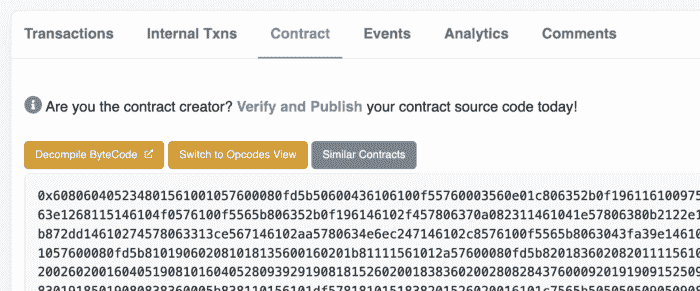
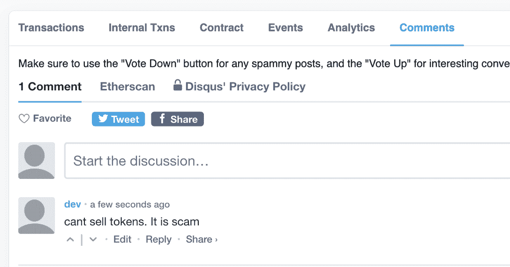
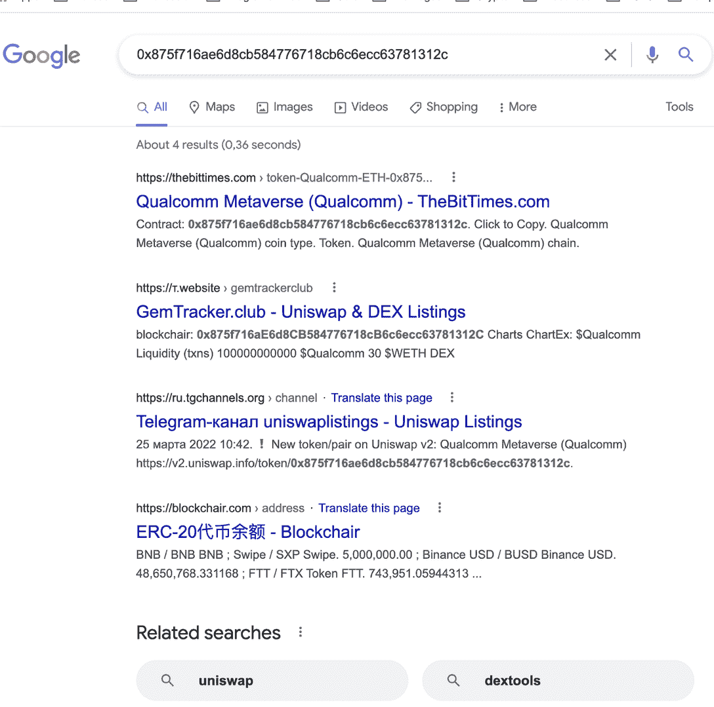
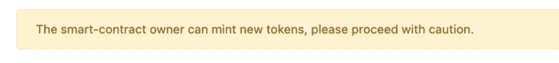
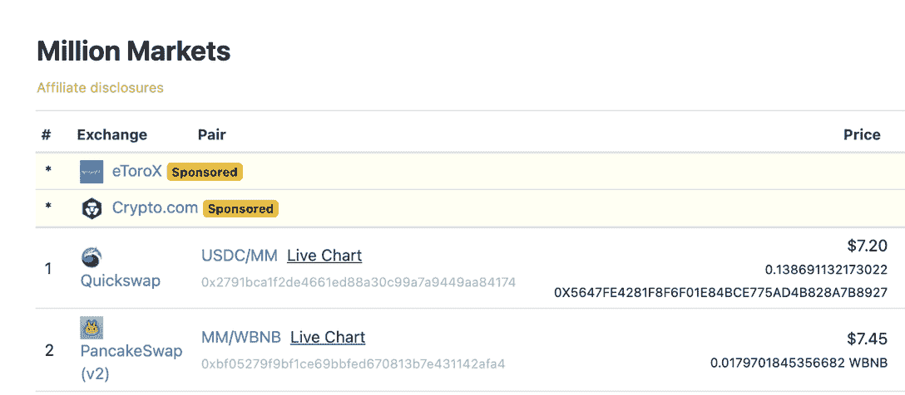
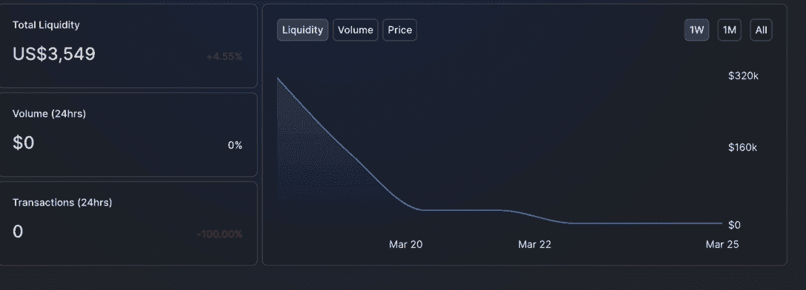

# 检验代币骗局的 8 种方法

> 原文：<https://web.archive.org/web/https://dappradar.com/blog/8-ways-to-check-if-its-a-token-scam>

## 并非所有的区块链项目都是平等的。用这个清单学习如何辨别好坏

区块链充斥着快速赚钱和轻松乘车的承诺。但是要知道你持有的代币是否是一个精心策划的骗局的一部分，以将你从你辛苦赚来的钱中分离出来。有八种简单的方法来执行你的尽职调查，以避免欺诈者和骗子。

在互联网的不同地方，你会发现相同的信息:

> 自己做研究！
> 
> Cyber security experts

你得到了这个建议，却没有得到如何去做或者寻找什么的指示。识别漏洞和骗局需要经验和知识。

因此，这里有一个核对表来帮助您确定令牌是否值得查看，或者它是否包含令牌诈骗的强烈信号。

这篇文章涵盖了以太网，但是同样的方法和其他工具也适用于其他区块链。

注:您可以通过查看相关网站或进入 [Etherscan](https://web.archive.org/web/20221006034917/https://etherscan.io/tokens) 并在搜索栏中键入令牌名称来找到令牌的地址。

[Check Ethereum Price](https://web.archive.org/web/20221006034917/https://dappradar.com/hub/token/eth/ETH)

## 1.在 Etherscan 上验证校验码

访问[以太扫描并检查令牌的代码](https://web.archive.org/web/20221006034917/https://etherscan.io/address/0x875f716ae6d8cb584776718cb6c6ecc63781312c#code)。

如果代码没有被验证，你可能正在处理一个骗局。骗子不透露他们的代码的原因是，如果有问题，或错误，或有一个目的以外的声明。

## 2.查看以太扫描注释部分

如果有人称之为骗局，那么 99%肯定是骗局。如果你是这个活动的受害者，请不要犹豫，也留下你的评论。

同样，转到[以太扫描](https://web.archive.org/web/20221006034917/https://etherscan.io/address/0x875f716ae6d8cb584776718cb6c6ecc63781312c#comments)并点击评论选项卡，阅读人们对令牌的评论。

## 3.在谷歌搜索中检查令牌的地址

如果你上网搜索，找不到明确的首页，“白皮书”或者明显的代币用途，那很可能就是骗局。

## 4.检查 DappRadar 黑名单

我们的令牌黑名单可以在 Github 地址的[找到。](https://web.archive.org/web/20221006034917/https://github.com/dappradar/tokens-blacklist)

如果令牌地址在列表中，这就是一个骗局。

## 5.在令牌资源管理器中检查令牌详细信息

如果你在 [CoinGecko](https://web.archive.org/web/20221006034917/https://www.coingecko.com/) 或 [DappRadar 的 token explorer](https://web.archive.org/web/20221006034917/https://dappradar.com/hub/tokens/ethereum/all/) (或类似的硬币价格追踪器)上找不到代币，代币很可能是骗局。

如果它在令牌资源管理器上，并且您看到类似这样的警告通知，请谨慎操作:

出于验证的目的，所有合法令牌与[令牌探索者](https://web.archive.org/web/20221006034917/https://dappradar.com/hub/tokens/ethereum/all/1)共享其信息。

## 6.检查有多少个交换托管令牌

如果代币只在几个[分散交易所](https://web.archive.org/web/20221006034917/https://dappradar.com/rankings/category/exchanges) (dex)交易，那几乎可以肯定是骗局。

## 7.检查代币余额池中的流动性

在像 Uniswap V2 或其他指数这样的平台上，检查代币的流动性是非常容易的。

流动性是加密货币的数量或智能合约中锁定的令牌数量，使人们能够在分散的交易所中买卖资产。

如果流动资金少于 100，000 美元或以显著的速度下降，你可能会看到一个骗局。

当您使用 dex 时，一定要检查其他基本的链上活动:

*   交易量——交易的代币数量，通常以美元计算。
*   交易计数—令牌交换的次数。
*   与智能合约交互的唯一活跃钱包–使用 Web3 钱包连接到 dex 的用户数量。

如果这些看起来不寻常，做更多的调查。

## 8.检查第三方分析工具

以下是一些令牌分析工具:

*   [气味测试](https://web.archive.org/web/20221006034917/https://tokensniffer.com/token/0x3a6e7ac13311e3500fc1c678a62a8472bd213a9d)–这将对令牌进行自动审核。100 分中的分数越低，该令牌越有可能是一个骗局。
*   是不是一个[蜜罐](https://web.archive.org/web/20221006034917/https://honeypot.is/ethereum?address=0x3a6e7ac13311e3500fc1c678a62a8472bd213a9d)骗局？蜜罐是聪明的契约，带有明显的故意插入其中的编程缺陷。当攻击者试图利用该缺陷时，另一段隐藏代码被激活，并从本质上攻击攻击者。无论你是否打算成为一名加密黑客，蜜罐总是应该避免的。
*   学习 [DEXtools](https://web.archive.org/web/20221006034917/https://www.dextools.io/app/ether/pair-explorer/0xd04652b8c22c0b2ccefeb0ed9d3486cda07d721b) 的基础知识。它记录现场代币价格，并帮助您实时评估代币的真实价值。

骗子永远存在，无论是在区块链还是在现实世界。遵循这些提示，你应该避免设计来取走你的钱的假代币。

使用 DappRadar 的工具和跟踪器，如 [Token Explorer](https://web.archive.org/web/20221006034917/https://dappradar.com/hub/tokens/ethereum/all/) 和我们的 [NFT 排名页面](https://web.archive.org/web/20221006034917/https://dappradar.com/nft)来进行你自己的市场研究。

## 随身携带您的 Web3 之旅

有了 DappRadar 移动应用程序，再也不要错过 Web3。查看最受欢迎的 dapps 的性能，并关注您投资组合中的 NFT。您在 DappRadar 上的帐户与我们的移动应用程序同步，很快您就可以选择实时接收提醒！

[<picture></picture>](https://web.archive.org/web/20221006034917/https://play.google.com/store/apps/details?id=com.portfolio.dappradar)[Download for Android](https://web.archive.org/web/20221006034917/https://play.google.com/store/apps/details?id=com.portfolio.dappradar) NewsletterUnsubscribe at any time. [T&Cs](https://web.archive.org/web/20221006034917/https://dappradar.com/terms) and [Privacy Policy](https://web.archive.org/web/20221006034917/https://dappradar.com/privacy-policy)