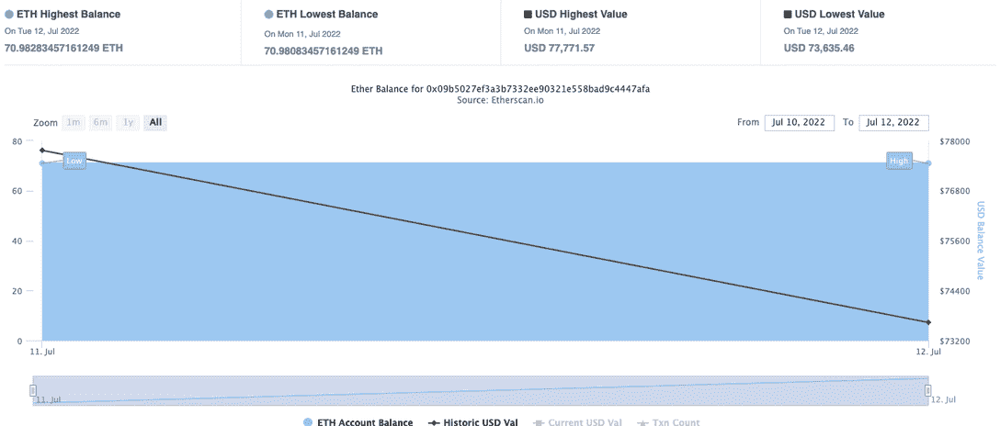
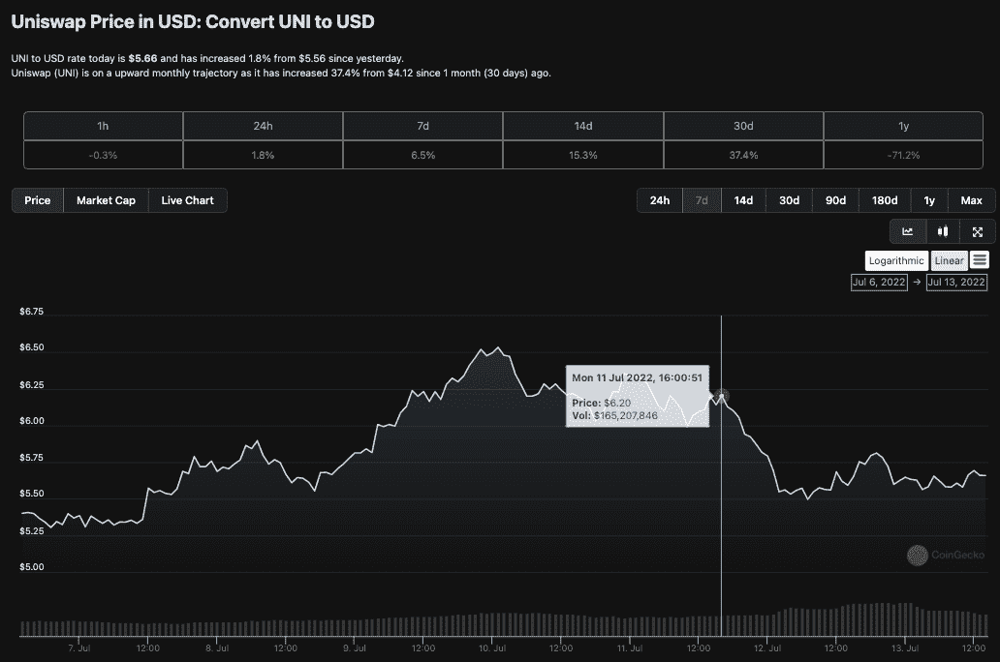

# Uniswap 网络钓鱼攻击导致 800 万美元损失

> 原文：<https://web.archive.org/web/https://dappradar.com/blog/8m-taken-in-uniswap-phishing-attack>

## 黑客窃取了超过 7500 个以太币

**7 月 11 日星期一，一个提供虚假空投的网络钓鱼骗局从广受欢迎的 DeFi 平台 Uniswap 的用户那里提取了近 800 万美元的资金。该网络钓鱼骗局承诺向人们空投 400 枚价值约 2000 美元的统一代币。然而，当用户连接钱包接收汇款时，他们在不知情的情况下签署了批准，允许黑客在 lp 令牌中提取资金帮助。**

这不是 Uniswap 的错。这是一个网络钓鱼骗局，而不是 Uniswap 的错误或协议安全问题。相反，错误在于用户在 UNI airdrop 的虚假印象下签署了恶意交易请求。它强调了只要人类的贪婪存在，坏演员就会一直在行业中发挥作用。

[由于安全和智能合同漏洞不断受到不良行为者的测试，黑客和漏洞利用今年已经夺走了超过 10 亿美元的资金](https://web.archive.org/web/20220811211650/https://dappradar.com/blog/dapp-industry-report-q2-nfts-and-web3-games-keep-enduring-market-conditions-as-shockwaves-from-the-terra-collapse-reach-cefi-and-vcs/#Security-should-remain-a-focus---$676-million-was-stolen-in-crypto-assets-during-Q2)。这一最新事件只是突出了对更多用户保护的需要，以及用户对使用区块链钱包和加密所涉及的风险的更深刻理解。

向 Uniswap 添加流动性的用户将收到代表平台流动性头寸的流动性提供商(LP)令牌。这些令牌是可转移的，并且使用 ERC-721 令牌标准。大多数 NFT 项目使用相同的标准，LP 令牌是代表流动性池中头寸的 NFT。

## 发生了什么事？

根据 Etherscan 的说法，7 月 11 日，一个坏演员部署了一个未经验证的智能合同——这是 Uniswap 等长期项目不会做的事情。部署合同后，黑客攻击钱包中有流动性提供商(LP)令牌的 Uniswap 用户。

黑客攻击者诱骗他们在钱包里签署了一项交易，他们认为这将允许他们收集 400 个 UNI 令牌。

相反，该交易是为了获得支出资金的批准，使黑客能够访问用户持有的所有 Uniswap LP 令牌。

根据 Etherscan 的数据，在撰写本文时，不到 74，000 个钱包与恶意智能合约进行了交互，该恶意智能合约现已耗尽 7，500 ETH，约合 800 万美元。批准交易允许黑客钱包代表用户花费资金。

在从之前的批准交易中获得访问权限后，黑客[将所有 LP 令牌转移](https://web.archive.org/web/20220811211650/https://etherscan.io/address/0xecc6b71b294cd4e1baf87e95fb1086b835bb4eba#tokentxnsErc721)到他们的钱包中，并从 Uniswap 中提取所有[流动性](https://web.archive.org/web/20220811211650/https://etherscan.io/tx/0xdfa99059d33b0f6dd23b2c82921f57709604e40e7f580b260347c317addee89c)。根据来自[以太扫描](https://web.archive.org/web/20220811211650/https://etherscan.io/address/0x09b5027ef3a3b7332ee90321e558bad9c4447afa#analytics)的分析信息，偷走了超过 7573 个以太币。

## FUD 很危险

恐惧、不确定性和怀疑(通常简称为 FUD)是在销售、市场营销、公共关系、政治、投票等方面使用的宣传策略。FUD 通常是一种策略，通过传播负面的、可疑的或虚假的信息来影响感知，并宣布诉诸恐惧。

尽管在许多人错误地将 Uniswap 归咎于该漏洞后，许多媒体进行了澄清，但 UNI 的价格在紧随其后的时间里暴跌了 10%以上。这显示了新闻和猜测对[密码领域领先协议](https://web.archive.org/web/20220811211650/https://dappradar.com/rankings)的影响，以及正确媒体报道和理解的重要性。

Source: CoinGecko

## 在加密中保持安全

首先要说的是，贪婪战胜了大多数人，尤其是在金钱方面。加密土人似乎很快追逐奖励，但不那么快研究。此外，快速浏览一下 Uniswaps 的社交媒体、他们的电报信息等。，可以为受影响的人提前快速确认空投服务。

加密空间仍处于发展的早期阶段。这是一个从区块链科技开始的非常激动人心的时刻，因为机会几乎是无限的。然而，在区块链保持安全并保护您的身份和投资是您在该领域取得个人成功的关键。

要了解更多关于在加密和与区块链互动时保持安全的信息，请查看我们的 [DappRadar 指南以避免被 REKT](https://web.archive.org/web/20220811211650/https://dappradar.com/blog/how-to-avoid-getting-rekt-in-crypto-defi) 和我们的基本[指南以在加密中保持安全](https://web.archive.org/web/20220811211650/https://dappradar.com/blog/4-tips-on-blockchain-cybersecurity-stay-safe-in-crypto)，或者直接跳到下面您最感兴趣的部分:

*   [永远不要分享你的加密钱包密码和种子短语](https://web.archive.org/web/20220811211650/https://dappradar.com/blog/4-tips-on-blockchain-cybersecurity-stay-safe-in-crypto)
*   [考虑一个冷加密钱包服务](https://web.archive.org/web/20220811211650/https://dappradar.com/blog/4-tips-on-blockchain-cybersecurity-stay-safe-in-crypto)
*   [分散投资组合](https://web.archive.org/web/20220811211650/https://dappradar.com/blog/4-tips-on-blockchain-cybersecurity-stay-safe-in-crypto)
*   [检查您将要使用的 dapps 的完整性](https://web.archive.org/web/20220811211650/https://dappradar.com/blog/4-tips-on-blockchain-cybersecurity-stay-safe-in-crypto)
*   如何避免在加密中被重新加密& DeFi