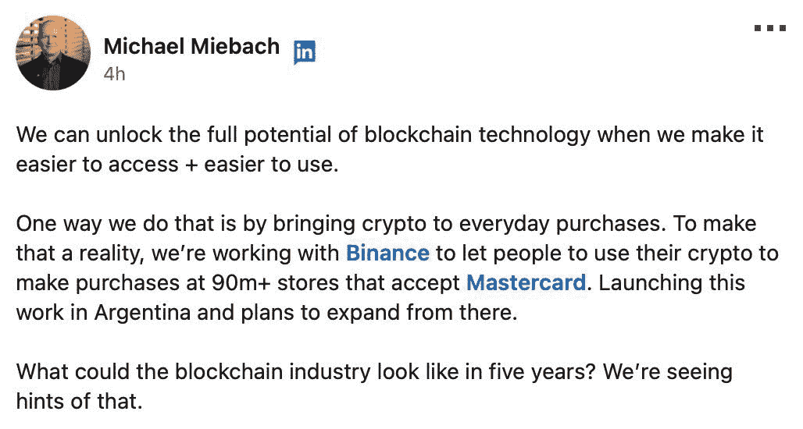

# 全球 9000 万家商店接受加密支付

> 原文：<https://web.archive.org/web/https://dappradar.com/blog/90-million-stores-worldwide-accepting-crypto-payments>

## 此举是在万事达卡和币安宣布为阿根廷提供预付费加密卡之后做出的

**除了投机和购买** [**NFTs**](https://web.archive.org/web/20221014180057/https://dappradar.com/nft) **之外，您是否还想使用加密货币？很快，你就可以在全球 9000 万家商店用信用卡买东西了。万事达卡和币安推出了一种币安卡，使顾客能够使用他们加密钱包中的数字货币购买真实的实物。**

**总结**

*   万事达卡和币安将开始为顾客提供使用币安卡用比特币和 BNB 支付商品的机会。计划是将这一服务推广到全球 9，000 万家商店。
*   一种连接加密货币和法定货币的预付卡目前正在阿根廷试用。从这里开始，万事达卡和币安计划扩展到世界其他地方。

[https://web.archive.org/web/20221014180057if_/https://www.youtube.com/embed/XMnghGaSH4Y?feature=oembed](https://web.archive.org/web/20221014180057if_/https://www.youtube.com/embed/XMnghGaSH4Y?feature=oembed)

What is a Web3 wallet?

## 万事达卡将与金融部门合作采用大量加密技术

万事达卡和币安已经联手在全球 9000 万家商店实现加密货币购物。

这个消息是昨天，8 月 23 日(重新)宣布的，在 Web3 社区有很多人在讨论。主要对话围绕着大规模采用以及这如何成为主流接受加密货币作为法定货币可行替代品的开始。

Michael Miebach LinkedIn announcement on 23rd August

尽管这是个大新闻，但万事达卡[并不是第一家引入加密货币](https://web.archive.org/web/20221014180057/https://www.forbes.com/sites/walterloeb/2022/08/04/gucci-leads-in-crypto-transactions/)作为店内支付有效形式的公司。古驰今年 5 月开始接受 [ApeCoin](https://web.archive.org/web/20221014180057/https://dappradar.com/hub/token/eth/APE?from=0x4d224452801aced8b2f0aebe155379bb5d594381) 、[以太](https://web.archive.org/web/20221014180057/https://dappradar.com/hub/token/eth/ETH)、[包裹比特币](https://web.archive.org/web/20221014180057/https://dappradar.com/hub/token/eth/WBTC?from=0x2260fac5e5542a773aa44fbcfedf7c193bc2c599)、[柴犬](https://web.archive.org/web/20221014180057/https://dappradar.com/hub/token/eth/SHIB?from=0x95ad61b0a150d79219dcf64e1e6cc01f0b64c4ce)、 [USDC](https://web.archive.org/web/20221014180057/https://dappradar.com/hub/token/eth/USDC?from=0xa0b86991c6218b36c1d19d4a2e9eb0ce3606eb48) 、 [GUSD](https://web.archive.org/web/20221014180057/https://dappradar.com/hub/token/eth/GUSD?from=0x056fd409e1d7a124bd7017459dfea2f387b6d5cd) 等等。

[Use our Token Explorer to discover cryptocurrency prices](https://web.archive.org/web/20221014180057/https://dappradar.com/hub/tokens/ethereum/all/1)

万事达卡和币安还没有确定推出的日期。似乎有理由认为，将加密支付引入全球 9000 万家商店不会是一蹴而就的事情。但是像万事达这样的公司做出这样的承诺肯定会帮助人们开始把 Web3 技术视为一个机会，而不是一个风险。

正如万事达卡首席执行长迈克尔·米巴赫(Michael Miebach)在 LinkedIn 上宣布合作的帖子中问道的那样，“五年后区块链的行业会是什么样子？”

## 预付卡在阿根廷已经落后了

这不是我们第一次从万事达卡和币安那里听说这项新举措。这家信贷公司本月早些时候宣布，他们将在阿根廷推出这项新举措，大概是作为一次试运行。

阿根廷因其对比特币的大力采用而在密码圈里众所周知，这可能是由于该国的高通胀率。因此，万事达和币安选择这个拉丁美洲国家作为其新联合计划的试验场也就不足为奇了。

众所周知，币安卡是该公司以切实可行的方式推进全球加密货币应用的持续努力的一部分任何持有有效身份证的人都可以用这张卡支付账单和购物，使用他们的比特币和 BNB 资产。

如果一切顺利，两家公司计划向更多的客户提供服务。加密货币采用率高的国家——越南、萨尔瓦多和美国——可能会成为第一批申请币安卡的国家。

## 什么是币安，他们的标志是什么？

币安是一家拥有两个区块链、自己的交易所和自己的加密货币的中国公司。区块链被称为 [BNB 信标链](https://web.archive.org/web/20221014180057/https://dappradar.com/hub/tokens/bsc/all/1)和 BNB 智能链；合在一起，他们就是 BNB 链。该交易所简称为币安，生态系统的标志是 [BNB](https://web.archive.org/web/20221014180057/https://dappradar.com/hub/token/bsc/BNB) ，代表建设和建设。

2022 年 2 月，[币安重组了其生态系统的运作方式](https://web.archive.org/web/20221014180057/https://dappradar.com/blog/binance-chain-and-binance-smart-chain-become-bnb-chain/)。人们使用 BNB 信标链来发送和接收 BNB 和其他数字资产。人们也可以通过 BNB 智能链发送 BNB，但它与以太坊虚拟机(EVM)兼容。币安所做的是创造与其他连锁店的互操作性。

要了解币安作为一家公司提供了什么，你可以在它的区块链上找到什么平台，请访问 [DappRadar 对币安 dapps](https://web.archive.org/web/20221014180057/https://dappradar.com/rankings/protocol/binance-smart-chain) 的排名。你会在那里找到游戏、定义、交换和更多的东西。

[Discover NFTs on BNB Chain](https://web.archive.org/web/20221014180057/https://dappradar.com/nft/protocol/binance-smart-chain) NewsletterUnsubscribe at any time. [T&Cs](https://web.archive.org/web/20221014180057/https://dappradar.com/terms) and [Privacy Policy](https://web.archive.org/web/20221014180057/https://dappradar.com/privacy-policy)