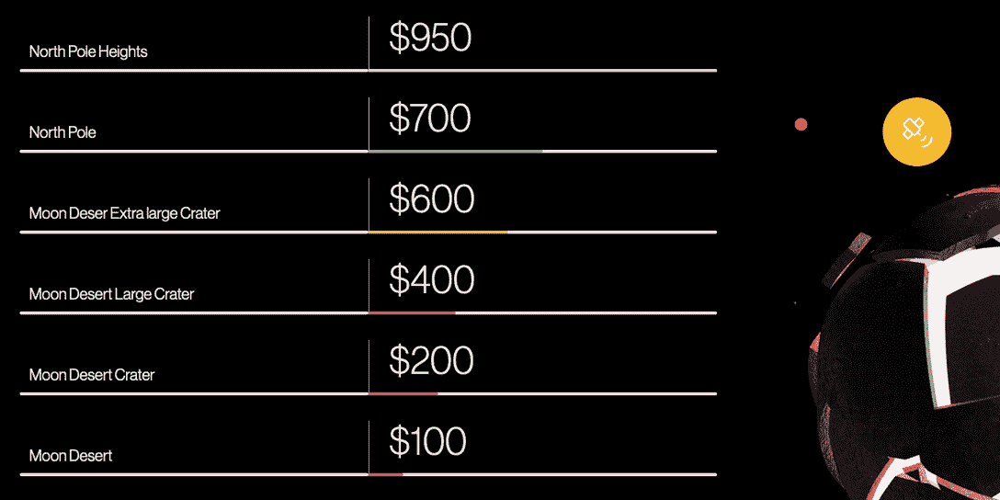

# 近距离观察 Moon 的“玩到赚”游戏

> 原文：<https://web.archive.org/web/https://dappradar.com/blog/a-closer-look-at-moons-play-to-earn-gameplay>

## 月球是第一个采用 P2E 力学的月球元宇宙平台

月亮是一款元宇宙的即玩即赚游戏，专为梦想太空的人设计。为了充分享受月球的游戏性并赚取被动收入，玩家需要了解其最有价值的游戏资产，月球土地。目前，月球土地私人销售仍在进行，玩家可以以更低的价格购买土地。

众所周知，常规游戏除了纯粹的享受之外，没有提供任何玩的动力。相比之下，区块链通过提供技术基础设施来举办付费游戏，改变了行业范式。它们被称为“玩到赚”(P2E)游戏，在游戏参与方面提供货币化机制和双向沟通。因此，游戏开发商正跳入这一领域，希望这是未来。

商业繁荣通常是市场需求增加的反映。DappRadar 追踪区块链上的大量游戏。在其 1 月份的报告中，前 5 大游戏当月平均每天有 765，000 个独立活动钱包(UAW)。不足为奇的是，他们都在游戏中引入了“玩到赚”的机制。

随着这一领域竞争的加剧，游戏开发商们正绞尽脑汁在游戏玩法上创造差异化。但是，另一方面，这意味着现在游戏玩家有了更多的选择。对于那些对太空充满热情的人来说，月球是一个很好的选择。在月球，玩家可以冒险进入一个生动的虚拟空间，同时赚取被动收入。

## 月球土地——赚钱的关键

Moon 的月球地块，每一块都是不可替代的象征(NFT)，需要策略和商业头脑来发现持续收入的可能性。就像在现实生活中，土地的位置会影响其价值。下表展示了不同之处:

月球沙漠中的一块土地可能表明它缺乏未来创收的特定资源，因此价格较低。就在他们的土地上赚钱而言，所有者可以参与 Moon 的玩家驱动型经济。更具体地说，土地所有者可以出售或出租来赚取利润。或者他们可以在自己的土地上开发项目，吸引其他玩家前来消费。因此，一块土地的价值可以增加，主要是由于战略游戏。它们将被动地为所有者创造收入，尽管这确实需要积极的投资和开发。

除了明智地管理土地之外，参与私人销售可以让玩家以更低的价格获得土地，这保证了未来的溢价。因此，请第一个享受私人销售特权的人，[加入](https://web.archive.org/web/20221231203216/https://moon.ws/moon-sale)月亮元宇宙吧。

月球的循环经济有其自身的效用象征——月球。玩家可以从各种游戏内活动中获得月亮，例如出售或出租一块土地。除了在游戏中消费，持有者可以简单地持有它们以获得长期增值，或者在加密交易所交易以获得流动性。随着 Moon 的社交生态系统的扩展，代币的积极长期价值将毋庸置疑。

## 月球游戏说明

月球的游戏叙事是以人类的登月计划为背景的。核心游戏围绕分布在月球表面的 126，000 块 NFT 土地展开。这些虚拟土地是游戏中最重要和最有价值的资产。以下要点简要描述了月球的基本玩法:

*   **国家发展。**玩家会组建氏族，共同开发月球国家。一个国家需要一支的军队来保卫自己免受侵略或向其他国家扩张。财政管理局将征收税收以支持政府支出。
*   **交易。除了管理一个国家内的商业，玩家还可以进行星际贸易。它依靠玩家的技能和商业策略来实现利润最大化。**
*   **解决政治争端。《月球》的游戏具有高度的互动性和吸引力，让用户有强烈的掌控感。在动荡时期，玩家需要通过谈判解决政治争端，并在激烈的冲突中导航。**
*   发现奥秘。月球的阴暗面是未知的，充满了神秘。当玩家揭开荒野时，它会增加刺激感。

月亮是为那些喜欢冒险和梦想太空的人而造的。游戏生态系统中的 P2E 机制允许玩家探索游戏并获得丰厚的经济利益。

平心而论，月亮照耀着当前千篇一律的 P2E 市场。土地的私下出售仍在进行。只需访问下面的游戏公开交流渠道，就有机会获得额外的好处。

**社交媒体渠道**

[推特](https://web.archive.org/web/20221231203216/https://twitter.com/moonmetaverse_)

[不和](https://web.archive.org/web/20221231203216/https://discord.com/invite/themoon)

[电报](https://web.archive.org/web/20221231203216/https://t.me/moon_the_game)

[中等](https://web.archive.org/web/20221231203216/https://moongame.medium.com/)

**免责声明** —这是一篇赞助文章。DappRadar 不认可本页面上的任何内容或产品。DappRadar 旨在提供准确的信息，但读者应该在采取行动之前总是自己做研究。DappRadar 的文章不能被认为是投资建议。