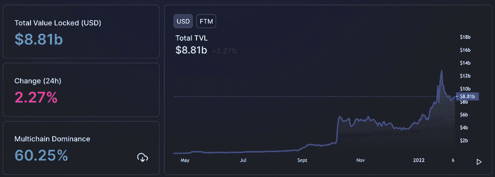
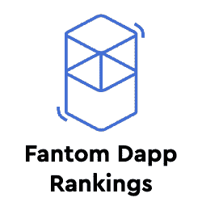
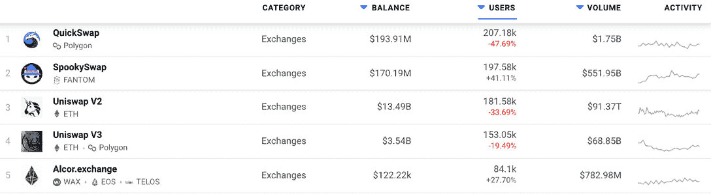
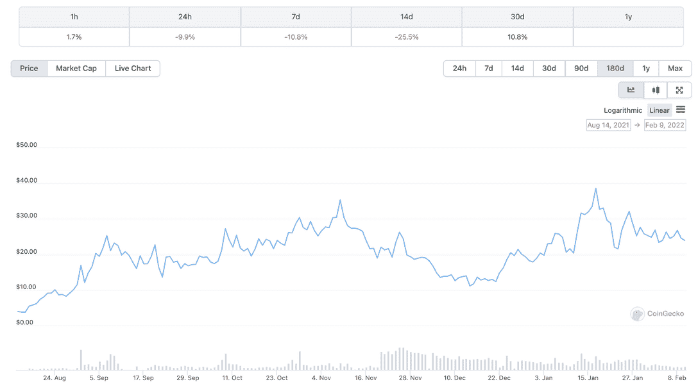
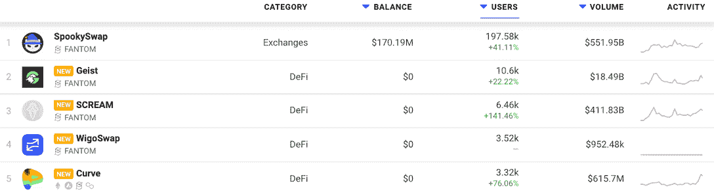
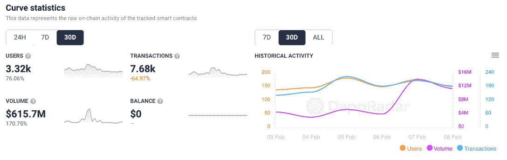

# Fantom 上的 DeFi Dapps

> 原文：<https://web.archive.org/web/https://dappradar.com/blog/a-look-at-defi-dapps-on-fantom>

## 是什么促使 Fantom 成为 TVL DeFi 第五大贡献者

最近整合的方通区块链公司是目前 DeFi 锁定(TVL)总价值的第五大贡献者。在全部 2200 亿美元的 TVL 中，Fantom 占了大约 90 亿美元。至关重要的是，说到 TVL，Fantom 可能领先于 Polygon、Solana 和 Tron 等更知名的网络。

作为一个拥有 DeFi 总价值约 5%的网络，难怪 Fantom 上运行的大多数 dapps 现在都属于 DeFi 类别。也许这就是为什么很多人不知道 Fantom 的原因，因为这个行业现在把重点放在了 NFTs 和 GameFi 产品上。然而，值得深入到 [Fantom dapp 生态系统](https://web.archive.org/web/20221209054657/https://dappradar.com/rankings/protocol/fantom)中，去发现哪些 dapp 正在推动这一 TVL 和用户活动的最大份额。此外，我们可以看到其他类别是否开始显示出积极的增长信号。

## Why Fantom?

在不详细介绍 Fantom 背后的架构和技术的情况下，有必要了解 Fantom 的主要信息，以及它为何成为 DeFi dapps 的重要参考。

*   **可扩展性** : Fantom 每秒可以处理数千个事务，并且可以扩展到数百个节点。
*   **速度** : Fantom 的交易速度平均 1 秒。
*   **安全**:据开发商介绍，提供制度保障。它还提供绝对有效性，这意味着交易永远不会被撤销。Fantom 群龙无首。因此，安全并不取决于一小群行为者。
*   **支持智能合约** : Fantom 完全兼容以太坊。开发者可以像在以太坊一样创建和使用 EVM 兼容的智能合约。

FTM 是 Fantom 网络的本地令牌。它被用在各种场景中:在部署项目时支付费用，被标桩，以及用于治理。

[<picture></picture>](https://web.archive.org/web/20221209054657/https://dappradar.com/fantom/exchanges/spookyswap)[<picture></picture>](https://web.archive.org/web/20221209054657/https://dappradar.com/rankings/protocol/fantom)[<picture></picture>](https://web.archive.org/web/20221209054657/https://dappradar.com/fantom/marketplaces/nftkey-marketplace)

## 作为 DeFi 网络的 Fantom

我们立即看到，在过去 30 天里，Fantom 上唯一活跃钱包排名前 10 位的 dapps 中有 9 个属于 DeFi 和 Exchange 类别。而 NFTKEY，[一家多连锁店的 NFT 市场](https://web.archive.org/web/20221209054657/https://dappradar.com/blog/nftkey-marketplace-doubles-audience-with-multichain-approach)，已经开始对 Fantom 产生吸引力。有趣的是，经过仔细观察，我们看到 DeFi 类别中的 dapp[Fantom 骑士](https://web.archive.org/web/20221209054657/https://dappradar.com/fantom/defi/knights-of-fantom)，显示了 GameFi dapp 的所有特征，它融合了游戏和金融机制，提供了一个简单的 Fantom 和 crypto。

我们已经看到像和谐的 [DeFi 王国](https://web.archive.org/web/20221209054657/https://dappradar.com/blog/play-to-earn-defi-kingdoms-rise-to-success)和雪崩的[Crabada](https://web.archive.org/web/20221209054657/https://dappradar.com/blog/what-is-crabada-new-play-to-earn-game-on-avalanche/)这样的 dapps 通过这种提议取得了非常积极的结果，所以看看 Fantom 骑士是否能吸引类似的兴趣将会很有趣。此外，看看前面提到的 GameFi dapps 将来是否会在 Fantom 上推出，并为 GameFi 类别和 Fantom 骑士的竞争提供力量，这将是一件有趣的事情。

## 谁在创造所有的价值？

在过去的 30 天里，有近 20 万个活跃钱包连接到了 SpookySwap，这是 Fantom 上的明显领导者。然而， [Multichain，一个跨链路由器协议](https://web.archive.org/web/20221209054657/https://defillama.com/protocol/multichain)目前没有被 DappRadar 跟踪。它允许用户使用网桥在不同的区块链之间交换令牌。根据他们的官方网站，该协议支持 30 个其他链和超过 1，389 个附加令牌。由于其功能性，Multichain 在 Fantom DeFi 的 88 亿美元总额中持有超过 50 亿美元。

在 DappRadar 排名的顶端，我们看到 SpookySwap 占据了非常重要的位置，在过去的 30 天里吸引了超过 197，000 个独特的活跃钱包。在同一时间段内，这分别超过了 Uniswap V2 和 V3。仅次于[多边形交换快速交换](https://web.archive.org/web/20221209054657/https://dappradar.com/polygon/exchanges/quickswap)。此外，[超过 13.6 亿美元](https://web.archive.org/web/20221209054657/https://defillama.com/chain/Fantom)，或者说 Fantom TVL 88 亿美元总额的 20%左右，来自于 SpookySwap。更重要的是，随着超过 5000 亿美元的交易量流经该协议，[斯布克思 wap 正在成为 DeFi 领域的一个强大玩家](https://web.archive.org/web/20221209054657/https://dappradar.com/fantom/exchanges/spookyswap)。

## 什么是 SpookySwap？

SpookySwap 是 Fantom 上的一个自动做市(AMM)分散式交易所(DEX ),使用 BOO 令牌作为其治理令牌。2021 年 4 月，该平台推出了代币互换、农场、鼓励其他 Fantom 项目的赠款以及以用户为中心的服务。其增长的一个原因是用户可以很容易地从币安智能链和以太坊桥接资产。这使得他们能够将当前的密码资产转移到 Fantom，并以比以太坊低得多的成本开始交易。

BOO token 在过去 30 天表现良好，上涨 10.8%，至 24 美元左右。当然，它受到了 BTC 和瑞士联邦理工学院最近撤资的影响，但似乎正在复苏。

## 精英中的精英

坐在 SpookySwap 下面，我们看到了 DeFi 类别中的四个主要玩家。艾斯特，尖叫，WigoSwap 和曲线。前三个现在只在 Fantom 上运行，但 Curve 是一个多链以太坊 dapp，它的翅膀扩展到了 Avalanche、Polygon 和 Fantom。

Curve 在 Fantom 上表现良好，因为交易者利用了它的快速交易、桥接技术和低廉的费用。活跃钱包的月环比增长超过 76%，而过去 30 天的交易量超过 6.15 亿美元。

艾斯特、Scream 和 WigoSwap 都为用户提供了类似的建议。[艾斯特](https://web.archive.org/web/20221209054657/https://dappradar.com/fantom/defi/geist)专注于流动性供应、农业和赌博业。该平台为用户提供了一种简单的方式来赚取他们持有的 FTM 和其他精选令牌。 [Scream](https://web.archive.org/web/20221209054657/https://dappradar.com/fantom/defi/scream) 类似于现有的借贷平台，如复合金融、Aave 和 C.R.E.A.M .金融。用户可以借出任何受支持的资产，并使用其资本作为抵押来借入受支持的资产。

WigoSwap 与众不同，它为用户提供了一个自动做市商(AMM)和一个 NFT 本地市场。该平台还可以促进代币互换、标桩、耕作和交易 NFT。此外，用户可以通过下注 WIGO 在 WigoSwap 上获得免费代币。

## Fantom 摘要

如果 Fantom 继续通过明智的合作和进一步的技术创新使自己与众不同，它可能会成为一个重要的参与者。虽然 Fantom 为其用户提供了非常相似的服务，但它采用了独特的技术，使其更加高效。

然而，以太坊计划在 2022 年推出 [ETH 2.0，将其结构过渡到股权证明。这种转变可能会让 Fantom 和其他区块链公司发现，收费和速度上的竞争优势在未来变得不那么有价值。即使从技术角度来看有一些显著的差异，](/web/20221209054657/https://dappradar.com/blog/ethereum-test-drives-eth-2-0-as-tvl-surpasses-77-billion/)[以太坊仍然是最重要的区块链](https://web.archive.org/web/20221209054657/https://dappradar.com/blog/dapp-industry-report-january-2022)，总价值超过 1230 亿美元。

 NewsletterUnsubscribe at any time. [T&Cs](https://web.archive.org/web/20221209054657/https://dappradar.com/terms) and [Privacy Policy](https://web.archive.org/web/20221209054657/https://dappradar.com/privacy-policy)

***以上不构成投资建议。此处给出的信息仅供参考。请行使尽职调查，做你的研究。作者持有 ETH、BTC、AGIX、HEX、LINK、GRT、CRO、OMI、不可变 X、GALA、AVASTR、GMEE、CUBE、RADAR、FLOW、FTM、BNB、SPS、WRLD、ATOM 和 ADA。***