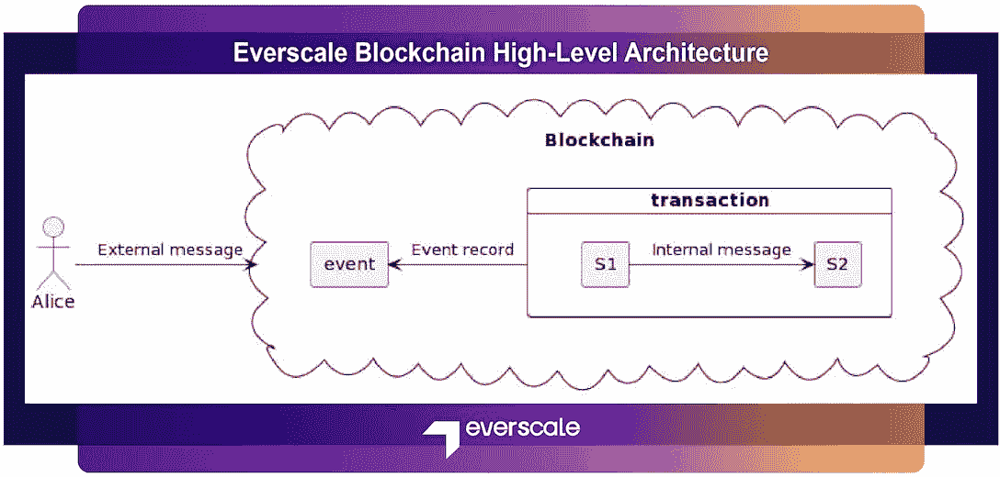
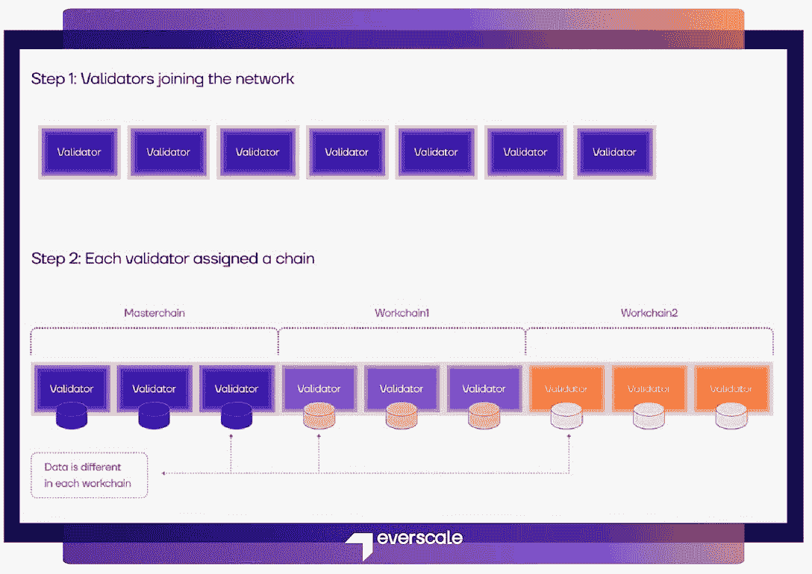
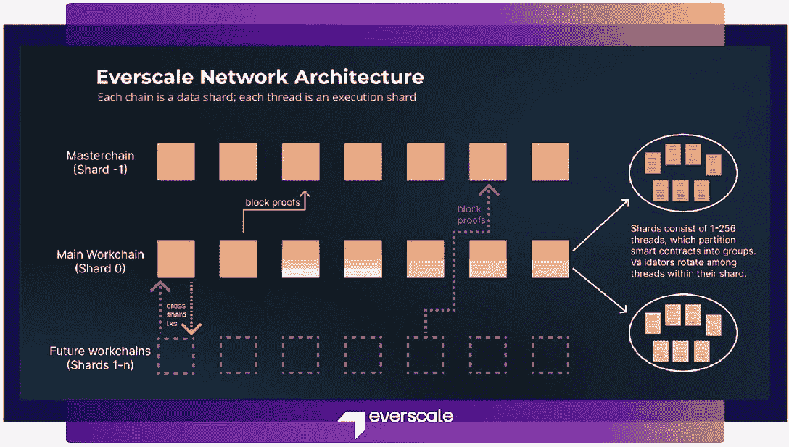
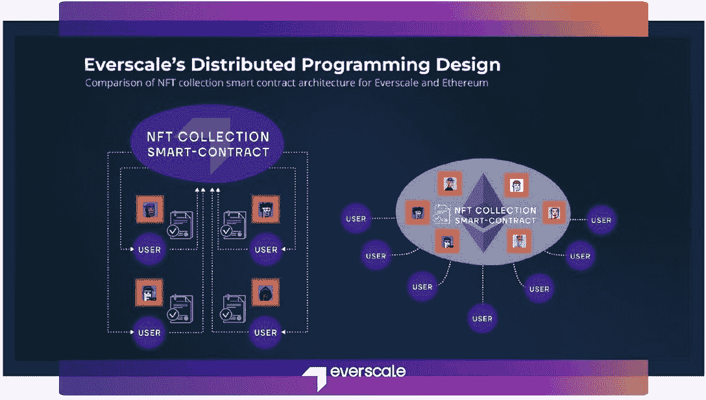

# 看看 Everscale 的建筑:它如何解决现有区块链的缺点

> 原文：<https://web.archive.org/web/https://dappradar.com/blog/a-look-at-everscales-architecture-how-it-addresses-existing-blockchains-drawbacks>

## 深入了解 Everscale 独特的区块链设计

在本文中，开发人员将学习理解 Everscale 架构的要点。他们将熟悉 Everscale 区块链的组件，了解它为什么性能如此之好，并了解我们如何解决长期存在的区块链问题。最重要的是，开发人员投入时间和精力阅读本系列将获得丰厚回报，并顺利加入 Everscale 友好而专业的开发团队。

## 目录

*   [Everscale 架构的简要介绍](https://web.archive.org/web/20221128230109/https://dappradar.com/blog/a-look-at-everscales-architecture-how-it-addresses-existing-blockchains-drawbacks/#brief)
    *   [信息如何在示意图层面发挥作用。](https://web.archive.org/web/20221128230109/https://dappradar.com/blog/a-look-at-everscales-architecture-how-it-addresses-existing-blockchains-drawbacks/#how)
    *   工作链
*   [区块链组件。](https://web.archive.org/web/20221128230109/https://dappradar.com/blog/a-look-at-everscales-architecture-how-it-addresses-existing-blockchains-drawbacks/#components)
    *   [消息](https://web.archive.org/web/20221128230109/https://dappradar.com/blog/a-look-at-everscales-architecture-how-it-addresses-existing-blockchains-drawbacks/#messages)
    *   [TVM](https://web.archive.org/web/20221128230109/https://dappradar.com/blog/a-look-at-everscales-architecture-how-it-addresses-existing-blockchains-drawbacks/#TVM)
    *   [BOC(细胞袋)](https://web.archive.org/web/20221128230109/https://dappradar.com/blog/a-look-at-everscales-architecture-how-it-addresses-existing-blockchains-drawbacks/#BOC)
    *   [碎片](https://web.archive.org/web/20221128230109/https://dappradar.com/blog/a-look-at-everscales-architecture-how-it-addresses-existing-blockchains-drawbacks/#shards)
*   [Everscale 的“分布式编程”解决了长期存在的数据存储问题。](https://web.archive.org/web/20221128230109/https://dappradar.com/blog/a-look-at-everscales-architecture-how-it-addresses-existing-blockchains-drawbacks/#solves)

## Everscale 架构的简要介绍。

首先，应该提到的是，由于 Everscale 的出现时间较晚，以及与之相关的时间滞后，它能够评估以太坊和其他竞争网络上所犯的错误。凭借这一专家观点，社区开发人员成功地为 Everscale 区块链建筑公司交付了正确的解决方案。

不同于大多数其他积极使用同步执行环境的区块链网络，Everscale 本身着眼于异步。这是一种更先进的技术，允许运行复杂的逻辑，适合现代后端开发人员的需求。

[Learn more about Everscale’s strengths](https://web.archive.org/web/20221128230109/https://everscale.network/)

### 请参见下面示意图级别的消息工作方式

### 工作链

有两个称为工作链的全球“区域”:**主链**用于共识和其他内部功能，以及**主工作链**用于面向智能合约的用户。

当存在大量用户消息和 contract-2-contract 消息时，主工作链可以被动态地分成碎片(线程)。每个碎片被分配给全局验证器集中的一个随机的验证器子组。在相对较短的时间内(一轮)选择子组。在任何给定的时间，相应的子组负责在给定的碎片中执行事务。同时，它不断地从其工作链的所有其他碎片中下载块。

值得一提的是，在实践中，可以添加更多的工作链，多达数百个。每个新工作链可以有自己的配置参数和本机令牌。这反过来允许开发人员在安全性和性能之间找到正确的平衡。

每个工作链都被分割成称为“线程”的执行碎片它们包含了整个智能合同和账户链的划分。验证器在分配的线程中循环，只执行线程中的事务。线程数量根据网络负载动态调整，从 1 到 256。

[Learn everything about Everscale](https://web.archive.org/web/20221128230109/https://everscale.network/)

## **区块链组件**

我们不会用关于什么是交易、块、账户或验证器的多余信息来烦你。这些东西你可能已经看过几百遍了。相反，我们将简要概述 Everscale 区块链特有的元素。

### **消息**

在 Everscale 上，有两种类型的信息。例如，外部入站消息从外部世界传入区块链，以便用户部署和执行合同，而另一方面，内部消息允许智能合同相互通信。该协定最多可以向任何其他协定(包括其自身)生成 255 条内部消息。所有消息传递都是异步的。

### TVM

Everscale 的主链和主工作链使用一种独特的虚拟机，称为 TON 虚拟机(TVM)。它以异步方式工作，并在其核心使用特殊的单元树数据结构。用 Solidity 或 C++写的代码可以编译成 TVM 汇编。

### 细胞袋

它是 Everscale 上数据打包的通用格式。每一个对象——账户、交易、消息、数据块——都作为 BoC 存储在区块链存储器上。顺便说一下，块的 BoC 包括在各个块中执行的所有消息和事务的 BoC。

### 陶瓷或玻璃碎片

Everscale 中的碎片用于解决区块链面临的经典问题，即低吞吐量。分片是在计算和存储级别实现的。计算分片也称为多线程。如上所述，Everscale 实现了动态多线程。它允许验证器抵抗高负载。

存储分区是在工作链级别实现的。将来，Everscale 上可以部署多个多线程的 workchcains。由于这两种类型的分片，Everscale 已经实现了 1 条工作链 4000 TPS 的可观吞吐量。部署工作链进行水平扩展是可能的，但我们现在正在研究一种共识算法，以一种安全的方式做到这一点。

[Get in touch with Everscale](https://web.archive.org/web/20221128230109/https://t.me/everscaleonboarding)

## Everscale 的“分布式编程”解决了长期存在的数据存储问题。

区块链技术的原始想法在于，从最开始(创世纪)到最新的区块之间存在区块链。假设总是有可能查看从 genesis 块到最新块的所有交易。

然而，由于技术限制，直到最近，区块链社区中仍有一种坚定的理解，即我们只能从以下两个选项中选择一个:高吞吐量或存储历史。

作为区块链领先的开发商之一，Everscale 从不寻找简单而廉价的方法来解决区块链的技术问题。因此，突出显示的问题以最大的效率和准确性得到了解决。

在 Everscale 区块链，每个智能合约都需要为在该州存储数据支付租金。费用与数据的大小相对应。当钱用完了，合同就被删除了，首先是有收回的可能，然后是彻底的。

因此，如果用户不想再为存储付费，他们可以选择不存储小额或无意义的交易。这种方法为更重要的数据释放了存储空间，并允许用户只为自己的存储付费。

我们很高兴你读完这篇文章，并仍然与我们在一起。很快我们将推出下一篇文章，解释 Everscale 对 CBDCs 和 private 区块链的看法。

**了解更多关于 Everscale 的信息**

*   [**网站**](https://web.archive.org/web/20221128230109/https://everscale.network/)
*   [**推特**](https://web.archive.org/web/20221128230109/https://twitter.com/Everscale_net)
*   [**不和**](https://web.archive.org/web/20221128230109/https://discord.com/invite/GSPAGVTuqQ)

**免责声明** —这是一篇赞助文章。DappRadar 不认可本页面上的任何内容或产品。DappRadar 旨在提供准确的信息，但读者应该在采取行动之前总是自己做研究。DappRadar 的文章不能被认为是投资建议。