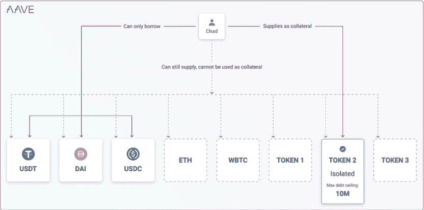
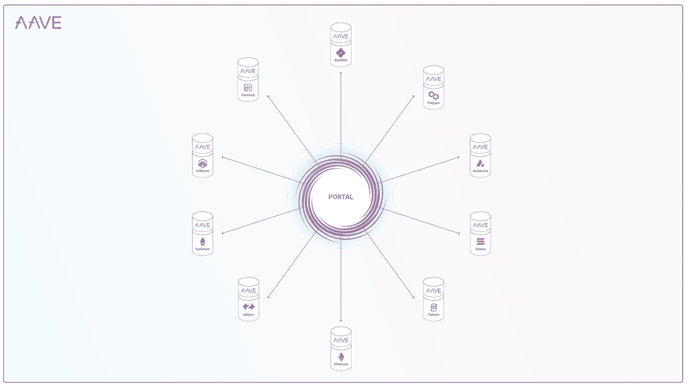

# Aave V3 想走 DeFi 主流

> 原文：<https://web.archive.org/web/https://dappradar.com/blog/aave-v3-wants-to-take-defi-mainstream>

## DeFi 的主要玩家之一的最重要的更新

**Aave V3 希望消除进入壁垒，改善用户体验，并将 DeFi 推向主流。自从以 ETHLend 的名义从一个点对点贷款平台转型以来，Aave 已经成为一个分散的金融巨头，占今天 DeFi 锁定(TVL)总价值的 220 多亿美元。**

*[Aave 协议](/web/20220925084119/https://dappradar.com/blog/aave-avalanche-defi-lending-crypto/)是一个分散的非托管流动性协议，用户可以作为供应商、借款人或清算人参与其中。供应商为市场提供流动性，并可以从所提供的资产中赚取利息。同时，借款人可以超抵押借款，也可以搞闪贷，不需要超抵押。V3 允许用户优化他们提供给 Aave 的资产的收益和借贷能力。*

尽管[在 Avalanche 和 Polygon 的多链环境](https://web.archive.org/web/20220925084119/https://dappradar.com/ethereum/defi/aave)中运行，但核心活动仍然在日益拥挤的[以太坊网络](/web/20220925084119/https://dappradar.com/blog/when-are-ethereum-gas-fees-lowest/)中进行。因此，Aave 一直受区块链以太坊及其不断上涨的燃气费的支配。V3 的推出旨在为用户和 Aave 自己解决这个问题。该团队将其 V3 升级集中在几个关键领域，包括资本效率、第 2 层优化、协议安全、去中心化和整体用户体验。

## 第二层优化

像 Aave 这样的协议在第二层网络上的流行和机会是巨大的。然而，一个核心问题是，第二层上的主要交易成本来自于 calldata。Calldata 是包含函数参数的唯一数据位置。它是一个不可修改的、非持久的区域，函数参数存储在这里，其行为很像内存。为了最小化成本，Aave V3 在 Arbitrum 和[乐观](https://web.archive.org/web/20220925084119/https://dappradar.com/rankings/protocol/optimismhttps://dappradar.com/rankings/protocol/optimism)上使用不同的第二层契约，这些契约压缩了传递给池方法的信息。

## 资本效率

资本效率使用最少的投入资本来驱动最大的股权回报。当然，这是每个投资者的梦想。因此，我们很早就看到了 Aave 在这方面的改进。Aave V3 的主要目标是为流动性提供者创造更多收益。

如上所述，Aave 在其智能合约中锁定了近 220 亿美元，其中大部分处于闲置状态，为流动性提供商从借款活动中产生收益。收益是安全稳定的，但我们觉得他们可以做得更好。引入允许用户重复使用闲置资本的功能，而不增加偿付能力意外事件，也不将资产重新分配给其他 DeFi dapps，从而减少对资产桥的依赖，降低整体智能合同风险。

## 隔离模式

a 已经引入了隔离模式，这是一个受 [MakerDAO 的曝光管理方法](/web/20220925084119/https://dappradar.com/blog/makerdao-an-introduction-and-how-it-works/)启发的特性。这个特性现在允许 Aave 治理成员投票决定哪些资产应该被列为隔离的。提供单独资产作为抵押品的借款人不能将其他资产添加到他们的抵押品中，只能借入一篮子稳定的债券，但有债务上限。

## 多链门户

[门户功能](https://web.archive.org/web/20220925084119/https://docs.aave.com/developers/whats-new/portal)允许不同网络的 Aave V3 市场之间的流动性流动。升级后的 V3 支持治理批准的网桥在源网络上烧录 aTokens，同时在目标网络上即时生成 aTokens。然后，底层资产可以以延迟的方式提供给目标网络上的 Aave，在通过桥移动后绕过它到达池。门户特性的添加使得所提供的资产能够在不同区块链上操作的 Aave 迭代之间流动。

桥梁是一个必要的功能，但伴随着固有的风险，今年已经有数亿美元被盗。2022 年最值得注意的案例是[虫洞](/web/20220925084119/https://dappradar.com/blog/321-million-taken-as-solana-wormhole-bridge-hacked/)和浪人利用。桥梁被视为交易过程中的一个薄弱环节，在一段时间内，使令牌暴露在更大的风险中。

Aave 引入了治理批准的桥梁，将 Aave 用户置于决策的核心。此外，门户功能需要很少的更改，因为它利用 Aave 的计息 aTokens 在源网络上刻录它们，同时在目标网络上即时生成它们。

## 效率模式

高效率模式(eMode)允许借款人在供给和借入资产价格相关的情况下，从其抵押品中获取最高的借款能力，尤其是当两者都是同一基础资产的分支时。比如[美元支持的稳定货币](/web/20220925084119/https://dappradar.com/blog/backing-stablecoins-how-does-this-work/)盯住美元。

## 风险管理

[Aave V3](https://web.archive.org/web/20220925084119/https://dappradar.com/multichain/defi/aavehttps://dappradar.com/multichain/defi/aave) 带来了比之前版本的 Aave 更复杂的参数和特性。最重要的是，Aave 治理投票者现在可以配置资产的借入和供应上限，以控制每项资产可以借入和供应多少。Aave 治理还可以在不影响现有借款人的情况下，将任何资产的借款能力控制降至 0%。

此外，Aave V3 引入了 Aave 治理的能力，允许实体更新协议的风险参数，而无需对每个变更进行治理投票。这些实体可以是 Dao 或自动化代理，如 Gauntlet，它们可以构建在特性之上，并在发生意外事件时自动做出反应。

第二层网络的高吞吐量、可伸缩性和低成本意味着来自以太坊的大部分资产都转移到了第二层。为了减轻第二层网络中的一些问题，V3 引入了高级价格 oracle sentinel。该特性引入了清算的宽限期，并在特定情况下禁止借款，并且是为第 2 层设计的，以处理定序器的任何停机时间。

最后，为了完成一系列创新的风险管理升级，在 V3 中，清算机制得到了改进，允许在头寸接近破产时对其进行完全清算。以前，任何时候都只能清算一半的头寸。

## 多重奖励和索赔

[在 Aave V2](https://web.archive.org/web/20220925084119/https://dappradar.com/multichain/defi/aave) 中，Aave Governance 通过机构群体提案激活了流动性挖掘奖励，尽管每项资产的费率不同，但奖励都以 stkAave 代币计价。

Aave Protocol V3 现在为用户提供了每个令牌多个奖励的选项，使得资产列表能够启用以其协议令牌命名的额外激励奖励。V3 还允许用户向另一个帐户申请奖励，并在一次交易中为每项资产申请多种类型的奖励，从而节省了用户的时间和金钱。

## Aave V3 总结

那些刚接触去中心化金融的人可能会比本文开始时感到更加困惑。然而，为 Aave V3 概述的大部分内容只不过是为了提高整体效率、安全性和可用性而实现的后台操作。在很大程度上，Aave 的普通用户将会得到更好的服务，不需要太担心 V3 的细节。简而言之，用户将获得更高的收益率、更高的安全性和更好的用户体验。

对于那些更关注细节的人来说，这里的一些功能确实非常出色，尤其是 Aave 将如何使用其 aTokens 来处理跨链的桥接资产。此外，有趣的是看到像 Aave 这样的强大公司在第二层上全力以赴，在那里集中精力，可以说勾勒出了 DeFi 的未来。

 NewsletterUnsubscribe at any time. [T&Cs](https://web.archive.org/web/20220925084119/https://dappradar.com/terms) and [Privacy Policy](https://web.archive.org/web/20220925084119/https://dappradar.com/privacy-policy)

***以上不构成投资建议。此处给出的信息仅供参考。请行使尽职调查，做你的研究。作者持有多种加密货币的头寸，包括 BTC、瑞士法郎和雷达。***