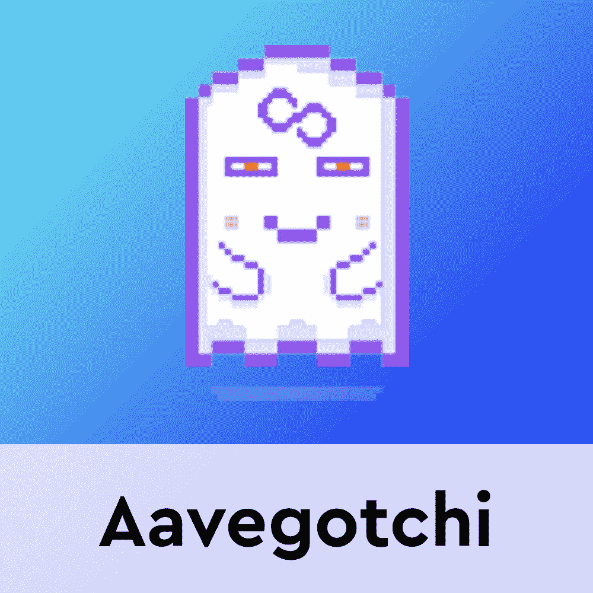
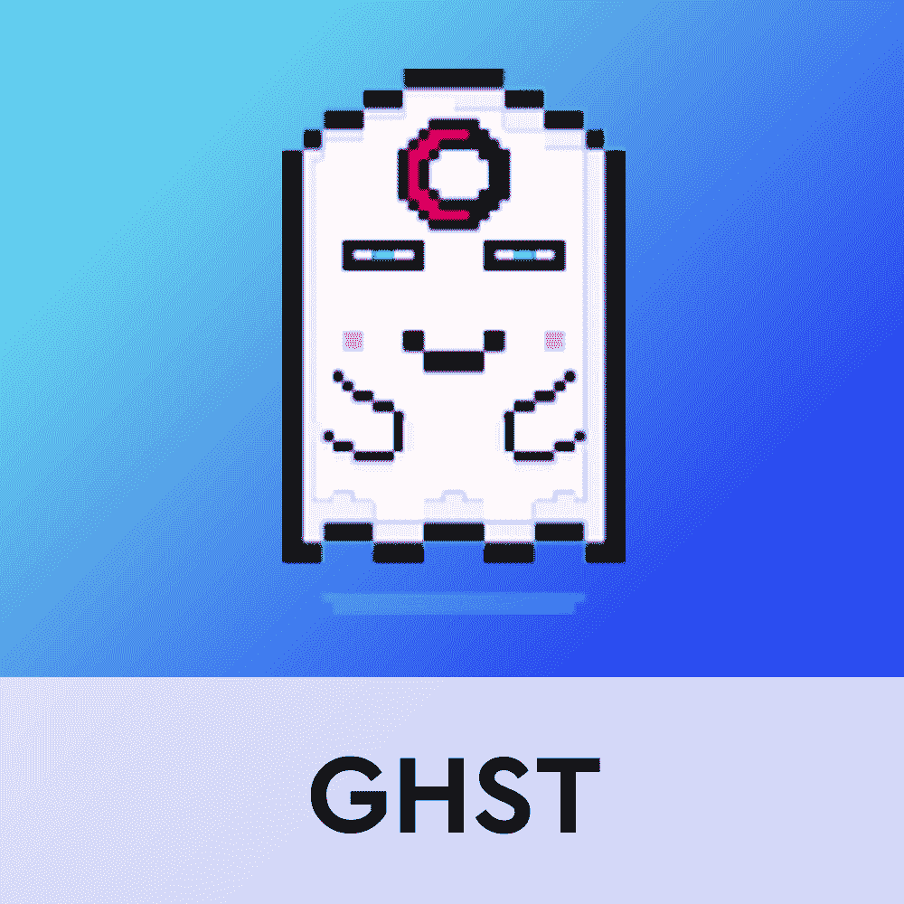

# Aavegotchi 于 3 月 31 日推出 Gotchiverse

> 原文：<https://web.archive.org/web/https://dappradar.com/blog/aavegotchi-launches-gotchiverse-on-march-31>

## Gotchiverse 将成为所有 Aavegotchi NFTs 的虚拟游戏场

Aavegotchi 团队宣布了备受期待的 Gotchiverse 虚拟世界的发布日期。3D 虚拟游戏空间将于 3 月 31 日正式发布。随着 Gotchiverse 的推出，Aavegotchi 收藏者将获得更多的游戏赚钱机会。最重要的是，这将是所有 Gotchi 粉丝的共享虚拟空间。

根据官方宣布，新平台将带来新的游戏和众多的互动渠道，供玩家相互交流。更重要的是，Gothciverse 将给出 Aavegotchi NFTs 的另一个用例，它将成为虚拟环境中的可玩角色。

[https://web.archive.org/web/20221211111206if_/https://www.youtube.com/embed/PtgZT-dVERI?start=1&feature=oembed](https://web.archive.org/web/20221211111206if_/https://www.youtube.com/embed/PtgZT-dVERI?start=1&feature=oembed)

令人印象深刻的是，Gotchiverse 虚拟世界有一个重要的目标。据游戏工作室 Pixelcraft 的杰西·约翰逊·首席运营官称，这个平台革新了在线游戏领域。

## Aavegotchi 将玩家聚集在一起

Gotchiverse 工作方式的革命性因素来自于同时向所有玩家展示相同的环境。虽然传统上，虚拟世界依赖于向每个玩家显示环境的副本来避免不必要的网络压力，但 Gotchiverse 将规避这种做法。

相反，该平台将由全球数百台服务器支持，这样所有进入 Gothciverse 的玩家实际上都看到了同一版本的游戏。重要的是，这个结构将支持 Gotchiverse 中的游戏性。

新虚拟世界中的一种游戏模式将类似于吃豆人类型的地图，允许玩家沿途收集 NFT 资源。同时游戏将确保没有关于哪个玩家先“抓住”物品的争议。这项技术还将为 Aavegotchi 社区提供在同一空间相互交流的终极环境。

## 哥特里弗斯的土地

在真正的元宇宙时尚中，如果没有拥有土地的前景，Gotchiverse 虚拟世界是不完整的。除了全新的游戏玩法，Aavegtochi 还推出了四种新资源。FUD、FOMO、阿尔法和 KEK 将在整个游戏过程中聚集在一起，用于装饰和定制哥特里弗斯的土地。

此外，这些资源将允许玩家制作有用的游戏内工具，进一步提高他们在 Gotchiverse 中的性能。目前，没有更多关于 Aavegotchi 虚拟世界的土地所有权方面的信息。然而，随着 3 月 31 日的临近，该团队将发布更多关于该平台的细节。

DappRadar 将继续监视 Aavegotchi，因为社区里充满了开始探索 Gotchiverse 的期望。查看下面有用的链接，做好准备，了解更多关于 Aavegotchi 的信息。此外，您可以在 Twitter 上关注 DappRadar，首先了解最新的 Aavegotchi 新闻。

[<picture></picture>](https://web.archive.org/web/20221211111206/https://dappradar.com/polygon/games/aavegotchi)[<picture></picture>](https://web.archive.org/web/20221211111206/https://dappradar.com/hub/token/polygon/GHST/MATIC?from=0x385eeac5cb85a38a9a07a70c73e0a3271cfb54a7)[<picture></picture>](https://web.archive.org/web/20221211111206/https://dappradar.com/blog/aavegotchi-to-launch-new-set-of-defi-nft-wearables/) NewsletterUnsubscribe at any time. [T&Cs](https://web.archive.org/web/20221211111206/https://dappradar.com/terms) and [Privacy Policy](https://web.archive.org/web/20221211111206/https://dappradar.com/privacy-policy)