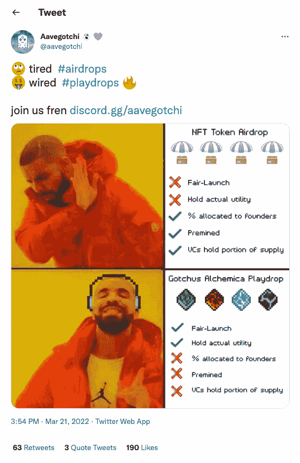
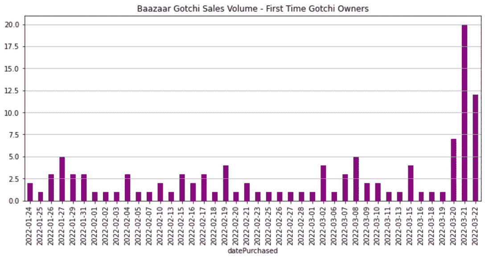
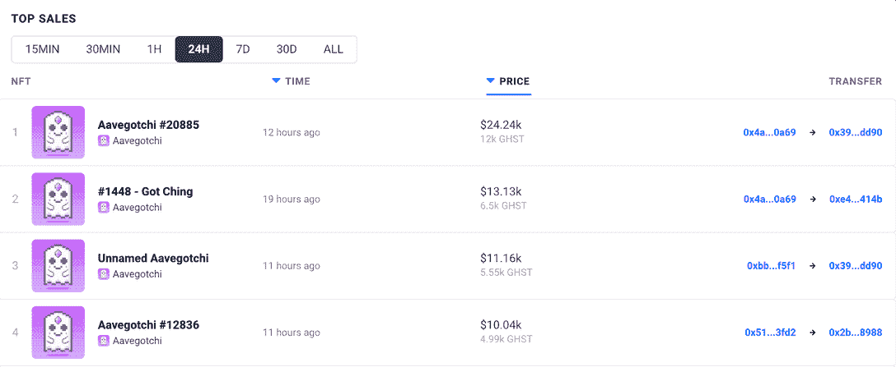
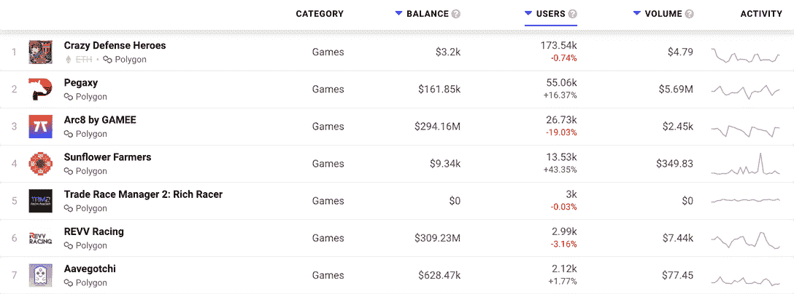

# Aavegotchi 通过用 Playdrops 代替空投来奖励真正的粉丝

> 原文：<https://web.archive.org/web/https://dappradar.com/blog/aavegotchi-rewards-real-fans-by-replacing-airdrops-with-playdrops>

## Aavegotchi 寻找解决 NFT 空投固有问题的方法

加密收藏游戏 [Aavegotchi](https://web.archive.org/web/20220927111023/https://dappradar.com/polygon/games/aavegotchi) 首次推出空投概念的新玩法。他们正在用一个名为 playdrops 的新系统取代旧的代币和资产分配系统，该系统将于 3 月 31 日发布其 alpha 版本。

每一项新发明首先代表一个解决方案，然后才是一个问题。以空投为例。他们解决了如何将非正规金融服务送到需要和应该得到它们的人的账户和钱包里的问题。但很快，聪明的人找到了一种方法，利用系统让奖励向他们倾斜。

在 Aavegotchi，他们的程序员、工程师和问题解决者团队设计了一个解决方案:playdrops。

Aavegotchi Twitter post

Aavegotchi 的 playdrops 摒弃了有利于创始人和风投的预挖掘和资产配置。预挖掘是早期投资者先于其他人获得代币和资产的一种方式。它们稀释了未偿代币的价值，从而让其他所有人的情况变得更糟。

Aavegotchi 的开发者还承诺推出一个象征性的项目，每个人都有公平的机会参与其中。人们收到的代币将“具有实际效用”，而不是一些只不过是营销噱头的空投。所以看起来 playdrop 和空投在基本原理上不同，但是 play drop 的实用性是什么呢？

正如“玩”这个词所暗示的，用户需要真正地玩才能获得 Gotchus Alchemica，这是游戏中的四种资产。这些资产被称为 FUD、FOMO、阿尔法和 KEK。它们每隔几分钟就会在 Aavegotchi 的地图上产卵。这意味着如果玩家想要奖励，他们必须玩游戏。这里没有讲义！

## Aavegotchi 的阿尔法发射

期待已久的 Gotchiverse alpha 将于 3 月 31 日发布，并持续到 4 月 30 日。到目前为止，Aavegotchi 是一个 GameFi 平台，玩家可以在这里押注名为 aTokens 的创收资产。随着这一发布，Gotchiverse 将向用户开放，让他们与 GotchiGang 成员一起耕种、社交、战斗和探索。在发布之前，首次拥有 Gotchi 的用户数量激增。

Source: Shigeru Gotchimoto on Twitter

随着供不应求，Gotchi 的价格将会上涨。在最近的 24 小时内，NFT 头像的售价高达数千美元。一位买家甚至花 24240 美元买了一个。

[DappRadar analytics](https://web.archive.org/web/20220927111023/https://dappradar.com/polygon/games/aavegotchi)

Aavegotchi 在 Polygon gaming[DappRadar 排名页面中排名第七，这也凸显了这款游戏在同类竞争对手中的受欢迎程度。下表显示了 dapp 在过去七天的表现。我们可以看到，与该平台交互的唯一活跃钱包数量略微增加了 1.77%，达到 2，120 个。](https://web.archive.org/web/20220927111023/https://dappradar.com/rankings/protocol/polygon/category/games)

[DappRadar Polygon game rankings](https://web.archive.org/web/20220927111023/https://dappradar.com/rankings/protocol/polygon/category/games)

在 DappRadar，我们将关注 Aavegotchi 在 3 月 31 日 alpha 发布前的连锁活动。请务必关注我们在 [DappRadar 博客](https://web.archive.org/web/20220927111023/https://dappradar.com/blog/)上的报道。

通过[使用我们的分析工具](https://web.archive.org/web/20220927111023/https://dappradar.com/rankings)并在[推特](https://web.archive.org/web/20220927111023/https://twitter.com/DappRadar)上关注我们，了解区块链游戏和分散应用世界的所有其他新闻。你也可以在格林威治时间每周四下午 4 点加入我们的每周[不和谐](https://web.archive.org/web/20220927111023/https://discord.com/invite/QMnwjGzrkG)。