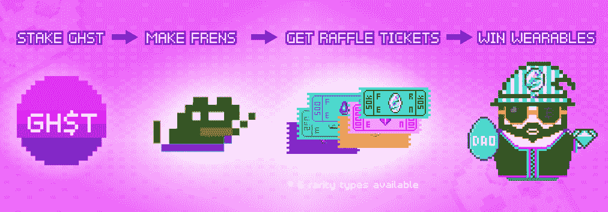
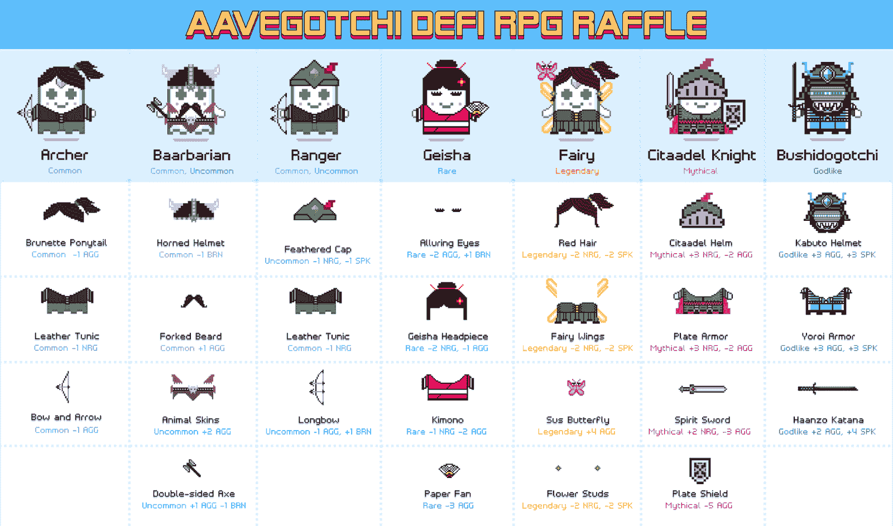
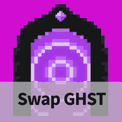

# Aavegotchi 将推出新的 DeFi NFT 可穿戴设备

> 原文：<https://web.archive.org/web/https://dappradar.com/blog/aavegotchi-to-launch-new-set-of-defi-nft-wearables>

## 用户可以用他们的积分购买彩票

**玩赚游戏 dapp Aavegotchi 宣布了另一项可穿戴设备抽奖活动，将于 1 月 26 日在多边形区块链举行。据该团队称，这将是迄今为止最大的可穿戴设备抽奖活动。**

Aavegotchi ghost 由真实的加密货币支持。这些数字存钱罐包含的价值越多，它们在游戏赚取机制中的表现就越好。这些像素幽灵通过穿着衣服和拿着物品获得更多的功能和经济能力。在第六次可穿戴设备抽奖中，Aavegotchi 团队将分发 24 种不同的可穿戴设备。

为了参加比赛并有机会获得幸运，用户需要购买彩票。他们只能通过押注 GHST 或流动性池代币来获得这些入场券。您下注越多，您收集的 frens 点数就越多。然后你需要用这些积分购买各种稀有的彩票。门票的稀有性给了你更大的获胜机会，并使你更有可能获得稀有物品。

从世界协调时 1 月 26 日下午 2 点至世界协调时 29 日下午 2 点，您可以购买一次性奖券。之后，Aavegotchi 团队将使用一个由 Chainlink 驱动的随机数生成器来挑选获胜者。

## 什么是 Aavegotchi 可穿戴设备

角色扮演游戏之后，可穿戴设备都是以主题为基础的，所以期待大量的幻想可穿戴设备。总共有 7 个全新的集合，每个集合包含 3 或 4 个项目。Archer 系列是最常见的，而 Bushidogotchi 系列则非常罕见。这一套包括一只宠物，苏斯巴特利。这是传说中的物品，也是仙女套装的一部分。

可穿戴设备会影响 Aavegotchi 幽灵的 4 个特征:

*   AGG =侵略性
*   NRG =能源
*   SPK =幽灵
*   BRN =大脑大小

在 Aavegotchi 宇宙中，特征分布在钟形曲线上。因此，拥有负面特质并不是坏事。收藏家和玩家需要尝试获得尽可能降低或增加分数的可穿戴设备。本质上，平庸不是你应该想要的。

此外，可穿戴设备会影响基本稀有度得分(BRS)。每个 Aavegotchi 都有一个基于其个性特征、配备的可穿戴设备和眼睛特征的 BRS。一件普通的物品有+1 的 BRS 分数，而一件神一般的物品加+50。

在农事活动期间，稀有的 Aavegotchi 将会更好地耕种 GHST。此外，一个高 BRS 的 gotchi 无疑会在[即将到来的 Gotchiverse](https://web.archive.org/web/20220630125606/https://dappradar.com/blog/aavegotchi-gets-its-own-play-to-earn-gaming-universe) 中受益，这是一个充满了 DeFi 和 play-to-earn 机制的虚拟世界。

[<picture></picture>](https://web.archive.org/web/20220630125606/https://dappradar.com/polygon/games/aavegotchi)[<picture></picture>](https://web.archive.org/web/20220630125606/https://dappradar.com/hub/swap)[<picture></picture>](https://web.archive.org/web/20220630125606/https://dappradar.com/blog/tag/aavegotchi)