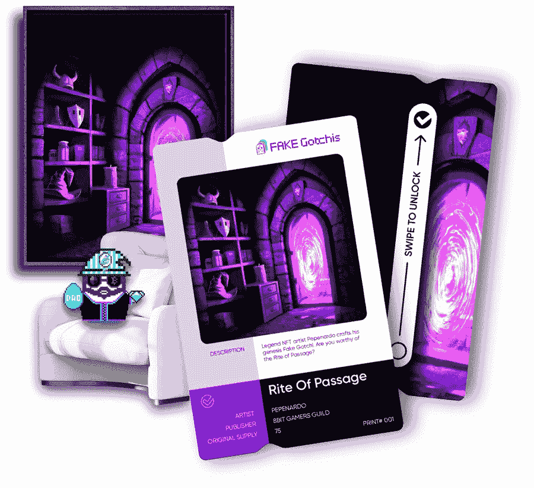
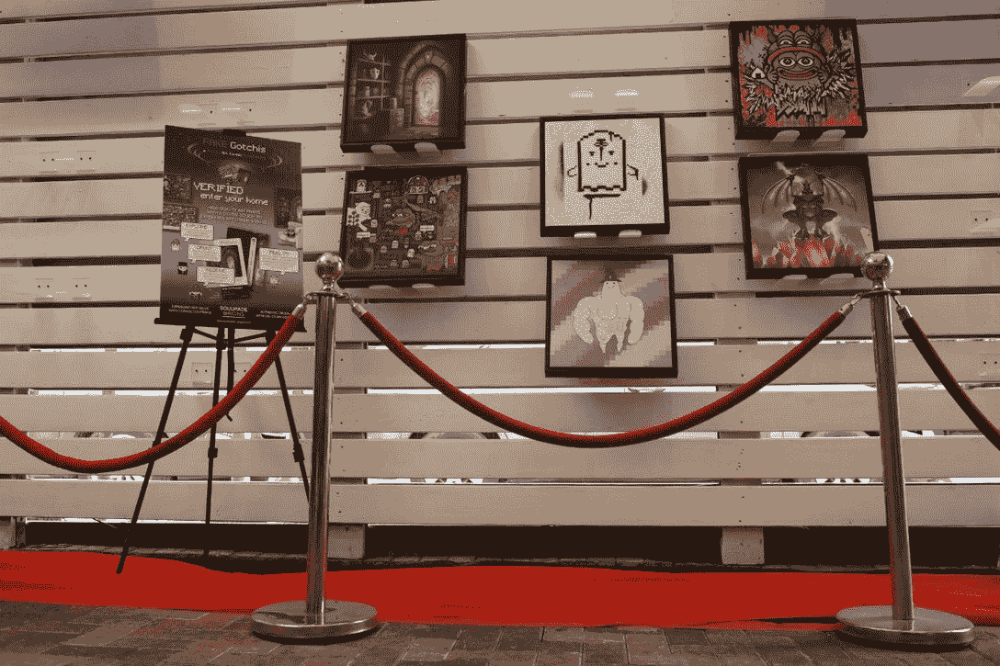

# Aavegotchi 带来了业内首个经过验证的实物 NFT 版画

> 原文：<https://web.archive.org/web/https://dappradar.com/blog/aavegotchi-verified-fakes-fake-gotchi-physical-nft-art>

## 经过验证的赝品是经过编号的实体印刷品，通过集成的链上版税与 NFT 原作联系在一起

虽然 Aavegotchi 已经将游戏与分散金融联系起来，但该项目现在将经过验证的数字艺术带入了我们的现实世界。该团队推出了“验证赝品”,这是业内首个从数字 NFT 艺术品中创建验证实物印刷品的计划。

## 摘要

*   被证实的赝品是 NFT 原创艺术的实物复制品，版税由创作者和 NFT 持有者分享。
*   假 Gotchi NFT 的销售额在第一个月就超过了 63，000 美元。
*   收藏家现在可以通过 GBM 拍卖行买到假的格奇艺术品。竞标者要么因参与而获得奖励，要么赢得 NFT 拍卖。

## 有许多发展的一年

Aavegotchi 在今年开始时是一个 GameFi 项目，玩家可以抚摸他们的数字幽灵，收集可穿戴物品，并从他们的数字存钱罐中赚取利息。然而,《2022》给这个项目带来了很多创新，Gotchiverse 的引入达到了顶峰。在这个数字世界中，玩家可以拥有一块土地，并在上面建造发电设施。

随着定制的需求，也出现了在地块上展示 NFTs 的选项。这就是假 Gotchi 艺术项目发挥作用的地方。限量的薄荷优惠券上市，Aavegotchi 社区成员可以与艺术家合作，为 NFT 系列制作 Aavegotchi 灵感艺术作品。

伪造的戈奇·NFT 艺术收藏只有一个月大，但已经有超过 63，000 美元的销售额。

与 Soulmade Origins 的最新合作现在允许 Aavegotchi 社区获得他们最喜欢的假冒 gotchi 艺术品的经验证的限量版实体印刷品，经验证的赝品。

## 什么是验证过的假货？

一个验证假是一个限量版，编号的原始假格奇 NFT 艺术品的物理打印。每个订单会给你两件东西:一张空白框架的画布和一张灵魂印记卡。

这张卡验证你的作品的细节，连接到 NFT 元数据，你的物理作品的打印日期，格式，甚至打印 ID。这样你就可以确认你拥有第一版或第十版的实体印刷品。

> 和我们一起庆祝⁦[@ soulmadeorigins](https://web.archive.org/web/20221229213557/https://twitter.com/SoulmadeOrigins?ref_src=twsrc%5Etfw)⁩[# NFP](https://web.archive.org/web/20221229213557/https://twitter.com/hashtag/NFP?src=hash&ref_src=twsrc%5Etfw)科技在行动！
> 
> 在⁦todays [@0xPolygon](https://web.archive.org/web/20221229213557/https://twitter.com/0xPolygon?ref_src=twsrc%5Etfw) ⁩赛事或 [#WAGMIMIAMI](https://web.archive.org/web/20221229213557/https://twitter.com/hashtag/WAGMIMIAMI?src=hash&ref_src=twsrc%5Etfw) 找到 [#gotchigang](https://web.archive.org/web/20221229213557/https://twitter.com/hashtag/gotchigang?src=hash&ref_src=twsrc%5Etfw) 获得第一个不可替代的物理⁦ [@poapxyz](https://web.archive.org/web/20221229213557/https://twitter.com/poapxyz?ref_src=twsrc%5Etfw) ⁩🚀[pic.twitter.com/eJfrVoWX3w](https://web.archive.org/web/20221229213557/https://t.co/eJfrVoWX3w)
> 
> — FAKE Gotchis Official (@FAKEgotchis) [December 1, 2022](https://web.archive.org/web/20221229213557/https://twitter.com/FAKEgotchis/status/1598383642576769024?ref_src=twsrc%5Etfw)

[Get your Verified Fakes in the Aavegotchi Store](https://web.archive.org/web/20221229213557/https://store.aavegotchi.com/collections/verified-fakes)

## 创作者版税呢？

在真正的 Web3 精神中，创作者版税和协作是伪 Gotchi 和验证伪倡议中高度赞赏的方面。每张实体印刷品赚取 4%的版税，以 GHST 代币支付。这些版税根据区块链设定的条款，按月支付给艺术家和 NFT 的所有者。

这使得拥有一件假的 Gotchi 作品不仅对艺术感兴趣，而且对所有者、艺术家和出版商来说也是一个潜在的收入来源。有各种各样的方法可以买到假的 Gotchi，但是最新的和最有趣的选择之一是 GBM 拍卖行。

## GBM 拍卖行现在每周 7 天每天 24 小时开放

Aavegotchi 去年推出了他们的 GBM 拍卖，为原本相当无聊的拍卖增加了一个游戏化的层面。在 GBM 拍卖期间，竞标者也可以获得。在拍卖中被出价过高的人将在 GHST 因参与 NFT 的价格发现而获得奖励。这意味着你要么赢得 NFT 奖，要么拿回你的钱并获得少量奖励。

以前，GBM 拍卖行只在特殊活动期间开门，例如土地拍卖。然而，现在拍卖行是一直营业的。社区成员可以在市场上出售他们稀有的 Aavegotchi NFTs 或伪造的 Gotchi NFT 艺术品。

Verified Fakes on display at Art Basel in Miami (source: Aavegotchi)

GMB 拍卖行有一个有趣的机制，那就是每次拍卖都有 60 分钟的取消期。拍卖结束后，卖家有 60 分钟时间决定是否同意最终价格。如果他们不这样做，他们需要支付 GHST 奖励和销售费用作为惩罚，但他们可以保留 NFT。

*   [查看 GBM 拍卖行](https://web.archive.org/web/20221229213557/https://auction.aavegotchi.com/)

## Aavegotchi 怎么样了？

经过验证的赝品和伪造的戈奇 NFT 艺术品是支持和欣赏真品的项目。尽管市场处于熊市，但 Aavegotchi 的交易量在过去 30 天里增长了 6.5%，达到 215，130 美元以上。售出的商品数量飙升了 25%，达到 1，257 件。

这些数字无论如何都不是创纪录的表现，但它们凸显了 Web3 游戏的总体弹性。就链上活动而言，在撰写本文时，Aavegotchi 位于[多边形排名](https://web.archive.org/web/20221229213557/https://dappradar.com/rankings/protocol/polygon)的第 22 位。这是因为，举例来说，进入 Gotchiverse 不需要交易，只需要区块链签名。

通过 DappRadar 上的产品页面深入了解 Aavegotchi。在那里你可以看到所有的 NFT 交易活动和 dapp 活动。

[Discover the Aavegotchi product page](https://web.archive.org/web/20221229213557/https://dappradar.com/polygon/games/aavegotchi)