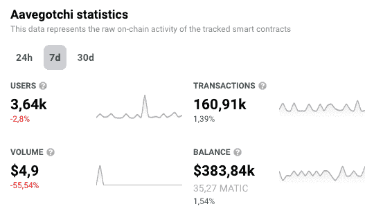

# Aavegotchi s Gotchiverse 农业释放

> 原文：<https://web.archive.org/web/https://dappradar.com/blog/aavegotchis-gotchiverse-farming-release>

## 了解三个新的安装和主要的游戏更新

最近在 7 月 9 日宣布后，GotchiGang 的成员可以开始在 Aavegotchi 的 Gotchiverse 的土地上种植庄稼。Aavegotchi 介绍了三个新的 ERC1155 装置，用于 NFT 博彩元宇宙的制作和升级。

在过去的几个月里，Aavegotchi 社区达到了重要的里程碑。玩家在 5 月 18 日开始定制和利用他们在 Gotchiverse 里面的土地。

现在，Aavegotchi 通过发布产量农业和游戏更新来帮助其成员收集资源，为未来 Lickidators 的入侵做准备，从而加倍了它给 Gotchiverse 带来的效用。

在本文中，您将了解 Aavegotchi 和 Gotchiverse 背后的基础知识，以及如何开始玩这个有趣的游戏。

## 什么是 Aavegotchi 和 Gotchiverse？

用杰西·J、首席运营官和 Aavegotchi 的共同创始人的话说，“Gotchiverse 是一本等待着色的大涂色书”。

Gotchiverse 是一个开源的、社区拥有的 NFT 游戏协议，它使游戏玩家拥有真正的资产所有权。它也可以被定义为一个具有 DeFi 元素的 NFT 游戏元宇宙。

更重要的是，这是 Aavegotchis——收集资源的像素化幽灵人物生活的世界。玩家扮演的是追逐 Gotchus Alchemica 之类资源的 Aavegotchis，got chus Alchemica 是 Gotchiverse 内部引擎的润滑油。

Gotchus Alchemica 是由四个公平发射 ERC-20 代币组成，作为 Gotchiverse 的元素。哥特克斯炼金术士被恰当地命名为 FUD、FOMO、阿尔法和 KEK，他们被用于建造和升级哥特克斯的设施。

#### **听听我们最近和 Aavegotchi 的对话**

[https://web.archive.org/web/20221207201723if_/https://www.youtube.com/embed/9Zil5_M6OWs?feature=oembed](https://web.archive.org/web/20221207201723if_/https://www.youtube.com/embed/9Zil5_M6OWs?feature=oembed)

这些设施从可以增加收入潜力的强大基础设施，到更具防御性的设施或玩家可以用来装饰包裹的美观设施。

## GHST·托肯，葛楚斯炼金术士和舔食者

GHST 和 Gotchus 炼金术都是完全可交易的。舔食者是免费的复仇女神角色。舔食者的角色是与 Aavegotchis 战斗来窃取炼金术，所以这就是为什么收集资源来保护他们免受这些入侵者的伤害是很重要的。

使用 [DappRadar 的游戏排名工具](https://web.archive.org/web/20221207201723/https://dappradar.com/polygon/games/aavegotchi)，我们可以看到，在撰写本文时，GHST 的当前价格为 1.32 美元，在过去 24 小时内有 1981 个 UAWs(唯一活动钱包)与 dapps 智能合约进行交互。

此外，数据还显示，在过去 7 天里，dapp 的智能合约中的资产总价值为 35，270 万 MATIC(383，840 美元)。

Source: [DappRadar](https://web.archive.org/web/20221207201723/https://dappradar.com/polygon/games/aavegotchi)

## 你怎么能在高尔夫球场打球？

你首先需要一个 Metamask 钱包，然后启用多边形网络，并确保你有一些自动令牌来支付汽油费。

您可以使用 DappRadar 轻松访问 Aavegotchi 的 Gotchiverse。[连接您的钱包并在此访问 dapp】](https://web.archive.org/web/20221207201723/https://dappradar.com/polygon/games/aavegotchi)

[https://web.archive.org/web/20221207201723if_/https://www.youtube.com/embed/woduDyWuKHY?feature=oembed](https://web.archive.org/web/20221207201723if_/https://www.youtube.com/embed/woduDyWuKHY?feature=oembed)

如果您的 Metamask 钱包没有多边形网络，您可以观看我们的视频，了解如何设置多边形钱包。

[https://web.archive.org/web/20221207201723if_/https://www.youtube.com/embed/LXzkVkPbvUs?feature=oembed](https://web.archive.org/web/20221207201723if_/https://www.youtube.com/embed/LXzkVkPbvUs?feature=oembed)

一旦进入游戏，可以借一把格奇，全身心地投入到认真的玩法中，尽可能多的收集炼金术，对建筑装置有帮助。这些装置在黑市上很有用，或者在公开市场上卖给 GHST。

阅读[Aavegochi s Gotchiverse Land Release](https://web.archive.org/web/20221207201723/https://dappradar.com/blog/aavegotchi-gotchiverse-land-release)获得关于如何开始的更详细的分步指南。

## 三个新装置对玩家来说意味着什么？

三个新的 ERC1155 装置是 Haarvesters、Reservoirs 和 Maakers。他们将在 Gotchiverse 中为玩家提供工艺和升级服务。

### 收割机

服务器有点像现实世界中的石油开采机。他们允许玩家从他们的 Gotchiverse 领域包裹下取出炼金术。每次升级后收获率增加，每个收获者可以收获一种类型的炼丹。

### 水库

蓄水池是哈维斯特的接受者，只能容纳一种炼金术，就像他们的前辈一样。水库的容量与水位的增加成正比，提高了溢出率和半径率。

### 标记

制造商增加了在一个包裹中执行的同时升级的数量。通常情况下，玩家一次只能升级一个包裹的安装，但 Maakers 的安装大大提高了。然而，它有局限性，因为玩家每个包裹只能有一个制造商。

## 农业版开辟了新的游戏赚钱方式

这次释放为农民和学者都带来了机会。玩家可以改善他们的农业设置，并通过每八小时清空水库获得更多炼金术。

另一方面，如果土地所有者同意，学者们也可以用借来的 Aavegotchis 清空他们的水库。现在在公开的借贷市场上借贷非常容易。

## 一会儿见，法国人！

[<picture></picture>](https://web.archive.org/web/20221207201723/https://dappradar.com/polygon/games/aavegotchi)[<picture></picture>](https://web.archive.org/web/20221207201723/https://dappradar.com/hub/swap)[<picture></picture>](https://web.archive.org/web/20221207201723/https://dappradar.com/blog/tag/aavegotchi) NewsletterUnsubscribe at any time. [T&Cs](https://web.archive.org/web/20221207201723/https://dappradar.com/terms) and [Privacy Policy](https://web.archive.org/web/20221207201723/https://dappradar.com/privacy-policy)