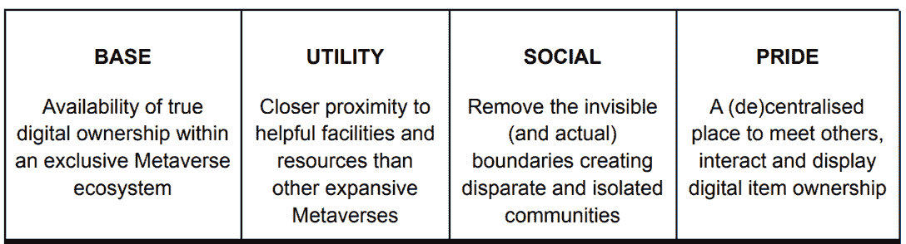
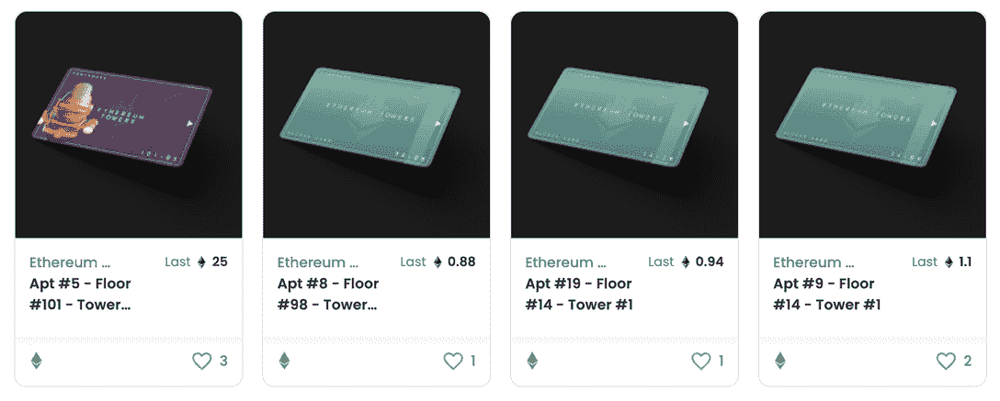
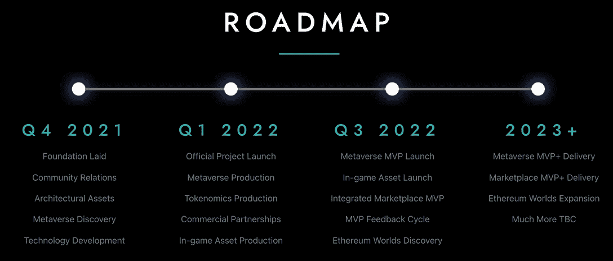

# 获得一个 NFT，进入你在以太坊塔的公寓

> 原文：<https://web.archive.org/web/https://dappradar.com/blog/acquire-an-nft-and-get-access-to-your-apartment-in-ethereum-towers>

## 区块链以太坊的 4388 套玩家公寓

以太坊塔是以太坊世界虚拟世界的一部分，居民可以获得他们可以自己制作的虚拟公寓。这些塔楼由 4，388 套公寓以及生活设施和公共区域组成。

以太坊大厦的公寓位于两座相同的 101 层高楼中。居民购买他们自己的虚拟公寓，作为以太坊网络上的 ERC-721 不可替代令牌(NFT)。以太坊塔有三种不同类型的公寓:标准公寓、豪华公寓和顶层公寓。这些都有自己的津贴和价格标签。

受最近的全球事件和体验社区互动的困难的推动，[以太坊塔项目旨在元宇宙创造一个由 NFTs 支持的 Web3 世界，让居民完全拥有他们的物品。为了让事情开始，项目背后的团队与 NFT 社区合作，如妇女的世界，老板美女，奥迪斯，带来了独家社区和内容的塔。](https://web.archive.org/web/20220929050228/https://ethereumtowers.com/)

垂直结构由 4388 个玩家拥有的公寓和各种公共区域组成，它设置在更广阔的以太坊世界元宇宙。居民将能够随心所欲地使用他们的公寓空间，并可以使用 3D builder 自由设计和划分空间，这将允许他们将从市场购买的物品放置在网格上，以装饰他们的房间。值得注意的是，玩家可以修改的级别和他们拥有的访问权限取决于公寓的类型——例如，顶层公寓提供了最大的空间和最高级别的访问权限。

## **以太坊塔作为垂直世界**

使用公共生活的垂直模型，并试图复制共享生活空间的关键方面，[以太坊塔背后的团队希望为居民提供超过其他虚拟世界和元宇宙平台的四个关键优势](https://web.archive.org/web/20220929050228/https://ethereumtowers.com/)。

这四个方面已经集成到一个多用途数字环境中，为居民提供了一个与朋友、家人和社区成员见面的无缝数字体验。此外，[以太坊塔正在利用 NFTs 中强大的公用事业趋势，赋予持有者独占权和使用权](https://web.archive.org/web/20220929050228/https://dappradar.com/blog/new-dapps-report-nft-collectibles-january-2022-edition-3)；超出了标准的个人资料图片。

居民们可以以 NFTs 的形式展示他们的艺术、收藏品和其他物品，或者将这个空间作为一个宁静的地方。公寓所有者将能够制造各种风格和尺寸的游戏配件，如墙架和展示柜。然后[连接一个区块链钱包](https://web.archive.org/web/20220929050228/https://dappradar.com/blog/tag/metamask)并选择要显示的 NFTs。与此同时，该平台希望在家门口提供一个中心社区，居民可以在这里社交、学习、分享想法和互动。

## 标准房、豪华房还是顶层公寓？

每栋楼有 101 层，1-99 层仅包含标准和豪华公寓，100-101 层仅包含较为罕见的顶层公寓。公寓的大小各不相同，顶层公寓有可能跨越两层。

几套顶层公寓已经以 25 ETH 的价格售出，而一套标准公寓的价格约为 1 ETH。公寓的类型和位置决定了它的稀有程度。同时，楼层数和住在上面的人也会影响感知价值。公寓的分配如下:

*   每塔标准 1980(总共 3960)-90.24%
*   豪华每塔 198 英镑(总共 396 英镑)–9.02%
*   每塔 16 个顶层公寓(共 32 个)–0.73%

澳大利亚出生的杰森·贝尔蒙特(又名贝尔莫)是全球头号保龄球手，他已经在 1 号楼的 80 层租到了一套公寓。而 101 层的顶层公寓被卖给了 Discord 社区的一名成员，作为他们购买整层楼的交易的一部分。

顶层公寓有更多的空间，它们配有令人垂涎的可定制的黑色出入卡 NFT。除了标准公寓和豪华公寓，他们还能获得更多个性化选择和额外的业主福利。

## 总结和以太坊塔路线图

该团队表示，期望的结果是以太坊大厦内公寓的所有者将像在物理环境中一样互动，体验深思熟虑和真诚的对话，建立持久的友谊，并帮助彼此在网络和现实生活中取得成功。1 号楼的大部分已经售出，包括几个顶层公寓，2 号楼将于 2022 年 2 月下旬上市。通过他们的[不和](https://web.archive.org/web/20220929050228/https://discord.com/invite/ethereumtowers)和[推特](https://web.archive.org/web/20220929050228/https://twitter.com/EthereumTowers)渠道参与进来。

以太坊塔刚刚开始全面的路线图，该项目将在 2023 年 Q1 奥运会前完成大部分重要里程碑。关于 tokenomic 模型的更多信息的到来，以及原生市场的推出，原生游戏内令牌有可能为以太坊塔治理和游戏内支出提供动力。旨在处理元宇宙内的一系列交易，据信居民也将通过参加活动、玩迷你游戏和使用他们的公寓等来获得这些代币。请密切关注这个项目，因为它正在向天空发展。

## 链接:

*   [网站](https://web.archive.org/web/20220929050228/https://ethereumtowers.com/)
*   [信纸](https://web.archive.org/web/20220929050228/https://ethereumtowers.com/#LIGHTPAPER)
*   [推特](https://web.archive.org/web/20220929050228/https://twitter.com/EthereumTowers)
*   [不和](https://web.archive.org/web/20220929050228/https://discord.gg/ethereumtowers)
*   [OpenSea](https://web.archive.org/web/20220929050228/https://opensea.io/collection/ethereum-towers)
*   [Instagram](https://web.archive.org/web/20220929050228/https://www.instagram.com/ethereumtowers/)
*   [脸书](https://web.archive.org/web/20220929050228/https://www.facebook.com/groups/ethereumtowers)

 NewsletterUnsubscribe at any time. [T&Cs](https://web.archive.org/web/20220929050228/https://dappradar.com/terms) and [Privacy Policy](https://web.archive.org/web/20220929050228/https://dappradar.com/privacy-policy)