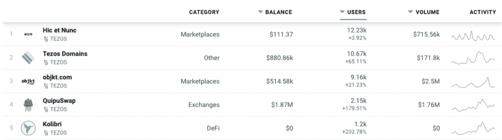
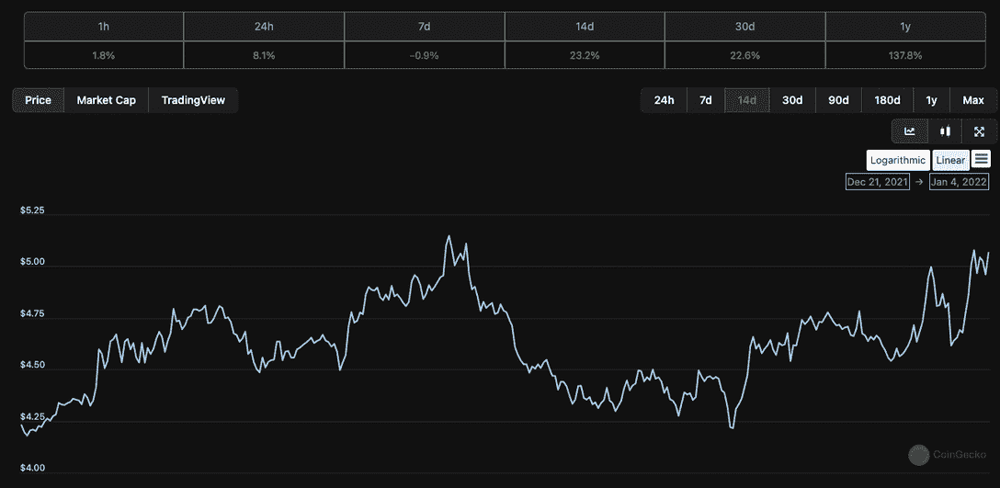
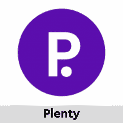

# 领先 Tezos Dapps 的活跃钱包激增

> 原文：<https://web.archive.org/web/https://dappradar.com/blog/active-wallets-surge-on-leading-tezos-dapps>

## nft 市场和 defi 领先的用户活动

随着投资者继续多样化他们使用的服务，Tezos 区块链上的 Dapps 本周受到了用户越来越多的关注。Hic et Nunc 和 objekt.com 的 NFT 市场人气高涨，在过去的七天里注册了超过 21，000 个活跃钱包。随着 ENS 式空投的谣言继续流传，Tezos 域名似乎仍在吸引人们的注意力。

而与以太坊或币安上的类似 dapp 相比，与 dapp 交互的活跃钱包的数量并不多。这是一个强烈的信号，表明 Tezos dapps 正在为那些寻找投资者提供实用和有吸引力的服务。虽然 NFT 市场在吸引活跃钱包方面处于领先地位，但其 DeFi 和 exchange dapps 的周环比增幅最大。

类似于 Uniswap 的令牌交换平台 QuipuSwap 的活跃钱包增长了 179%以上。与此同时，Kolibri，一种基于 Tezos 的基于抵押债务头寸(CDP)的稳定硬币，一周上涨超过 232%。

[<picture></picture>](https://web.archive.org/web/20221208062157/https://dappradar.com/rankings/protocol/tezos)

## Tezos 是什么？

Tezos 是最令人印象深刻的早期区块链项目之一。虽然它不像比特币和以太坊那样是第一代区块链的一部分，但从后来的发展来看，Tezos 受益匪浅。通过从现有区块链的缺点中吸取教训，Tezos 给区块链带来了创新。

由于其链上治理模型，Tezos 能够定期无缝升级和添加创新。速度上，Tezos 每秒可以输出 200 笔交易，以太坊每秒支持 15 笔交易，比特币只有 4，6 笔。Tezos 的利益验证机制还需要更少的能源和运营成本，使其成为构建环保区块链应用的理想替代平台。当我们进入 2022 年的时候，这一点已经变得非常突出。

最后但同样重要的是，Tezos 为去中心化应用和 DeFi 解决方案的开发提供了一个繁荣的环境。快速的交易速度、低廉的燃气费以及区块链的自修正特性使其在 dapp 开发方面非常灵活。最初在以太坊推出的 NFT 市场 Something that Rarible 希望在 2021 年底之前在 Tezos 上推出。

## 利好推动 XTZ 价格？

Tezos 区块链上 dapps 的使用和采用越来越多，最终应该会导致网络上的交易量增加，这对其本地令牌 XTZ 的价格起着至关重要的作用。在 2021 年经历了价格上涨 137%的坚实一年后，7 天价格增长可能表明网络上活动的增加将继续进一步刺激 XTZ 的价格。当然，在我们能够得出任何全面的结论之前，这都取决于 dapp 使用活动在更长时间内的一致性。

Tezos dapp 生态系统还处于早期，但在领先的 dapp 背后似乎正在建立强大的社区。随着 2022 年新的 dapps 的到来，这种情况将受到密切关注。

[<picture></picture>](https://web.archive.org/web/20221208062157/https://dappradar.com/tezos/defi/plenty)[<picture></picture>](https://web.archive.org/web/20221208062157/https://dappradar.com/tezos/defi/kolibri)[<picture></picture>](https://web.archive.org/web/20221208062157/https://dappradar.com/tezos/exchanges/quipuswap)[<picture></picture>](https://web.archive.org/web/20221208062157/https://dappradar.com/blog/guide-on-how-to-create-a-wallet-for-tezos)[<picture></picture>](https://web.archive.org/web/20221208062157/https://dappradar.com/tezos/defi/wrap)[<picture></picture>](https://web.archive.org/web/20221208062157/https://dappradar.com/rankings/protocol/tezos)

***以上不构成投资建议。此处给出的信息仅供参考。请行使尽职调查，做你的研究。作者持有 ETH、BTC、AGIX、HEX、LINK、GRT、CRO、OMI、不可变 X、ENS、GALA、AVASTR、GMEE、CUBE、雷达、FLOW、FTM、BNB、SPS、WRLD、ADA***