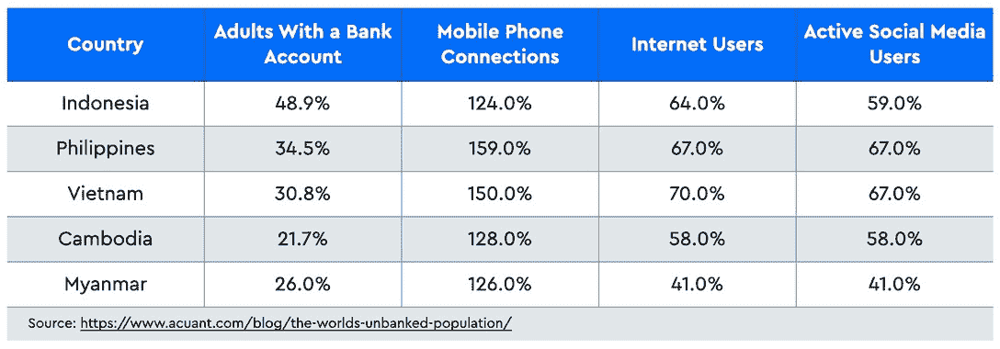

# ADALend 和 Robatz 网络:重新定义分散贷款

> 原文：<https://web.archive.org/web/https://dappradar.com/blog/adalend-and-robatz-network-redefining-decentralized-lending>

## ADALend 和 Robatz Network 合作开发 Cardano 本地分散式贷款协议

卡达诺区块链上的借贷协议 ADALend 最近与 Robatz Network 建立了合作关系，改善了其平台上的用户体验。Cardano 原生借贷平台希望变得更便宜和更高效，从而成为一个必去的平台。

现代银行业是从伦巴第广场的中世纪犹太借贷服务演变而来的。今天，借贷仍然在金融体系中扮演着重要的角色，服务中介促进了资金的流动。

由于分散融资，用户现在能够在没有中介的情况下进行这种活动。DeFi 的贷款业务稳步发展，投资者从中受益。不同链上的新平台随即进入市场。建立在卡多纳之上的阿达兰是那些旨在在先驱者基础上进行改进的星球之一。与 Robatz Network 合作后，ADALend 将为 DeFi 用户提供无缝的用户体验和更具成本效益的贷款机会。

## ADALend 和 Robatz 网络合作伙伴关系

Robatz Network 是一家软件开发公司，专注于全方位的商业解决方案。目前，该公司的专业知识已经扩展到分散化系统，如群算法、边缘计算和区块链，提供企业级的研究服务和开发支持。Robatz Network 将利用他们的知识来改善 ADALend 的贷款服务。

此次合作旨在将 ADALend 平台的实用性和易用性提升到一个新的高度。具体来说，两个团队将合作进行深入而全面的研究，以分析聚合协议环境。研究的范围将包括流动性、交换、用户界面和 UX。随着双方团队在平台设计和部署方面的努力，升级后的 ADALend 平台将拥有优化的用户体验，允许用户顺利进行自主借贷交易。

## 重新想象分散贷款的未来

根据 Acuant 的一份报告，世界上仍有很大一部分人没有银行账户，尤其是在发展中国家。然而，对于区块链的拓荒者来说，DeFi 最大的机会来自于这个事实。让我们以新的加密天堂东南亚(SEA)为例。在主要的东南亚国家，上网的比例相对较高，而一半以上的人口以现金形式存储和转移资金。下表显示了互联网普及率和银行账户所有权之间的差距。

分散融资以及由此衍生的 dapps 为该地区的经济活动带来了显著的变化。无论是汇款、贷款还是赚取被动收入，由于多年的无银行生活，人们正在接受 DeFi 作为一种方便和负担得起的金融工具。

随着 DeFi 的优势得到更广泛的认可，ADALend 将在为用户提供负担得起的 DeFi 贷款解决方案方面发挥更大的作用。与 Robatz Network 的合作将提升 ADALend 的终极分散式贷款体验，从而进一步成功实现这些目标。

[关于 ADALend 的更多信息](https://web.archive.org/web/20230121050837/https://adalend.finance/)

[加入官方不和](https://web.archive.org/web/20230121050837/https://discord.gg/afTpq4mQRG)

[加入私人回合](https://web.archive.org/web/20230121050837/http://adalend.finance/)

**免责声明** —这是一篇赞助文章。DappRadar 不认可本页面上的任何内容或产品。DappRadar 旨在提供准确的信息，但读者应该在采取行动之前总是自己做研究。DappRadar 的文章不能被认为是投资建议。