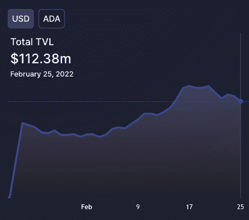

# adalind 是 cardano defi 生态系统的先驱

> 原文：<https://web.archive.org/web/https://dappradar.com/blog/adalend-pioneers-within-the-cardano-defi-ecosystem>

## ADALend 在 Cardano 上提供低成本、高效率的借贷协议

**ADALend 已经成为 Cardano 生态系统中最早的 DeFi 服务之一。贷款协议通过引入即时贷款，为数字金融市场带来了灵活性。毫不奇怪，ADALend 在卡尔达诺更广阔的 DeFi 生态系统中扮演着重要角色，**

ADALend 是卡尔达诺区块链的一个分散式贷款协议。它希望通过提供直接获得贷款和抵押品的途径，带来更大的灵活性。因此，该平台通过连接贷款人和借款人，在 Cardano 的流动性可持续性方面发挥了重要作用。

致力于实现金融领域的包容性，分散金融(DeFi)在 2020 年夏天异军突起。各种公链竞争加速，GameFi、NFTFi、SocialFi 等概念迅速涌现。显然，那个夏天不仅仅是 DeFi 的一个人秀。

以比特币、以太坊为代表的区块链，为很多领域的去中心化提供了最关键的技术基础。然而，它们的可伸缩性、互操作性和可持续性总是有改进的空间。

自 2015 年成立以来，采用利害关系证明(PoS)的公链 Cardano 一直以解决上述问题为愿景。经过多年的发展，Cardona 的 dapp 生态系统已经有了一些重大的改进。无论是 DeFi，区块链博彩，还是 NFT，所有部门都取得了辉煌的成绩。在卡尔达诺的 DeFi 领域，ADALend 坚持为新一轮去中心化借贷浪潮赋能的使命。

## 卡达诺·迪菲生态系统

在撰写本文时，Cardano 的市值为 280 亿美元，并已成为使用股权证明共识机制的最大区块链之一。卡尔达诺团队高度重视学术严谨性，以确保区块链技术的稳定性和可持续性。项目开发通过同行评审研究，这意味着大胆的想法在投入使用前可能会受到质疑。该项目的研究支持来自 IOHK，一家杰出的区块链基础设施研究和工程公司。

Cardano 使用自主开发的 Ouroboros 协议，这是一种利害关系证明算法，可以提供数学上证明的安全保证。因此，该算法能够实现安全高效的缩放。

目前，大约有 150 个项目正在通过卡尔达诺的项目催化剂创新计划开发他们的想法。他们中的一些人已经成功地管理了区块链。卡达诺生态系统的未来是光明的。

德菲一直是卡尔达诺的关键。最近，密码行业遭受了动荡。全球加密市场资本总额比 2021 年 11 月 3 万亿美元的高点低了大约 50%。相比之下，由于在 mainnet 上推出 DeFi dapps，Cardano 在过去几周在总价值锁定(TVL)方面取得了一些健康的收益。下图显示了从 [DeFi Llama](https://web.archive.org/web/20220929042549/https://defillama.com/chain/Cardano?currency=USD) 到 1 月 25 日卡尔达诺在 TVL 的增长情况。

 Photo credit: DeFi Llama

在 DeFi 中，贷款协议对于资本资源分配至关重要。在 Cardano DeFi 生态系统中，ADALend 处于最前沿。最近，IOHK 已经将 [ADALend](https://web.archive.org/web/20220929042549/https://bit.ly/30HrOCn) 列入了他们的基本卡达诺清单。一定程度上说明 ADALend 的技术有学术界的背书。

## adalind defi 的主要特点

ADALend 致力于通过消除传统的银行中介来实现贷款行业的民主化。该平台将提供一种简单、安全、透明的方式来连接借贷双方。值得注意的是，ADALend 为 Q1 2022 规划了几个里程碑，包括原型测试版发布。

让我们仔细看看 ADALend 的主要特性。首先，ADALend 为任何配对提供**无权限借贷。** ADALend 的治理将通过选择最安全的甲骨文来确保向用户提供最佳服务。为了增强该功能的安全性，将采用授权来限制配对的许可。

**激励性流动性**将允许用户在提供流动性的同时获得奖励。这样的机械师的设计是为了方便借贷。

**社区治理**是另一个重要支柱。该项目引入了 ADAL 作为实现目标的治理令牌。持有人可以通过对治理提案进行投票或提交新提案进行投票来达成共识。

最后但同样重要的**是生态系统基础层。**ADALend 项目可以吸引资产并建立激励机制，以支持金融产品生态系统。

要了解有关 ADALend 的更多信息，请访问[网站](https://web.archive.org/web/20220929042549/https://bit.ly/30HrOCn)。

**免责声明** —这是一篇赞助文章。DappRadar 不认可本页面上的任何内容或产品。DappRadar 旨在提供准确的信息，但读者应该在采取行动之前总是自己做研究。DappRadar 的文章不能被认为是投资建议。