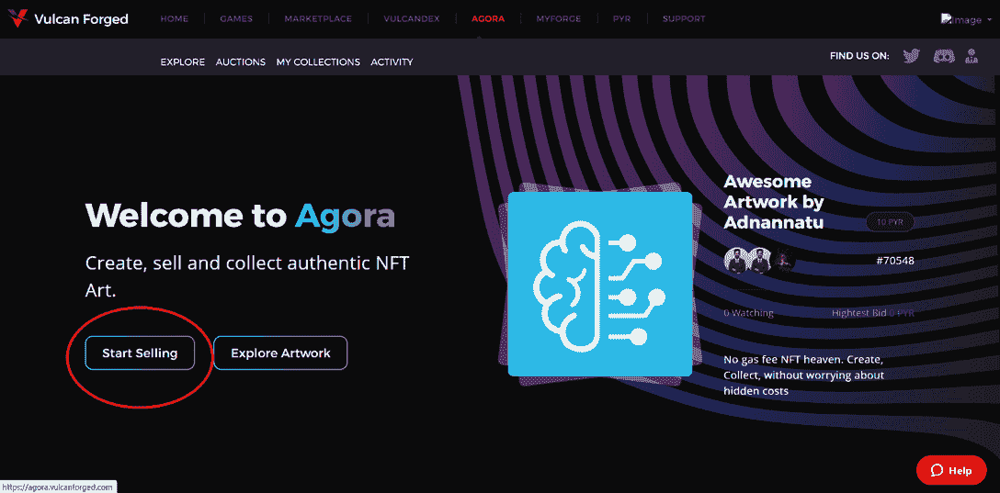
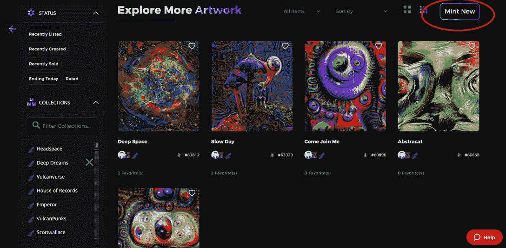

# 瓦肯锻造的广场:没有气体的 NFT 天堂

> 原文：<https://web.archive.org/web/https://dappradar.com/blog/agora-by-vulcan-forged-the-gas-free-nft-heaven>

## Agora 为 NFT 爱好者提供了一个没有汽油的铸造体验

**Agora 加入了 Vulcan Forged 不断扩大的生态系统，提供了一个无气体的 NFT 铸造平台。尽管可能很拥挤，但 NFT 战场从来不缺乏创新。Agora NFT 平台，专注于简单和效率，将充分解放艺术家的创造力和收藏家的热情。**

在 2021 年的纪录片《失落的达芬奇》中，[艺术品经销商 Yves Bouvier 通过向客户隐瞒艺术品的真实价格，赚取了高达 4000 万美元的利润。更离谱的是，至今还没有人能够验证这幅迄今为止最昂贵的达芬奇画作的真伪。](https://web.archive.org/web/20230114194431/https://news.artnet.com/art-world/sothebys-and-yves-bouvier-sue-rybolovlev-in-ongoing-international-feud-1156712)

实物艺术品市场一直是监管最少的市场之一，这突显出增加透明度的紧迫性。NFT 技术的出现消除了艺术世界中的中间人和看门人。此外，它为艺术家提供了一个内容的媒介，一种货币化的手段，以及一个真实性的证明——一石三鸟。

NFTs 使艺术家能够以点对点的方式直接向粉丝出售他们的艺术作品。但是，大多数 NFTs 创建者使用的以太坊区块链中心的天然气费用很高，这让交易双方都很头疼。Vulcan Forged 的 Agora NFT 平台允许用户创建和收集 NFT，而没有隐藏成本。

## 什么是集市

Agora 是瓦肯锻造生态系统的最新扩展。这是一个无气体，简单易用的 NFT 艺术平台，具有高速和低成本的特点。铸造你自己的 NFT，只需要花费 1 个熔岩(截至本文撰写时，[当前价格为 0.12 美元，](https://web.archive.org/web/20230114194431/https://www.vulcandexstats.com/lavapyr))。

熔岩，多边形原生令牌，是火神星的次级令牌。它被设计成一个生态系统助推器，有许多实用工具。获取熔岩很简单。用户只需要玩或参与任何火神伪造或托管的游戏。有不同的方式来花费熔岩，包括升级 VulcanVerse 中的土地，解锁游戏功能，进入交易卡游戏 Berserk 的锦标赛，等等。现在，LAVA 成为用户探索迷人的 NFT 艺术世界的廉价通行证。

## 如何用 Agora 创作 NFT

以下步骤将引导你通过一个平稳的铸造过程与 Agora。

1.注册一个[我的伪造账户。](https://web.archive.org/web/20230114194431/https://auth.vulcanforged.com/)

2.赚取，或者使用 [VulcanDex](https://web.archive.org/web/20230114194431/https://vulcandex.vulcanforged.com/en/swap) 获得一些熔岩。如果你已经是火神锻造生态系统游戏的玩家，你可以通过游戏赚取模式赚取熔岩。如果你不是游戏玩家，但想直接进入 NFT 创作/收藏市场，你可以去分散交易中心 [VulcanDex](https://web.archive.org/web/20230114194431/https://vulcandex.vulcanforged.com/en/swap) 。在这里，你可以把 USDC，PYR，MATIC 或者 WETH(包裹的 ETH)换成 LAVA- [在这里找到更多关于使用 VulcanDex 的信息。](https://web.archive.org/web/20230114194431/https://medium.com/@digital.digitz/getting-started-guide-for-vulcandex-6c4929ee224b)

3.前往您的 [My Forge 钱包](https://web.archive.org/web/20230114194431/https://myforge.vulcanforged.com/Dashboard/MyWallets)查看您的余额。只要你有 1 个以上的熔岩可用，你可以在广场创造一个 NFT！

4.点击 Agora 的链接，然后点击**开始销售**

5.点击**新建**

6.选择您的收藏类型。目前只有**型单**可用，**多**未来会成为一种选择。要上传您的作品，只需拖放或选择您的文件)。请注意，最大文件大小为 5MB。允许的文件类型有 JPG、PNG、GIF、WEBP 和 BMP。

7.输入您的**头衔**、**描述**、**标签、**，以及您是否想在市场上列出您的 NFT。如果您选择市场选项，您可以选择**固定价格**、**限时拍卖、**和**公开招标**。

8.最后，您可以选择是将 NFT 添加到现有集合还是创建新集合。

**要了解火神锻造的最新消息，请关注以下频道:**

[不和谐](https://web.archive.org/web/20230114194431/https://discord.gg/vulcanverse)
[推特](https://web.archive.org/web/20230114194431/http://twitter.com/vulcanforged)
[中](https://web.archive.org/web/20230114194431/http://vulcanforgedco.medium.com/)
[电报](https://web.archive.org/web/20230114194431/http://tg.me/veriarti)