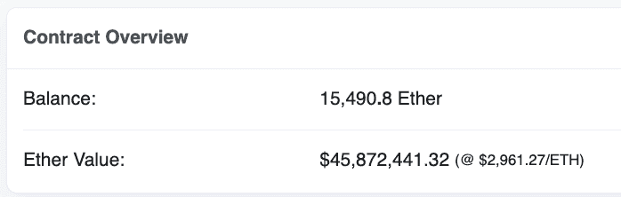
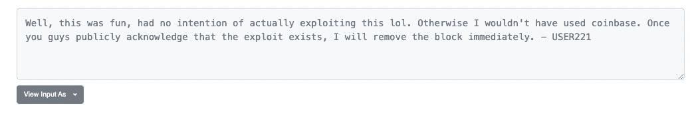

# AkuDreams 看到 3400 万美元被永远锁定在区块链的边缘

> 原文：<https://web.archive.org/web/https://dappradar.com/blog/akudreams-see-34-million-locked-away-forever-in-blockchain-limbo>

## 代码中的 Bug 和 whitehat 漏洞都给 Akutars NFT 项目制造带来了灾难

**总结**

*   ***[由于糟糕的智能合同](https://web.archive.org/web/20220925231647/https://dappradar.com/blog/akudreams-see-34-million-locked-away-forever-in-blockchain-limbo/#the-setup)，AkuDreams 的 Akutar 项目从梦想变成了噩梦。***
*   ***[说到底](https://web.archive.org/web/20220925231647/https://dappradar.com/blog/akudreams-see-34-million-locked-away-forever-in-blockchain-limbo/#the-misery)，社区里没输钱的还是他们的***[***NFTs***](https://web.archive.org/web/20220925231647/https://dappradar.com/nft)***。AkuDreams 无法收回铸造过程中积累的 3400 万美元。***
*   对任何涉足智能合约的人来说，教训是:与开发者合作，让他们刀枪不入。

4 月 22 日，AkuDreams 大张旗鼓地推出了它的 Akutars NFT 造币工艺。不幸的是，对于参与其中的每个人来说，编写糟糕的智能契约和代码中不可避免的循环导致了心痛和金钱损失。

由前 MLB 玩家转为全职数字艺术家的 Micah Johnson 备受期待的 Akutars 项目已经变成了一个包含傲慢，天真，正义和损失的故事。但是从这个悲惨的故事中可以学到一课。

## 设置

阿库塔斯 NFT 项目于美国东部时间 4 月 22 日下午 4:30 开始铸造过程。这项工作背后的团队 Akudreams 已经建立了质量和创新的声誉。它的大批粉丝已经准备好，带着他们的 ETH 等待荷兰拍卖会的开始。

荷兰式拍卖从高价开始，然后越来越低，直到有人扣动扳机，支付一个可接受的价格。一旦发生这种情况，并假设买方的出价高于保留价格，投标人赢得该项目。这是一种屡试不爽的制造 NFT 的方法。

不幸的是，对于 AkuDreams 来说，他们代码中的一个 bug 意味着这个过程并不顺利。

AkuDreams 对他们的智能合同进行编码的方式是，在 AkuDreams 团队可以提取他们从拍卖中积累的资金之前，所有出价高于他们的拍卖参与者都将收到他们失去的投标作为退款。

智能合同中还写道，用户只能按顺序获得退款。因此，如果有人能够通过发现并利用代码中的错误来停止这一序列，他们就可以停止整个退款过程。

某个对代码有敏锐眼光的人注意到了这个缺陷，并向 AkuDreams 发送了一条消息。不幸的是，这个团队对这个建议没有做出很好的回应，并且发出了一个简短的回复。

> AkuDreams 团队假装这是一个特性，而不是一个漏洞，当多个开发人员在 mint 之前提出问题时。奇怪的理由。[pic.twitter.com/cVgEXnnWzF](https://web.archive.org/web/20220925231647/https://t.co/cVgEXnnWzF)
> 
> — foobar (@0xfoobar) [April 23, 2022](https://web.archive.org/web/20220925231647/https://twitter.com/0xfoobar/status/1517662967633952769?ref_src=twsrc%5Etfw)

AkuDreams 似乎声称他们的缺陷不是一个缺陷，而是一个功能。

## 进入被剥削者

了解到 AkuDream 的智能契约包含一个漏洞问题后，注意到这个漏洞的人执行了一个叫做悲伤契约的东西。这阻止了所有退款返回给在悲痛合同部署后投标的未中标者。它锁定了 NFT 智能合约中的大部分拍卖资金。

Funds from Dutch auction shown on Etherscan

在剥削者执行悲伤契约之前，一个人的每一次出价都可以作为退款收回，但是要收回他们的钱，人们需要支付汽油费。对于每个在悲痛剥削后出价的人来说，他们的钱都被锁起来了。

幸运的是，参与竞拍的人发现，这一漏洞是由一位仁慈的怀特哈特黑客实施的，他无意窃取人们的钱，只是想指出 AkuDreams 智能合同中的缺陷。

Note left by whitehat hacker

## 结局好就一切都好？

一个开关被写入智能合同，允许剥削者撤销他们的行动，退款可以按计划返回。怀特哈特黑客声明他们愿意扳动这个开关，但有一个条件。

开发者希望 AkuDreams 团队公开承认他们犯了两个错误。第一个是写得很糟糕的智能合约。第二点，也许是更令人震惊的一点，是不承认他们犯了任何错误。

Micah Johnson 和 Aku 团队发布了一条推文，承认他们的错误，并概述了他们将如何回报社区。

> 对任何人来说，所犯的错误都不会比我自己付出更大的代价。我把所有的钱都投入到了 Aku 的建设中。大多数东西都会退回去，我们会继续做我们计划要做的事情。
> 
> 一砖一瓦。【https://t.co/vQiPbl0Jpl 
> 
> — Micah Johnson (@Micah_Johnson3) [April 23, 2022](https://web.archive.org/web/20220925231647/https://twitter.com/Micah_Johnson3/status/1517877506187186177?ref_src=twsrc%5Etfw)