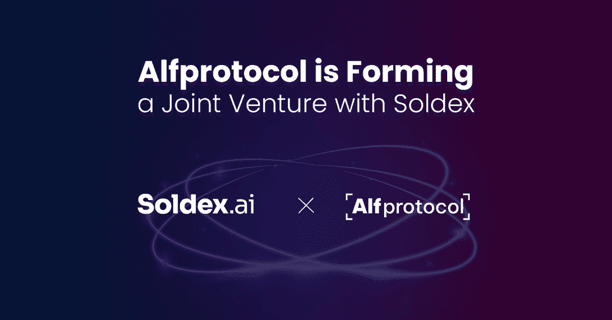

# Alfprotocol 和 Soldex 联手提升您的 DeFi 产品组合

> 原文：<https://web.archive.org/web/https://dappradar.com/blog/alfprotocol-and-soldex-join-forces-to-boost-your-defi-portfolio>

## 进一步释放下一代 DeFi 体验的潜力。

Alfprotocol 和 Soldex 正在组建一家合资企业，为 DeFi 用户带来由 Solana 驱动的强大 DeFi 体验。从技术的角度来看，这两个项目是互补的，对彼此都有利。

**概要:**

*   Solana 已经成为行业中最重要的 DeFi 生态系统之一。
*   Solana 网络中的两家 [DeFi 乐高公司 Alfprotocol 和 Soldex 宣布成立合资企业。](https://web.archive.org/web/20220930143334/https://dappradar.com/rankings/protocol/solana/category/defi)
*   Alfprotocol 的特点是可以满足各种风险偏好的杠杆收益率农业，而 Soldex 是一个人工智能驱动的交易平台，使用户能够聪明地交易。
*   两者的合作将为用户带来前所未有的 DeFi 服务。

在当前的多连锁店环境中，DeFi 服务变得比以往更加多样化和容易获得。随着选项的引入，DeFi 用户对自己的决定变得更加明智。从避免网络拥塞到追求交易速度和节省交易成本，他们知道实现利润最大化所需的一切。

这些需求促使用户转向 Solana，这是以速度和吞吐量著称的下一代区块链。另一方面，Solana 也吸引了许多 DeFi 开发者为 Solana 的 DeFi 生态系统注入新的想法。

考虑到这一点，[索拉纳 DeFi space](https://web.archive.org/web/20220930143334/https://dappradar.com/rankings/protocol/solana/category/defi) 的崛起似乎更合乎逻辑。最近，Solana 将见证其 DeFi 空间的重要合作伙伴关系，因为 [Alfprotocol](https://web.archive.org/web/20220930143334/https://alfprotocol.com/) 和 Soldex，两家 DeFi 乐高公司，已经宣布即将成立合资企业。

这个合资对用户来说意味着什么？前所未有的难忘体验。

## alf protocol–通过高达 200 倍的杠杆作用提高产量农业能力

Alfprotocol 是一个复杂的 DeFi 平台，为不同风险偏好的交易者和投资者提供服务。它为不同风险承受能力的用户提供杠杆和非杠杆产品。

非杠杆化的流动性产品是 Alf 做市商(AlfMM，一种分散的交易所服务)和 allocation Alf(AAlf，一种过度抵押的借款服务)。这两个协议为交易者和规避风险的投资者提供了切入点，以满足他们不同的交易需求。

对于那些喜欢高产农业以获取 DeFi 收入的人来说， [Alfprotocol 的杠杆高产农业](https://web.archive.org/web/20220930143334/https://alfprotocol.com/feature/leveraged-yield-farming-and-liquidity-provision-up-to-200x-leverage/)允许他们在同等条件下获得更高的利润。此外，Alfprotocol 采用动态杠杆率，可以[为所有参与者实现最优资本效率](https://web.archive.org/web/20220930143334/https://alfprotocol.com/feature/dynamic-rates-on-leverage-optimize-capital-efficiency-for-all-participants/)。

在 Alfprotocol 的生态系统中，ALF 令牌是协议激励结构和价值提取机制的核心。持有人可以在"道"模块中入股 ALF，对"道"资金的使用有发言权。Alf 杠杆协议用户可以收到 ALF 作为奖励。

用户可以通过此链接找到 ALF 实用程序的完整列表，并从[有限代币销售中获得 ALF。](https://web.archive.org/web/20220930143334/https://alfprotocol.com/)

## Soldex 使用户能够使用其 dex 和耕作，作为一项全面和用户友好的技术，获得双重奖励

当前分散的交易所面临许多问题，包括流动性水平低、交易量小、交易速度低、用户体验差等等。Soldex 是一个社区驱动的加密交易平台，旨在解决这些问题，并使用户能够做出更明智、更明智的决定。

双倍产量耕作是 Soldex 团队引以为豪的一项功能，并为此感到非常兴奋。从技术的角度来看，它将 Soldex 与 Solana 生态系统中的其他 DeFi 协议区分开来。我们的农场代码是开发团队从零开始开发的全新代码。它使用锚引擎盖下作为一个最先进的工具来开发程序在索拉纳区块链。

## Alfprotocol 将成为索拉纳的一站式 DeFi 商店

凭借每秒 65，000 次交易(TPS)和接近零的交易费用，Solana 在 DeFi 中的表现难以超越。所以 Solana DeFi 的金钱乐高正在崛起。

Alfprotocol 和 Soldex 的合资企业将进一步释放 Solana DeFi 生态系统的网络效应。此外，它加强了 Alfprotocol 作为通往索拉纳 DeFi 世界的门户的定位。

值得注意的是，整合双方的技术、团队和业务已经开始。合并后的团队正致力于推出更先进、更安全的产品来造福用户。这些包括获得额外的资金，更多的流动性，以及更广泛的互操作性网络。

**了解有关 Alfprotocol 技术及其生态系统的更多信息。**

电子邮件—[【电子邮件保护】](/web/20220930143334/https://dappradar.com/cdn-cgi/l/email-protection)

[网站](https://web.archive.org/web/20220930143334/https://alfprotocol.com/)

[电报](https://web.archive.org/web/20220930143334/https://t.me/alfprotocol)

[不和](https://web.archive.org/web/20220930143334/https://discord.gg/WBmKUH4rk2)

**免责声明** —这是一篇赞助文章。DappRadar 不认可本页面上的任何内容或产品。DappRadar 旨在提供准确的信息，但读者应该在采取行动之前总是自己做研究。DappRadar 的文章不能被认为是投资建议。