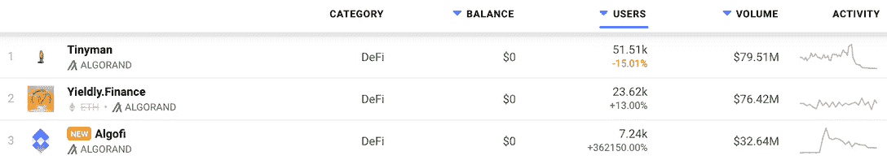
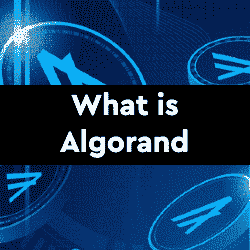
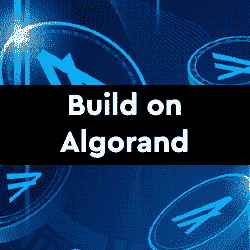
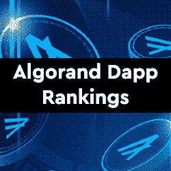

# Algorand Dapps 现在在 DappRadar 上

> 原文：<https://web.archive.org/web/https://dappradar.com/blog/algorand-dapps-now-on-dappradar>

## DeFi 和游戏 dapps 的理想平台

DappRadar 很高兴宣布现在[在 algrand](https://web.archive.org/web/20221221060707/https://dappradar.com/rankings/protocol/algorand)上追踪 dapps。一个纯粹的利害关系证明，通常简称为 PPOS，区块链网络。自 2017 年麻省理工学院教授希尔维奥·米卡利对区块链技术，特别是创建去中心化、安全和可扩展的区块链的挑战感兴趣以来，Algorand 一直在开发中。

《阿尔格兰德区块链协议》的核心是 PPOS 共识机制。该系统允许所有 ALGO 令牌持有者参与批量生产。这是一个低成本、高吞吐量的网络，其核心是数据块终结。每笔交易的成本约为 0.001 ALGO，不到 1 美分，非常适合 DeFi 和游戏用例。区块链每秒还可以处理多达 1000 笔交易，与比特币或以太坊不同，块终结发生在单个块之后。

阿尔格兰德也努力成为碳负网络中最环保的区块链。他们正在努力实现这一目标。例如，基于 4000 个验证器的网络，Algorand 每次交易仅使用 0，000，008 千瓦时。这些数字与比特币(930 千瓦时/txn)或以太坊(70 千瓦时/txn)形成鲜明对比。

## 阿尔格兰德·达普斯

最初， [DappRadar 将跟踪三个 dapps](https://web.archive.org/web/20221221060707/https://dappradar.com/rankings/protocol/algorand)，在接下来的几周和几个月里，更多的 dapp 将会跟进。开发者可以独立提交他们的 dapps，并通过[开发者仪表板](https://web.archive.org/web/20221221060707/https://dappradar.com/dashboard/submit-dapp)获得对数千名参与用户的可见性。

目前，Algorand 上被跟踪的 dapps 集中于 DeFi 服务。Tinyman 是一个分散的交易协议，它利用 Algorand 为交易者、流动性提供者和开发者创建一个开放和安全的市场。 [Yieldly](https://web.archive.org/web/20221221060707/https://dappradar.com/algorand/defi/yieldly-finance) 的产品套件包括赌注和流动性挖掘池，跨链互换，加上 Algo 和 NFT 无损失彩票。相比之下， [Algofi](https://web.archive.org/web/20221221060707/https://dappradar.com/algorand/defi/algofi) 平台允许 Algorand 用户借贷以赚取利息、杠杆或做空加密资产。

## Algorand 总结

当其他区块链依赖第 2 层解决方案的开发来提供可扩展性时，Algorand 提供了这些现成的选项。[阿尔格兰德区块链](https://web.archive.org/web/20221221060707/https://dappradar.com/rankings/protocol/algorand)由两层不同的材料组成。在第一层，你会发现所有的智能合同。例如，用户可以在这里交换加密货币或创建新的区块链资产。真正的奇迹发生在他们的第二层，可以运行更复杂的智能合约。例如，这些将适合于运行一套 DeFi 服务的复杂操作。

[<picture></picture>](https://web.archive.org/web/20221221060707/https://dappradar.com/blog/what-is-algorand-a-next-generation-blockchain)[<picture></picture>](https://web.archive.org/web/20221221060707/https://dappradar.com/blog/an-introduction-to-algorand-dapp-development)[<picture></picture>](https://web.archive.org/web/20221221060707/https://dappradar.com/rankings/protocol/algorand) NewsletterUnsubscribe at any time. [T&Cs](https://web.archive.org/web/20221221060707/https://dappradar.com/terms) and [Privacy Policy](https://web.archive.org/web/20221221060707/https://dappradar.com/privacy-policy)