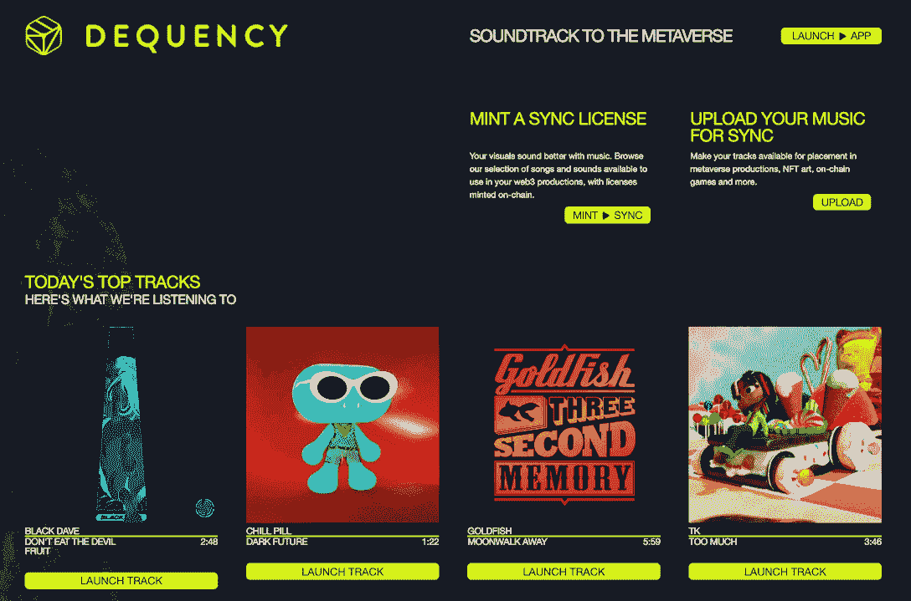
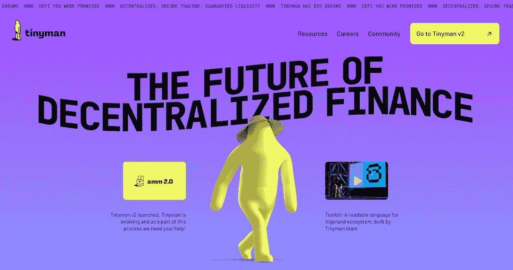
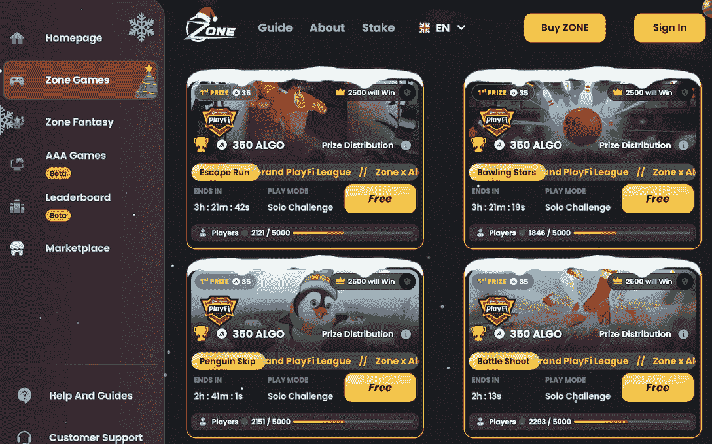
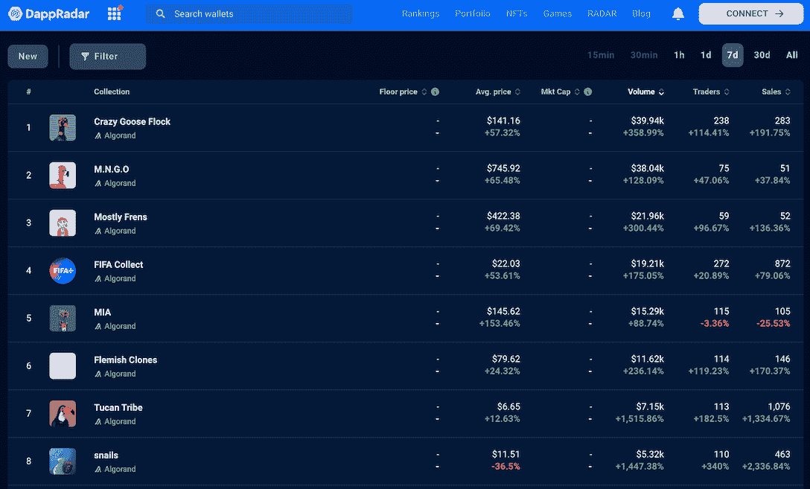
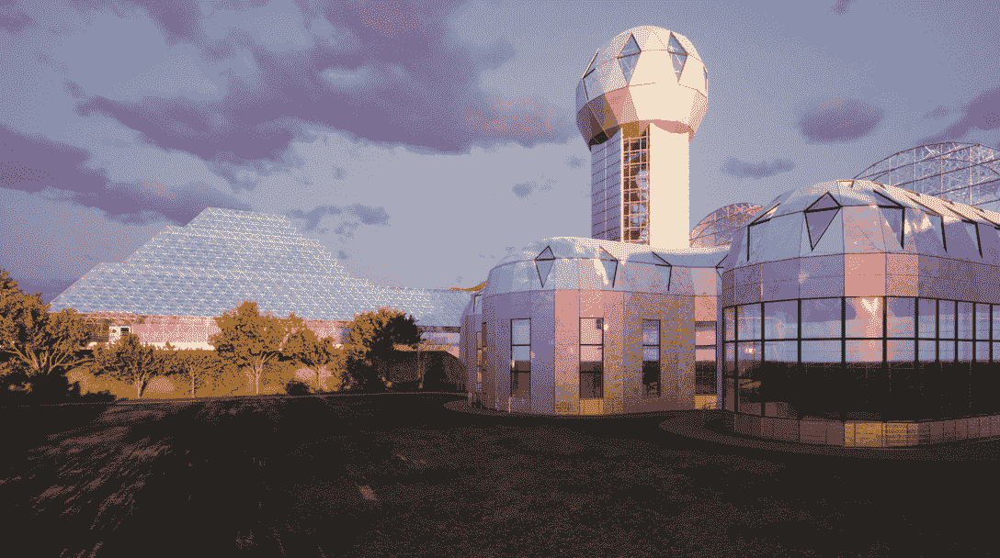

# 2023 年阿尔格兰德·达普斯值得关注

> 原文：<https://web.archive.org/web/https://dappradar.com/blog/algorand-dapps-to-watch-out-for-in-2023>

## 为您带来阿尔格兰德生态系统最全面的概述

**阿尔格兰德 dapp 生态系统在 2023 年有一个健康的开端。它有 500 多个项目在多个行业蓬勃发展。值得注意的是，这些 dapps 帮助网络跨越了 10 亿交易里程碑。这些项目中哪一个会在 2023 年引起轰动？他们是如何服务于 Algorand 社区和用户的？请继续阅读，寻找答案。**

内容:

*   [*关键伙伴关系一目了然*](https://web.archive.org/web/20230121103755/https://dappradar.com/blog/algorand-dapps-to-watch-out-for-in-2023/#key)
*   [*具有重大里程碑意义的算法*](https://web.archive.org/web/20230121103755/https://dappradar.com/blog/algorand-dapps-to-watch-out-for-in-2023/#algorand)
    *   
    *   **[【tinyman】](https://web.archive.org/web/20230121103755/https://dappradar.com/blog/algorand-dapps-to-watch-out-for-in-2023/#tinyman)**
    *   **[区](https://web.archive.org/web/20230121103755/https://dappradar.com/blog/algorand-dapps-to-watch-out-for-in-2023/#zone)**
*   *[*充满活力的阿尔格兰德 NFT 生态系统*](https://web.archive.org/web/20230121103755/https://dappradar.com/blog/algorand-dapps-to-watch-out-for-in-2023/#nft)*
*   **[阿尔格兰德](https://web.archive.org/web/20230121103755/https://dappradar.com/blog/algorand-dapps-to-watch-out-for-in-2023/#future)* 的未来如何*

 *## 关键合作伙伴关系一览

Algorand 以许多重要合作伙伴强调的积极前景开始了 2023 年。

国际足联和阿尔格兰德合作，为 2022 年世界杯的球迷带来前所未有的娱乐体验。FIFA+数字收藏品是他们合作的成果。它允许用户以 Algorand 支持的 NFT 的形式，通过档案和数字收藏品拥有体育赛事的难忘时刻。

然后是 Napster，音频文件分发的先驱。其 Web3 转型有阿尔格兰德保驾护航。由于 Algorand 的技术，该公司可以在音乐民主化方面推动更多创新，并让艺术家从 Web3 创作者经济中受益。

值得一提的是，Algorand 被选中支持意大利创新的数字担保平台，为其提供区块链技术支持。新平台预计将于 2023 年初上线，这将是区块链技术首次在欧盟成员国的银行和保险担保中发挥作用。

[Explore the Algorand ecosystem](https://web.archive.org/web/20230121103755/https://dappradar.com/rankings/protocol/algorand)

## 具有重要里程碑的 Algorand dapps

Algorand 最近在 Twitter 上宣布，它已经越过了 10 亿美元的交易里程碑。这充分证明了该网络的日益普及及其生态系统的健康发展。

> 10 亿交易！
> 
> “[@ algrand](https://web.archive.org/web/20230121103755/https://twitter.com/Algorand?ref_src=twsrc%5Etfw)[#区块链](https://web.archive.org/web/20230121103755/https://twitter.com/hashtag/blockchain?src=hash&ref_src=twsrc%5Etfw)由于一段时间的持续高负载，网络运行平稳，刚刚处理了第 10 亿笔交易，因为它是为工程负责人“——@ GaryMalouf。ALGO fam，敬请期待即将到来的惊喜👀[pic.twitter.com/fpwKbQtcV9](https://web.archive.org/web/20230121103755/https://t.co/fpwKbQtcV9)
> 
> — Algorand Foundation (@AlgoFoundation) [January 3, 2023](https://web.archive.org/web/20230121103755/https://twitter.com/AlgoFoundation/status/1610417430685270019?ref_src=twsrc%5Etfw)

Algorand 于 2017 年开发，2019 年上线。使用多层解决方案和纯粹的利益一致证明(PPoS ), Algorand 上的交易只需不到 4 秒钟即可完成。

此外，Algorand 是高效的，因为它支持多种编程语言，从 Java 和 C++到 Go、Python 和 Rust。因此，开发者可以利用 Algorand 快速推出 Web3 好创意。

[Learn more about Algorand’s technical strengths](https://web.archive.org/web/20230121103755/https://dappradar.com/blog/what-is-algorand-a-next-generation-blockchain)

现在，Algorand 生态系统中有 500 多个分散项目，满足各类用户的不同需求。让我们来看看 2023 年将会带来更有价值的用例的一些项目。

[Discover dapps on Algorand](https://web.archive.org/web/20230121103755/https://dappradar.com/rankings/protocol/algorand)

### de quence–web 3 同步许可市场

Dequency 正在为音乐和视觉创作者建立一个分散的生态系统，以便在 NFT 艺术、元宇宙内容、Web3 游戏等方面进行联系和合作。

例如，该平台允许音乐版权持有者将他们的音乐用于授权。然后，视觉艺术家可以获得许可，在他们的项目中使用该平台的音乐来创建独特的 NFTs 和元宇宙内容。

此外，Dequency 精心设计的激励模式提高了用户参与度，为平台注入了活力。这是味觉验证协议。具体来说，它允许社区成员——或“引领潮流者”——通过对音乐质量、潜在受欢迎程度以及与平台的相关性做出贡献来获得象征性奖励。

[Learn more about Dequency](https://web.archive.org/web/20230121103755/https://dequency.io/)

### 铁皮人——阿尔格兰的定义指数

Tinyman 是一种分散式 AMM 协议，它利用了 Algorand 区块链的快速安全框架。它是阿尔格兰德生态系统中分散融资的一个开放、安全的枢纽。

分散化和非羁押是铁皮人作为 DeFi 交换的中心。它采用自动做市商(AMM)的方法，特别是用不变的产品配方。值得注意的是，这种模式被认为更适合在区块链交易，因为它能够随时提供流动性。要了解更多关于丁尼曼的 AMM 机制和订单簿模式之间的差异，请参考此链接。

Tinnyman 刚刚推出了它的 V2.0 版本。新版本为用户带来了一些改进，如可组合呼叫、灵活流动性管理(FLEX)、元池、快速贷款、快速互换和动态费用。总而言之，它在很大程度上增强了用户体验。

[Learn more about Tinnyman](https://web.archive.org/web/20230121103755/https://dappradar.com/algorand/defi/tinyman)

### zone——一个合作的 GameFi 平台

Zone 是 Algorand 上的一个社交 Gamefi 平台，对所有玩家免费。它提供了各种各样的休闲游戏，并为用户提供真钱奖励。

开发者也可以从 GameFi 生态系统中受益。该平台允许开发人员在平台上放置任何游戏，并通过游戏的 API 端点利用区域智能合约。

Zone 的目标是成为游戏开发者和游戏工作室的 Web3 合作伙伴。在这方面，在加入游戏平台的过程中，Zone 将为开发者提供技术、用户获取和保留方面的专业指导。不仅如此，开发者在测试阶段将获得 100%的收入分成，之后获得 50%。

[Learn more about Zone](https://web.archive.org/web/20230121103755/https://zone.game/zone-games)

## 充满活力的阿尔格兰德 NFT 生态系统

DappRadar 追踪 NFT 在 Algorand 的活动。数据显示，阿尔格兰德支持的 NFT 项目在过去一周获得了显著的发展势头。一些 NFT 收藏的交易者数量、交易量和平均交易价格都有显著增长。

疯狂鹅群是一个社区驱动的 NFT 项目，允许持有者赚取代币并参加活动、游戏、空投等。该系列目前位于阿尔格兰德 NFT 7 天排名的首位，交易量飙升 359%，达到近 40，000 美元。

M.N.G.O .位居第二，交易额为 3.84 万美元，增长 128%。所有者可以每周收到两次公用事业令牌空投，他们可以用它来进行莱佛士，投注，并升级他们的 M.N.G.O 同伴。

除了数码收藏品，阿尔格兰德的 NFT 艺术倡议也同样引人注目。EPOCH 是一个以艺术家为中心的虚拟画廊。它鼓励艺术家用批判和创新的方法挑战当前的策展和展览实践。

[Discover more NFT projects on Algorand](https://web.archive.org/web/20230121103755/https://dappradar.com/nft/collections/protocol/algorand)

## 阿尔格兰德的未来会怎样

Algorand 的目标之一是通过变革性技术为 Web3 生态系统带来真正的互操作性，这将结束行业中的部落主义。

为此，该项目将继续创新增强互操作性的工具，例如。

总之，这些工具使资产和价值能够在任何链之间交换和互操作，为 Web3 的大规模采用建立了坚实的技术基础设施。

#### 有用的链接

*   [网站](https://web.archive.org/web/20230121103755/https://www.algorand.com/)
*   [推特](https://web.archive.org/web/20230121103755/https://twitter.com/Algorand)
*   [中等](https://web.archive.org/web/20230121103755/https://medium.com/algorand)
*   [不和](https://web.archive.org/web/20230121103755/https://discord.gg/84AActu3at)
*   [文档](https://web.archive.org/web/20230121103755/https://developer.algorand.org/)

**免责声明** —这是一篇赞助文章。DappRadar 不认可本页面上的任何内容或产品。DappRadar 旨在提供准确的信息，但读者应该在采取行动之前总是自己做研究。DappRadar 的文章不能被认为是投资建议。*