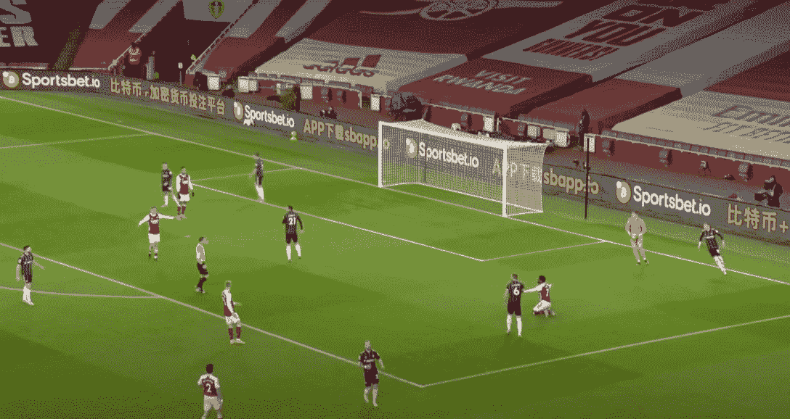
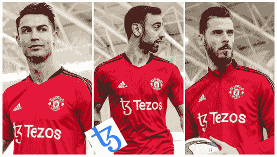
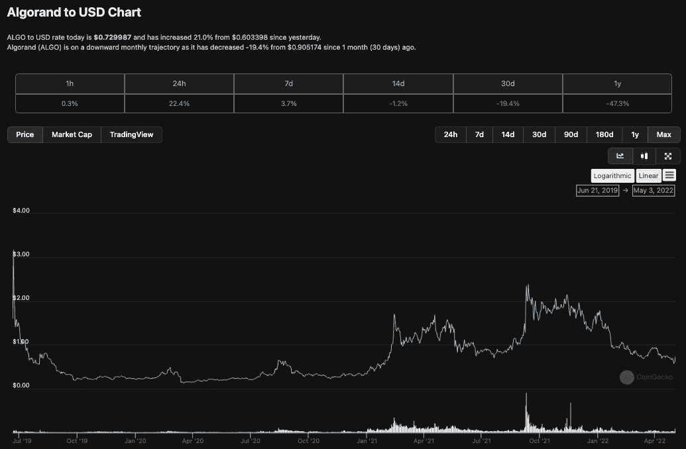
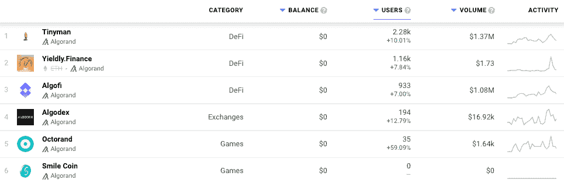

# 阿尔格兰德赞助 2022 年国际足联世界杯

> 原文：<https://web.archive.org/web/https://dappradar.com/blog/algorand-to-sponsor-2022-fifa-world-cup>

## 国际足联的区块链伙伴关系是 11 年来第一个美国赞助商

国际足联宣布阿尔格兰德·区块链成为 2022 年卡塔尔世界杯的第一家美国赞助商。他们将这笔交易称为技术合作伙伴关系，因为 Algorand 将帮助国际足联制定数字资产战略，并有可能营销与足球相关的 NFT。

## 摘要

*   阿尔格兰德公司与国际足联就 2022 年卡塔尔世界杯达成技术合作
*   2022 年 3 月，国际足联宣布与总部位于新加坡的 crypto.com 达成 2022 年世界杯协议
*   铁皮人和 T2【Yieldly Finance】是阿尔格兰德区块链上最受欢迎的应用
*   阿尔格兰德上领先的 DeFi 平台 Algofi 拥有 1.04 亿美元的 TVL

国际足联在过去的十年里经历了一段艰难的时期。首先，腐败和操纵比赛的指控最终导致国际足联主席塞思·布拉特被控欺诈、管理不善、挪用国际足联资金和伪造文件。而他的同事米歇尔·普拉蒂尼则被指控欺诈、挪用公款、伪造文件，以及作为布拉特管理不善的帮凶。

在此之后，国际足联一直在努力寻找任何高调的美国赞助商，以补充与可口可乐、百威啤酒、维萨和 T2 麦当劳的长期协议。直到最近，国际足联与来自主办国、俄罗斯、卡塔尔和中国的企业签署了 2018 年和 2022 年世界杯的几乎所有赞助商。

## 国际足联转向科技

今年 3 月，国际足联开始瞄准科技行业，并宣布与广泛使用的加密平台 Crypto.com 达成 2022 年锦标赛协议，该平台已成为体育赛事和球队的知名赞助商。该协议还涵盖了由澳大利亚和新西兰主办的 2023 年女足世界杯。

足球对于 crypto 和区块链的合作伙伴关系并不陌生，他们在英国和全球都有区块链组织的支持。此外，Crypto.com 将足球视为大众接受的途径，因为国际足联估计，全球有惊人的 2.65 亿人(包括男性和女性)踢足球，35 亿人认为自己是足球迷。与此同时，超过 3.28 亿人观看了意大利和英格兰之间的 2021 年欧洲锦标赛决赛。对任何赞助商来说这都是很大的关注。

*Sportbet.io hoarding ads at Arsenal’s Emirates stadium *

曼联在 2022 年初与泰佐斯·区块链签署了一份多年协议，泰佐斯每年支付 2700 万美元，[据 The Athletic](https://web.archive.org/web/20230118142029/https://bitcoinist.com/tezos-sponsorship-deal-manchester-united/)报道。最近，利物浦足球俱乐部[已经](https://web.archive.org/web/20230118142029/https://www.fxempire.com/news/article/rumors-hit-the-news-wires-of-liverpool-fc-eyeing-a-crypto-sponsor-979214)探索了秘密赞助商的想法，因为他们目前的赞助合同即将到期。

*Tezos sponsor Manchester United’s training kit*

该交易是一种技术合作关系，Algorand 将帮助国际足联制定数字资产战略，并有可能营销与足球相关的 NFT。Algorand 的低交易费用、近乎即时的交易终结和分散化设计确保了买卖双方在 NFT 的无摩擦和无障碍体验。

范围是无限的，理论上的想法可以包括一个[协会风格的 NFT 锦标赛足球运动员集合](/web/20230118142029/https://dappradar.com/blog/new-dapps-report-the-association-following-in-the-footsteps-of-nba-top-shot/)，其中球员的统计数据根据他们的表现在整个锦标赛中提高。而足球的概念，尤其是大型比赛的“时刻”，以前已经讨论过，并由篮球界的 [NBA 顶级射手](/web/20230118142029/https://dappradar.com/blog/nba-topshot-doubles-weekly-sales-volume-to-10-2m/)提出。

## 什么是阿尔格兰德？

[algrand 是一个区块链](https://web.archive.org/web/20230118142029/https://dappradar.com/rankings/protocol/algorand),旨在促进金融的未来和 dapps 的发展。阿尔格兰德区块链公司使用一种纯粹的利益相关者共识机制，通常简称为 PPOS。Algorand 是麻省理工学院图灵奖获得者密码学家希尔维奥·米卡利的发明。此外，阿尔格兰德基金会支持阿尔格兰德的发展。

开发人员还可以快速推出各种用例的令牌。想想 stablecoins、治理令牌、实用令牌、NFT，甚至治理发布的数字法令。[马绍尔群岛](/web/20230118142029/https://dappradar.com/blog/what-is-algorand-a-next-generation-blockchain/)是最早发行国家加密令牌的国家之一，这种 SOV 令牌存在于阿尔格兰德岛上。

[从财务角度看阿尔格兰德](/web/20230118142029/https://dappradar.com/blog/introduction-to-algorand-pyteal-smart-signature-development/)，其本土的 ALGO 代币市值为 49 亿美元，24 小时交易量为 473，667，563 美元。截至发稿前的 24 小时内，它的价值已经上涨了 22%以上。这很可能是由于新闻和媒体提及其赞助 2026 年国际足联世界杯。

## 阿尔格兰德·达普斯

Algorand dapp 生态系统主要满足分散化金融应用的需求，这帮助其通过智能合同获得了[近 1 . 8 亿美元的总价值](https://web.archive.org/web/20230118142029/https://defillama.com/chain/Algorand)。尽管如此，它完全可以为开发者提供一个以碳友好、低成本的方式制造 NFT 的选择。与其他区块链相比，由于创新的 PPoS 算法，在 Algorand 上铸造一枚 NFT 的交易成本可以低至 0.001 ALGO。凭借与其他受欢迎的连锁店相同的功能，Algorand 允许用户令牌化大量的 NFT，而没有恶劣的环境影响和高昂的网络费用。

[Explore Algorand Dapps](https://web.archive.org/web/20230118142029/https://dappradar.com/rankings/protocol/algorand) on DappRadar

就在几天前，我们看到了一个问题，宇迦实验室的另一边元宇宙·NFT 的降落几乎扼杀了以太坊，并将 T2 的汽油费推高到创纪录的水平，最高时一笔简单的交易达到了数千美元。任何打算交到数百万粉丝手中的[大众诉求 NFT 项目](https://web.archive.org/web/20230118142029/https://dappradar.com/nft)都无法应对这些问题。此外，虽然国际足联可能想探索 NFTs，但在将它们交给没有受过教育的观众之前，还有无数的障碍要跨越。这可能是 [Algorand](https://web.archive.org/web/20230118142029/https://dappradar.com/rankings/protocol/algorand) 能够产生最大影响的地方。

 NewsletterUnsubscribe at any time. [T&Cs](https://web.archive.org/web/20230118142029/https://dappradar.com/terms) and [Privacy Policy](https://web.archive.org/web/20230118142029/https://dappradar.com/privacy-policy)

***以上不构成投资建议。此处给出的信息仅供参考。请行使尽职调查，做你的研究。作者持有多种加密货币的头寸，包括 BTC、瑞士法郎和雷达。***